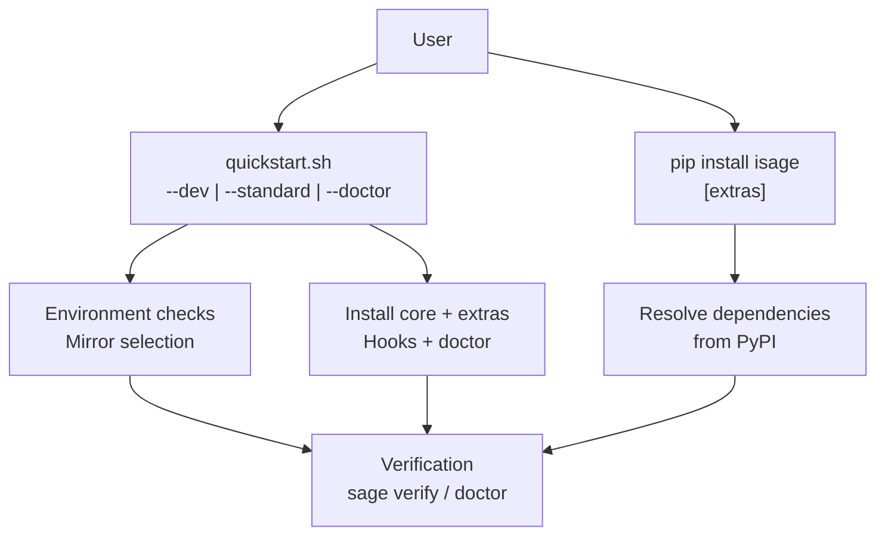
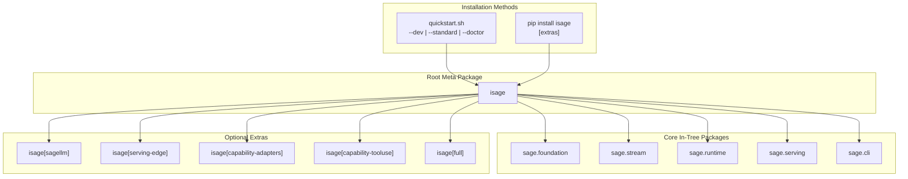
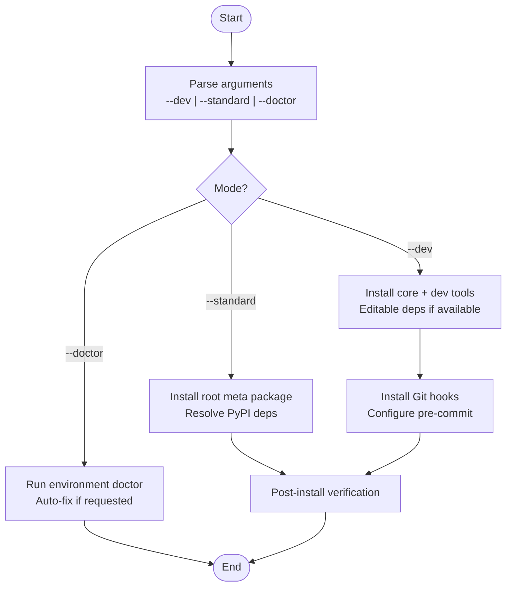
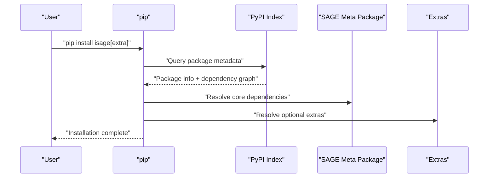
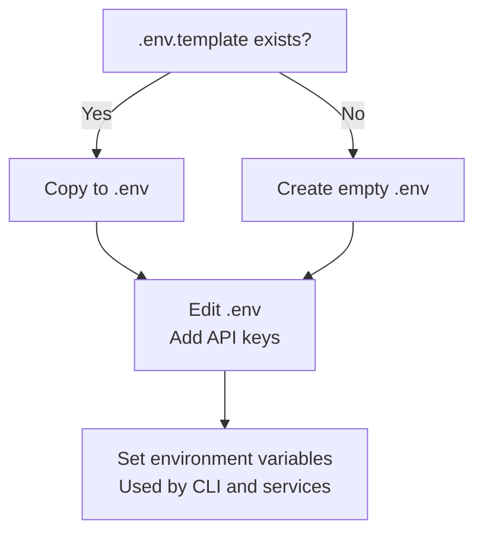
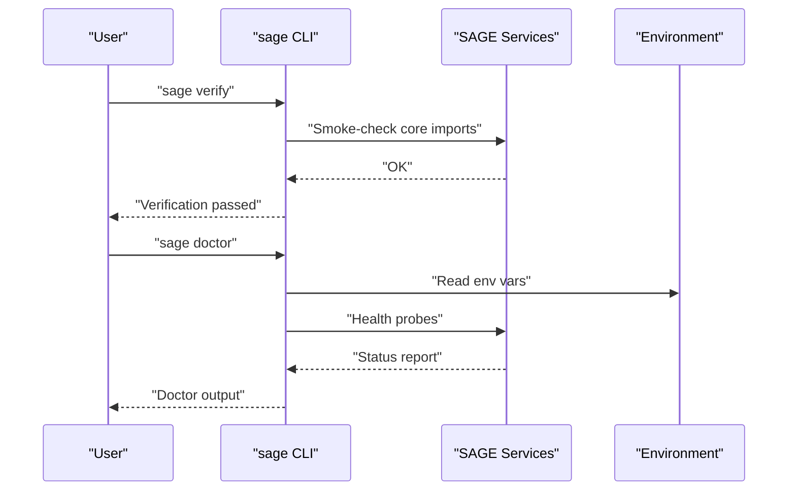
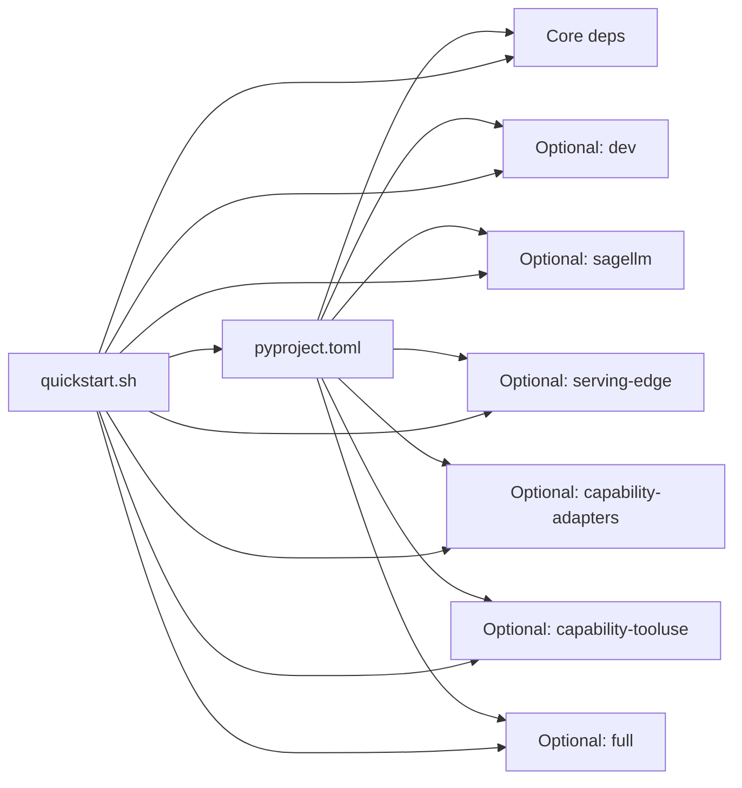

# Installation and Setup

<cite>
**Referenced Files in This Document**
- [quickstart.sh](file://quickstart.sh)
- [pyproject.toml](file://pyproject.toml)
- [README.md](file://README.md)
- [DEVELOPER.md](file://DEVELOPER.md)
- [chat.py](file://src/sage/cli/commands/apps/chat.py)
- [check_config_security.sh](file://tools/maintenance/helpers/check_config_security.sh)
</cite>

## Table of Contents
1. [Introduction](#introduction)
2. [Project Structure](#project-structure)
3. [Core Components](#core-components)
4. [Architecture Overview](#architecture-overview)
5. [Detailed Component Analysis](#detailed-component-analysis)
6. [Dependency Analysis](#dependency-analysis)
7. [Performance Considerations](#performance-considerations)
8. [Troubleshooting Guide](#troubleshooting-guide)
9. [Conclusion](#conclusion)
10. [Appendices](#appendices)

## Introduction
This document provides comprehensive installation and setup guidance for the SAGE framework. It covers multiple installation methods, configuration options, environment setup, verification steps, and troubleshooting procedures. It explains the recommended quickstart modes, PyPI installation, optional extras, environment variables, and known issues such as transformers version conflicts.

## Project Structure
SAGE offers two primary installation pathways:
- Recommended: The quickstart pipeline that automates environment checks, dependency resolution, mirrors, and post-install verification.
- PyPI-based: Installing the root meta package and optional extras directly via pip.

**Diagram sources**
- [quickstart.sh](file://quickstart.sh)
- [pyproject.toml](file://pyproject.toml)
- [README.md](file://README.md)

**Section sources**
- [README.md:210-276](file://README.md#L210-L276)
- [pyproject.toml:32-81](file://pyproject.toml#L32-L81)

## Core Components
- Root meta package: isage
- Core in-tree packages (default install):
  - sage.foundation
  - sage.stream
  - sage.runtime
  - sage.serving
  - sage.cli
- Optional extras:
  - isage[sagellm]
  - isage[serving-edge]
  - isage[capability-adapters]
  - isage[capability-tooluse]
  - isage[full]
- Edge runtime entrypoint:
  - sage-edge (via isage[serving-edge])

Notes:
- The default install does not include isagellm. SAGE integrates with it externally through serving and CLI.
- On Python 3.13+, isagellm may be unavailable until upstream wheels are published.

**Section sources**
- [README.md:234-266](file://README.md#L234-L266)
- [pyproject.toml:32-81](file://pyproject.toml#L32-L81)

## Architecture Overview
The installation architecture centers on the root meta package and optional extras. The quickstart pipeline orchestrates environment checks, mirror selection, dependency installation, and post-install verification.

**Diagram sources**
- [pyproject.toml](file://pyproject.toml)
- [README.md](file://README.md)

## Detailed Component Analysis

### Quickstart Pipeline Modes
- --dev mode
  - Installs core + dev tooling and attempts editable installs for sibling SAGE repos when present.
  - Configures Git hooks and development utilities.
- --standard mode
  - Installs the root meta package and resolves dependencies from PyPI.
- --doctor mode
  - Runs environment diagnosis and optional auto-fixes without full installation.

**Diagram sources**
- [quickstart.sh](file://quickstart.sh)

**Section sources**
- [README.md:212-226](file://README.md#L212-L226)
- [DEVELOPER.md:39-64](file://DEVELOPER.md#L39-L64)

### PyPI Installation
- Install the root meta package:
  - python -m pip install isage
- Install with dev tooling:
  - python -m pip install 'isage[dev]'
- Add optional extras as needed:
  - isage[sagellm], isage[serving-edge], isage[capability-adapters], isage[capability-tooluse], isage[full]

**Diagram sources**
- [pyproject.toml](file://pyproject.toml)

**Section sources**
- [README.md:227-253](file://README.md#L227-L253)
- [pyproject.toml:32-81](file://pyproject.toml#L32-L81)

### Environment Configuration (.env)
- Copy the template to .env and edit to add API keys.
- Available options include, for example, OPENAI_API_KEY and HF_TOKEN.
- The quickstart pipeline can assist with setting HF_TOKEN and HF_ENDPOINT when Hugging Face is unreachable.

**Diagram sources**
- [quickstart.sh](file://quickstart.sh)
- [README.md](file://README.md)

**Section sources**
- [README.md:311-318](file://README.md#L311-L318)
- [quickstart.sh:102-166](file://quickstart.sh#L102-L166)

### Verification and Troubleshooting
- Verify the in-tree core surface:
  - sage verify
- Run environment diagnostics:
  - sage doctor
- Quickstart doctor mode:
  - ./quickstart.sh --doctor
- Chat CLI reads model names from environment variables:
  - SAGELLM_MODEL_NAME and OPENAI_MODEL_NAME

**Diagram sources**
- [README.md](file://README.md)
- [chat.py](file://src/sage/cli/commands/apps/chat.py)

**Section sources**
- [README.md:267-275](file://README.md#L267-L275)
- [chat.py:31-48](file://src/sage/cli/commands/apps/chat.py#L31-L48)

### Known Issues and Resolutions
- Transformers version conflicts:
  - Prefer consulting the developer documentation and package-specific READMEs for guidance.
- Hugging Face rate limiting:
  - Configure HF_TOKEN and optionally HF_ENDPOINT via .env when network restrictions are detected.

**Section sources**
- [README.md:308-310](file://README.md#L308-L310)
- [quickstart.sh:102-166](file://quickstart.sh#L102-L166)

## Dependency Analysis
The root meta package declares core dependencies and optional extras. The quickstart pipeline resolves and installs these according to the chosen mode.

**Diagram sources**
- [pyproject.toml](file://pyproject.toml)
- [quickstart.sh](file://quickstart.sh)

**Section sources**
- [pyproject.toml:19-81](file://pyproject.toml#L19-L81)
- [quickstart.sh](file://quickstart.sh)

## Performance Considerations
- Network acceleration:
  - The quickstart pipeline selects mirrors and optimizes pip configuration to speed up downloads.
- Pre-commit and tool caching:
  - Centralized cache directories reduce repeated work and improve iteration speed.

**Section sources**
- [quickstart.sh](file://quickstart.sh)
- [DEVELOPER.md:408-446](file://DEVELOPER.md#L408-L446)

## Troubleshooting Guide
- Environment security and .env handling:
  - Ensure .env is ignored by version control and .env.template exists for reference.
- Installation failures:
  - Use --doctor to diagnose environment issues and apply auto-fixes when prompted.
- Post-install checks:
  - Run sage verify and sage doctor to confirm a healthy setup.

**Section sources**
- [check_config_security.sh:57-74](file://tools/maintenance/helpers/check_config_security.sh#L57-L74)
- [quickstart.sh:391-449](file://quickstart.sh#L391-L449)
- [README.md:267-275](file://README.md#L267-L275)

## Conclusion
For most users, the recommended path is to use the quickstart pipeline with --dev for contributors or --standard for general users. For targeted setups, PyPI installation with selected extras is supported. Always configure environment variables via .env, verify installation with the provided commands, and consult the troubleshooting steps for persistent issues.

## Appendices
- Additional developer resources and environment variable caching are documented in the developer guide.

**Section sources**
- [DEVELOPER.md:408-446](file://DEVELOPER.md#L408-L446)