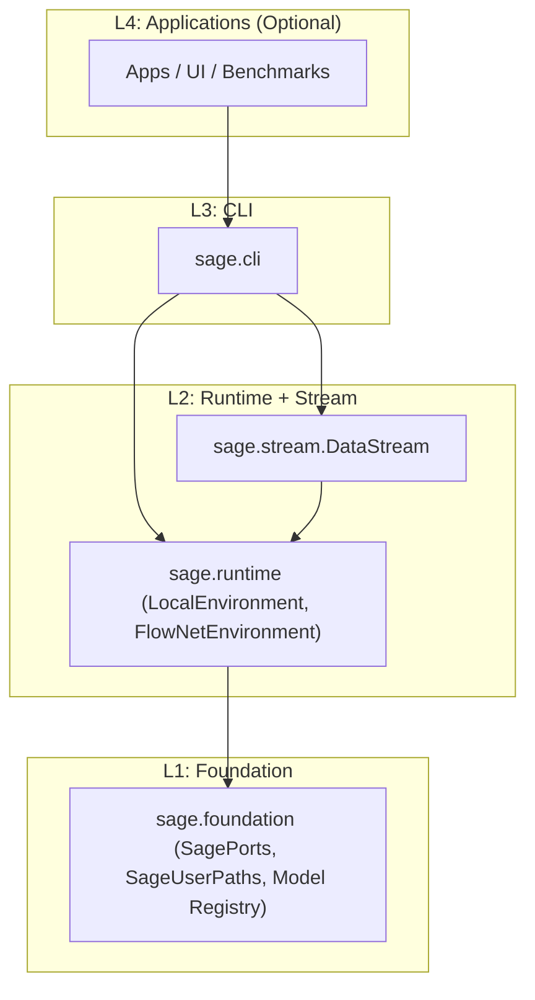
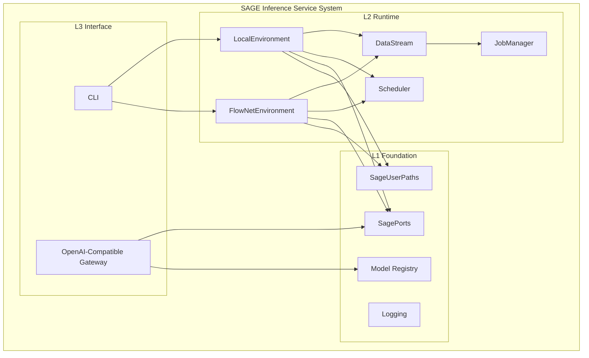
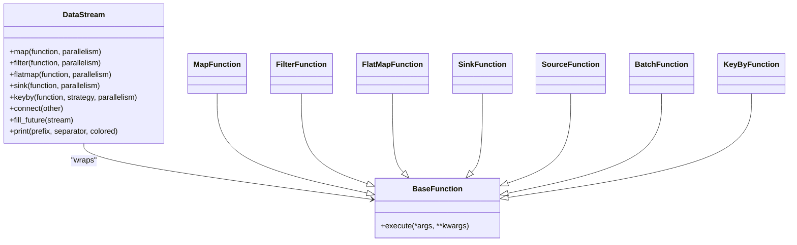
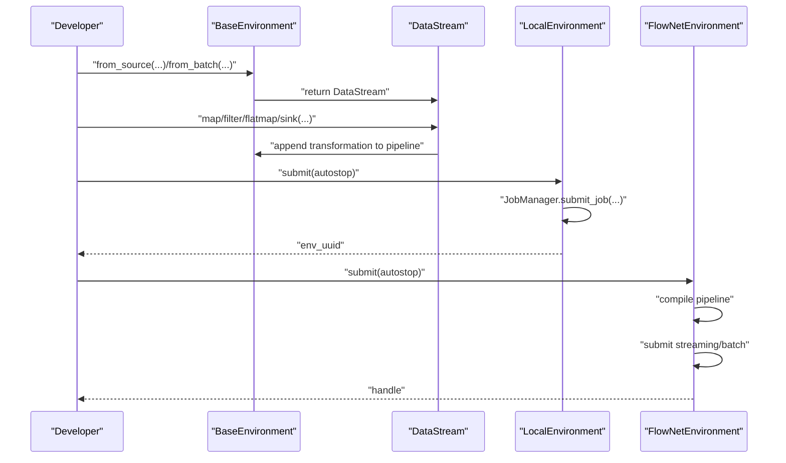
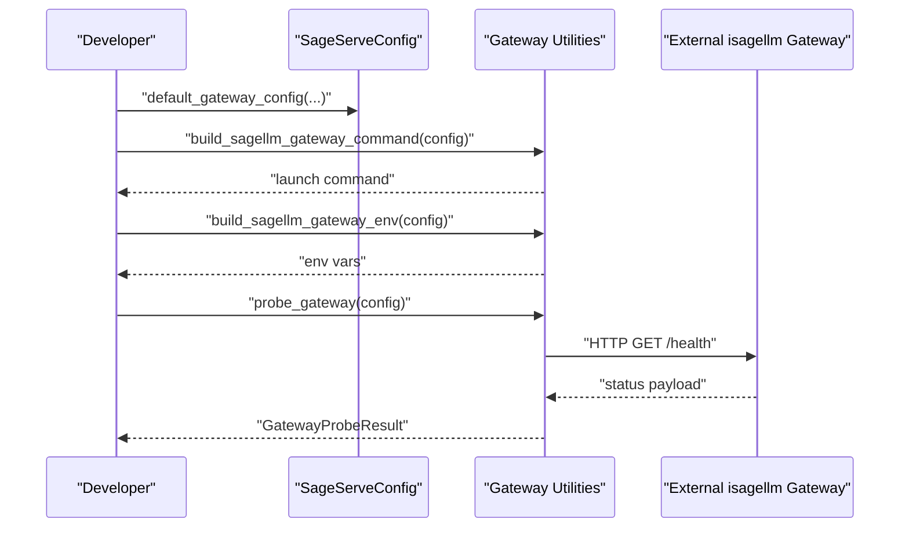
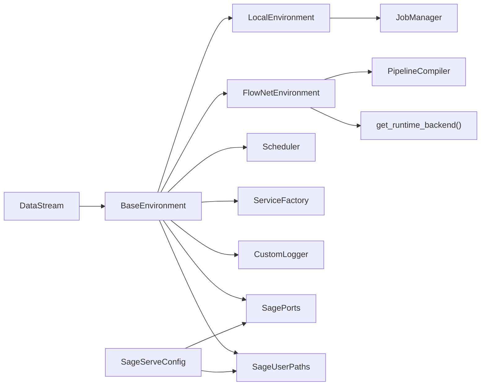

# Project Overview

<cite>
**Referenced Files in This Document**
- [README.md](file://README.md)
- [datastream.py](file://src/sage/stream/datastream.py)
- [core.py](file://src/sage/foundation/core.py)
- [environments.py](file://src/sage/runtime/environments.py)
- [base_environment.py](file://src/sage/runtime/base_environment.py)
- [gateway.py](file://src/sage/serving/gateway.py)
- [ports.py](file://src/sage/foundation/config/ports.py)
- [user_paths.py](file://src/sage/foundation/config/user_paths.py)
</cite>

## Table of Contents
1. [Introduction](#introduction)
2. [Project Structure](#project-structure)
3. [Core Components](#core-components)
4. [Architecture Overview](#architecture-overview)
5. [Detailed Component Analysis](#detailed-component-analysis)
6. [Dependency Analysis](#dependency-analysis)
7. [Performance Considerations](#performance-considerations)
8. [Troubleshooting Guide](#troubleshooting-guide)
9. [Conclusion](#conclusion)

## Introduction
SAGE is a high-performance streaming framework designed to build AI-powered data processing pipelines. Its Streaming-Augmented Generative Execution approach transforms complex LLM reasoning workflows into transparent, scalable systems through declarative dataflow abstractions. In 2026, SAGE underwent a focus reset toward a stream-first inference service system, sharpening its center to stream + runtime + serving + operations, with distributed execution as an optional scale-out mode.

At its core, SAGE provides:
- A stream-first dataflow abstraction (DataStream) enabling declarative pipeline composition
- A robust runtime with local-first execution and optional distributed processing (LocalEnvironment, FlowNetEnvironment)
- An integration plane for serving (SageServeConfig, gateway probing)
- A consolidated foundation for ports, user paths, and model registry

This orientation positions SAGE as a reusable, stream-oriented runtime and serving component that other systems can integrate through stable APIs rather than embedding deep implementation details.

**Section sources**
- [README.md:18-62](file://README.md#L18-L62)
- [README.md:22-53](file://README.md#L22-L53)

## Project Structure
SAGE organizes functionality into a four-tier workspace architecture (L1–L4), converging on a sharp center:
- L4: Application repos (optional)
- L3: CLI entrypoint (sage.cli)
- L2: Runtime and stream (sage.runtime + sage.stream)
- L1: Foundation (sage.foundation)

The target product convergence emphasizes:
- L3 Interface: CLI + OpenAI-compatible service entry + external integration surface
- L2 Runtime: LocalEnvironment + DataStream + JobManager + scheduler + execution services
- Optional Dist.: FlowNetEnvironment (FlowNet-backed distributed execution)
- L1 Foundation: config + ports + user paths + model registry + logging
- Optional: adapters for RAG, memory, tool-use, benchmark

**Diagram sources**
- [README.md:160-192](file://README.md#L160-L192)

**Section sources**
- [README.md:160-192](file://README.md#L160-L192)

## Core Components
This section introduces the foundational building blocks that define SAGE’s streaming-first inference service system.

- DataStream: The primary stream abstraction offering map, filter, flatmap, sink, keyby, and connection primitives. It composes transformations into a pipeline and supports parallelism hints per operator.
- BaseFunction family: The function contracts (MapFunction, FilterFunction, FlatMapFunction, SinkFunction, SourceFunction, BatchFunction, KeyByFunction, BaseJoinFunction, BaseCoMapFunction, FutureFunction) that power operators.
- Environments: LocalEnvironment for local execution and FlowNetEnvironment for optional distributed execution, both sharing the same operator parallelism semantics.
- Serving integration: SageServeConfig encapsulates gateway configuration and helper utilities for launching and probing an external isagellm gateway.

Practical developer experience highlights:
- Complex AI pipelines can be expressed in just a few lines of code using DataStream and BaseFunction subclasses.
- Parallelism semantics are consistent across local and distributed modes.
- Production-ready features include observability, fault tolerance, and flexible CPU/GPU scheduling.

**Section sources**
- [datastream.py:26-182](file://src/sage/stream/datastream.py#L26-L182)
- [core.py:16-335](file://src/sage/foundation/core.py#L16-L335)
- [environments.py:18-224](file://src/sage/runtime/environments.py#L18-L224)
- [gateway.py:16-168](file://src/sage/serving/gateway.py#L16-L168)

## Architecture Overview
SAGE’s architecture centers on a stream-first design that composes operators into a pipeline, executes them locally or on FlowNet, and exposes a serving surface for inference.

**Diagram sources**
- [README.md:180-192](file://README.md#L180-L192)
- [environments.py:18-224](file://src/sage/runtime/environments.py#L18-L224)
- [base_environment.py:25-269](file://src/sage/runtime/base_environment.py#L25-L269)
- [ports.py:26-199](file://src/sage/foundation/config/ports.py#L26-L199)
- [user_paths.py:53-195](file://src/sage/foundation/config/user_paths.py#L53-L195)

## Detailed Component Analysis

### DataStream: Declarative Dataflow Abstractions
DataStream is the core stream abstraction that enables declarative pipeline composition. It supports:
- map, filter, flatmap, sink, keyby operators with optional parallelism
- connecting streams and forming composite pipelines
- filling futures to create feedback edges
- printing intermediate results for observability

**Diagram sources**
- [datastream.py:26-182](file://src/sage/stream/datastream.py#L26-L182)
- [core.py:16-335](file://src/sage/foundation/core.py#L16-L335)

**Section sources**
- [datastream.py:26-182](file://src/sage/stream/datastream.py#L26-L182)
- [core.py:16-335](file://src/sage/foundation/core.py#L16-L335)

### Environments: Local and Distributed Execution
SAGE provides two execution environments:
- LocalEnvironment: local-first execution with in-process worker replicas honoring operator parallelism. Supports keyed streams with stable key-to-replica routing and unkeyed streams with round-robin routing.
- FlowNetEnvironment: optional distributed execution backed by FlowNet. Compiles the same parallelism hints into FlowNet actor replica counts, ensuring consistent semantics across platforms.

**Diagram sources**
- [base_environment.py:147-269](file://src/sage/runtime/base_environment.py#L147-L269)
- [environments.py:18-224](file://src/sage/runtime/environments.py#L18-L224)

**Section sources**
- [environments.py:18-224](file://src/sage/runtime/environments.py#L18-L224)
- [base_environment.py:25-269](file://src/sage/runtime/base_environment.py#L25-L269)

### Serving Integration: SageServeConfig and Gateway Probing
SAGE integrates with an external inference engine via an OpenAI-compatible gateway. SageServeConfig encapsulates the gateway configuration, including host, port, log level, model, and control-plane toggles. Helper functions build the launch command and environment, and probe the gateway health endpoint.

**Diagram sources**
- [gateway.py:16-168](file://src/sage/serving/gateway.py#L16-L168)

**Section sources**
- [gateway.py:16-168](file://src/sage/serving/gateway.py#L16-L168)

### Foundation: Ports, Paths, and Model Registry
SAGE’s foundation layer provides:
- Centralized port configuration (SagePorts) for serving and runtime surfaces
- XDG-compliant user paths (SageUserPaths) for config, data, state, and cache
- Model registry utilities for ensuring models are available locally

These components form the operating substrate that supports runtime and serving operations consistently across environments.

**Section sources**
- [ports.py:26-199](file://src/sage/foundation/config/ports.py#L26-L199)
- [user_paths.py:53-195](file://src/sage/foundation/config/user_paths.py#L53-L195)

## Dependency Analysis
SAGE’s dependency relationships emphasize a sharp center with optional distributed execution and serving integration.

**Diagram sources**
- [datastream.py:26-182](file://src/sage/stream/datastream.py#L26-L182)
- [base_environment.py:25-269](file://src/sage/runtime/base_environment.py#L25-L269)
- [environments.py:18-224](file://src/sage/runtime/environments.py#L18-L224)
- [gateway.py:16-168](file://src/sage/serving/gateway.py#L16-L168)
- [ports.py:26-199](file://src/sage/foundation/config/ports.py#L26-L199)
- [user_paths.py:53-195](file://src/sage/foundation/config/user_paths.py#L53-L195)

**Section sources**
- [datastream.py:26-182](file://src/sage/stream/datastream.py#L26-L182)
- [base_environment.py:25-269](file://src/sage/runtime/base_environment.py#L25-L269)
- [environments.py:18-224](file://src/sage/runtime/environments.py#L18-L224)
- [gateway.py:16-168](file://src/sage/serving/gateway.py#L16-L168)
- [ports.py:26-199](file://src/sage/foundation/config/ports.py#L26-L199)
- [user_paths.py:53-195](file://src/sage/foundation/config/user_paths.py#L53-L195)

## Performance Considerations
- Stream-first design prioritizes efficient dataflow composition and execution semantics.
- LocalEnvironment honors operator parallelism for non-source operators, enabling in-process worker replicas and stable routing for keyed streams.
- FlowNetEnvironment compiles the same parallelism hints into FlowNet actor replicas, ensuring consistent performance semantics across platforms.
- Observability and monitoring are built-in to support runtime insights and performance tuning.

[No sources needed since this section provides general guidance]

## Troubleshooting Guide
Common operational checks and utilities:
- Use CLI commands to verify environment health and runtime nodes
- Probe the gateway health endpoint to confirm serving readiness
- Diagnose port availability and status for serving and runtime surfaces
- Migrate legacy configuration and ensure XDG-compliant paths are set up

**Section sources**
- [README.md:138-158](file://README.md#L138-L158)
- [ports.py:131-199](file://src/sage/foundation/config/ports.py#L131-L199)
- [user_paths.py:167-195](file://src/sage/foundation/config/user_paths.py#L167-L195)

## Conclusion
SAGE’s 2026 focus reset consolidates the project into a sharp, stream-first inference service system centered on DataStream, runtime environments, serving integration, and operational foundations. This design enables developers to express complex AI pipelines in just a few lines of code while delivering production-ready performance, observability, and flexibility across local and distributed execution modes.

[No sources needed since this section summarizes without analyzing specific files]