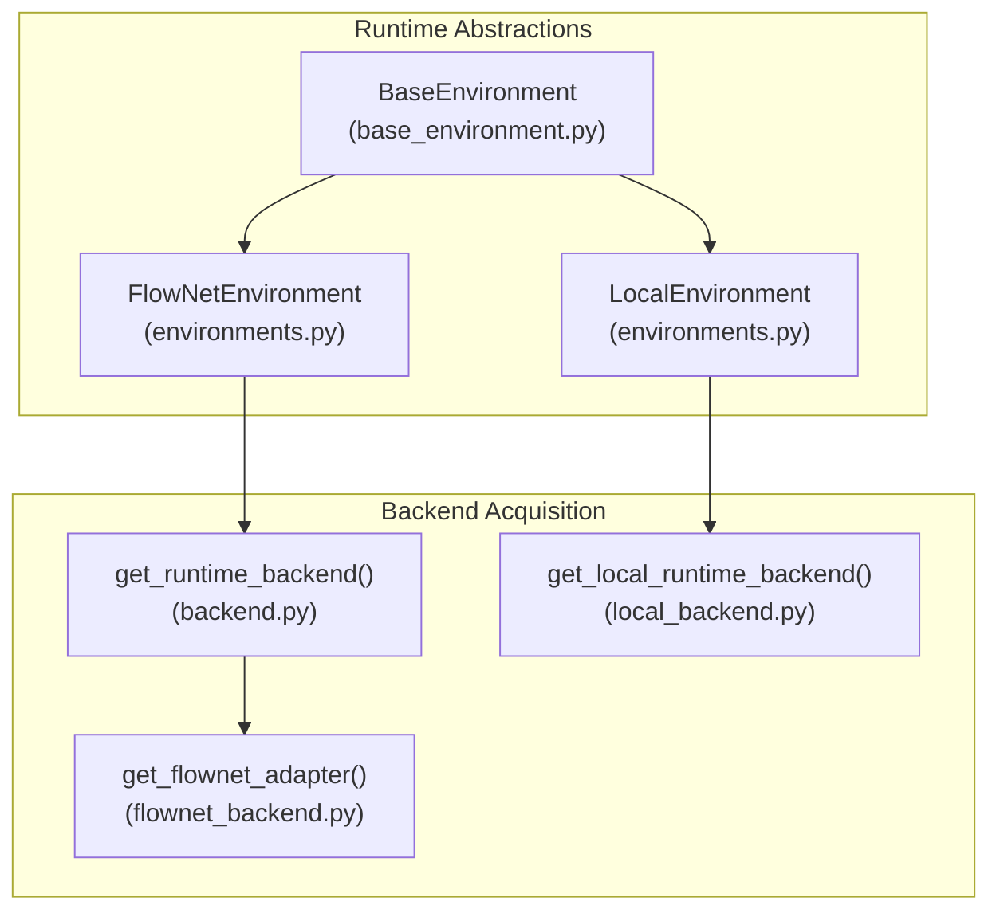
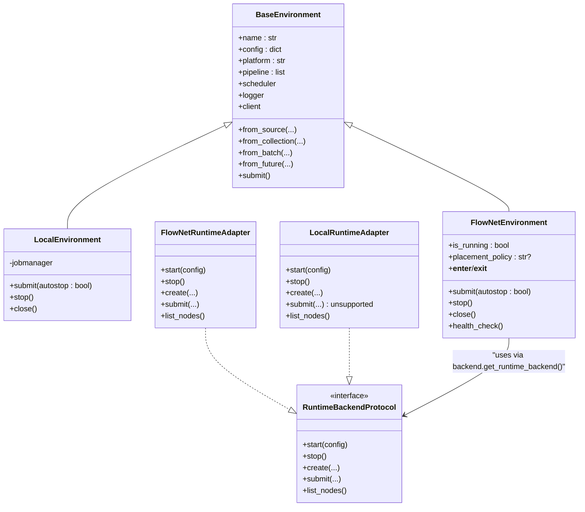
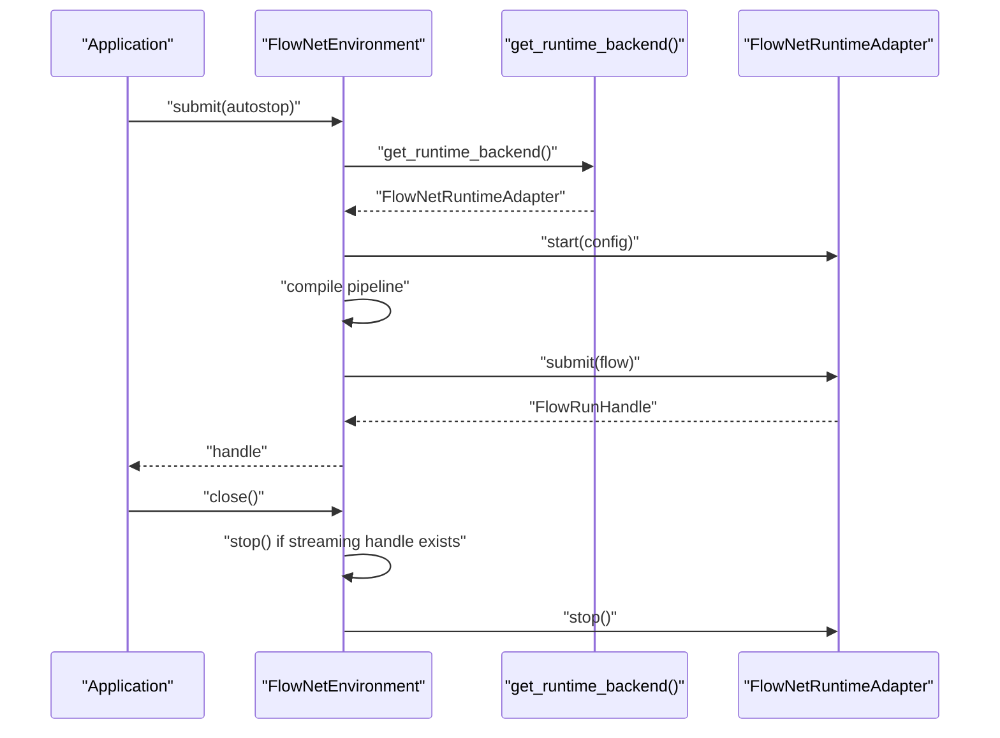
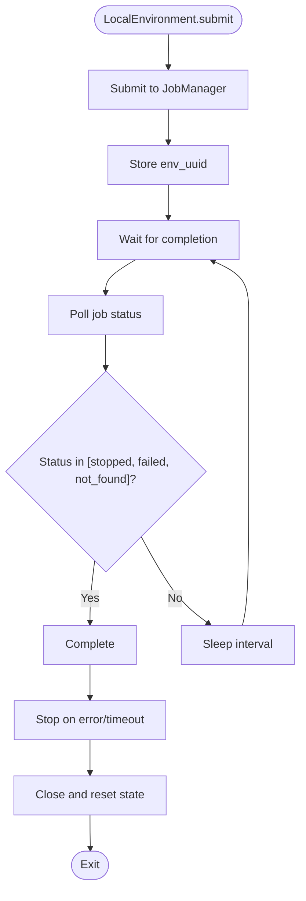
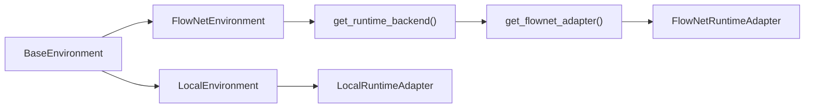

# Environment Management

<cite>
**Referenced Files in This Document**
- [environments.py](file://src/sage/runtime/environments.py)
- [base_environment.py](file://src/sage/runtime/base_environment.py)
- [backend.py](file://src/sage/runtime/backend.py)
- [flownet_backend.py](file://src/sage/runtime/flownet_backend.py)
- [local_backend.py](file://src/sage/runtime/local_backend.py)
</cite>

## Table of Contents
1. [Introduction](#introduction)
2. [Project Structure](#project-structure)
3. [Core Components](#core-components)
4. [Architecture Overview](#architecture-overview)
5. [Detailed Component Analysis](#detailed-component-analysis)
6. [Dependency Analysis](#dependency-analysis)
7. [Performance Considerations](#performance-considerations)
8. [Troubleshooting Guide](#troubleshooting-guide)
9. [Conclusion](#conclusion)
10. [Appendices](#appendices)

## Introduction
Environment Management in SAGE provides a unified abstraction for runtime execution contexts. It enables seamless switching between local development and distributed production deployments via two primary environment implementations:
- LocalEnvironment: supports batch-style execution with a local job manager and in-process scheduling.
- FlowNetEnvironment: optional distributed execution backed by the FlowNet runtime adapter, enabling streaming and cluster-mode submissions.

At the heart of this system is the backend acquisition mechanism that supplies the appropriate runtime adapter. This document explains environment lifecycle management, configuration options, resource allocation strategies, and operational patterns for both local and distributed modes.

## Project Structure
The environment management system is organized around a shared base class and two concrete environment implementations, with a backend acquisition helper and runtime adapters.

**Diagram sources**
- [base_environment.py:25-269](file://src/sage/runtime/base_environment.py#L25-L269)
- [environments.py:18-224](file://src/sage/runtime/environments.py#L18-L224)
- [backend.py:10-17](file://src/sage/runtime/backend.py#L10-L17)
- [flownet_backend.py:476-484](file://src/sage/runtime/flownet_backend.py#L476-L484)
- [local_backend.py:144-150](file://src/sage/runtime/local_backend.py#L144-L150)

**Section sources**
- [base_environment.py:25-269](file://src/sage/runtime/base_environment.py#L25-L269)
- [environments.py:18-224](file://src/sage/runtime/environments.py#L18-L224)
- [backend.py:10-17](file://src/sage/runtime/backend.py#L10-L17)
- [flownet_backend.py:476-484](file://src/sage/runtime/flownet_backend.py#L476-L484)
- [local_backend.py:144-150](file://src/sage/runtime/local_backend.py#L144-L150)

## Core Components
- BaseEnvironment: Defines the common interface and pipeline construction utilities for all environments. It manages configuration, platform identification, scheduler resolution, service registration, and pipeline assembly through transformations (source, batch, future).
- LocalEnvironment: Implements a local execution model using a JobManager for batch-style submission and completion polling. It exposes stop/close semantics and integrates with the local runtime adapter.
- FlowNetEnvironment: Implements distributed execution via the FlowNet runtime adapter. It compiles the pipeline using the runtime backend and supports streaming submissions and health checks.

Key responsibilities:
- Environment lifecycle: submit, stop, close, health_check, and context manager support (__enter__/__exit__).
- Backend acquisition: centralized via get_runtime_backend(), which returns the FlowNet adapter.
- Resource visibility: FlowNetEnvironment exposes placement policy and node health via the adapter.

**Section sources**
- [base_environment.py:25-269](file://src/sage/runtime/base_environment.py#L25-L269)
- [environments.py:18-224](file://src/sage/runtime/environments.py#L18-L224)
- [backend.py:10-17](file://src/sage/runtime/backend.py#L10-L17)

## Architecture Overview
The environment abstraction layer sits atop runtime adapters. FlowNetEnvironment uses the runtime backend acquisition helper to obtain the FlowNet adapter, which encapsulates distributed orchestration, actor creation, and flow submission. LocalEnvironment relies on the local runtime adapter for in-process execution.

**Diagram sources**
- [base_environment.py:25-269](file://src/sage/runtime/base_environment.py#L25-L269)
- [environments.py:18-224](file://src/sage/runtime/environments.py#L18-L224)
- [flownet_backend.py:320-470](file://src/sage/runtime/flownet_backend.py#L320-L470)
- [local_backend.py:90-149](file://src/sage/runtime/local_backend.py#L90-L149)
- [backend.py:10-17](file://src/sage/runtime/backend.py#L10-L17)

## Detailed Component Analysis

### BaseEnvironment: Abstraction and Pipeline Construction
- Purpose: Provides a common interface for environment implementations, including pipeline construction utilities and service registration.
- Pipeline building:
  - from_source: wraps a callable or BaseFunction into a SourceTransformation and appends to the pipeline.
  - from_collection: wraps a callable or BaseFunction into a BatchTransformation for collection-based processing.
  - from_batch: accepts BaseFunction subclasses, lists/tuples, or iterables and constructs appropriate batch sources.
  - from_future: creates a FutureTransformation to connect downstream stages to named upstream futures.
- Scheduler and platform: Resolved via resolve_scheduler with platform-specific defaults.
- Logging: CustomLogger is lazily initialized and exposed via logger property.
- Job manager client: Lazily created JobManagerClient with configurable host/port from config.

Operational notes:
- Pipeline stages are appended as transformations and later compiled by environment-specific compilers.
- Service registration supports both class-based and factory-based service provisioning.

**Section sources**
- [base_environment.py:25-269](file://src/sage/runtime/base_environment.py#L25-L269)

### LocalEnvironment: Local Execution Model
- Platform: local.
- Submission: Delegates to JobManager.submit_job, storing the returned environment UUID for lifecycle management.
- Completion handling: _wait_for_completion polls job status until completion or timeout, with graceful handling of interrupts and errors.
- Lifecycle:
  - stop: pauses the job via JobManager.
  - close: pauses and clears pipeline state, resets UUID.
- Monitoring: Optional monitoring flag influences environment behavior.

Configuration highlights:
- Configurable scheduler and enable_monitoring flag.
- Uses JobManagerClient with engine_host/engine_port from config.

**Section sources**
- [environments.py:18-129](file://src/sage/runtime/environments.py#L18-L129)
- [base_environment.py:206-211](file://src/sage/runtime/base_environment.py#L206-L211)

### FlowNetEnvironment: Distributed Execution Model
- Platform: flownet.
- Submission:
  - Compiles the pipeline using PipelineCompiler with the runtime backend obtained from backend.get_runtime_backend().
  - Supports streaming and batch/autostop modes; stores streaming handle for stop/close.
- Lifecycle:
  - stop: stops the streaming handle if present.
  - close: ensures streaming handle is released and internal graph cleared.
  - health_check: queries adapter.list_nodes() for node inventory.
- Placement policy: exposed via placement_policy property for distributed scheduling hints.
- Context manager: supports __enter__/__exit__ for automatic close.

Backend integration:
- Uses FlowNetRuntimeAdapter via get_flownet_adapter() through backend.get_runtime_backend().

**Section sources**
- [environments.py:131-221](file://src/sage/runtime/environments.py#L131-L221)
- [backend.py:10-17](file://src/sage/runtime/backend.py#L10-L17)
- [flownet_backend.py:476-484](file://src/sage/runtime/flownet_backend.py#L476-L484)

### Backend Acquisition and Runtime Adapters
- get_runtime_backend(): Returns the process-global FlowNet runtime adapter, centralizing access to distributed execution capabilities.
- FlowNetRuntimeAdapter:
  - start/stop: initializes and tears down cluster-local session and registry; supports lightweight vs cluster modes.
  - create: registers local actor instances with replica-aware logic and returns an actor handle.
  - submit: submits a flow program or endpoint to the cluster session; requires cluster mode.
  - list_nodes: returns node inventory from the runtime inspector when available.
- LocalRuntimeAdapter:
  - start/stop: manages an internal ThreadPoolExecutor for in-process execution.
  - create: instantiates actor-like handles backed by a thread pool.
  - submit: unsupported in local adapter (returns an unsupported handle).
  - list_nodes: returns a single local node info.

**Section sources**
- [backend.py:10-17](file://src/sage/runtime/backend.py#L10-L17)
- [flownet_backend.py:320-470](file://src/sage/runtime/flownet_backend.py#L320-L470)
- [local_backend.py:90-149](file://src/sage/runtime/local_backend.py#L90-L149)

## Architecture Overview

### Environment Initialization and Shutdown Procedures

**Diagram sources**
- [environments.py:153-171](file://src/sage/runtime/environments.py#L153-L171)
- [backend.py:10-17](file://src/sage/runtime/backend.py#L10-L17)
- [flownet_backend.py:328-351](file://src/sage/runtime/flownet_backend.py#L328-L351)
- [flownet_backend.py:413-448](file://src/sage/runtime/flownet_backend.py#L413-L448)
- [flownet_backend.py:353-365](file://src/sage/runtime/flownet_backend.py#L353-L365)

### Environment Lifecycle Flow (LocalEnvironment)

**Diagram sources**
- [environments.py:37-87](file://src/sage/runtime/environments.py#L37-L87)

## Dependency Analysis
- Coupling:
  - FlowNetEnvironment depends on backend.get_runtime_backend() and PipelineCompiler to compile and submit flows.
  - LocalEnvironment depends on JobManager for batch execution and JobManagerClient for remote orchestration.
- Cohesion:
  - BaseEnvironment centralizes pipeline construction and configuration, improving reuse across implementations.
- External dependencies:
  - FlowNetRuntimeAdapter optionally depends on the in-tree FlowNet package; absence raises a clear ImportError.
  - LocalRuntimeAdapter uses Python’s concurrent.futures for in-process execution.

**Diagram sources**
- [base_environment.py:25-269](file://src/sage/runtime/base_environment.py#L25-L269)
- [environments.py:18-224](file://src/sage/runtime/environments.py#L18-L224)
- [backend.py:10-17](file://src/sage/runtime/backend.py#L10-L17)
- [flownet_backend.py:476-484](file://src/sage/runtime/flownet_backend.py#L476-L484)
- [local_backend.py:144-150](file://src/sage/runtime/local_backend.py#L144-L150)

**Section sources**
- [environments.py:18-224](file://src/sage/runtime/environments.py#L18-L224)
- [backend.py:10-17](file://src/sage/runtime/backend.py#L10-L17)
- [flownet_backend.py:26-35](file://src/sage/runtime/flownet_backend.py#L26-L35)

## Performance Considerations
- LocalEnvironment:
  - Batch processing waits for completion; tune check intervals and timeouts to balance responsiveness and overhead.
  - Use enable_monitoring judiciously to avoid excessive logging overhead during high-throughput runs.
- FlowNetEnvironment:
  - Streaming submissions avoid blocking batch waits; leverage autostop for batch/autostop mode when appropriate.
  - Placement policy can guide distributed scheduling; ensure it aligns with workload characteristics.
  - FlowNetRuntimeAdapter:
    - Cluster mode incurs network and serialization overhead; use lightweight mode for local development.
    - Replica-aware actor creation scales parallelism; ensure actor state is partition-key aware for deterministic routing.
- Backend thread pools:
  - FlowNetRuntimeAdapter maintains an async executor; avoid long-running blocking calls in actor methods.
  - LocalRuntimeAdapter uses a thread pool; ensure tasks are CPU-bound or I/O-bound appropriately.

[No sources needed since this section provides general guidance]

## Troubleshooting Guide
Common issues and resolutions:
- FlowNetRuntimeAdapter not started:
  - Symptom: Calling create/submit/list_nodes before start raises a runtime error.
  - Resolution: Ensure get_flownet_adapter() is invoked or call start() explicitly.
  - Reference: [flownet_backend.py:367-372](file://src/sage/runtime/flownet_backend.py#L367-L372)
- Missing FlowNet package:
  - Symptom: ImportError indicating the in-tree FlowNet runtime package is unavailable.
  - Resolution: Install/update SAGE from this repository to include src/sage/runtime/flownet.
  - Reference: [flownet_backend.py:26-35](file://src/sage/runtime/flownet_backend.py#L26-L35)
- FlowNetEnvironment.stop without streaming handle:
  - Behavior: Logs a warning and no-op; ensure a streaming handle exists before stop.
  - Reference: [environments.py:173-182](file://src/sage/runtime/environments.py#L173-L182)
- LocalEnvironment.stop/cancel errors:
  - Behavior: Errors are caught and logged; ensure job is in a cancellable state.
  - Reference: [environments.py:95-110](file://src/sage/runtime/environments.py#L95-L110)
- Health check failures:
  - Behavior: health_check logs warnings and returns empty list on failure; verify adapter availability and session state.
  - Reference: [environments.py:188-194](file://src/sage/runtime/environments.py#L188-L194)

**Section sources**
- [flownet_backend.py:26-35](file://src/sage/runtime/flownet_backend.py#L26-L35)
- [flownet_backend.py:367-372](file://src/sage/runtime/flownet_backend.py#L367-L372)
- [environments.py:95-110](file://src/sage/runtime/environments.py#L95-L110)
- [environments.py:173-182](file://src/sage/runtime/environments.py#L173-L182)
- [environments.py:188-194](file://src/sage/runtime/environments.py#L188-L194)

## Conclusion
Environment Management in SAGE provides a robust abstraction for both local and distributed execution. BaseEnvironment unifies pipeline construction and configuration, while LocalEnvironment and FlowNetEnvironment deliver platform-specific lifecycles. The backend acquisition helper centralizes access to the FlowNet adapter, enabling seamless transitions from local development to distributed production. Proper configuration of schedulers, monitoring, and placement policies, along with careful lifecycle management, ensures reliable and performant deployments.

[No sources needed since this section summarizes without analyzing specific files]

## Appendices

### Practical Examples and Patterns
- Environment selection patterns:
  - Local development: instantiate LocalEnvironment with enable_monitoring for verbose logs; use batch/autostop mode for controlled execution.
  - Distributed deployment: instantiate FlowNetEnvironment; ensure FlowNetRuntimeAdapter is available and started in cluster mode.
- Configuration scenarios:
  - LocalEnvironment: set engine_host/engine_port in config; choose scheduler via scheduler parameter.
  - FlowNetEnvironment: pass placement_policy for distributed scheduling; use autostop for batch/autostop mode.
- Resource allocation strategies:
  - LocalRuntimeAdapter: adjust thread pool size via internal executor configuration; keep tasks non-blocking.
  - FlowNetRuntimeAdapter: configure replicas per actor via actor_config; use partition keys for deterministic routing.

[No sources needed since this section provides general guidance]