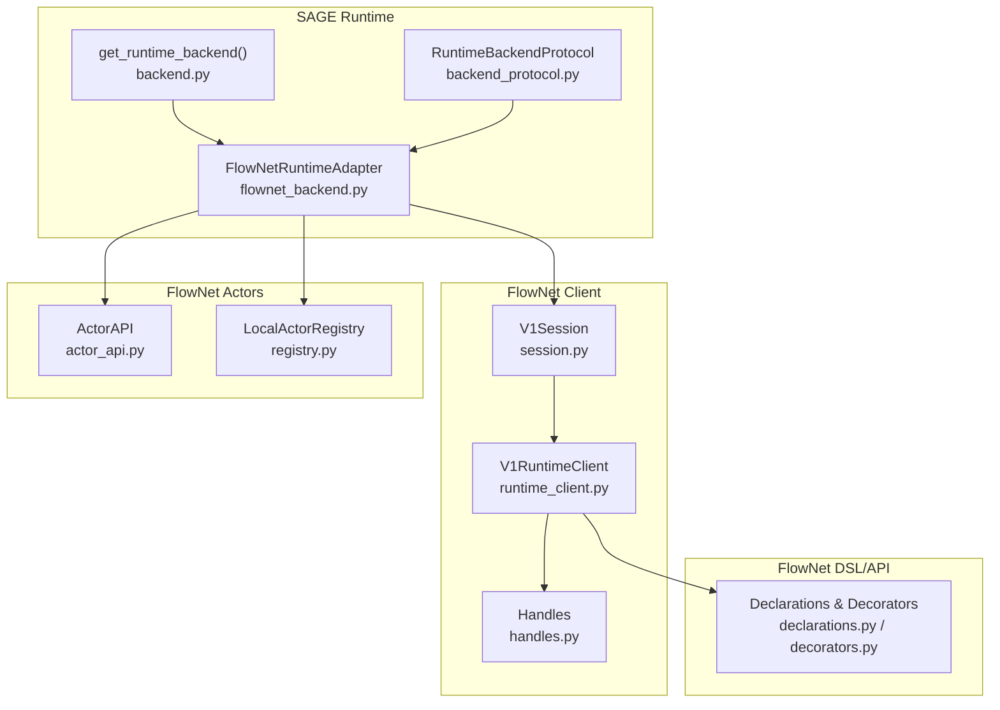
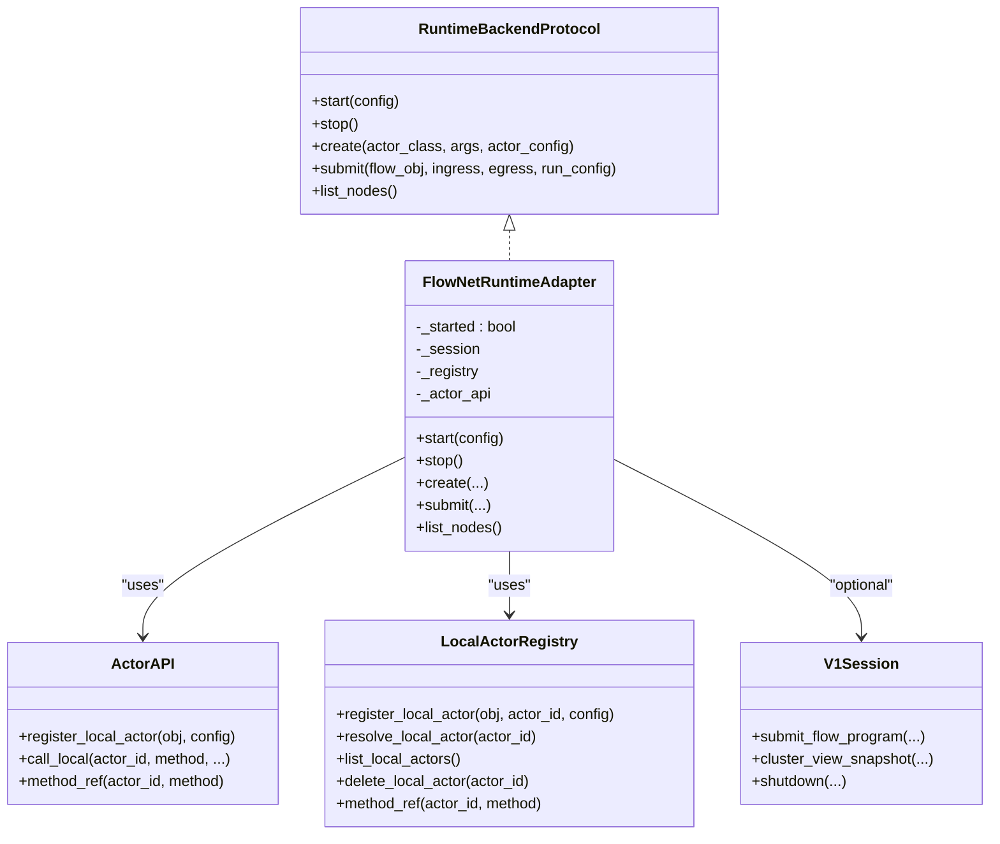
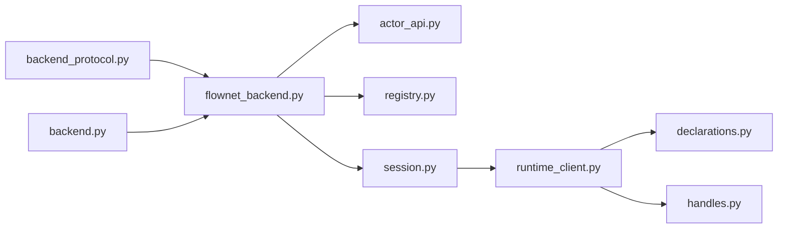

# FlowNet Integration

<cite>
**Referenced Files in This Document**
- [flownet_backend.py](file://src/sage/runtime/flownet_backend.py)
- [backend_protocol.py](file://src/sage/runtime/backend_protocol.py)
- [runtime_client.py](file://src/sage/runtime/flownet/client/runtime_client.py)
- [session.py](file://src/sage/runtime/flownet/client/session.py)
- [handles.py](file://src/sage/runtime/flownet/client/handles.py)
- [actor_api.py](file://src/sage/runtime/flownet/runtime/actors/actor_api.py)
- [registry.py](file://src/sage/runtime/flownet/runtime/actors/registry.py)
- [decorators.py](file://src/sage/runtime/flownet/api/decorators.py)
- [declarations.py](file://src/sage/runtime/flownet/api/declarations.py)
- [backend.py](file://src/sage/runtime/backend.py)
</cite>

## Table of Contents
1. [Introduction](#introduction)
2. [Project Structure](#project-structure)
3. [Core Components](#core-components)
4. [Architecture Overview](#architecture-overview)
5. [Detailed Component Analysis](#detailed-component-analysis)
6. [Dependency Analysis](#dependency-analysis)
7. [Performance Considerations](#performance-considerations)
8. [Troubleshooting Guide](#troubleshooting-guide)
9. [Conclusion](#conclusion)
10. [Appendices](#appendices)

## Introduction
This document explains the FlowNet Integration within SAGE’s runtime system. It focuses on how SAGE bridges its execution model to FlowNet’s distributed runtime via the FlowNetRuntimeAdapter. The adapter translates SAGE operations into FlowNet calls, manages actor handles and replica pools, coordinates distributed execution, and exposes backend protocol interfaces for method references, futures, and node discovery. The document provides both conceptual overviews for beginners and technical details for advanced users, including configuration, performance tuning, and troubleshooting distributed execution.

## Project Structure
The FlowNet integration spans several modules:
- Backend adapter and protocol abstractions live under the runtime layer.
- FlowNet client APIs define the distributed runtime surface, including sessions, endpoints, and lifecycle management.
- Actor runtime components provide local actor execution and method invocation semantics.
- API declarations and decorators define how flows, actors, and services are declared and bound.

**Diagram sources**
- [backend_protocol.py:79-122](file://src/sage/runtime/backend_protocol.py#L79-L122)
- [flownet_backend.py:320-483](file://src/sage/runtime/flownet_backend.py#L320-L483)
- [backend.py:10-17](file://src/sage/runtime/backend.py#L10-L17)
- [runtime_client.py:91-180](file://src/sage/runtime/flownet/client/runtime_client.py#L91-L180)
- [session.py:114-340](file://src/sage/runtime/flownet/client/session.py#L114-L340)
- [handles.py:9-55](file://src/sage/runtime/flownet/client/handles.py#L9-L55)
- [actor_api.py:18-136](file://src/sage/runtime/flownet/runtime/actors/actor_api.py#L18-L136)
- [registry.py:28-109](file://src/sage/runtime/flownet/runtime/actors/registry.py#L28-L109)
- [declarations.py:19-84](file://src/sage/runtime/flownet/api/declarations.py#L19-L84)
- [decorators.py:142-181](file://src/sage/runtime/flownet/api/decorators.py#L142-L181)

**Section sources**
- [flownet_backend.py:1-484](file://src/sage/runtime/flownet_backend.py#L1-L484)
- [backend_protocol.py:1-123](file://src/sage/runtime/backend_protocol.py#L1-L123)
- [runtime_client.py:1-800](file://src/sage/runtime/flownet/client/runtime_client.py#L1-L800)
- [session.py:1-790](file://src/sage/runtime/flownet/client/session.py#L1-L790)
- [handles.py:1-56](file://src/sage/runtime/flownet/client/handles.py#L1-L56)
- [actor_api.py:1-262](file://src/sage/runtime/flownet/runtime/actors/actor_api.py#L1-L262)
- [registry.py:1-155](file://src/sage/runtime/flownet/runtime/actors/registry.py#L1-L155)
- [declarations.py:1-200](file://src/sage/runtime/flownet/api/declarations.py#L1-L200)
- [decorators.py:1-442](file://src/sage/runtime/flownet/api/decorators.py#L1-L442)
- [backend.py:1-20](file://src/sage/runtime/backend.py#L1-L20)

## Core Components
- FlowNetRuntimeAdapter: Implements the RuntimeBackendProtocol to start/stop the runtime, create actors, submit flows, and list nodes. It integrates a local ActorAPI and LocalActorRegistry for local execution and a V1Session for cluster-backed execution.
- Actor Handles and Method References: Provide synchronous and asynchronous method invocation against single actors or replica pools, with round-robin selection and stable routing by partition keys.
- Backend Protocol Interfaces: Define the abstract contracts for node info, method futures, method references, actor handles, and flow run handles.
- Client Session and Runtime Client: Manage distributed lifecycle operations, endpoint publishing, and flow submission through a session and client surface.
- Actor Runtime API: Supports local actor registration, method invocation, and observability snapshots for callbacks and executor lanes.

Key responsibilities:
- Translate SAGE’s create/submit/list_nodes calls into FlowNet operations.
- Manage replica pools and routing keys for consistent partitioning.
- Expose futures and method references compatible with SAGE’s execution model.
- Provide node inventory for distributed orchestration.

**Section sources**
- [flownet_backend.py:320-483](file://src/sage/runtime/flownet_backend.py#L320-L483)
- [backend_protocol.py:79-122](file://src/sage/runtime/backend_protocol.py#L79-L122)
- [runtime_client.py:91-180](file://src/sage/runtime/flownet/client/runtime_client.py#L91-L180)
- [session.py:114-340](file://src/sage/runtime/flownet/client/session.py#L114-L340)
- [actor_api.py:18-136](file://src/sage/runtime/flownet/runtime/actors/actor_api.py#L18-L136)
- [registry.py:28-109](file://src/sage/runtime/flownet/runtime/actors/registry.py#L28-L109)

## Architecture Overview
The FlowNet integration centers on the FlowNetRuntimeAdapter, which:
- Starts a local runtime host and registers a LocalActorRegistry.
- Creates ActorAPI instances bound to the registry for local method invocation.
- Optionally initializes a V1Session for cluster mode, enabling flow submission and distributed coordination.
- Provides actor handles that encapsulate either a single actor or a replica pool, selecting replicas by partition key or round-robin.

**Diagram sources**
- [backend_protocol.py:79-122](file://src/sage/runtime/backend_protocol.py#L79-L122)
- [flownet_backend.py:320-483](file://src/sage/runtime/flownet_backend.py#L320-L483)
- [actor_api.py:18-136](file://src/sage/runtime/flownet/runtime/actors/actor_api.py#L18-L136)
- [registry.py:28-109](file://src/sage/runtime/flownet/runtime/actors/registry.py#L28-L109)
- [session.py:114-340](file://src/sage/runtime/flownet/client/session.py#L114-L340)

## Detailed Component Analysis

### FlowNetRuntimeAdapter
Purpose:
- Serve as the primary bridge between SAGE’s runtime backend and FlowNet’s distributed runtime.
- Provide a unified interface for creating actors, invoking methods, submitting flows, and enumerating nodes.

Key behaviors:
- start(config): Initializes LocalActorRegistry and ActorAPI; optionally starts a V1Session in cluster mode.
- create(actor_class, args, actor_config): Builds replica instances based on actor_config, registers them locally, and returns an actor handle supporting single or replica pools.
- submit(flow_obj, ingress, egress, run_config): Submits a flow program via the session when in cluster mode; supports endpoint-bound flows and URI-based flows.
- list_nodes(): Returns node inventory from the session’s runtime inspector or a local default.

Replica management:
- Replica count derived from actor_config; supports stable routing by partition key and round-robin fallback.
- Per-replica execution context injected into actor functions for logging and partition awareness.

Asynchronous execution:
- Uses a thread pool to run synchronous actor method calls from asynchronous contexts, returning futures compatible with the backend protocol.

**Section sources**
- [flownet_backend.py:320-483](file://src/sage/runtime/flownet_backend.py#L320-L483)
- [flownet_backend.py:157-237](file://src/sage/runtime/flownet_backend.py#L157-L237)
- [flownet_backend.py:99-126](file://src/sage/runtime/flownet_backend.py#L99-L126)
- [flownet_backend.py:128-155](file://src/sage/runtime/flownet_backend.py#L128-L155)

### Actor Handles and Replica Pools
- Single actor handle: Wraps a single actor_id and exposes method references.
- Replica pool handle: Manages multiple actor_ids and selects replicas by partition key hashing or round-robin rotation.
- Method references: Support synchronous call and async_call via a thread pool; futures propagate timeouts and cancellation.

Routing logic:
- Partition key extraction from arguments or partition_key keyword.
- Stable replica selection using BLAKE2B hash of the route key modulo replica count.
- Round-robin fallback when no partition key is present.

**Section sources**
- [flownet_backend.py:201-237](file://src/sage/runtime/flownet_backend.py#L201-L237)
- [flownet_backend.py:74-97](file://src/sage/runtime/flownet_backend.py#L74-L97)
- [flownet_backend.py:128-155](file://src/sage/runtime/flownet_backend.py#L128-L155)

### Backend Protocol Interfaces
Contracts:
- NodeInfoProtocol: Node identity, address, schedulability, and resource summary.
- MethodCallFuture: Asynchronous result with result(), cancel(), and done property.
- MethodRefProtocol: call(), async_call(), and cancel().
- ActorHandleProtocol: get_method(name) and optional cancel().
- FlowRunHandleProtocol: call() and cancel() for flow runs.
- RuntimeBackendProtocol: start(), stop(), create(), submit(), list_nodes().

These abstractions decouple SAGE’s runtime from FlowNet internals and enable pluggable backends.

**Section sources**
- [backend_protocol.py:9-122](file://src/sage/runtime/backend_protocol.py#L9-L122)

### Client Session and Runtime Client
- V1Session: Encapsulates a runtime client and runtime host; provides flow submission, run inspection, and cluster view snapshots.
- V1RuntimeClient: Three-stage lifecycle surface (declaration → registration → instantiation) with surfaces for actors, flows, services, sources, and stateless components.
- Handles: RegistrationHandle and InstanceHandle represent registration and instantiation artifacts respectively.

Usage patterns:
- Initialize a session in local_runtime mode to enable cluster-backed execution.
- Publish endpoints and submit flows programmatically; collect outcomes via endpoint references.

**Section sources**
- [session.py:114-340](file://src/sage/runtime/flownet/client/session.py#L114-L340)
- [runtime_client.py:91-180](file://src/sage/runtime/flownet/client/runtime_client.py#L91-L180)
- [handles.py:9-55](file://src/sage/runtime/flownet/client/handles.py#L9-L55)

### Actor Runtime API and Registry
- ActorAPI: Registers local actors, resolves them, lists actors, and performs local method calls. Also supports callback registration and observability snapshots.
- LocalActorRegistry: Manages actor records, local address resolution, and method references.

Integration:
- FlowNetRuntimeAdapter composes ActorAPI and LocalActorRegistry to support local execution and method invocation semantics.

**Section sources**
- [actor_api.py:18-136](file://src/sage/runtime/flownet/runtime/actors/actor_api.py#L18-L136)
- [registry.py:28-109](file://src/sage/runtime/flownet/runtime/actors/registry.py#L28-L109)

### FlowNet API Declarations and Decorators
- Declarations: ActorDeclaration, FlowDeclaration, ServiceDeclaration, SourceDeclaration, ProcessDeclaration, StatelessDeclaration encapsulate metadata and defaults.
- Decorators: actor(), flow(), service(), source(), process(), stateless() validate signatures and normalize fields, producing declaration objects ready for compilation and binding.

These enable declarative definition of distributed components and flows.

**Section sources**
- [declarations.py:19-84](file://src/sage/runtime/flownet/api/declarations.py#L19-L84)
- [decorators.py:142-181](file://src/sage/runtime/flownet/api/decorators.py#L142-L181)

### Practical Workflows and Examples

#### Adapter Setup and Initialization
- Obtain the singleton adapter via get_flownet_adapter(auto_start=True) or call start(config) manually.
- Configure mode and local_address; in cluster mode, a V1Session is initialized for distributed execution.

References:
- [flownet_backend.py:328-351](file://src/sage/runtime/flownet_backend.py#L328-L351)
- [flownet_backend.py:476-483](file://src/sage/runtime/flownet_backend.py#L476-L483)
- [backend.py:10-17](file://src/sage/runtime/backend.py#L10-L17)

#### Actor Creation Patterns
- Create actors with optional actor_config specifying parallelism or materialization policy overrides.
- Replica instances are registered locally; a handle is returned supporting single or replica pool invocation.

References:
- [flownet_backend.py:390-411](file://src/sage/runtime/flownet_backend.py#L390-L411)
- [flownet_backend.py:106-126](file://src/sage/runtime/flownet_backend.py#L106-L126)
- [registry.py:51-75](file://src/sage/runtime/flownet/runtime/actors/registry.py#L51-L75)

#### Distributed Execution Workflows
- Submit flows via FlowNetRuntimeAdapter.submit() when in cluster mode; supports endpoint-bound flows and URI-based flows.
- Use V1Session to submit flow programs and inspect run descriptors.

References:
- [flownet_backend.py:413-448](file://src/sage/runtime/flownet_backend.py#L413-L448)
- [session.py:187-207](file://src/sage/runtime/flownet/client/session.py#L187-L207)

#### Monitoring Distributed Pipeline Performance
- Use list_nodes() to retrieve node inventory from the runtime inspector.
- Inspect flow runs and cluster gossip stats via session methods.

References:
- [flownet_backend.py:450-469](file://src/sage/runtime/flownet_backend.py#L450-L469)
- [session.py:263-277](file://src/sage/runtime/flownet/client/session.py#L263-L277)

## Dependency Analysis
The adapter depends on:
- Backend protocol abstractions to remain backend-agnostic.
- Actor runtime components for local execution and method invocation.
- Client session and runtime client for cluster-backed operations.
- API declarations and decorators to define and compile distributed components.

**Diagram sources**
- [backend_protocol.py:79-122](file://src/sage/runtime/backend_protocol.py#L79-L122)
- [flownet_backend.py:320-483](file://src/sage/runtime/flownet_backend.py#L320-L483)
- [actor_api.py:18-136](file://src/sage/runtime/flownet/runtime/actors/actor_api.py#L18-L136)
- [registry.py:28-109](file://src/sage/runtime/flownet/runtime/actors/registry.py#L28-L109)
- [session.py:114-340](file://src/sage/runtime/flownet/client/session.py#L114-L340)
- [runtime_client.py:91-180](file://src/sage/runtime/flownet/client/runtime_client.py#L91-L180)
- [declarations.py:19-84](file://src/sage/runtime/flownet/api/declarations.py#L19-L84)
- [handles.py:9-55](file://src/sage/runtime/flownet/client/handles.py#L9-L55)
- [backend.py:10-17](file://src/sage/runtime/backend.py#L10-L17)

**Section sources**
- [flownet_backend.py:320-483](file://src/sage/runtime/flownet_backend.py#L320-L483)
- [runtime_client.py:91-180](file://src/sage/runtime/flownet/client/runtime_client.py#L91-L180)
- [session.py:114-340](file://src/sage/runtime/flownet/client/session.py#L114-L340)
- [actor_api.py:18-136](file://src/sage/runtime/flownet/runtime/actors/actor_api.py#L18-L136)
- [registry.py:28-109](file://src/sage/runtime/flownet/runtime/actors/registry.py#L28-L109)
- [declarations.py:19-84](file://src/sage/runtime/flownet/api/declarations.py#L19-L84)
- [handles.py:9-55](file://src/sage/runtime/flownet/client/handles.py#L9-L55)
- [backend.py:10-17](file://src/sage/runtime/backend.py#L10-L17)

## Performance Considerations
- Replica placement: Use partition keys to achieve stable, consistent routing across replicas for stateful workloads.
- Round-robin fallback: Without a partition key, round-robin ensures balanced distribution across replicas.
- Asynchronous execution: The adapter uses a thread pool to run synchronous actor calls; tune max workers and avoid blocking calls inside actors to prevent contention.
- Observability: Leverage ActorAPI observability snapshots for callbacks and executor lanes to identify hotspots and bottlenecks.
- Cluster mode: Prefer cluster mode for distributed execution; ensure session initialization and node discovery are configured properly to minimize latency.

[No sources needed since this section provides general guidance]

## Troubleshooting Guide
Common issues and resolutions:
- Missing FlowNet package: start() raises an ImportError if the in-tree FlowNet runtime package is unavailable. Install/update SAGE from the repository to include FlowNet.
- Calling submit() without cluster mode: submit() requires cluster mode; start with config={"mode": "cluster"}.
- Calling adapter methods before start(): Methods assert that the adapter is started; call start() or use get_flownet_adapter(auto_start=True).
- Actor method call timeouts: MethodCallFuture propagates TimeoutError when results do not arrive within the timeout.
- Cancellation: Futures support cancel(); actor handle cancel() deletes local actors from the registry.

Operational checks:
- Verify list_nodes() returns expected nodes; otherwise, inspect session runtime inspector snapshots.
- For endpoint-based flows, ensure endpoint publishing and binding are correct.

**Section sources**
- [flownet_backend.py:26-35](file://src/sage/runtime/flownet_backend.py#L26-L35)
- [flownet_backend.py:422-425](file://src/sage/runtime/flownet_backend.py#L422-L425)
- [flownet_backend.py:367-372](file://src/sage/runtime/flownet_backend.py#L367-L372)
- [flownet_backend.py:58-64](file://src/sage/runtime/flownet_backend.py#L58-L64)
- [flownet_backend.py:450-469](file://src/sage/runtime/flownet_backend.py#L450-L469)

## Conclusion
The FlowNet Integration provides a robust bridge between SAGE’s execution model and FlowNet’s distributed runtime. The FlowNetRuntimeAdapter encapsulates local and cluster execution, manages actor handles and replica pools, and exposes a backend protocol interface for seamless integration. With proper configuration, routing strategies, and observability, SAGE applications can scale across cluster nodes while maintaining a familiar programming model.

[No sources needed since this section summarizes without analyzing specific files]

## Appendices

### Adapter Configuration Reference
- mode: "lightweight" or "cluster". "cluster" enables V1Session for distributed execution.
- local_address: Address used for local runtime and registry.

References:
- [flownet_backend.py:334-335](file://src/sage/runtime/flownet_backend.py#L334-L335)
- [flownet_backend.py:343-349](file://src/sage/runtime/flownet_backend.py#L343-L349)

### Actor Config and Replica Policies
- parallelism: Integer number of replicas.
- materialization_policy_override: Dict containing replica_policy with count.

References:
- [flownet_backend.py:106-126](file://src/sage/runtime/flownet_backend.py#L106-L126)

### Flow Submission Patterns
- Endpoint-bound flows: Provide a callable endpoint on the flow object and specify ingress/egress topics.
- URI-based flows: Provide a flow_uri or uri on the flow object.

References:
- [flownet_backend.py:427-448](file://src/sage/runtime/flownet_backend.py#L427-L448)