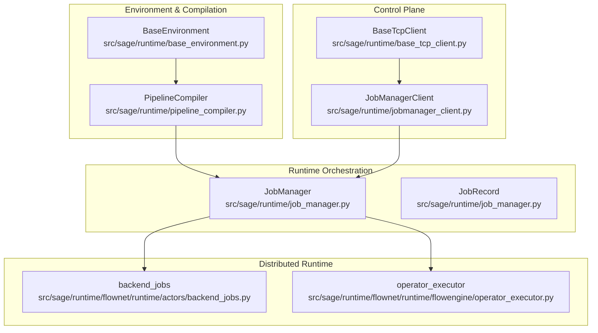
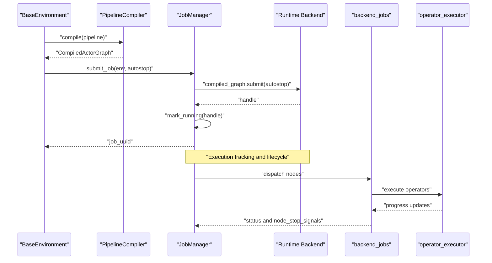
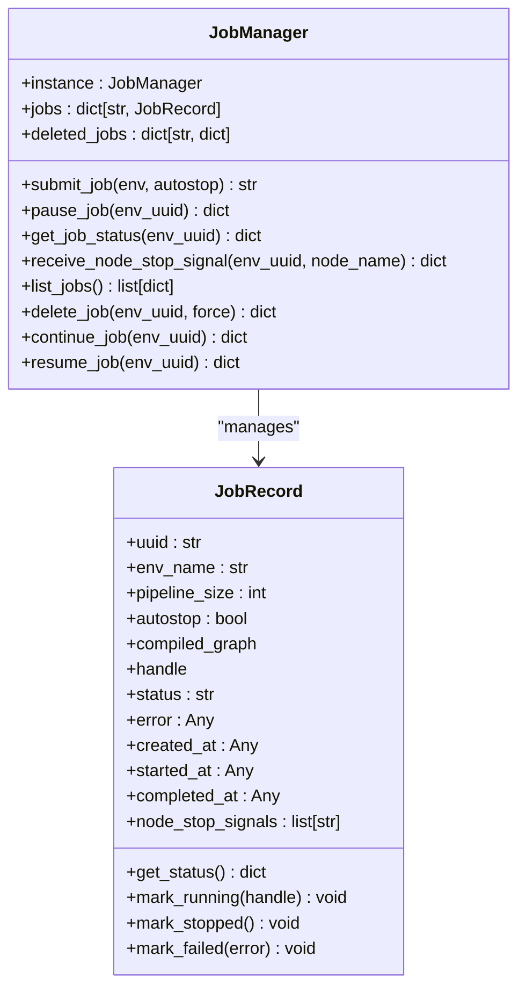
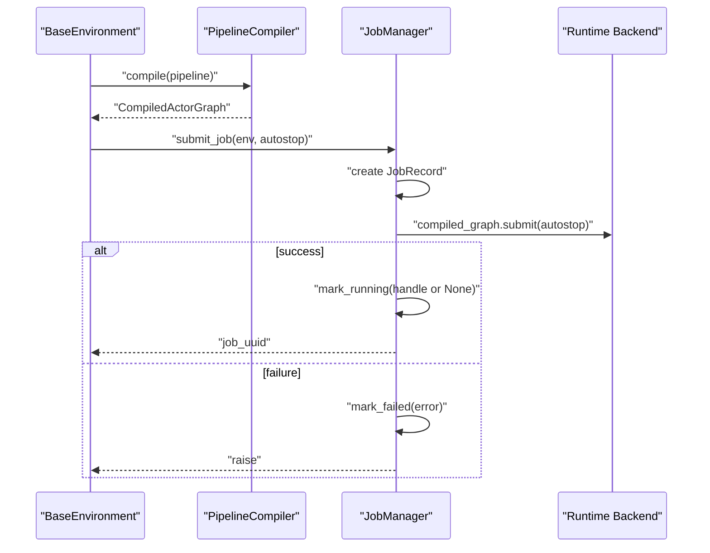
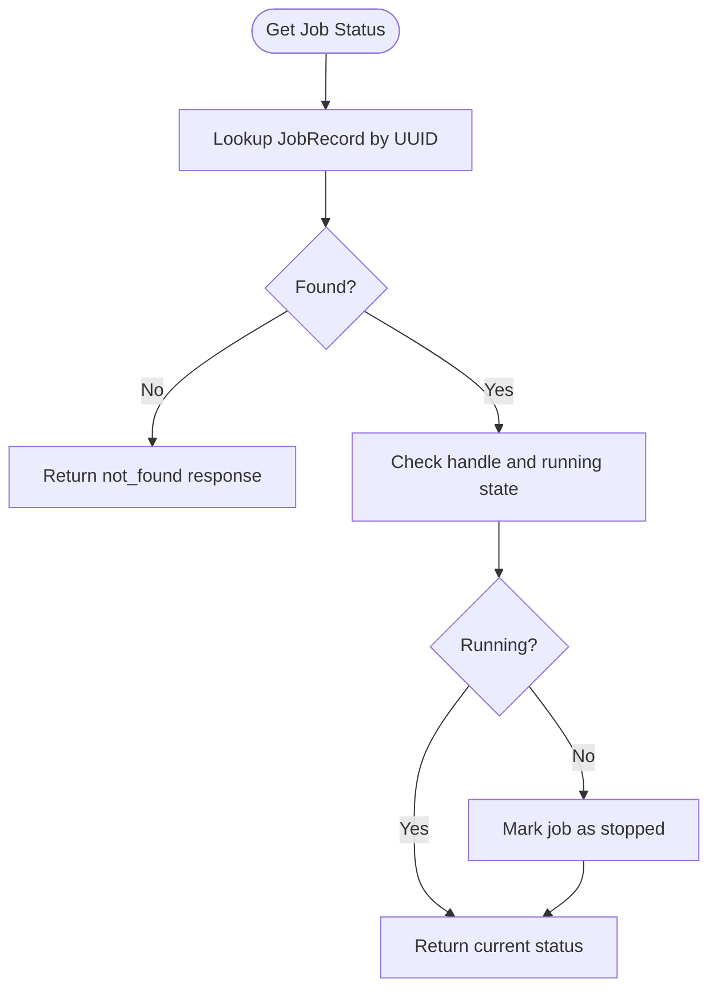
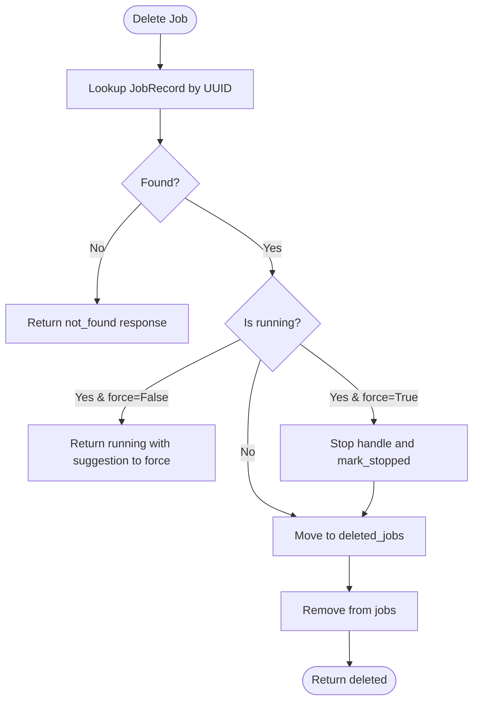
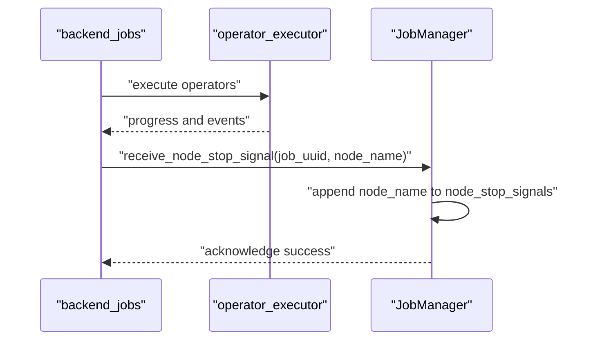
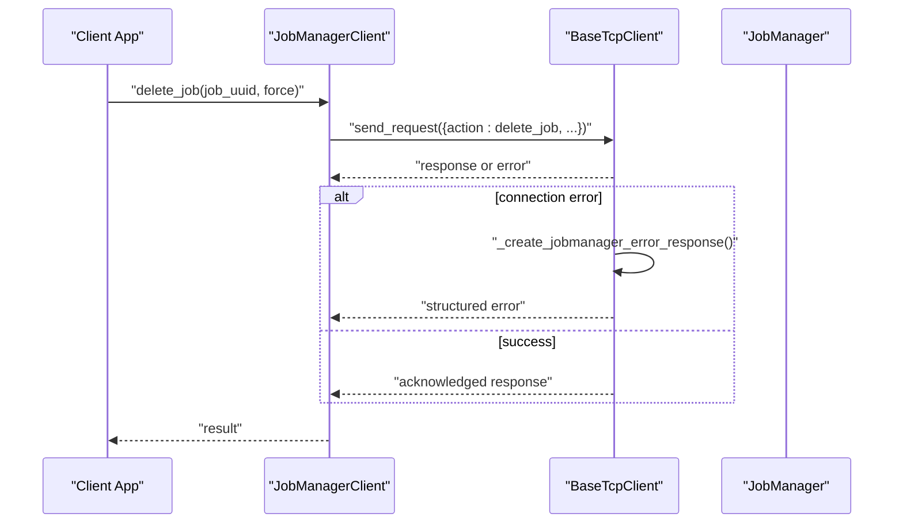
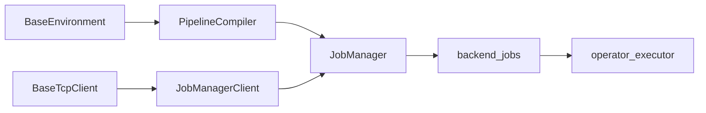

# Job Management

<cite>
**Referenced Files in This Document**
- [job_manager.py](file://src/sage/runtime/job_manager.py)
- [jobmanager_client.py](file://src/sage/runtime/jobmanager_client.py)
- [base_environment.py](file://src/sage/runtime/base_environment.py)
- [pipeline_compiler.py](file://src/sage/runtime/pipeline_compiler.py)
- [base_tcp_client.py](file://src/sage/runtime/base_tcp_client.py)
- [backend_jobs.py](file://src/sage/runtime/flownet/runtime/actors/backend_jobs.py)
- [operator_executor.py](file://src/sage/runtime/flownet/runtime/flowengine/operator_executor.py)
</cite>

## Table of Contents
1. [Introduction](#introduction)
2. [Project Structure](#project-structure)
3. [Core Components](#core-components)
4. [Architecture Overview](#architecture-overview)
5. [Detailed Component Analysis](#detailed-component-analysis)
6. [Dependency Analysis](#dependency-analysis)
7. [Performance Considerations](#performance-considerations)
8. [Troubleshooting Guide](#troubleshooting-guide)
9. [Conclusion](#conclusion)
10. [Appendices](#appendices)

## Introduction
This document explains the Job Management subsystem that coordinates streaming pipeline executions in SAGE. It focuses on the JobManager as the central coordinator for job submission, lifecycle management, status tracking, and resource coordination across distributed environments. The content is structured for both beginners—covering job-based execution models and distributed coordination concepts—and experienced developers—detailing scheduling, resource allocation, and performance optimization.

## Project Structure
The Job Management system spans several modules:
- Runtime orchestration and lifecycle: JobManager and JobRecord
- Client-side control plane: JobManagerClient
- Environment and pipeline compilation: BaseEnvironment and PipelineCompiler
- Distributed runtime integration: backend_jobs and operator_executor
- TCP client error handling: BaseTcpClient

**Diagram sources**
- [job_manager.py](file://src/sage/runtime/job_manager.py)
- [jobmanager_client.py](file://src/sage/runtime/jobmanager_client.py)
- [base_environment.py](file://src/sage/runtime/base_environment.py)
- [pipeline_compiler.py](file://src/sage/runtime/pipeline_compiler.py)
- [base_tcp_client.py](file://src/sage/runtime/base_tcp_client.py)
- [backend_jobs.py](file://src/sage/runtime/flownet/runtime/actors/backend_jobs.py)
- [operator_executor.py](file://src/sage/runtime/flownet/runtime/flowengine/operator_executor.py)

**Section sources**
- [job_manager.py](file://src/sage/runtime/job_manager.py)
- [jobmanager_client.py](file://src/sage/runtime/jobmanager_client.py)
- [base_environment.py](file://src/sage/runtime/base_environment.py)
- [pipeline_compiler.py](file://src/sage/runtime/pipeline_compiler.py)
- [base_tcp_client.py](file://src/sage/runtime/base_tcp_client.py)
- [backend_jobs.py](file://src/sage/runtime/flownet/runtime/actors/backend_jobs.py)
- [operator_executor.py](file://src/sage/runtime/flownet/runtime/flowengine/operator_executor.py)

## Core Components
- JobManager: Singleton orchestrator for lightweight local jobs. Manages job records, submission, lifecycle transitions, and status reporting.
- JobRecord: Encapsulates per-job metadata, runtime handle, timestamps, and node stop signals.
- JobManagerClient: TCP client to communicate with a remote JobManager service.
- BaseEnvironment: Holds environment configuration, pipeline definition, and references to scheduler and job manager.
- PipelineCompiler: Compiles a flow program into a runtime graph suitable for execution.
- backend_jobs and operator_executor: Distributed runtime components that execute compiled stages and nodes.

Key responsibilities:
- Job submission: Compile pipeline, create JobRecord, submit to runtime backend, and mark running.
- Execution tracking: Expose status, detect completion or failure, and maintain node stop signals.
- Cancellation: Stop running handles and finalize job state.
- Distributed coordination: Integrate with runtime actors and flow engine for streaming execution.

**Section sources**
- [job_manager.py](file://src/sage/runtime/job_manager.py)
- [jobmanager_client.py](file://src/sage/runtime/jobmanager_client.py)
- [base_environment.py](file://src/sage/runtime/base_environment.py)
- [pipeline_compiler.py](file://src/sage/runtime/pipeline_compiler.py)
- [backend_jobs.py](file://src/sage/runtime/flownet/runtime/actors/backend_jobs.py)
- [operator_executor.py](file://src/sage/runtime/flownet/runtime/flowengine/operator_executor.py)

## Architecture Overview
The Job Management architecture connects environment pipelines to runtime execution via a centralized JobManager. The control plane communicates with a remote JobManager through a TCP client, while the runtime executes compiled stages and nodes.

**Diagram sources**
- [base_environment.py](file://src/sage/runtime/base_environment.py)
- [pipeline_compiler.py](file://src/sage/runtime/pipeline_compiler.py)
- [job_manager.py](file://src/sage/runtime/job_manager.py)
- [backend_jobs.py](file://src/sage/runtime/flownet/runtime/actors/backend_jobs.py)
- [operator_executor.py](file://src/sage/runtime/flownet/runtime/flowengine/operator_executor.py)

## Detailed Component Analysis

### JobManager and JobRecord
JobManager is a thread-safe singleton responsible for:
- Creating JobRecord entries upon submission
- Compiling the environment’s pipeline and submitting to the runtime backend
- Tracking job status, completion, and errors
- Handling cancellation and deletion with optional force behavior
- Recording node stop signals from distributed runtime components

JobRecord encapsulates:
- Identity and metadata (UUID, environment name, pipeline size, autostop)
- Timing (created, started, completed)
- Error state and node stop signals
- A runtime handle and a running flag

**Diagram sources**
- [job_manager.py](file://src/sage/runtime/job_manager.py)

**Section sources**
- [job_manager.py](file://src/sage/runtime/job_manager.py)

### Job Submission Workflow
End-to-end submission flow:
- Environment defines a pipeline
- PipelineCompiler compiles the pipeline into a runtime graph
- JobManager creates a JobRecord and submits the compiled graph
- Autostop controls whether the runtime handle is tracked immediately
- On success, the job transitions to running; on failure, it is marked failed

**Diagram sources**
- [base_environment.py](file://src/sage/runtime/base_environment.py)
- [pipeline_compiler.py](file://src/sage/runtime/pipeline_compiler.py)
- [job_manager.py](file://src/sage/runtime/job_manager.py)

**Section sources**
- [base_environment.py](file://src/sage/runtime/base_environment.py)
- [pipeline_compiler.py](file://src/sage/runtime/pipeline_compiler.py)
- [job_manager.py](file://src/sage/runtime/job_manager.py)

### Execution Monitoring and Status Tracking
JobManager exposes status queries and maintains derived states:
- If a job has a handle but is not running while status indicates running, it is marked stopped
- Status includes success flag, UUID, current status, environment name, pipeline size, autostop, timestamps, error, running flag, and node stop signals
- Node stop signals are collected from distributed runtime components

**Diagram sources**
- [job_manager.py](file://src/sage/runtime/job_manager.py)

**Section sources**
- [job_manager.py](file://src/sage/runtime/job_manager.py)

### Cancellation and Deletion Mechanisms
Cancellation:
- Pause stops a running job by invoking the runtime handle’s stop method and marks the job as stopped
- Resume/Continue are unsupported for lightweight in-process jobs

Deletion:
- Delete requires the job to be stopped; pass force=True to stop and delete in one operation
- Deleted jobs are moved to a separate registry and removed from active jobs

**Diagram sources**
- [job_manager.py](file://src/sage/runtime/job_manager.py)

**Section sources**
- [job_manager.py](file://src/sage/runtime/job_manager.py)

### Distributed Coordination and Node Stop Signals
Distributed runtime components report node-level stop signals to JobManager:
- backend_jobs coordinates node execution
- operator_executor drives operator execution and emits progress
- JobManager aggregates node stop signals to inform higher-level control decisions

**Diagram sources**
- [backend_jobs.py](file://src/sage/runtime/flownet/runtime/actors/backend_jobs.py)
- [operator_executor.py](file://src/sage/runtime/flownet/runtime/flowengine/operator_executor.py)
- [job_manager.py](file://src/sage/runtime/job_manager.py)

**Section sources**
- [backend_jobs.py](file://src/sage/runtime/flownet/runtime/actors/backend_jobs.py)
- [operator_executor.py](file://src/sage/runtime/flownet/runtime/flowengine/operator_executor.py)
- [job_manager.py](file://src/sage/runtime/job_manager.py)

### Control Plane Communication
JobManagerClient provides a TCP-based control plane to a remote JobManager service:
- Actions include delete_job, receive_node_stop_signal, and cleanup_all_jobs
- Includes retry logic and structured error responses

**Diagram sources**
- [jobmanager_client.py](file://src/sage/runtime/jobmanager_client.py)
- [base_tcp_client.py](file://src/sage/runtime/base_tcp_client.py)
- [job_manager.py](file://src/sage/runtime/job_manager.py)

**Section sources**
- [jobmanager_client.py](file://src/sage/runtime/jobmanager_client.py)
- [base_tcp_client.py](file://src/sage/runtime/base_tcp_client.py)
- [job_manager.py](file://src/sage/runtime/job_manager.py)

## Dependency Analysis
- BaseEnvironment depends on PipelineCompiler to produce a runtime graph
- JobManager depends on PipelineCompiler and a runtime backend to submit jobs
- JobManagerClient depends on BaseTcpClient for network communication
- backend_jobs and operator_executor depend on compiled stages and runtime handles managed by JobManager

**Diagram sources**
- [base_environment.py](file://src/sage/runtime/base_environment.py)
- [pipeline_compiler.py](file://src/sage/runtime/pipeline_compiler.py)
- [job_manager.py](file://src/sage/runtime/job_manager.py)
- [jobmanager_client.py](file://src/sage/runtime/jobmanager_client.py)
- [base_tcp_client.py](file://src/sage/runtime/base_tcp_client.py)
- [backend_jobs.py](file://src/sage/runtime/flownet/runtime/actors/backend_jobs.py)
- [operator_executor.py](file://src/sage/runtime/flownet/runtime/flowengine/operator_executor.py)

**Section sources**
- [base_environment.py](file://src/sage/runtime/base_environment.py)
- [pipeline_compiler.py](file://src/sage/runtime/pipeline_compiler.py)
- [job_manager.py](file://src/sage/runtime/job_manager.py)
- [jobmanager_client.py](file://src/sage/runtime/jobmanager_client.py)
- [base_tcp_client.py](file://src/sage/runtime/base_tcp_client.py)
- [backend_jobs.py](file://src/sage/runtime/flownet/runtime/actors/backend_jobs.py)
- [operator_executor.py](file://src/sage/runtime/flownet/runtime/flowengine/operator_executor.py)

## Performance Considerations
- Throughput optimization: minimize serialization overhead by batching control-plane requests and reducing redundant status queries
- Resource allocation: leverage autostop to release resources promptly after pipeline completion; use force deletion judiciously to avoid orphaned handles
- Parallelism: ensure pipeline stages are designed to maximize concurrency; avoid unnecessary blocking operations in operators
- Monitoring: enable monitoring in BaseEnvironment to capture telemetry and adjust scheduling policies dynamically

[No sources needed since this section provides general guidance]

## Troubleshooting Guide
Common scenarios and remedies:
- Job not found: Verify the job UUID and ensure the job exists in JobManager’s registry
- Job still running during deletion: Stop the job first or pass force=True to terminate and delete
- Connection failures to JobManager: Confirm host/port, service health, and firewall rules; use structured error responses to diagnose
- Node stop signals: Investigate distributed runtime logs to identify problematic nodes and adjust pipeline configuration

**Section sources**
- [job_manager.py](file://src/sage/runtime/job_manager.py)
- [jobmanager_client.py](file://src/sage/runtime/jobmanager_client.py)
- [base_tcp_client.py](file://src/sage/runtime/base_tcp_client.py)

## Conclusion
Job Management in SAGE provides a robust, centralized mechanism to submit, track, and control streaming pipeline executions. It integrates tightly with environment compilation, runtime backends, and distributed components to deliver reliable distributed coordination. By leveraging JobManager’s lifecycle APIs, clients can implement efficient job creation workflows, monitor progress, handle failures gracefully, and optimize throughput in production deployments.

[No sources needed since this section summarizes without analyzing specific files]

## Appendices
- Practical examples:
  - Job creation: Build a pipeline with BaseEnvironment, compile with PipelineCompiler, and submit via JobManager to obtain a job UUID
  - Monitoring progress: Poll JobManager for status; watch for node stop signals to detect partial failures
  - Handling failures: Capture error details from JobRecord and trigger corrective actions; use force deletion to clean up stuck jobs
  - Optimizing throughput: Adjust pipeline stages for parallelism, enable monitoring, and tune autostop behavior

[No sources needed since this section provides general guidance]