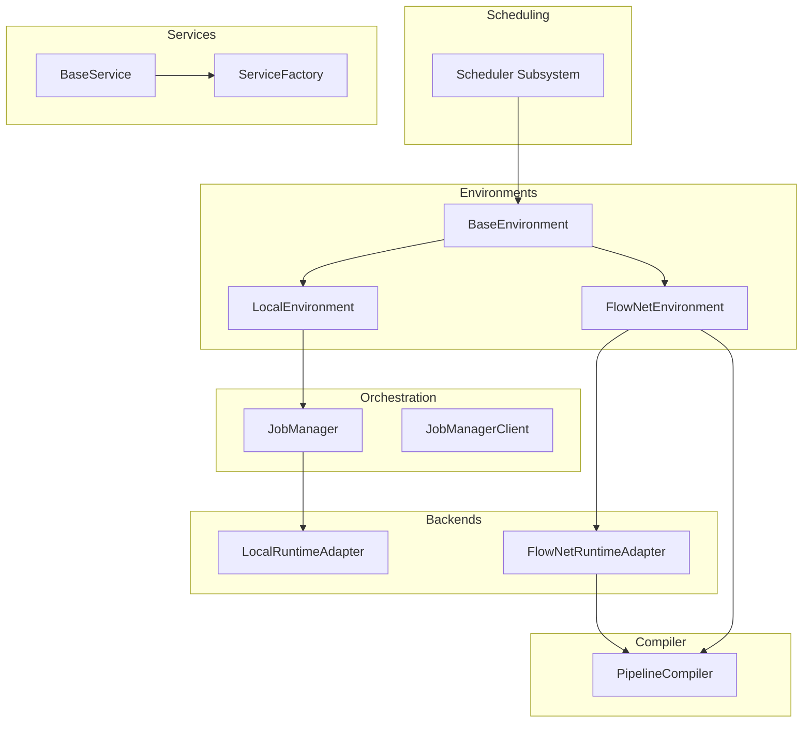
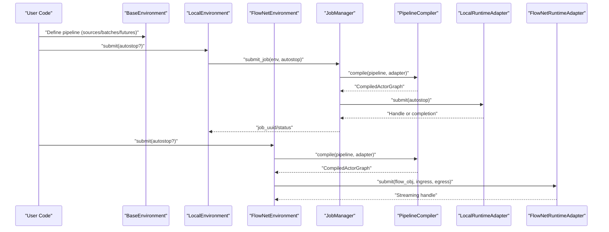
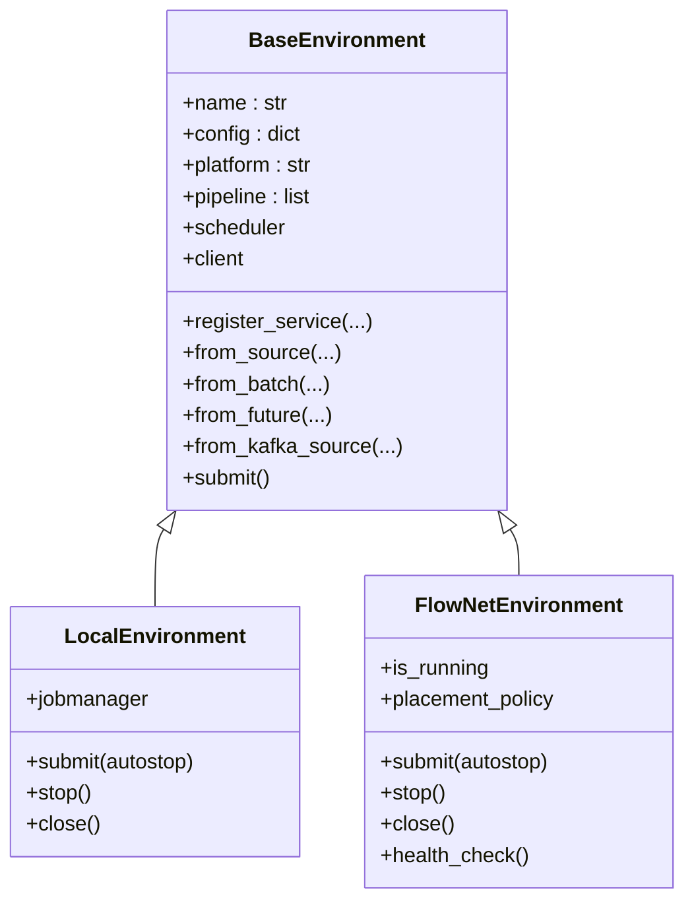
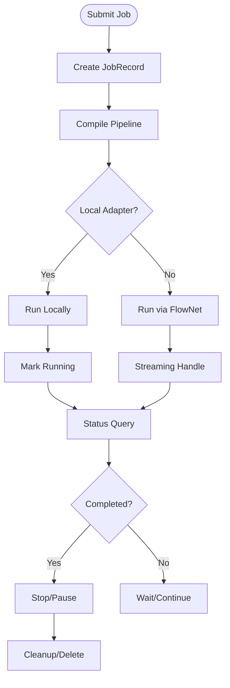
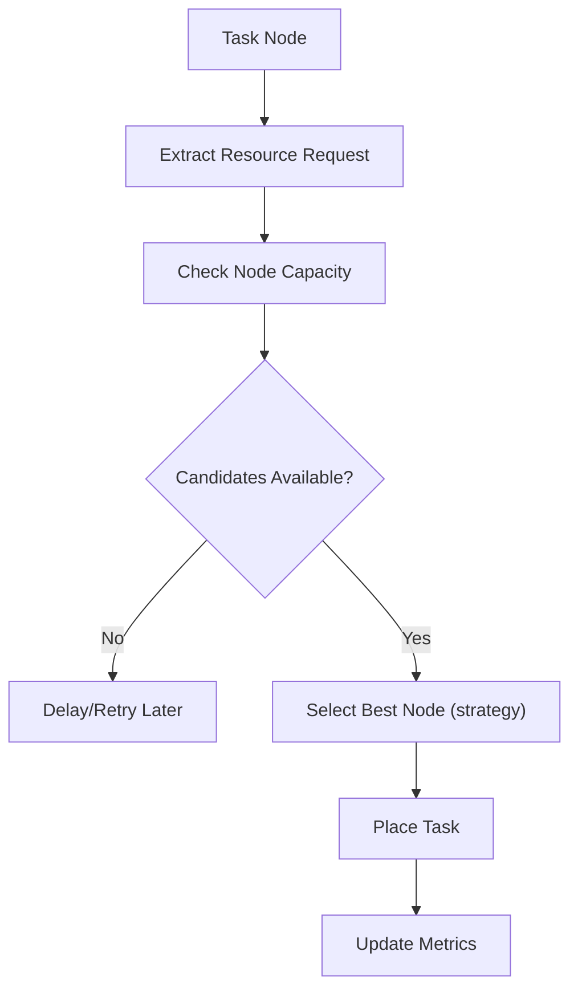
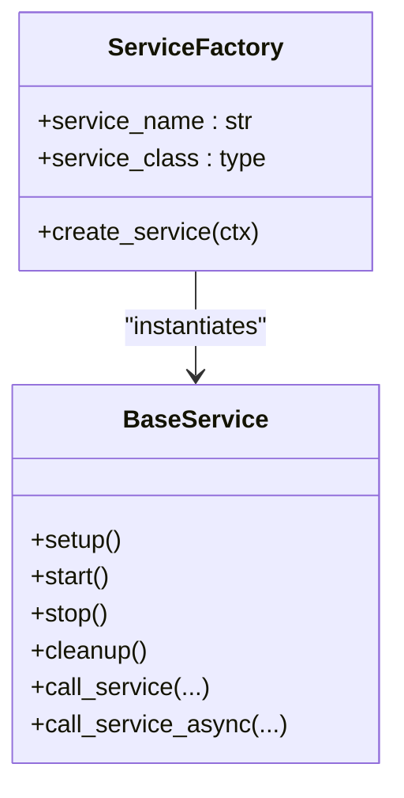
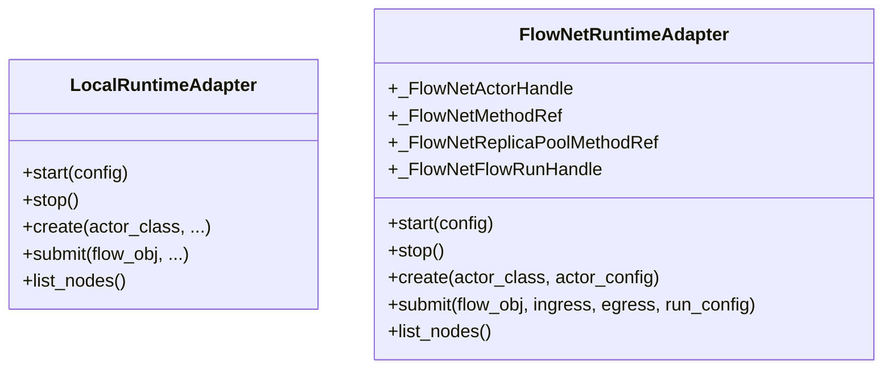
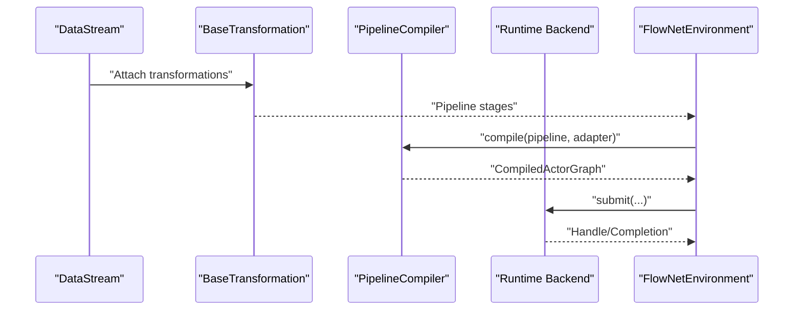
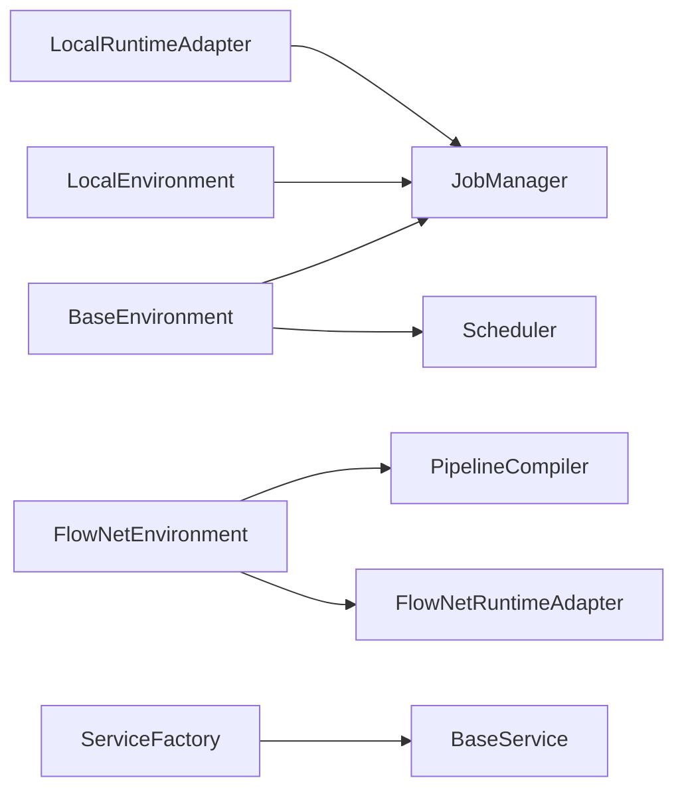

# Runtime Layer

<cite>
**Referenced Files in This Document**
- [base_environment.py](file://src/sage/runtime/base_environment.py)
- [environments.py](file://src/sage/runtime/environments.py)
- [job_manager.py](file://src/sage/runtime/job_manager.py)
- [scheduler.py](file://src/sage/runtime/scheduler.py)
- [service.py](file://src/sage/runtime/service.py)
- [service_factory.py](file://src/sage/runtime/service_factory.py)
- [local_backend.py](file://src/sage/runtime/local_backend.py)
- [flownet_backend.py](file://src/sage/runtime/flownet_backend.py)
- [jobmanager_client.py](file://src/sage/runtime/jobmanager_client.py)
- [pipeline_compiler.py](file://src/sage/runtime/pipeline_compiler.py)
- [backend.py](file://src/sage/runtime/backend.py)
- [README.md](file://README.md)
</cite>

## Table of Contents
1. [Introduction](#introduction)
2. [Project Structure](#project-structure)
3. [Core Components](#core-components)
4. [Architecture Overview](#architecture-overview)
5. [Detailed Component Analysis](#detailed-component-analysis)
6. [Dependency Analysis](#dependency-analysis)
7. [Performance Considerations](#performance-considerations)
8. [Troubleshooting Guide](#troubleshooting-guide)
9. [Conclusion](#conclusion)
10. [Appendices](#appendices)

## Introduction
The Runtime Layer is the backbone of SAGE’s streaming pipelines, responsible for executing data transformations either locally or in a distributed environment. It provides:
- Execution environments via LocalEnvironment and FlowNetEnvironment
- Backend systems to acquire runtime environments and materialize actors/nodes
- Job management for orchestrating pipeline lifecycles
- Scheduling algorithms for resource-aware placement and throughput
- Service orchestration for long-running processes and inter-service communication

This document explains both the conceptual underpinnings (distributed computing and actor model) and the technical implementation details (classes, flows, and integration points) to help beginners understand the system and experienced developers optimize and scale it.

## Project Structure
The Runtime Layer is organized around environment abstractions, schedulers, backends, and orchestration utilities. Key modules include:
- Environment base and concrete environments (LocalEnvironment, FlowNetEnvironment)
- Job manager and client for lifecycle control
- Scheduler subsystem for placement and load decisions
- Service primitives and factories for runtime services
- Local and FlowNet runtime adapters
- Pipeline compiler integration

**Diagram sources**
- [base_environment.py:25-269](file://src/sage/runtime/base_environment.py#L25-L269)
- [environments.py:18-224](file://src/sage/runtime/environments.py#L18-L224)
- [job_manager.py:63-224](file://src/sage/runtime/job_manager.py#L63-L224)
- [scheduler.py:102-291](file://src/sage/runtime/scheduler.py#L102-L291)
- [service.py:10-74](file://src/sage/runtime/service.py#L10-L74)
- [service_factory.py:9-67](file://src/sage/runtime/service_factory.py#L9-L67)
- [local_backend.py:90-150](file://src/sage/runtime/local_backend.py#L90-L150)
- [flownet_backend.py:320-484](file://src/sage/runtime/flownet_backend.py#L320-L484)
- [pipeline_compiler.py](file://src/sage/runtime/pipeline_compiler.py)
- [jobmanager_client.py](file://src/sage/runtime/jobmanager_client.py)

**Section sources**
- [base_environment.py:25-269](file://src/sage/runtime/base_environment.py#L25-L269)
- [environments.py:18-224](file://src/sage/runtime/environments.py#L18-L224)
- [job_manager.py:63-224](file://src/sage/runtime/job_manager.py#L63-L224)
- [scheduler.py:102-291](file://src/sage/runtime/scheduler.py#L102-L291)
- [service.py:10-74](file://src/sage/runtime/service.py#L10-L74)
- [service_factory.py:9-67](file://src/sage/runtime/service_factory.py#L9-L67)
- [local_backend.py:90-150](file://src/sage/runtime/local_backend.py#L90-L150)
- [flownet_backend.py:320-484](file://src/sage/runtime/flownet_backend.py#L320-L484)
- [pipeline_compiler.py](file://src/sage/runtime/pipeline_compiler.py)
- [jobmanager_client.py](file://src/sage/runtime/jobmanager_client.py)

## Core Components
- BaseEnvironment: Abstract base providing pipeline construction, service registration, and environment-wide facilities. It exposes methods to define sources, batches, futures, and Kafka sources, and manages a scheduler and jobmanager client.
- LocalEnvironment: Local execution environment that compiles and submits pipelines to a local in-process JobManager, supports stop/close semantics, and waits for completion for batch runs.
- FlowNetEnvironment: Distributed execution environment that compiles the pipeline via PipelineCompiler and submits to FlowNetRuntimeAdapter, supporting streaming pipelines and health checks.
- JobManager: Lightweight orchestrator for local jobs, maintaining job records, statuses, and lifecycle operations (pause, delete, health).
- Scheduler: Pluggable scheduling subsystem with FIFO and LoadAware schedulers, node selection, and metrics.
- Services: BaseService and ServiceFactory provide a pattern for registering and invoking long-running services within environments.
- Backends: LocalRuntimeAdapter for in-process execution; FlowNetRuntimeAdapter for distributed actor execution and flow submission.

Practical examples:
- Local vs distributed execution: Use LocalEnvironment for quick iteration and diagnostics; use FlowNetEnvironment for production-scale streaming.
- Job submission patterns: Build a pipeline with BaseEnvironment methods, then call submit on the chosen environment; for FlowNetEnvironment, pass autostop for batch-like behavior.
- Runtime monitoring: Enable monitoring in BaseEnvironment and inspect JobManager status; FlowNetEnvironment exposes health_check and streaming handle state.

**Section sources**
- [base_environment.py:25-269](file://src/sage/runtime/base_environment.py#L25-L269)
- [environments.py:18-224](file://src/sage/runtime/environments.py#L18-L224)
- [job_manager.py:63-224](file://src/sage/runtime/job_manager.py#L63-L224)
- [scheduler.py:102-291](file://src/sage/runtime/scheduler.py#L102-L291)
- [service.py:10-74](file://src/sage/runtime/service.py#L10-L74)
- [service_factory.py:9-67](file://src/sage/runtime/service_factory.py#L9-L67)
- [local_backend.py:90-150](file://src/sage/runtime/local_backend.py#L90-L150)
- [flownet_backend.py:320-484](file://src/sage/runtime/flownet_backend.py#L320-L484)

## Architecture Overview
The Runtime Layer integrates environment abstraction, orchestration, scheduling, and backends to execute streaming pipelines. LocalEnvironment delegates to JobManager for in-process execution; FlowNetEnvironment compiles and submits to FlowNetRuntimeAdapter for distributed execution.

**Diagram sources**
- [base_environment.py:25-269](file://src/sage/runtime/base_environment.py#L25-L269)
- [environments.py:18-224](file://src/sage/runtime/environments.py#L18-L224)
- [job_manager.py:86-115](file://src/sage/runtime/job_manager.py#L86-L115)
- [local_backend.py:127-136](file://src/sage/runtime/local_backend.py#L127-L136)
- [flownet_backend.py:413-448](file://src/sage/runtime/flownet_backend.py#L413-L448)
- [pipeline_compiler.py](file://src/sage/runtime/pipeline_compiler.py)

## Detailed Component Analysis

### Environment Abstractions
- BaseEnvironment: Provides pipeline construction APIs (source, batch, future, Kafka), service registration, and environment-wide configuration. It initializes a scheduler and offers a JobManager client accessor.
- LocalEnvironment: Extends BaseEnvironment to integrate with JobManager for local execution, including wait-for-completion logic and stop/close semantics.
- FlowNetEnvironment: Extends BaseEnvironment to compile and submit pipelines to FlowNetRuntimeAdapter, supporting streaming handles and health checks.

**Diagram sources**
- [base_environment.py:25-269](file://src/sage/runtime/base_environment.py#L25-L269)
- [environments.py:18-224](file://src/sage/runtime/environments.py#L18-L224)

**Section sources**
- [base_environment.py:25-269](file://src/sage/runtime/base_environment.py#L25-L269)
- [environments.py:18-224](file://src/sage/runtime/environments.py#L18-L224)

### Job Management and Lifecycle
- JobManager maintains in-memory job records, transitions states (created → running → stopped/failed), and exposes status queries and lifecycle controls.
- LocalEnvironment and FlowNetEnvironment both rely on JobManager for local jobs; FlowNetEnvironment bypasses it for distributed submissions handled by FlowNetRuntimeAdapter.

**Diagram sources**
- [job_manager.py:86-150](file://src/sage/runtime/job_manager.py#L86-L150)
- [environments.py:37-129](file://src/sage/runtime/environments.py#L37-L129)
- [environments.py:153-201](file://src/sage/runtime/environments.py#L153-L201)

**Section sources**
- [job_manager.py:63-224](file://src/sage/runtime/job_manager.py#L63-L224)
- [environments.py:18-224](file://src/sage/runtime/environments.py#L18-L224)

### Scheduling and Resource Allocation
- NodeSelector and NodeResources encapsulate node discovery and capacity checks for local or demo distributed scenarios.
- BaseScheduler, FIFOScheduler, and LoadAwareScheduler implement placement decisions, optional delays, and metrics collection.
- Resource requests are extracted from transformations; LoadAwareScheduler enforces concurrency limits and tracks utilization.

**Diagram sources**
- [scheduler.py:46-100](file://src/sage/runtime/scheduler.py#L46-L100)
- [scheduler.py:171-244](file://src/sage/runtime/scheduler.py#L171-L244)
- [scheduler.py:258-279](file://src/sage/runtime/scheduler.py#L258-L279)

**Section sources**
- [scheduler.py:102-291](file://src/sage/runtime/scheduler.py#L102-L291)

### Service Orchestration
- BaseService defines a minimal interface for services with setup/cleanup/start/stop hooks and a context-aware call_service/call_service_async mechanism.
- ServiceFactory constructs services with injected contexts, enabling consistent lifecycle management across environments.

**Diagram sources**
- [service.py:10-74](file://src/sage/runtime/service.py#L10-L74)
- [service_factory.py:9-67](file://src/sage/runtime/service_factory.py#L9-L67)

**Section sources**
- [service.py:10-74](file://src/sage/runtime/service.py#L10-L74)
- [service_factory.py:9-67](file://src/sage/runtime/service_factory.py#L9-L67)

### Backends and Distributed Coordination
- LocalRuntimeAdapter: In-process adapter using ThreadPoolExecutor to create actor handles and reject external flow submission (unsupported).
- FlowNetRuntimeAdapter: Distributed adapter integrating with FlowNet runtime, including local actor registry, replica pools, method routing, and cluster-mode submission.

**Diagram sources**
- [local_backend.py:90-150](file://src/sage/runtime/local_backend.py#L90-L150)
- [flownet_backend.py:320-484](file://src/sage/runtime/flownet_backend.py#L320-L484)

**Section sources**
- [local_backend.py:90-150](file://src/sage/runtime/local_backend.py#L90-L150)
- [flownet_backend.py:320-484](file://src/sage/runtime/flownet_backend.py#L320-L484)

### Relationship Between Runtime and Stream Layer
- BaseEnvironment composes transformations from the stream layer (DataStream, BaseTransformation subclasses) and feeds them into the pipeline compiler and runtime backends.
- FlowNetEnvironment integrates with PipelineCompiler to produce a compiled actor graph and then submits to FlowNetRuntimeAdapter for distributed execution.

**Diagram sources**
- [base_environment.py:28-43](file://src/sage/runtime/base_environment.py#L28-L43)
- [environments.py:153-171](file://src/sage/runtime/environments.py#L153-L171)
- [pipeline_compiler.py](file://src/sage/runtime/pipeline_compiler.py)
- [flownet_backend.py:413-448](file://src/sage/runtime/flownet_backend.py#L413-L448)

**Section sources**
- [base_environment.py:25-269](file://src/sage/runtime/base_environment.py#L25-L269)
- [environments.py:131-171](file://src/sage/runtime/environments.py#L131-L171)
- [pipeline_compiler.py](file://src/sage/runtime/pipeline_compiler.py)

## Dependency Analysis
Key dependencies and relationships:
- Environments depend on BaseEnvironment and JobManager for local execution; FlowNetEnvironment depends on PipelineCompiler and FlowNetRuntimeAdapter for distributed execution.
- Scheduler is injected into BaseEnvironment and used during compilation/execution.
- ServiceFactory depends on context injection utilities to construct services consistently.

**Diagram sources**
- [base_environment.py:79-84](file://src/sage/runtime/base_environment.py#L79-L84)
- [environments.py:89-93](file://src/sage/runtime/environments.py#L89-L93)
- [job_manager.py:86-115](file://src/sage/runtime/job_manager.py#L86-L115)
- [flownet_backend.py:320-484](file://src/sage/runtime/flownet_backend.py#L320-L484)
- [local_backend.py:90-150](file://src/sage/runtime/local_backend.py#L90-L150)
- [service_factory.py:29-41](file://src/sage/runtime/service_factory.py#L29-L41)

**Section sources**
- [base_environment.py:79-84](file://src/sage/runtime/base_environment.py#L79-L84)
- [environments.py:89-93](file://src/sage/runtime/environments.py#L89-L93)
- [job_manager.py:86-115](file://src/sage/runtime/job_manager.py#L86-L115)
- [flownet_backend.py:320-484](file://src/sage/runtime/flownet_backend.py#L320-L484)
- [local_backend.py:90-150](file://src/sage/runtime/local_backend.py#L90-L150)
- [service_factory.py:29-41](file://src/sage/runtime/service_factory.py#L29-L41)

## Performance Considerations
- Scheduler choice:
  - FIFO: Minimal overhead, predictable ordering.
  - LoadAware: Controls concurrency and adapts to workload; tune max_concurrent and strategy for throughput vs latency.
- Concurrency and batching:
  - Use batch sources and transformations to reduce per-item overhead.
  - Tune batch sizes and parallelism in actor configurations.
- Resource awareness:
  - Provide accurate cpu_required/gpu_required/memory_required in transformations to improve placement decisions.
- Local vs distributed:
  - LocalEnvironment is optimized for low-latency, single-host execution.
  - FlowNetEnvironment scales across nodes; ensure cluster resources match workload profiles.
- Monitoring:
  - Enable monitoring in BaseEnvironment and inspect JobManager status for operational insights.

[No sources needed since this section provides general guidance]

## Troubleshooting Guide
Common issues and resolutions:
- FlowNetRuntimeAdapter import errors: Ensure the in-tree FlowNet runtime package is available; otherwise, adapter operations will raise ImportError.
- Local adapter submit unsupported: LocalRuntimeAdapter intentionally does not support external flow submission; use FlowNetEnvironment for distributed flows.
- Job not found or status inconsistencies: Verify job_uuid correctness and check JobManager.get_job_status; ensure streaming handles are properly tracked.
- Health checks:
  - FlowNetEnvironment.health_check returns node list; failures are logged and return empty list.
  - JobManager.health_check reports in-process mode and job counts.

**Section sources**
- [flownet_backend.py:26-35](file://src/sage/runtime/flownet_backend.py#L26-L35)
- [local_backend.py:127-136](file://src/sage/runtime/local_backend.py#L127-L136)
- [job_manager.py:134-149](file://src/sage/runtime/job_manager.py#L134-L149)
- [environments.py:188-194](file://src/sage/runtime/environments.py#L188-L194)

## Conclusion
The Runtime Layer provides a cohesive framework for building and operating streaming pipelines. BaseEnvironment unifies pipeline construction and environment configuration; JobManager and FlowNetEnvironment deliver robust orchestration for local and distributed execution respectively; Scheduler ensures efficient resource allocation; and Services offer a standardized way to manage long-running processes. Together, these components enable both beginner-friendly workflows and advanced, scalable deployments.

[No sources needed since this section summarizes without analyzing specific files]

## Appendices

### Practical Examples Index
- Local execution:
  - Build a pipeline using BaseEnvironment methods, then call LocalEnvironment.submit(autostop=True) to run in-process.
  - Monitor status via JobManager.get_job_status and stop/close as needed.
- Distributed execution:
  - Use FlowNetEnvironment.submit(autostop=False) for streaming pipelines.
  - Inspect health via FlowNetEnvironment.health_check and manage lifecycle via stop/close.
- Service orchestration:
  - Register services via BaseEnvironment.register_service and invoke via BaseService.call_service/call_service_async.

**Section sources**
- [base_environment.py:96-115](file://src/sage/runtime/base_environment.py#L96-L115)
- [environments.py:37-129](file://src/sage/runtime/environments.py#L37-L129)
- [environments.py:153-201](file://src/sage/runtime/environments.py#L153-L201)
- [job_manager.py:134-149](file://src/sage/runtime/job_manager.py#L134-L149)
- [service.py:33-61](file://src/sage/runtime/service.py#L33-L61)