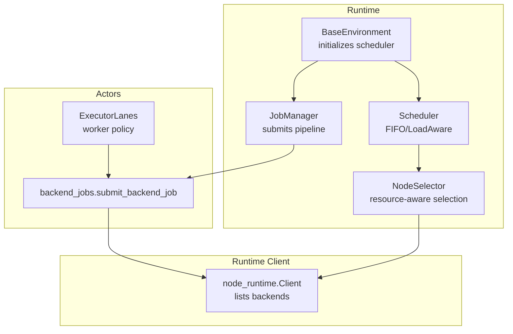
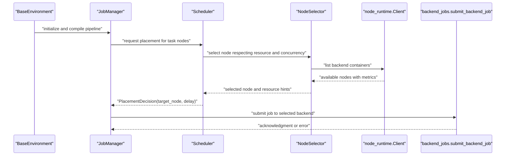
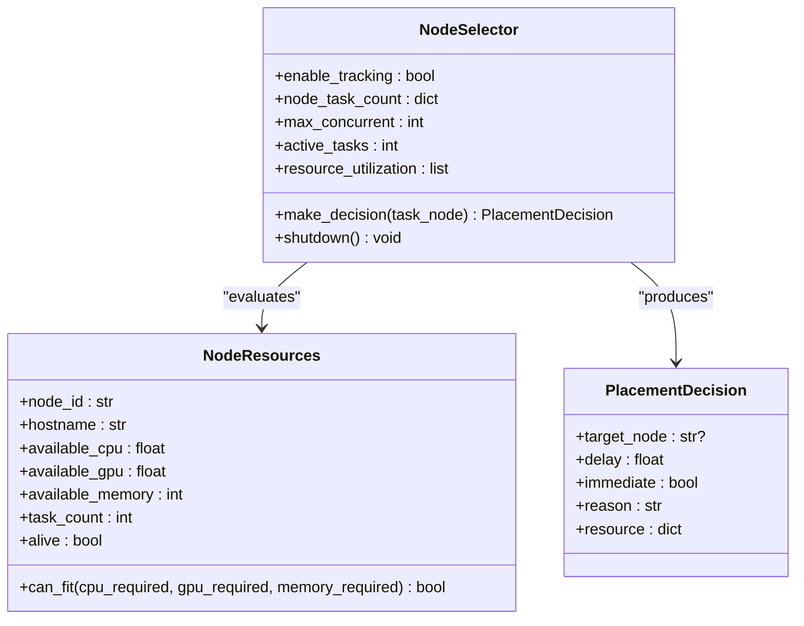
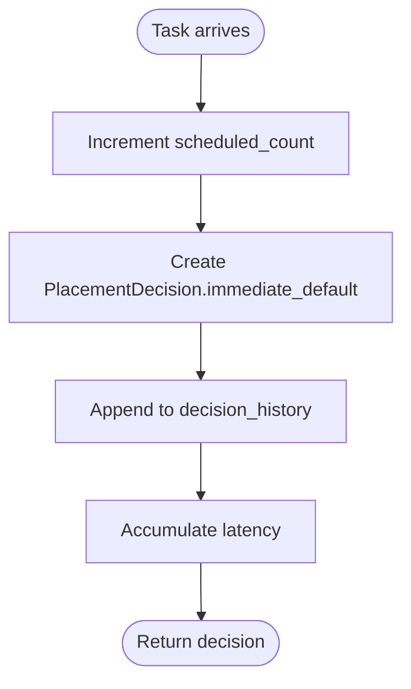
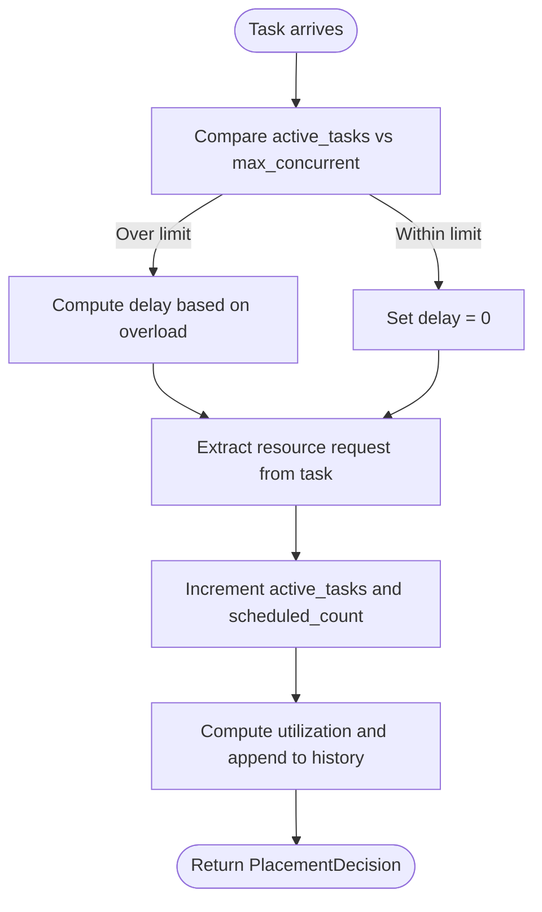
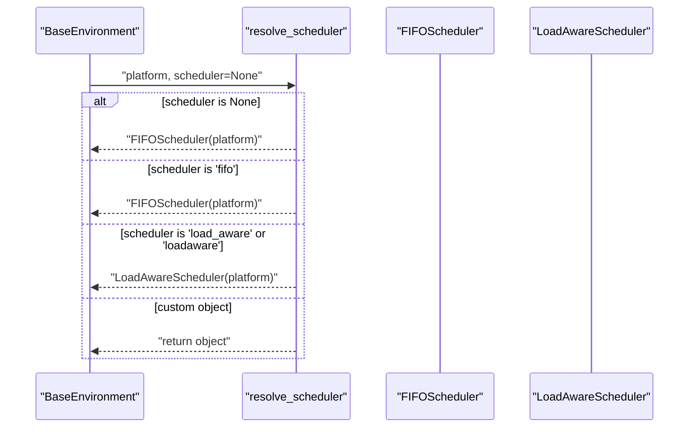
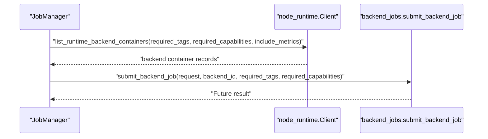
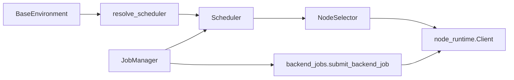

# Scheduler System

<cite>
**Referenced Files in This Document**
- [scheduler.py](file://src/sage/runtime/scheduler.py)
- [base_environment.py](file://src/sage/runtime/base_environment.py)
- [job_manager.py](file://src/sage/runtime/job_manager.py)
- [node_runtime.py](file://src/sage/runtime/flownet/client/node_runtime.py)
- [backend_jobs.py](file://src/sage/runtime/flownet/runtime/actors/backend_jobs.py)
- [executor_lanes.py](file://src/sage/runtime/flownet/runtime/actors/executor_lanes.py)
- [openai_replay_carrier.py](file://tools/benchmark_carrier/openai_replay_carrier.py)
</cite>

## Table of Contents
1. [Introduction](#introduction)
2. [Project Structure](#project-structure)
3. [Core Components](#core-components)
4. [Architecture Overview](#architecture-overview)
5. [Detailed Component Analysis](#detailed-component-analysis)
6. [Dependency Analysis](#dependency-analysis)
7. [Performance Considerations](#performance-considerations)
8. [Troubleshooting Guide](#troubleshooting-guide)
9. [Conclusion](#conclusion)
10. [Appendices](#appendices)

## Introduction
This document explains the Scheduler System in SAGE, focusing on how the runtime allocates and schedules tasks across available compute resources. The scheduler’s primary role is to distribute computational workloads efficiently, balancing load, managing resource contention, and optimizing pipeline execution performance. It supports configurable scheduling algorithms, resource-aware placement decisions, and metrics-driven insights to tune throughput and latency under varying workload patterns.

## Project Structure
The scheduler system spans several runtime modules:
- Scheduler primitives and algorithms live in the scheduler module.
- Environment initialization wires the scheduler into the runtime lifecycle.
- Job orchestration integrates scheduling decisions into pipeline submission.
- Runtime clients and actors expose backend containers and job submission APIs used by the scheduler.
- Benchmarking tools collect scheduling performance metrics such as throughput, delays, and SLO violations.

**Diagram sources**
- [base_environment.py:79-84](file://src/sage/runtime/base_environment.py#L79-L84)
- [job_manager.py:86-114](file://src/sage/runtime/job_manager.py#L86-L114)
- [scheduler.py:144-278](file://src/sage/runtime/scheduler.py#L144-L278)
- [node_runtime.py:1457-1653](file://src/sage/runtime/flownet/client/node_runtime.py#L1457-L1653)
- [backend_jobs.py:14-30](file://src/sage/runtime/flownet/runtime/actors/backend_jobs.py#L14-L30)
- [executor_lanes.py:37-63](file://src/sage/runtime/flownet/runtime/actors/executor_lanes.py#L37-L63)

**Section sources**
- [scheduler.py:1-290](file://src/sage/runtime/scheduler.py#L1-L290)
- [base_environment.py:79-84](file://src/sage/runtime/base_environment.py#L79-L84)
- [job_manager.py:86-114](file://src/sage/runtime/job_manager.py#L86-L114)
- [node_runtime.py:1457-1653](file://src/sage/runtime/flownet/client/node_runtime.py#L1457-L1653)
- [backend_jobs.py:14-30](file://src/sage/runtime/flownet/runtime/actors/backend_jobs.py#L14-L30)
- [executor_lanes.py:37-63](file://src/sage/runtime/flownet/runtime/actors/executor_lanes.py#L37-L63)

## Core Components
- BaseScheduler and derived schedulers:
  - FIFO scheduler: simple ordering with minimal overhead.
  - LoadAware scheduler: enforces concurrency limits and tracks utilization and latency.
- PlacementDecision: encapsulates scheduling outcomes including target node, delay, and resource hints.
- NodeResources and NodeSelector: model node capacity and select nodes respecting resource constraints and concurrency.
- Environment integration: BaseEnvironment resolves and initializes a scheduler instance.
- JobManager: compiles and submits pipeline graphs, integrating with the scheduler via backend job submission.
- Backend job submission: runtime actors submit jobs to backend containers, which align with scheduling decisions.

Key responsibilities:
- Resource allocation: evaluate CPU/GPU/memory and custom resources against node capacity.
- Load balancing: distribute tasks across nodes while respecting concurrency caps.
- Performance optimization: minimize scheduling latency and maximize throughput.
- Dynamic adjustment: adapt to changing workload patterns via metrics and policies.

**Section sources**
- [scheduler.py:10-32](file://src/sage/runtime/scheduler.py#L10-L32)
- [scheduler.py:23-44](file://src/sage/runtime/scheduler.py#L23-L44)
- [scheduler.py:46-139](file://src/sage/runtime/scheduler.py#L46-L139)
- [scheduler.py:144-247](file://src/sage/runtime/scheduler.py#L144-L247)
- [base_environment.py:79-84](file://src/sage/runtime/base_environment.py#L79-L84)
- [job_manager.py:86-114](file://src/sage/runtime/job_manager.py#L86-L114)
- [backend_jobs.py:14-30](file://src/sage/runtime/flownet/runtime/actors/backend_jobs.py#L14-L30)

## Architecture Overview
The scheduler sits between the environment and runtime backends. It receives task nodes, evaluates resource requirements, and produces placement decisions. These decisions are executed by submitting jobs to backend containers discovered via the runtime client.

**Diagram sources**
- [base_environment.py:79-84](file://src/sage/runtime/base_environment.py#L79-L84)
- [job_manager.py:86-114](file://src/sage/runtime/job_manager.py#L86-L114)
- [scheduler.py:144-247](file://src/sage/runtime/scheduler.py#L144-L247)
- [node_runtime.py:1457-1653](file://src/sage/runtime/flownet/client/node_runtime.py#L1457-L1653)
- [backend_jobs.py:14-30](file://src/sage/runtime/flownet/runtime/actors/backend_jobs.py#L14-L30)

## Detailed Component Analysis

### Scheduler Algorithms and Decision Model
- PlacementDecision: carries target_node, delay, immediate flag, reason, and resource metadata. It enables deterministic and observable scheduling outcomes.
- NodeResources: models per-node capacity and feasibility checks for CPU/GPU/memory and task count.
- NodeSelector: selects nodes considering resource requests and concurrency thresholds, computing utilization and optional delays when saturated.

**Diagram sources**
- [scheduler.py:10-32](file://src/sage/runtime/scheduler.py#L10-L32)
- [scheduler.py:23-44](file://src/sage/runtime/scheduler.py#L23-L44)
- [scheduler.py:46-139](file://src/sage/runtime/scheduler.py#L46-L139)

**Section sources**
- [scheduler.py:10-32](file://src/sage/runtime/scheduler.py#L10-L32)
- [scheduler.py:23-44](file://src/sage/runtime/scheduler.py#L23-L44)
- [scheduler.py:46-139](file://src/sage/runtime/scheduler.py#L46-L139)

### FIFO Scheduler
- Purpose: simplest scheduling policy prioritizing order-of-submission.
- Behavior: assigns tasks immediately with minimal overhead; tracks scheduled counts and latency.
- Metrics: exposes total scheduled, average latency, and platform.

**Diagram sources**
- [scheduler.py:144-168](file://src/sage/runtime/scheduler.py#L144-L168)

**Section sources**
- [scheduler.py:144-168](file://src/sage/runtime/scheduler.py#L144-L168)

### LoadAware Scheduler
- Purpose: balance load by enforcing a maximum concurrency threshold and optionally delaying tasks when saturated.
- Strategy: maintains active task count, computes utilization, and may introduce small delays proportional to overload.
- Metrics: tracks active tasks, max concurrency, average resource utilization, and latency.

**Diagram sources**
- [scheduler.py:171-247](file://src/sage/runtime/scheduler.py#L171-L247)

**Section sources**
- [scheduler.py:171-247](file://src/sage/runtime/scheduler.py#L171-L247)

### Environment Integration and Scheduler Resolution
- BaseEnvironment initializes the scheduler via a resolution function that accepts None, a string identifier, or a custom scheduler object implementing the required interface.
- Supported identifiers include “fifo” and “load_aware”.

**Diagram sources**
- [base_environment.py:79-84](file://src/sage/runtime/base_environment.py#L79-L84)
- [scheduler.py:254-278](file://src/sage/runtime/scheduler.py#L254-L278)

**Section sources**
- [base_environment.py:79-84](file://src/sage/runtime/base_environment.py#L79-L84)
- [scheduler.py:254-278](file://src/sage/runtime/scheduler.py#L254-L278)

### Backend Container Discovery and Job Submission
- Runtime client snapshots backend containers, optionally filtering by tags/capabilities and including metrics.
- Actors submit backend jobs with explicit backend targeting and required capabilities, enabling alignment with scheduler decisions.

**Diagram sources**
- [node_runtime.py:1623-1653](file://src/sage/runtime/flownet/client/node_runtime.py#L1623-L1653)
- [backend_jobs.py:14-30](file://src/sage/runtime/flownet/runtime/actors/backend_jobs.py#L14-L30)

**Section sources**
- [node_runtime.py:1623-1653](file://src/sage/runtime/flownet/client/node_runtime.py#L1623-L1653)
- [backend_jobs.py:14-30](file://src/sage/runtime/flownet/runtime/actors/backend_jobs.py#L14-L30)

### Executor Policies and Concurrency Control
- Executor lanes and worker policies define maximum concurrency per task, ensuring the scheduler’s LoadAware strategy aligns with runtime limits.
- Proper configuration prevents oversubscription and improves stability under bursty workloads.

**Section sources**
- [executor_lanes.py:37-63](file://src/sage/runtime/flownet/runtime/actors/executor_lanes.py#L37-L63)

## Dependency Analysis
- Scheduler depends on:
  - NodeSelector for resource-aware decisions.
  - PlacementDecision for structured outcomes.
  - Environment for platform and scheduler resolution.
- JobManager depends on:
  - Scheduler for placement decisions.
  - Backend job submission for execution.
- Runtime client and actors depend on:
  - Backend container discovery and job submission APIs.

**Diagram sources**
- [base_environment.py:79-84](file://src/sage/runtime/base_environment.py#L79-L84)
- [scheduler.py:254-278](file://src/sage/runtime/scheduler.py#L254-L278)
- [job_manager.py:86-114](file://src/sage/runtime/job_manager.py#L86-L114)
- [node_runtime.py:1623-1653](file://src/sage/runtime/flownet/client/node_runtime.py#L1623-L1653)
- [backend_jobs.py:14-30](file://src/sage/runtime/flownet/runtime/actors/backend_jobs.py#L14-L30)

**Section sources**
- [base_environment.py:79-84](file://src/sage/runtime/base_environment.py#L79-L84)
- [scheduler.py:254-278](file://src/sage/runtime/scheduler.py#L254-L278)
- [job_manager.py:86-114](file://src/sage/runtime/job_manager.py#L86-L114)
- [node_runtime.py:1623-1653](file://src/sage/runtime/flownet/client/node_runtime.py#L1623-L1653)
- [backend_jobs.py:14-30](file://src/sage/runtime/flownet/runtime/actors/backend_jobs.py#L14-L30)

## Performance Considerations
- Throughput and latency:
  - Track average scheduling latency and throughput to detect bottlenecks.
  - Use metrics from scheduler implementations to guide capacity planning.
- SLO and delay handling:
  - Monitor delayed vs rejected outcomes and SLO violations to adjust concurrency and resource allocations.
- Capacity planning:
  - Align max_concurrent with backend container capabilities and executor policies.
  - Use backend container snapshots to assess available resources and utilization trends.

Practical tips:
- Prefer LoadAware scheduler for variable workloads to smooth spikes.
- Tune max_concurrent and resource requests per task to avoid saturation.
- Observe backend container metrics to right-size clusters and backends.

[No sources needed since this section provides general guidance]

## Troubleshooting Guide
Common symptoms and remedies:
- High scheduling latency:
  - Inspect scheduler metrics (average latency, scheduled counts).
  - Consider switching to LoadAware scheduler and reducing max_concurrent.
- Frequent delays or rejections:
  - Review backend container availability and capabilities.
  - Increase backend capacity or adjust resource requests per task.
- SLO violations:
  - Analyze delayed and spillover counts from benchmarking tools.
  - Adjust concurrency and resource allocation policies.

Monitoring and diagnostics:
- Use runtime client to list backend containers and their metrics.
- Collect scheduling metrics from the scheduler implementations.
- Leverage benchmarking tools to quantify TTFT, E2E, rejection, and SLO violation rates.

**Section sources**
- [scheduler.py:160-168](file://src/sage/runtime/scheduler.py#L160-L168)
- [scheduler.py:226-243](file://src/sage/runtime/scheduler.py#L226-L243)
- [node_runtime.py:1457-1653](file://src/sage/runtime/flownet/client/node_runtime.py#L1457-L1653)
- [openai_replay_carrier.py:1173-1205](file://tools/benchmark_carrier/openai_replay_carrier.py#L1173-L1205)

## Conclusion
The SAGE Scheduler System provides flexible, resource-aware scheduling primitives integrated into the runtime pipeline. By combining simple FIFO ordering with a load-aware algorithm, it balances throughput and stability. Effective capacity planning, backend container visibility, and metrics-driven tuning enable optimal performance across diverse workload patterns.

[No sources needed since this section summarizes without analyzing specific files]

## Appendices

### Practical Examples and How-To
- Configure scheduler type:
  - Set scheduler to “fifo” or “load_aware” during environment initialization to choose the desired algorithm.
- Monitor resource utilization:
  - Retrieve scheduler metrics (e.g., active tasks, average utilization) and correlate with backend container snapshots.
- Optimize throughput:
  - Adjust max_concurrent and per-task resource requests; observe scheduling latency and SLO metrics to converge on an optimal configuration.

[No sources needed since this section provides general guidance]