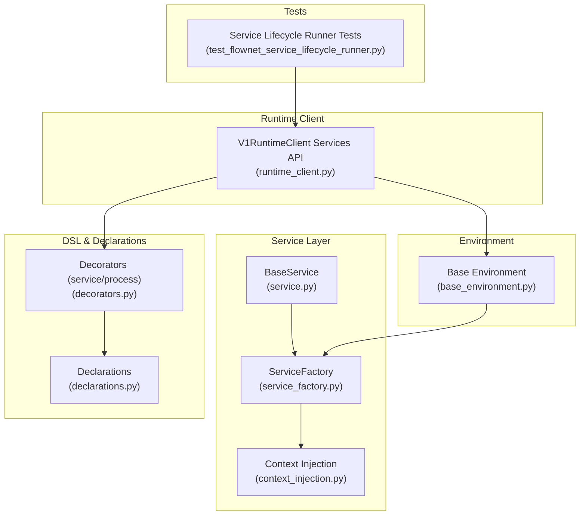
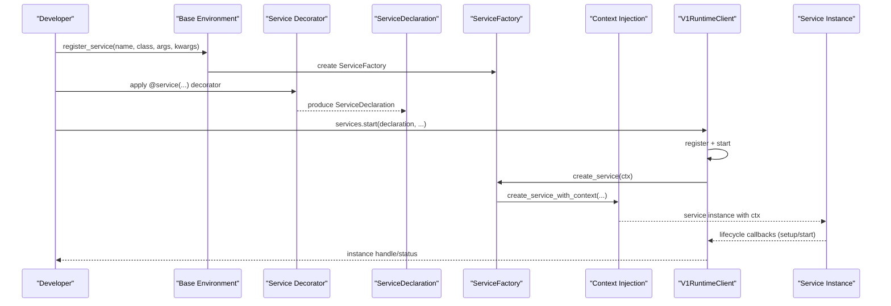
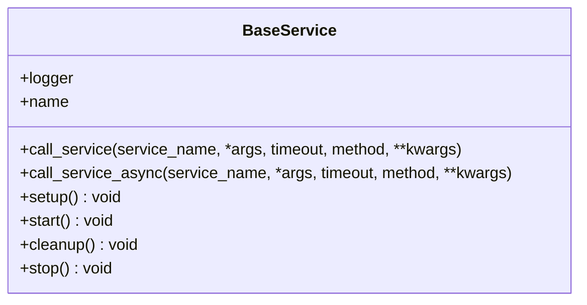
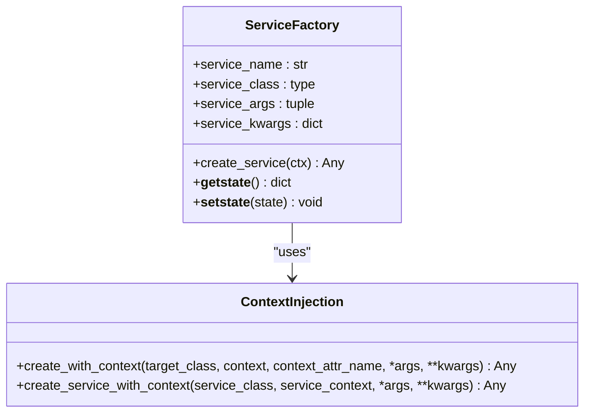
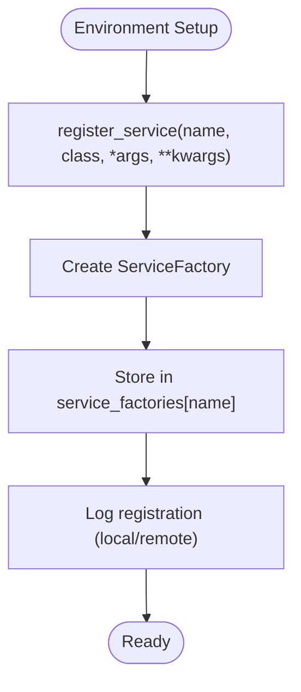
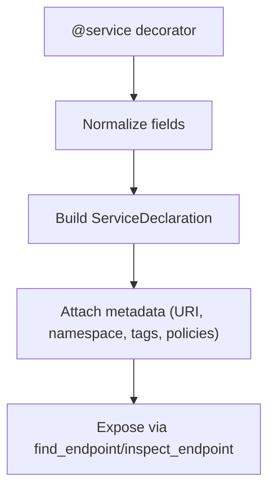
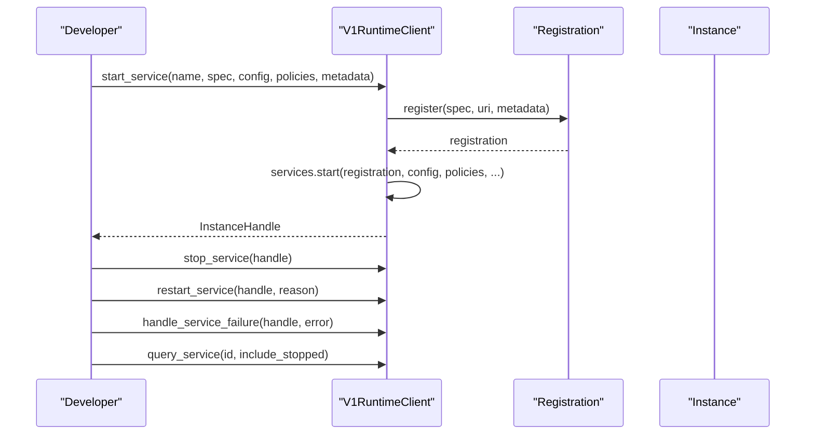
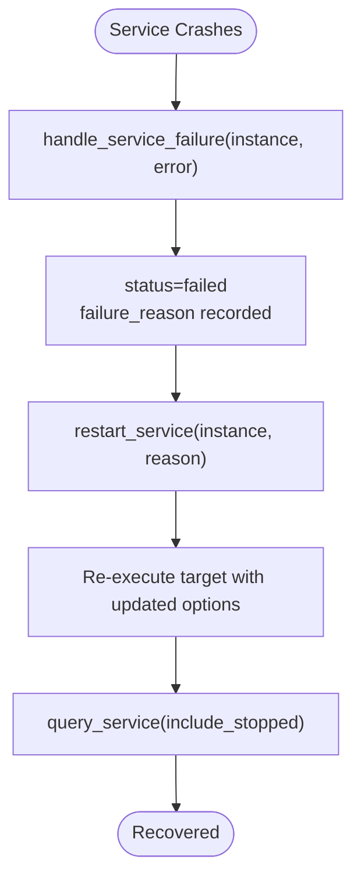
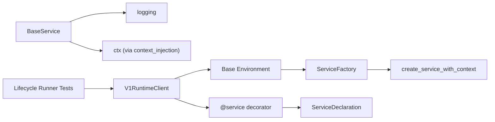

# Service Orchestration

<cite>
**Referenced Files in This Document**
- [service.py](file://src/sage/runtime/service.py)
- [service_factory.py](file://src/sage/runtime/service_factory.py)
- [context_injection.py](file://src/sage/runtime/context_injection.py)
- [base_environment.py](file://src/sage/runtime/base_environment.py)
- [decorators.py](file://src/sage/runtime/flownet/api/decorators.py)
- [declarations.py](file://src/sage/runtime/flownet/api/declarations.py)
- [runtime_client.py](file://src/sage/runtime/flownet/client/runtime_client.py)
- [test_flownet_service_lifecycle_runner.py](file://src/tests/test_flownet_service_lifecycle_runner.py)
- [_runtime_kernel_types.py](file://src/sage/stream/_runtime_kernel_types.py)
- [runtime.py](file://src/sage/runtime/flownet/runtime/runtime.py)
</cite>

## Table of Contents
1. [Introduction](#introduction)
2. [Project Structure](#project-structure)
3. [Core Components](#core-components)
4. [Architecture Overview](#architecture-overview)
5. [Detailed Component Analysis](#detailed-component-analysis)
6. [Dependency Analysis](#dependency-analysis)
7. [Performance Considerations](#performance-considerations)
8. [Troubleshooting Guide](#troubleshooting-guide)
9. [Conclusion](#conclusion)
10. [Appendices](#appendices)

## Introduction
This document explains SAGE’s Service Orchestration system for managing long-running services in a distributed runtime. It covers how services are defined, created via factories, registered in environments, started and monitored, and how failures are handled. The goal is to provide both a beginner-friendly overview of service-oriented architecture and microservices concepts and deep technical details for developers implementing lifecycle management, monitoring, and fault tolerance.

## Project Structure
The orchestration system spans several modules:
- Service primitives define the contract and lifecycle hooks for services.
- Factories construct services with runtime context injection.
- Environment registration binds service names to factory definitions.
- DSL decorators and declarations describe service behavior and metadata.
- Runtime client exposes lifecycle APIs for starting, stopping, restarting, and querying services.
- Tests demonstrate lifecycle runner behavior and failure handling.

**Diagram sources**
- [service.py:10-74](file://src/sage/runtime/service.py#L10-L74)
- [service_factory.py:9-67](file://src/sage/runtime/service_factory.py#L9-L67)
- [context_injection.py:9-45](file://src/sage/runtime/context_injection.py#L9-L45)
- [base_environment.py:96-115](file://src/sage/runtime/base_environment.py#L96-L115)
- [decorators.py:234-285](file://src/sage/runtime/flownet/api/decorators.py#L234-L285)
- [declarations.py:690-725](file://src/sage/runtime/flownet/api/declarations.py#L690-L725)
- [runtime_client.py:240-271](file://src/sage/runtime/flownet/client/runtime_client.py#L240-L271)
- [test_flownet_service_lifecycle_runner.py:17-96](file://src/tests/test_flownet_service_lifecycle_runner.py#L17-L96)

**Section sources**
- [service.py:10-74](file://src/sage/runtime/service.py#L10-L74)
- [service_factory.py:9-67](file://src/sage/runtime/service_factory.py#L9-L67)
- [context_injection.py:9-45](file://src/sage/runtime/context_injection.py#L9-L45)
- [base_environment.py:96-115](file://src/sage/runtime/base_environment.py#L96-L115)
- [decorators.py:234-285](file://src/sage/runtime/flownet/api/decorators.py#L234-L285)
- [declarations.py:690-725](file://src/sage/runtime/flownet/api/declarations.py#L690-L725)
- [runtime_client.py:240-271](file://src/sage/runtime/flownet/client/runtime_client.py#L240-L271)
- [test_flownet_service_lifecycle_runner.py:17-96](file://src/tests/test_flownet_service_lifecycle_runner.py#L17-L96)

## Core Components
- BaseService: Defines the service contract with lifecycle hooks (setup, start, cleanup, stop) and inter-service invocation helpers. It also exposes a logger and a name derived from the environment context.
- ServiceFactory: Encapsulates how to construct a service with optional arguments and keyword arguments, and supports serialization/deserialization for distributed environments.
- Context Injection: Provides a mechanism to inject a runtime context into a service instance before initialization, ensuring services can access runtime facilities consistently.
- Base Environment Registration: Registers services under names and exposes logging for local/remote platforms.
- DSL Decorators and Declarations: Describe services with metadata, scheduling defaults, policies, and styles (e.g., event-driven, periodic, hybrid).
- Runtime Client Services API: Exposes lifecycle operations (start, stop, restart, query) and failure handling for services.

**Section sources**
- [service.py:10-74](file://src/sage/runtime/service.py#L10-L74)
- [service_factory.py:9-67](file://src/sage/runtime/service_factory.py#L9-L67)
- [context_injection.py:9-45](file://src/sage/runtime/context_injection.py#L9-L45)
- [base_environment.py:96-115](file://src/sage/runtime/base_environment.py#L96-L115)
- [decorators.py:234-285](file://src/sage/runtime/flownet/api/decorators.py#L234-L285)
- [runtime_client.py:240-271](file://src/sage/runtime/flownet/client/runtime_client.py#L240-L271)

## Architecture Overview
The orchestration architecture centers on a declarative service model and a runtime client that manages instances. Services are declared with metadata and styles, registered, and started through the client. The environment provides a factory registry and context injection so services can communicate and coordinate.

**Diagram sources**
- [base_environment.py:96-115](file://src/sage/runtime/base_environment.py#L96-L115)
- [decorators.py:234-285](file://src/sage/runtime/flownet/api/decorators.py#L234-L285)
- [declarations.py:690-725](file://src/sage/runtime/flownet/api/declarations.py#L690-L725)
- [service_factory.py:29-41](file://src/sage/runtime/service_factory.py#L29-L41)
- [context_injection.py:40-44](file://src/sage/runtime/context_injection.py#L40-L44)
- [runtime_client.py:240-271](file://src/sage/runtime/flownet/client/runtime_client.py#L240-L271)

## Detailed Component Analysis

### Service Contract and Lifecycle Hooks
- Purpose: Define a consistent contract for long-running services, including lifecycle management and inter-service communication.
- Key elements:
  - Logger and name resolution via context.
  - Inter-service invocation helpers (sync and async).
  - Lifecycle hooks: setup, start, cleanup, stop with no-op defaults for extensibility.
- Practical use:
  - Subclass BaseService to implement custom services.
  - Override lifecycle hooks to initialize resources and perform cleanup.
  - Use call_service/call_service_async to coordinate with other services.

**Diagram sources**
- [service.py:10-74](file://src/sage/runtime/service.py#L10-L74)

**Section sources**
- [service.py:10-74](file://src/sage/runtime/service.py#L10-L74)

### Service Factory Pattern and Context Injection
- Purpose: Encapsulate creation and configuration of services, enabling context-aware instantiation and robust distribution.
- Key elements:
  - Factory holds service name, class, and constructor arguments.
  - create_service constructs instances with injected context.
  - Serialization support (__getstate__/__setstate__) for distributed environments.
  - Context injection ensures services can access runtime facilities during construction.
- Practical use:
  - Register services via environment with register_service.
  - Use ServiceFactory.create_service to obtain configured instances.
  - Serialize factories for cross-process boundaries.

**Diagram sources**
- [service_factory.py:9-67](file://src/sage/runtime/service_factory.py#L9-L67)
- [context_injection.py:9-45](file://src/sage/runtime/context_injection.py#L9-L45)

**Section sources**
- [service_factory.py:9-67](file://src/sage/runtime/service_factory.py#L9-L67)
- [context_injection.py:9-45](file://src/sage/runtime/context_injection.py#L9-L45)

### Environment Registration and Discovery
- Purpose: Bind service names to factories and expose logging for local/remote platforms.
- Key elements:
  - register_service creates a ServiceFactory and stores it under a name.
  - register_service_factory allows injecting an existing factory.
  - Logging indicates whether registration is local or remote.
- Practical use:
  - Register services early in environment setup.
  - Retrieve or override factories as needed.

**Diagram sources**
- [base_environment.py:96-115](file://src/sage/runtime/base_environment.py#L96-L115)

**Section sources**
- [base_environment.py:96-115](file://src/sage/runtime/base_environment.py#L96-L115)

### Service Declaration and Orchestration Metadata
- Purpose: Describe services declaratively with metadata, scheduling defaults, policies, and styles.
- Key elements:
  - @service decorator validates and normalizes fields, including service_style and heartbeat_default_sec.
  - ServiceDeclaration carries target, URIs, namespaces, tags, capabilities, and resource/scheduler defaults.
  - find_endpoint/inspect_endpoint enable discovery and inspection of endpoints bound to services.
- Practical use:
  - Annotate service targets with @service to produce declarations.
  - Use declarations to start services with the runtime client.

**Diagram sources**
- [decorators.py:234-285](file://src/sage/runtime/flownet/api/decorators.py#L234-L285)
- [declarations.py:690-725](file://src/sage/runtime/flownet/api/declarations.py#L690-L725)

**Section sources**
- [decorators.py:234-285](file://src/sage/runtime/flownet/api/decorators.py#L234-L285)
- [declarations.py:690-725](file://src/sage/runtime/flownet/api/declarations.py#L690-L725)

### Runtime Client Lifecycle Operations
- Purpose: Manage service instances end-to-end, including start, stop, restart, query, and failure handling.
- Key elements:
  - start_service registers a service specification and starts it with config/policies/metadata.
  - stop_service halts a running instance.
  - restart_service restarts with a reason and preserves recovery context.
  - handle_service_failure marks a running service failed and records reasons.
  - query_service retrieves current or historical snapshots.
- Practical use:
  - Start services with appropriate bindings and options.
  - Monitor status and recover from failures using restart and failure handlers.

**Diagram sources**
- [runtime_client.py:240-271](file://src/sage/runtime/flownet/client/runtime_client.py#L240-L271)
- [runtime_client.py:2106-2125](file://src/sage/runtime/flownet/client/runtime_client.py#L2106-L2125)

**Section sources**
- [runtime_client.py:240-271](file://src/sage/runtime/flownet/client/runtime_client.py#L240-L271)
- [runtime_client.py:2106-2125](file://src/sage/runtime/flownet/client/runtime_client.py#L2106-L2125)

### Failure Handling and Recovery
- Purpose: Record failures, restart instances, and preserve recovery context for diagnostics and resilience.
- Key elements:
  - Manual failure marking sets status to failed and captures failure reason.
  - Restart preserves previous failure reason and recovery summary.
  - Lifecycle runner tests demonstrate crash handling and re-execution.
- Practical use:
  - Use handle_service_failure to mark failures explicitly.
  - Rely on restart to re-execute targets with updated options.
  - Inspect snapshots to verify recovery and failure details.

**Diagram sources**
- [runtime_client.py:2106-2125](file://src/sage/runtime/flownet/client/runtime_client.py#L2106-L2125)
- [test_flownet_service_lifecycle_runner.py:17-96](file://src/tests/test_flownet_service_lifecycle_runner.py#L17-L96)

**Section sources**
- [runtime_client.py:2106-2125](file://src/sage/runtime/flownet/client/runtime_client.py#L2106-L2125)
- [test_flownet_service_lifecycle_runner.py:17-96](file://src/tests/test_flownet_service_lifecycle_runner.py#L17-L96)

### Lightweight Context Limitations
- Purpose: Clarify limitations in lightweight contexts where service access is unavailable.
- Key elements:
  - Lightweight context raises runtime errors for service calls and lacks service retrieval.
- Practical use:
  - Avoid invoking service methods in lightweight contexts; use full runtime contexts for orchestration.

**Section sources**
- [_runtime_kernel_types.py:245-249](file://src/sage/stream/_runtime_kernel_types.py#L245-L249)

## Dependency Analysis
- BaseService depends on logging and context for logger/name resolution and inter-service calls.
- ServiceFactory depends on context injection to construct services with runtime context.
- Base Environment integrates ServiceFactory registration and logs platform-specific registrations.
- DSL decorators and declarations provide metadata and validation for service definitions.
- Runtime client orchestrates lifecycle operations and interacts with registrations and state stores.
- Tests exercise lifecycle runner behavior and failure handling.

**Diagram sources**
- [service.py:10-74](file://src/sage/runtime/service.py#L10-L74)
- [service_factory.py:9-67](file://src/sage/runtime/service_factory.py#L9-L67)
- [context_injection.py:9-45](file://src/sage/runtime/context_injection.py#L9-L45)
- [base_environment.py:96-115](file://src/sage/runtime/base_environment.py#L96-L115)
- [decorators.py:234-285](file://src/sage/runtime/flownet/api/decorators.py#L234-L285)
- [declarations.py:690-725](file://src/sage/runtime/flownet/api/declarations.py#L690-L725)
- [runtime_client.py:240-271](file://src/sage/runtime/flownet/client/runtime_client.py#L240-L271)
- [test_flownet_service_lifecycle_runner.py:17-96](file://src/tests/test_flownet_service_lifecycle_runner.py#L17-L96)

**Section sources**
- [service.py:10-74](file://src/sage/runtime/service.py#L10-L74)
- [service_factory.py:9-67](file://src/sage/runtime/service_factory.py#L9-L67)
- [context_injection.py:9-45](file://src/sage/runtime/context_injection.py#L9-L45)
- [base_environment.py:96-115](file://src/sage/runtime/base_environment.py#L96-L115)
- [decorators.py:234-285](file://src/sage/runtime/flownet/api/decorators.py#L234-L285)
- [declarations.py:690-725](file://src/sage/runtime/flownet/api/declarations.py#L690-L725)
- [runtime_client.py:240-271](file://src/sage/runtime/flownet/client/runtime_client.py#L240-L271)
- [test_flownet_service_lifecycle_runner.py:17-96](file://src/tests/test_flownet_service_lifecycle_runner.py#L17-L96)

## Performance Considerations
- Minimize heavy work in setup/start to reduce cold-start latency.
- Use lightweight contexts only for non-orchestrated tasks; orchestration requires full runtime contexts.
- Prefer declarative metadata (policies, scheduler defaults) to avoid per-instance computation overhead.
- Keep inter-service calls asynchronous when possible to prevent blocking.

## Troubleshooting Guide
- Service context not initialized:
  - Symptom: Runtime error when calling service methods without context.
  - Resolution: Ensure services are created via ServiceFactory with a valid context.
- Service class missing after deserialization:
  - Symptom: Warning indicating service_class is None after deserialization.
  - Resolution: Rebuild factories or ensure class availability in distributed environments.
- Service crashes and failure recording:
  - Use handle_service_failure to mark failures and capture reasons.
  - Restart to re-execute targets and verify recovery via query_service snapshots.
- Graceful shutdown and cleanup:
  - Implement stop/cleanup hooks to release resources and ensure orderly termination.

**Section sources**
- [service.py:41-61](file://src/sage/runtime/service.py#L41-L61)
- [service_factory.py:65-67](file://src/sage/runtime/service_factory.py#L65-L67)
- [runtime_client.py:2106-2125](file://src/sage/runtime/flownet/client/runtime_client.py#L2106-L2125)
- [runtime.py:1085-1127](file://src/sage/runtime/flownet/runtime/runtime.py#L1085-L1127)

## Conclusion
SAGE’s Service Orchestration system provides a robust framework for defining, registering, and managing long-running services. By combining BaseService contracts, ServiceFactory creation with context injection, declarative DSL metadata, and runtime client lifecycle operations, it enables scalable, observable, and resilient service management. Developers can implement custom services, coordinate inter-service communication, and handle failures with structured recovery and monitoring.

## Appendices
- Beginner Concepts:
  - Service-oriented architecture: Decompose systems into cohesive services with well-defined contracts.
  - Microservices: Independent services owned by small teams, communicating asynchronously or via lightweight synchronous calls.
  - Orchestration: Coordinating service lifecycles, health monitoring, and failure recovery.
- Developer Practices:
  - Define services by subclassing BaseService and overriding lifecycle hooks.
  - Register services via environment and use ServiceFactory for consistent instantiation.
  - Describe services with @service and leverage declarations for metadata and policies.
  - Use runtime client APIs to start, stop, restart, and query services; handle failures explicitly.