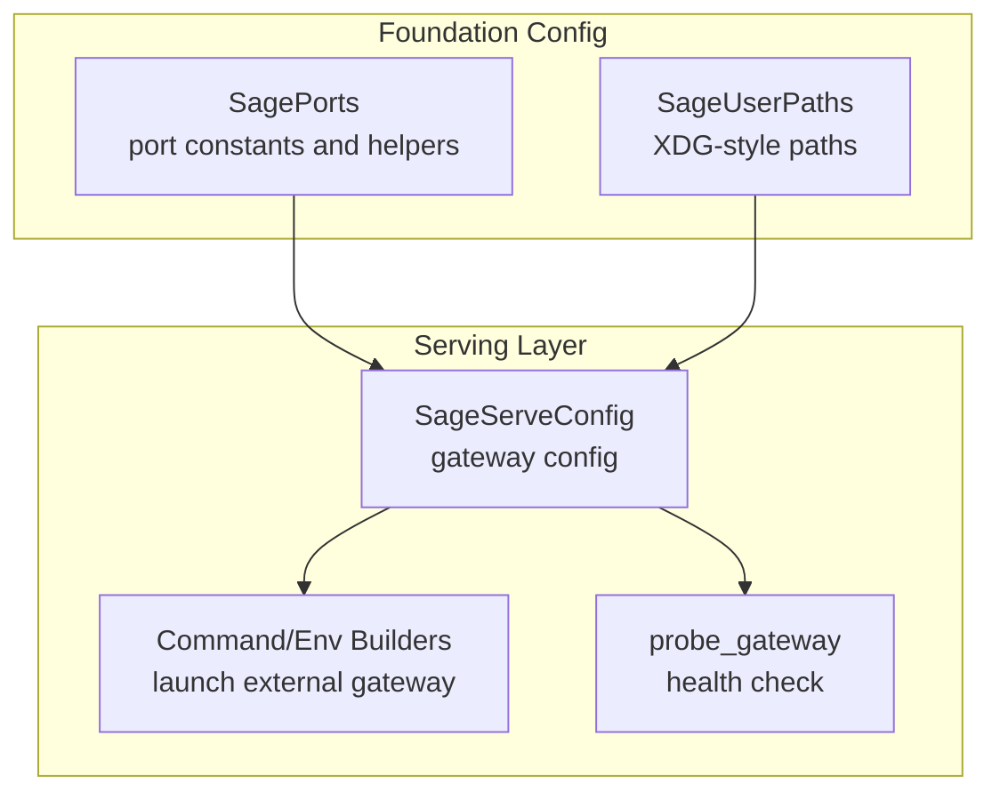
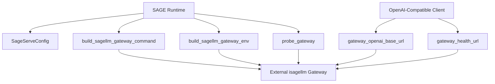
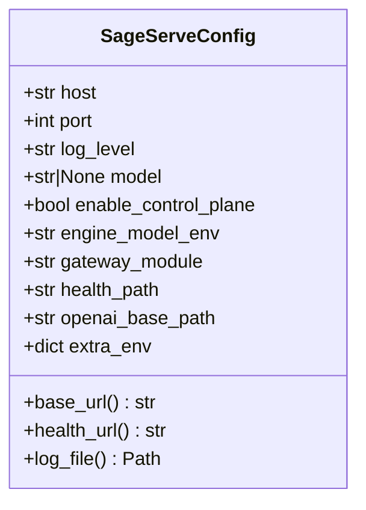
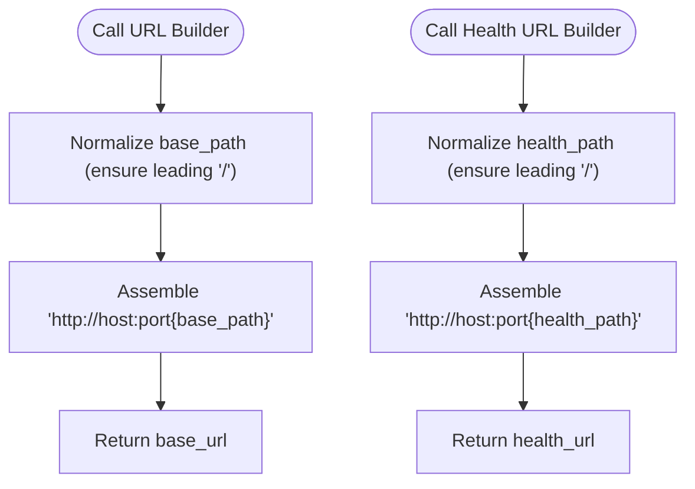
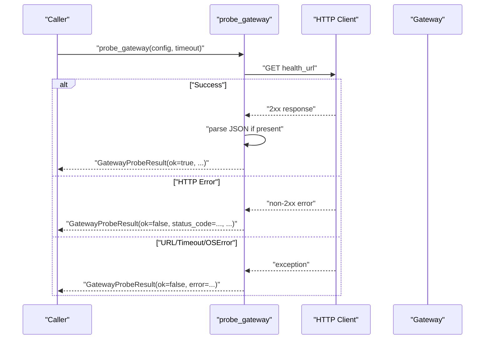
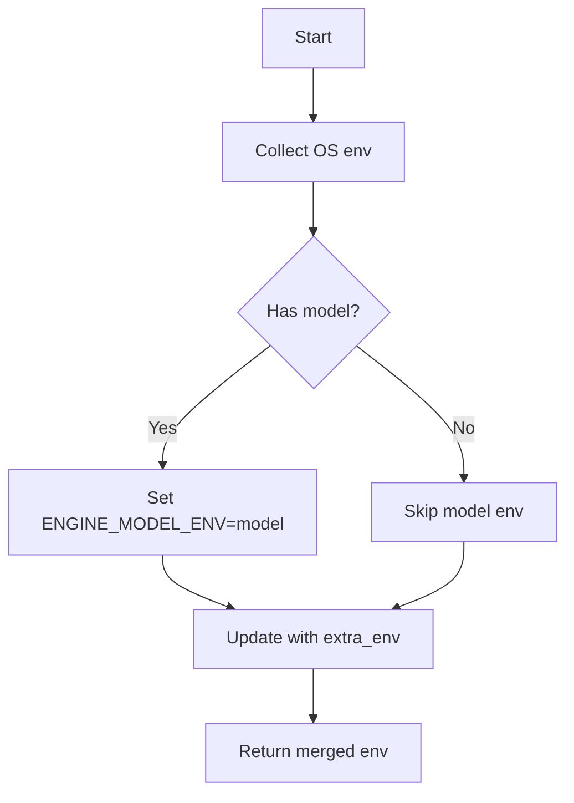
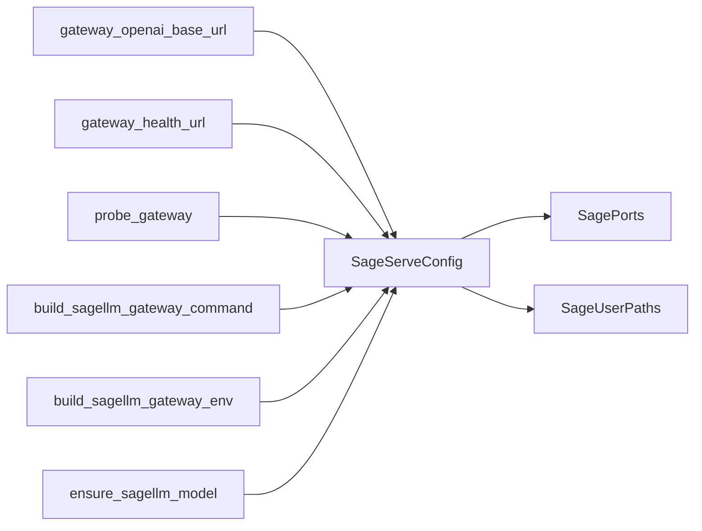

# HTTP Gateway Implementation

<cite>
**Referenced Files in This Document**
- [gateway.py](file://src/sage/serving/gateway.py)
- [ports.py](file://src/sage/foundation/config/ports.py)
- [user_paths.py](file://src/sage/foundation/config/user_paths.py)
- [config.yaml](file://config/config.yaml)
</cite>

## Table of Contents
1. [Introduction](#introduction)
2. [Project Structure](#project-structure)
3. [Core Components](#core-components)
4. [Architecture Overview](#architecture-overview)
5. [Detailed Component Analysis](#detailed-component-analysis)
6. [Dependency Analysis](#dependency-analysis)
7. [Performance Considerations](#performance-considerations)
8. [Troubleshooting Guide](#troubleshooting-guide)
9. [Conclusion](#conclusion)
10. [Appendices](#appendices)

## Introduction
This document explains SAGE’s OpenAI-compatible HTTP gateway integration. It focuses on how SAGE configures and interacts with an external inference engine gateway (referred to as the isagellm gateway), acting as an orchestrator while delegating model execution to the external process. Covered topics include the SageServeConfig dataclass, gateway URL construction helpers, health probing, environment variable management, and operational guidance for production deployments.

## Project Structure
The HTTP gateway implementation resides under the serving layer and foundational configuration utilities:
- Serving gateway integration: [gateway.py](file://src/sage/serving/gateway.py)
- Port configuration and defaults: [ports.py](file://src/sage/foundation/config/ports.py)
- User paths and log file resolution: [user_paths.py](file://src/sage/foundation/config/user_paths.py)
- Example configuration file: [config.yaml](file://config/config.yaml)

**Diagram sources**
- [gateway.py:16-42](file://src/sage/serving/gateway.py#L16-L42)
- [gateway.py:98-126](file://src/sage/serving/gateway.py#L98-L126)
- [gateway.py:138-167](file://src/sage/serving/gateway.py#L138-L167)
- [ports.py:26-56](file://src/sage/foundation/config/ports.py#L26-L56)
- [user_paths.py:53-136](file://src/sage/foundation/config/user_paths.py#L53-L136)

**Section sources**
- [gateway.py:16-42](file://src/sage/serving/gateway.py#L16-L42)
- [ports.py:26-56](file://src/sage/foundation/config/ports.py#L26-L56)
- [user_paths.py:53-136](file://src/sage/foundation/config/user_paths.py#L53-L136)

## Core Components
- SageServeConfig: Encapsulates gateway connection and integration parameters, including host, port, log level, model selection, control plane enablement, and OpenAI-compatible base path.
- URL Construction Helpers: Functions to compute the OpenAI-compatible base URL and health-check URL for the external gateway.
- Health Probing: A probe function that queries the gateway health endpoint and returns structured results.
- Command and Environment Builders: Utilities to construct the external gateway launch command and environment variables.
- Model Availability Helper: Ensures the target model exists locally via SAGE’s model registry.

Key responsibilities:
- Provide a unified configuration surface for the external isagellm gateway.
- Build URLs compatible with OpenAI clients.
- Probe the gateway for readiness.
- Launch the external gateway with proper environment and model binding.

**Section sources**
- [gateway.py:16-42](file://src/sage/serving/gateway.py#L16-L42)
- [gateway.py:73-91](file://src/sage/serving/gateway.py#L73-L91)
- [gateway.py:138-167](file://src/sage/serving/gateway.py#L138-L167)
- [gateway.py:98-126](file://src/sage/serving/gateway.py#L98-L126)
- [gateway.py:129-135](file://src/sage/serving/gateway.py#L129-L135)

## Architecture Overview
SAGE orchestrates an external inference engine gateway that exposes an OpenAI-compatible API. SAGE manages configuration, launches the gateway process, probes health, and routes requests to the gateway’s base URL. The gateway is responsible for model loading, inference execution, and returning OpenAI-style responses.

**Diagram sources**
- [gateway.py:16-42](file://src/sage/serving/gateway.py#L16-L42)
- [gateway.py:73-91](file://src/sage/serving/gateway.py#L73-L91)
- [gateway.py:138-167](file://src/sage/serving/gateway.py#L138-L167)
- [gateway.py:98-126](file://src/sage/serving/gateway.py#L98-L126)

## Detailed Component Analysis

### SageServeConfig: External Gateway Configuration
SageServeConfig defines the integration contract with the external isagellm gateway. It includes:
- Host and port for the gateway process.
- Log level and optional model specification.
- Control plane enablement flag.
- Environment variable keys for model propagation and extra environment overrides.
- OpenAI base path and health path customization.
- Computed properties for base_url, health_url, and log_file location.

Usage patterns:
- Construct a default configuration using the convenience factory.
- Override host/port/log_level/model/control-plane flags per deployment.
- Use computed properties to derive URLs and log file paths.

**Diagram sources**
- [gateway.py:16-42](file://src/sage/serving/gateway.py#L16-L42)

**Section sources**
- [gateway.py:16-42](file://src/sage/serving/gateway.py#L16-L42)
- [gateway.py:55-70](file://src/sage/serving/gateway.py#L55-L70)

### URL Construction: OpenAI-Compatible Base and Health
Two helper functions normalize and assemble gateway URLs:
- gateway_openai_base_url: Builds the OpenAI-compatible base URL using host, port, and base path.
- gateway_health_url: Builds the health-check URL using host, port, and health path.

Behavior:
- Normalize leading slashes for base_path and health_path.
- Assemble http://host:port/prefix consistently.

**Diagram sources**
- [gateway.py:73-91](file://src/sage/serving/gateway.py#L73-L91)

**Section sources**
- [gateway.py:73-91](file://src/sage/serving/gateway.py#L73-L91)

### Health Probing: probe_gateway
probe_gateway performs a GET request against the gateway’s health endpoint and returns a structured result:
- ok: Boolean indicating HTTP 2xx status.
- url: The health URL used.
- status_code: HTTP status code when available.
- payload: Parsed JSON payload when available.
- error: Human-readable error string for failures (including timeouts and network errors).

**Diagram sources**
- [gateway.py:138-167](file://src/sage/serving/gateway.py#L138-L167)

**Section sources**
- [gateway.py:138-167](file://src/sage/serving/gateway.py#L138-L167)

### Command and Environment Builders
- build_sagellm_gateway_command: Constructs the external process invocation with host, port, log level, and optional control plane flag.
- build_sagellm_gateway_env: Merges current environment with model-specific and extra environment overrides.

Operational notes:
- The gateway module name is configurable but defaults to the isagellm gateway package.
- Model selection is propagated via an environment variable key configured in the dataclass.
- Extra environment entries can be injected for specialized deployment needs.

**Diagram sources**
- [gateway.py:120-126](file://src/sage/serving/gateway.py#L120-L126)

**Section sources**
- [gateway.py:98-126](file://src/sage/serving/gateway.py#L98-L126)
- [gateway.py:120-126](file://src/sage/serving/gateway.py#L120-L126)

### Model Availability Helper
ensure_sagellm_model delegates to SAGE’s model registry to ensure the requested model is available locally. This ensures the external gateway can load the model without manual intervention.

**Section sources**
- [gateway.py:129-135](file://src/sage/serving/gateway.py#L129-L135)

## Dependency Analysis
- SageServeConfig depends on SagePorts for default port assignment and SageUserPaths for log file location.
- URL builders depend on host, port, and path parameters.
- probe_gateway depends on urllib for HTTP requests.
- Command builder depends on sys.executable and the configured gateway module.
- Environment builder depends on os.environ and the configured model environment key.

**Diagram sources**
- [gateway.py:16-42](file://src/sage/serving/gateway.py#L16-L42)
- [gateway.py:73-91](file://src/sage/serving/gateway.py#L73-L91)
- [gateway.py:138-167](file://src/sage/serving/gateway.py#L138-L167)
- [gateway.py:98-126](file://src/sage/serving/gateway.py#L98-L126)
- [gateway.py:129-135](file://src/sage/serving/gateway.py#L129-L135)
- [ports.py:26-56](file://src/sage/foundation/config/ports.py#L26-L56)
- [user_paths.py:53-136](file://src/sage/foundation/config/user_paths.py#L53-L136)

**Section sources**
- [gateway.py:16-42](file://src/sage/serving/gateway.py#L16-L42)
- [gateway.py:73-91](file://src/sage/serving/gateway.py#L73-L91)
- [gateway.py:138-167](file://src/sage/serving/gateway.py#L138-L167)
- [gateway.py:98-126](file://src/sage/serving/gateway.py#L98-L126)
- [gateway.py:129-135](file://src/sage/serving/gateway.py#L129-L135)
- [ports.py:26-56](file://src/sage/foundation/config/ports.py#L26-L56)
- [user_paths.py:53-136](file://src/sage/foundation/config/user_paths.py#L53-L136)

## Performance Considerations
- Use appropriate log levels to balance observability and overhead.
- Prefer control plane enablement when coordinating multiple gateway instances for scalability.
- Keep base and health paths normalized to avoid redundant path concatenations.
- Tune probe timeout to match network conditions; shorter timeouts reduce latency but increase sensitivity to transient issues.
- Ensure model assets are pre-fetched to minimize cold-start delays during initial requests.

[No sources needed since this section provides general guidance]

## Troubleshooting Guide
Common connectivity and configuration issues:
- Gateway not reachable
  - Verify host and port alignment with the launched gateway process.
  - Confirm the health URL resolves and responds within the configured timeout.
  - Use the port availability helpers to check conflicts.
- Model not found
  - Ensure the model identifier is correct and available locally.
  - Re-run model availability checks to fetch missing assets.
- Environment mismatch
  - Confirm the model environment variable key matches the external gateway’s expectations.
  - Review extra environment overrides for typos or conflicting values.
- Health probe failures
  - Inspect returned error messages for HTTP status codes or network exceptions.
  - Increase timeout for slow networks or heavy load.
  - Validate firewall and container networking if deployed in containers.

Operational checks:
- Use the health probe to confirm readiness before sending requests.
- Monitor gateway logs located under SAGE’s log directory for runtime diagnostics.

**Section sources**
- [gateway.py:138-167](file://src/sage/serving/gateway.py#L138-L167)
- [user_paths.py:132-135](file://src/sage/foundation/config/user_paths.py#L132-L135)

## Conclusion
SAGE’s HTTP gateway integration provides a clean, configurable bridge to an external inference engine. By centralizing configuration, URL construction, health probing, and environment management, SAGE enables seamless orchestration of OpenAI-compatible model serving while delegating execution to the external gateway. Proper configuration, health monitoring, and environment hygiene are essential for reliable production operation.

[No sources needed since this section summarizes without analyzing specific files]

## Appendices

### Practical Configuration Examples
- Default configuration with recommended defaults:
  - Host: loopback address
  - Port: gateway default port constant
  - Log level: info
  - Optional model: specify a model identifier
  - Control plane: enable when coordinating multiple instances
- Environment variable management:
  - Model propagation via the configured engine model environment key
  - Extra environment entries for specialized runtime needs
- Health probing:
  - Use the probe function to verify readiness prior to routing requests

**Section sources**
- [gateway.py:55-70](file://src/sage/serving/gateway.py#L55-L70)
- [gateway.py:120-126](file://src/sage/serving/gateway.py#L120-L126)
- [gateway.py:138-167](file://src/sage/serving/gateway.py#L138-L167)

### Relationship Between SAGE and External Engines
- SAGE acts as the orchestrator: managing configuration, launching the gateway, probing health, and exposing OpenAI-compatible endpoints.
- The external engine executes inference: loading models and generating responses according to the OpenAI-compatible API surface.

**Section sources**
- [gateway.py:98-103](file://src/sage/serving/gateway.py#L98-L103)