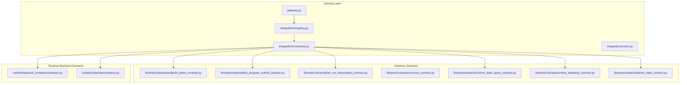
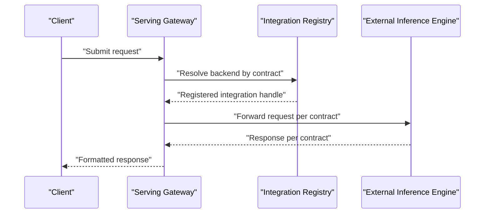
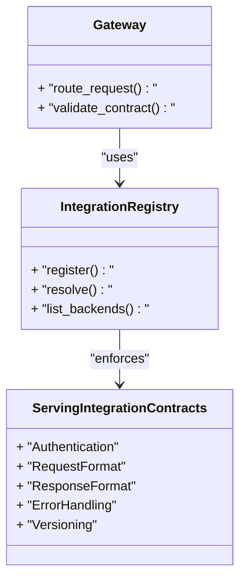
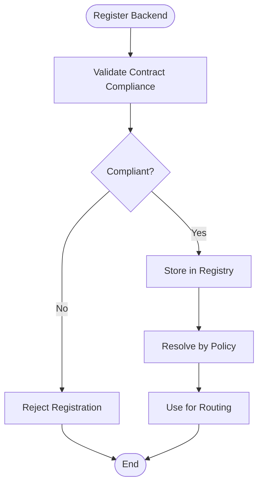
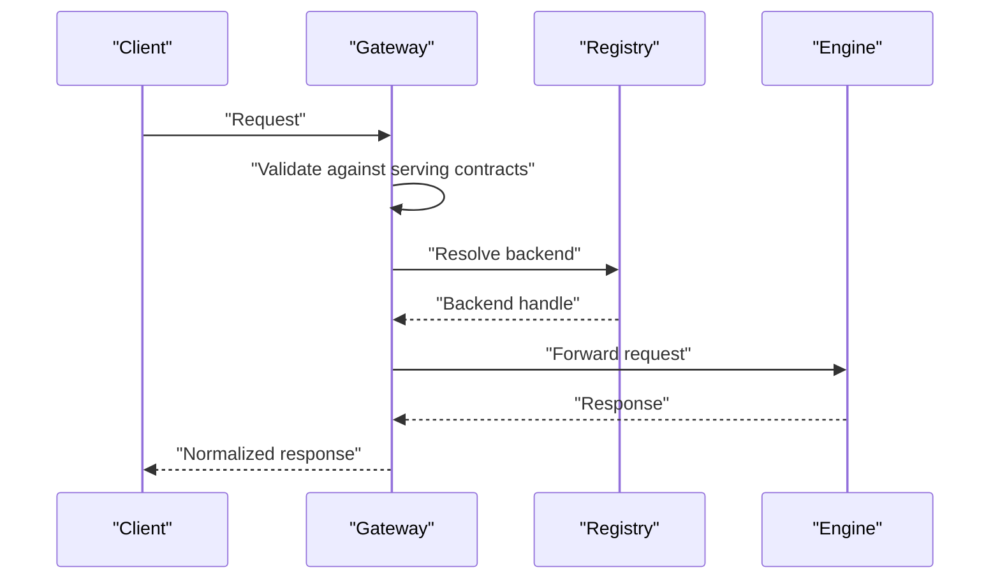
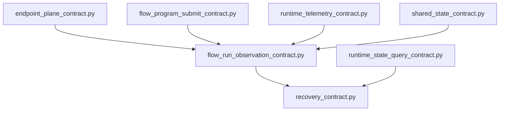

# Integration Contracts

<cite>
**Referenced Files in This Document**
- [contracts.py](file://src/sage/serving/integrations/contracts.py)
- [registry.py](file://src/sage/serving/integrations/registry.py)
- [mock.py](file://src/sage/serving/integrations/mock.py)
- [gateway.py](file://src/sage/serving/gateway.py)
- [endpoint_plane_contract.py](file://src/sage/runtime/flownet/contracts/endpoint_plane_contract.py)
- [flow_program_submit_contract.py](file://src/sage/runtime/flownet/contracts/flow_program_submit_contract.py)
- [flow_run_observation_contract.py](file://src/sage/runtime/flownet/contracts/flow_run_observation_contract.py)
- [recovery_contract.py](file://src/sage/runtime/flownet/contracts/recovery_contract.py)
- [runtime_state_query_contract.py](file://src/sage/runtime/flownet/contracts/runtime_state_query_contract.py)
- [runtime_telemetry_contract.py](file://src/sage/runtime/flownet/contracts/runtime_telemetry_contract.py)
- [shared_state_contract.py](file://src/sage/runtime/flownet/contracts/shared_state_contract.py)
- [backend_container_contracts.py](file://src/sage/runtime/runtime/backend_container/contracts.py)
- [collective_contracts.py](file://src/sage/runtime/runtime/collective/contracts.py)
- [test_flownet_endpoint_plane_contract.py](file://src/tests/test_flownet_endpoint_plane_contract.py)
- [test_flownet_runtime_state_query.py](file://src/tests/test_flownet_runtime_state_query.py)
- [test_flownet_shared_state_service_contract.py](file://src/tests/test_flownet_shared_state_service_contract.py)
- [test_workflow_product_integration_contract.py](file://src/tests/test_workflow_product_integration_contract.py)
</cite>

## Table of Contents
1. [Introduction](#introduction)
2. [Project Structure](#project-structure)
3. [Core Components](#core-components)
4. [Architecture Overview](#architecture-overview)
5. [Detailed Component Analysis](#detailed-component-analysis)
6. [Dependency Analysis](#dependency-analysis)
7. [Performance Considerations](#performance-considerations)
8. [Troubleshooting Guide](#troubleshooting-guide)
9. [Conclusion](#conclusion)
10. [Appendices](#appendices)

## Introduction
This document describes the Integration Contracts for SAGE’s serving integration framework. It explains the contract-based approach for connecting SAGE with external inference engines, documents interface specifications and expected behaviors, and details the integration registry system for managing different serving backends. It also covers contract requirements for implementing new serving integrations, including authentication, request/response formatting, and error handling protocols. Examples of contract compliance checking and validation mechanisms are included, along with the relationship between contracts and the broader SAGE architecture. Finally, it addresses versioning strategies, backward compatibility, and migration paths for contract updates.

## Project Structure
The serving integration contracts live under the serving module and integrate with the runtime’s contract suite. The key areas are:
- Serving integration contracts and registry
- Gateway for serving orchestration
- Runtime contracts for distributed systems and observability
- Tests validating contract compliance

**Diagram sources**
- [gateway.py](file://src/sage/serving/gateway.py)
- [registry.py](file://src/sage/serving/integrations/registry.py)
- [contracts.py](file://src/sage/serving/integrations/contracts.py)
- [endpoint_plane_contract.py](file://src/sage/runtime/flownet/contracts/endpoint_plane_contract.py)
- [flow_program_submit_contract.py](file://src/sage/runtime/flownet/contracts/flow_program_submit_contract.py)
- [flow_run_observation_contract.py](file://src/sage/runtime/flownet/contracts/flow_run_observation_contract.py)
- [recovery_contract.py](file://src/sage/runtime/flownet/contracts/recovery_contract.py)
- [runtime_state_query_contract.py](file://src/sage/runtime/flownet/contracts/runtime_state_query_contract.py)
- [runtime_telemetry_contract.py](file://src/sage/runtime/flownet/contracts/runtime_telemetry_contract.py)
- [shared_state_contract.py](file://src/sage/runtime/flownet/contracts/shared_state_contract.py)
- [backend_container_contracts.py](file://src/sage/runtime/runtime/backend_container/contracts.py)
- [collective_contracts.py](file://src/sage/runtime/runtime/collective/contracts.py)

**Section sources**
- [gateway.py](file://src/sage/serving/gateway.py)
- [registry.py](file://src/sage/serving/integrations/registry.py)
- [contracts.py](file://src/sage/serving/integrations/contracts.py)

## Core Components
- Serving Integration Contracts: Defines the canonical interfaces and behaviors for integrating external inference engines with SAGE. These contracts specify request/response formats, error semantics, and operational guarantees.
- Integration Registry: Manages registered serving backends and their capabilities, enabling pluggable selection and lifecycle management.
- Gateway: Provides the primary entry point for serving operations, delegating to registered integrations according to configured policies.
- Runtime Contracts: Provide foundational contracts for distributed runtime behavior, including endpoint plane operations, flow program submission, observation, recovery, runtime state queries, telemetry, and shared state synchronization.

Key responsibilities:
- Contract definition and validation
- Backend registration and discovery
- Request routing and response shaping
- Observability and resilience via runtime contracts

**Section sources**
- [contracts.py](file://src/sage/serving/integrations/contracts.py)
- [registry.py](file://src/sage/serving/integrations/registry.py)
- [gateway.py](file://src/sage/serving/gateway.py)
- [endpoint_plane_contract.py](file://src/sage/runtime/flownet/contracts/endpoint_plane_contract.py)
- [flow_program_submit_contract.py](file://src/sage/runtime/flownet/contracts/flow_program_submit_contract.py)
- [flow_run_observation_contract.py](file://src/sage/runtime/flownet/contracts/flow_run_observation_contract.py)
- [recovery_contract.py](file://src/sage/runtime/flownet/contracts/recovery_contract.py)
- [runtime_state_query_contract.py](file://src/sage/runtime/flownet/contracts/runtime_state_query_contract.py)
- [runtime_telemetry_contract.py](file://src/sage/runtime/flownet/contracts/runtime_telemetry_contract.py)
- [shared_state_contract.py](file://src/sage/runtime/flownet/contracts/shared_state_contract.py)

## Architecture Overview
The serving integration architecture centers on a contract-first design that enables pluggable backends while preserving API compatibility. The gateway routes requests to registered integrations, which must conform to the serving integration contracts. Underlying runtime contracts ensure distributed consistency, observability, and resilience.

**Diagram sources**
- [gateway.py](file://src/sage/serving/gateway.py)
- [registry.py](file://src/sage/serving/integrations/registry.py)
- [contracts.py](file://src/sage/serving/integrations/contracts.py)

## Detailed Component Analysis

### Serving Integration Contracts
The serving integration contracts define the canonical interface for connecting external inference engines. They specify:
- Authentication and authorization mechanisms
- Request/response schemas and serialization formats
- Error handling and status semantics
- Operational guarantees and retry/backoff policies
- Versioning and compatibility constraints

Contract compliance ensures that new backends can be integrated without breaking existing clients or changing the public API surface.

**Diagram sources**
- [contracts.py](file://src/sage/serving/integrations/contracts.py)
- [registry.py](file://src/sage/serving/integrations/registry.py)
- [gateway.py](file://src/sage/serving/gateway.py)

**Section sources**
- [contracts.py](file://src/sage/serving/integrations/contracts.py)

### Integration Registry System
The registry manages serving backends and enforces contract compliance during resolution. It supports:
- Backend registration with metadata and capabilities
- Policy-driven backend selection
- Health checks and failover
- Lifecycle management and deprecation

**Diagram sources**
- [registry.py](file://src/sage/serving/integrations/registry.py)
- [contracts.py](file://src/sage/serving/integrations/contracts.py)

**Section sources**
- [registry.py](file://src/sage/serving/integrations/registry.py)

### Gateway Orchestration
The gateway acts as the single entry point for serving operations. It:
- Validates incoming requests against the serving integration contracts
- Resolves the appropriate backend via the registry
- Forwards requests and normalizes responses
- Handles errors and retries per contract-defined policies

**Diagram sources**
- [gateway.py](file://src/sage/serving/gateway.py)
- [registry.py](file://src/sage/serving/integrations/registry.py)
- [contracts.py](file://src/sage/serving/integrations/contracts.py)

**Section sources**
- [gateway.py](file://src/sage/serving/gateway.py)

### Runtime Contracts Supporting Serving
The runtime contracts provide the underlying infrastructure for distributed serving:
- Endpoint plane contract: Defines endpoint lifecycle and communication semantics
- Flow program submit contract: Specifies how programs are submitted and executed
- Flow run observation contract: Captures execution traces and metrics
- Recovery contract: Ensures fault tolerance and recovery procedures
- Runtime state query contract: Enables querying runtime state
- Runtime telemetry contract: Standardizes telemetry collection
- Shared state contract: Coordinates shared state across nodes

These contracts collectively ensure that serving backends operate consistently within the distributed runtime.

**Diagram sources**
- [endpoint_plane_contract.py](file://src/sage/runtime/flownet/contracts/endpoint_plane_contract.py)
- [flow_program_submit_contract.py](file://src/sage/runtime/flownet/contracts/flow_program_submit_contract.py)
- [flow_run_observation_contract.py](file://src/sage/runtime/flownet/contracts/flow_run_observation_contract.py)
- [recovery_contract.py](file://src/sage/runtime/flownet/contracts/recovery_contract.py)
- [runtime_state_query_contract.py](file://src/sage/runtime/flownet/contracts/runtime_state_query_contract.py)
- [runtime_telemetry_contract.py](file://src/sage/runtime/flownet/contracts/runtime_telemetry_contract.py)
- [shared_state_contract.py](file://src/sage/runtime/flownet/contracts/shared_state_contract.py)

**Section sources**
- [endpoint_plane_contract.py](file://src/sage/runtime/flownet/contracts/endpoint_plane_contract.py)
- [flow_program_submit_contract.py](file://src/sage/runtime/flownet/contracts/flow_program_submit_contract.py)
- [flow_run_observation_contract.py](file://src/sage/runtime/flownet/contracts/flow_run_observation_contract.py)
- [recovery_contract.py](file://src/sage/runtime/flownet/contracts/recovery_contract.py)
- [runtime_state_query_contract.py](file://src/sage/runtime/flownet/contracts/runtime_state_query_contract.py)
- [runtime_telemetry_contract.py](file://src/sage/runtime/flownet/contracts/runtime_telemetry_contract.py)
- [shared_state_contract.py](file://src/sage/runtime/flownet/contracts/shared_state_contract.py)

### Backend Container and Collective Contracts
Additional contracts support containerized and collective execution patterns:
- Backend container contracts: Define container-level integration behaviors
- Collective contracts: Define multi-node coordination and dispatch behaviors

These contracts complement the serving integration contracts by ensuring consistent container and collective execution semantics.

**Section sources**
- [backend_container_contracts.py](file://src/sage/runtime/runtime/backend_container/contracts.py)
- [collective_contracts.py](file://src/sage/runtime/runtime/collective/contracts.py)

### Contract Compliance Checking and Validation
Contract compliance is validated through:
- Unit tests that assert adherence to serving integration contracts
- Runtime contract tests that validate distributed behaviors
- Mock implementations used to verify integration patterns

Examples of validation mechanisms include:
- Endpoint plane contract tests
- Runtime state query tests
- Shared state service contract tests
- Workflow product integration contract tests

These tests ensure that new backends meet the required interface specifications and behavioral guarantees.

**Section sources**
- [test_flownet_endpoint_plane_contract.py](file://src/tests/test_flownet_endpoint_plane_contract.py)
- [test_flownet_runtime_state_query.py](file://src/tests/test_flownet_runtime_state_query.py)
- [test_flownet_shared_state_service_contract.py](file://src/tests/test_flownet_shared_state_service_contract.py)
- [test_workflow_product_integration_contract.py](file://src/tests/test_workflow_product_integration_contract.py)

### Relationship Between Contracts and SAGE Architecture
Contracts enable pluggable serving backends while maintaining API compatibility by:
- Defining strict interface boundaries
- Enforcing consistent request/response formats
- Providing standardized error handling and telemetry
- Supporting versioning and backward compatibility strategies

This approach allows SAGE to evolve its internal runtime without breaking external integrations, and it enables third-party providers to implement compatible backends.

### Versioning Strategies, Backward Compatibility, and Migration Paths
Versioning strategies for contracts include:
- Semantic versioning for major/minor/patch releases
- Deprecation timelines and compatibility matrices
- Migration tooling and automated conversion scripts
- Feature flags and staged rollouts

Backward compatibility considerations:
- Preserve existing request/response shapes where possible
- Introduce optional fields and non-breaking changes
- Maintain stable error codes and semantics
- Provide clear migration guides and rollback strategies

Migration paths:
- Gradual rollout with dual-mode support
- Automated testing and validation during transitions
- Rollback mechanisms and monitoring alerts
- Documentation and training resources for maintainers

## Dependency Analysis
The serving integration contracts depend on runtime contracts to ensure distributed consistency and observability. The registry and gateway coordinate backend selection and request routing.

```mermaid
graph TB
C["serving/integrations/contracts.py"]
R["serving/integrations/registry.py"]
G["serving/gateway.py"]
EP["runtime/flownet/contracts/endpoint_plane_contract.py"]
FPS["runtime/flownet/contracts/flow_program_submit_contract.py"]
FRO["runtime/flownet/contracts/flow_run_observation_contract.py"]
REC["runtime/flownet/contracts/recovery_contract.py"]
RSQ["runtime/flownet/contracts/runtime_state_query_contract.py"]
RTE["runtime/flownet/contracts/runtime_telemetry_contract.py"]
SSC["runtime/flownet/contracts/shared_state_contract.py"]
C --> R
C --> G
C --> EP
C --> FPS
C --> FRO
C --> REC
C --> RSQ
C --> RTE
C --> SSC
```

**Diagram sources**
- [contracts.py](file://src/sage/serving/integrations/contracts.py)
- [registry.py](file://src/sage/serving/integrations/registry.py)
- [gateway.py](file://src/sage/serving/gateway.py)
- [endpoint_plane_contract.py](file://src/sage/runtime/flownet/contracts/endpoint_plane_contract.py)
- [flow_program_submit_contract.py](file://src/sage/runtime/flownet/contracts/flow_program_submit_contract.py)
- [flow_run_observation_contract.py](file://src/sage/runtime/flownet/contracts/flow_run_observation_contract.py)
- [recovery_contract.py](file://src/sage/runtime/flownet/contracts/recovery_contract.py)
- [runtime_state_query_contract.py](file://src/sage/runtime/flownet/contracts/runtime_state_query_contract.py)
- [runtime_telemetry_contract.py](file://src/sage/runtime/flownet/contracts/runtime_telemetry_contract.py)
- [shared_state_contract.py](file://src/sage/runtime/flownet/contracts/shared_state_contract.py)

**Section sources**
- [contracts.py](file://src/sage/serving/integrations/contracts.py)
- [registry.py](file://src/sage/serving/integrations/registry.py)
- [gateway.py](file://src/sage/serving/gateway.py)
- [endpoint_plane_contract.py](file://src/sage/runtime/flownet/contracts/endpoint_plane_contract.py)
- [flow_program_submit_contract.py](file://src/sage/runtime/flownet/contracts/flow_program_submit_contract.py)
- [flow_run_observation_contract.py](file://src/sage/runtime/flownet/contracts/flow_run_observation_contract.py)
- [recovery_contract.py](file://src/sage/runtime/flownet/contracts/recovery_contract.py)
- [runtime_state_query_contract.py](file://src/sage/runtime/flownet/contracts/runtime_state_query_contract.py)
- [runtime_telemetry_contract.py](file://src/sage/runtime/flownet/contracts/runtime_telemetry_contract.py)
- [shared_state_contract.py](file://src/sage/runtime/flownet/contracts/shared_state_contract.py)

## Performance Considerations
- Minimize serialization overhead by adhering to compact request/response formats
- Use streaming where appropriate to reduce latency and memory footprint
- Implement efficient caching and batching strategies aligned with contract requirements
- Ensure low-latency error handling and fast-fail mechanisms

## Troubleshooting Guide
Common issues and resolutions:
- Authentication failures: Verify credentials and token scopes against the serving integration contracts
- Request format mismatches: Align payload schemas with the defined request/response formats
- Backend resolution errors: Confirm backend registration and policy configuration
- Distributed runtime anomalies: Review runtime contract logs and telemetry for endpoint plane and state query issues

Validation and testing:
- Run contract compliance tests to catch regressions early
- Use mock implementations to simulate backend behavior during development
- Monitor telemetry and state queries to detect anomalies

**Section sources**
- [contracts.py](file://src/sage/serving/integrations/contracts.py)
- [registry.py](file://src/sage/serving/integrations/registry.py)
- [gateway.py](file://src/sage/serving/gateway.py)
- [runtime_telemetry_contract.py](file://src/sage/runtime/flownet/contracts/runtime_telemetry_contract.py)
- [runtime_state_query_contract.py](file://src/sage/runtime/flownet/contracts/runtime_state_query_contract.py)

## Conclusion
The Integration Contracts in SAGE establish a robust, contract-first framework for connecting external inference engines while preserving API compatibility and enabling pluggable backends. By combining serving integration contracts with runtime contracts and a centralized registry and gateway, SAGE achieves a scalable, observable, and resilient serving architecture. Versioning, backward compatibility, and migration strategies further ensure smooth evolution and adoption of new backends.

## Appendices
- Example validation references:
  - [test_flownet_endpoint_plane_contract.py](file://src/tests/test_flownet_endpoint_plane_contract.py)
  - [test_flownet_runtime_state_query.py](file://src/tests/test_flownet_runtime_state_query.py)
  - [test_flownet_shared_state_service_contract.py](file://src/tests/test_flownet_shared_state_service_contract.py)
  - [test_workflow_product_integration_contract.py](file://src/tests/test_workflow_product_integration_contract.py)