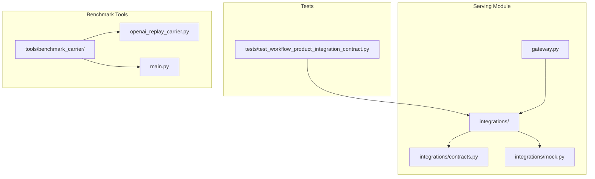
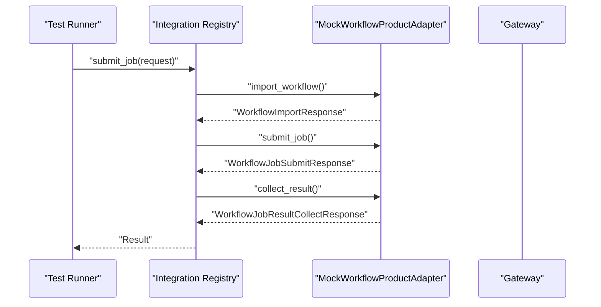
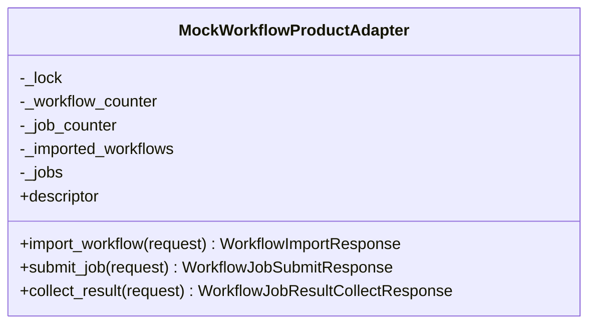
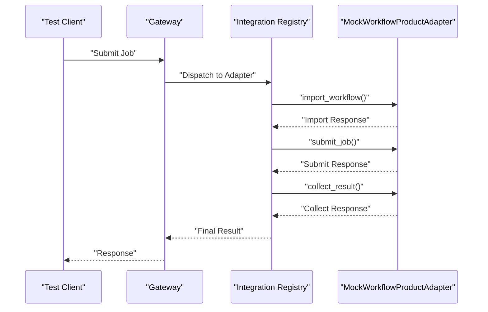
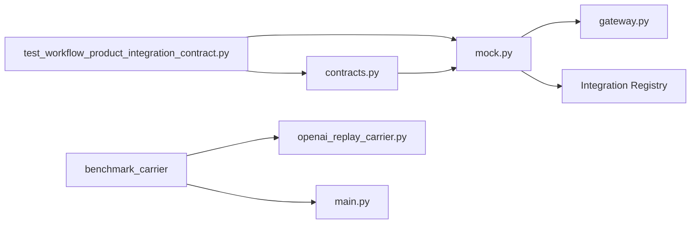

# Mock Integration and Testing

<cite>
**Referenced Files in This Document**
- [mock.py](file://src/sage/serving/integrations/mock.py)
- [contracts.py](file://src/sage/serving/integrations/contracts.py)
- [gateway.py](file://src/sage/serving/gateway.py)
- [test_workflow_product_integration_contract.py](file://src/tests/test_workflow_product_integration_contract.py)
- [openai_replay_carrier.py](file://tools/benchmark_carrier/openai_replay_carrier.py)
- [main.py](file://tools/benchmark_carrier/main.py)
</cite>

## Table of Contents
1. [Introduction](#introduction)
2. [Project Structure](#project-structure)
3. [Core Components](#core-components)
4. [Architecture Overview](#architecture-overview)
5. [Detailed Component Analysis](#detailed-component-analysis)
6. [Dependency Analysis](#dependency-analysis)
7. [Performance Considerations](#performance-considerations)
8. [Troubleshooting Guide](#troubleshooting-guide)
9. [Conclusion](#conclusion)

## Introduction
This document explains SAGE's mock integration and testing infrastructure for serving components. It focuses on how the mock implementation enables testing of serving integrations without external dependencies, including simulated responses, error injection, and load testing scenarios. It also covers testing strategies for validating serving configurations, integration contracts, and error handling paths, along with practical examples and best practices for transitioning from mock testing to production deployments.

## Project Structure
The serving mock and testing infrastructure resides under the serving module with supporting contracts and gateway components. Tests demonstrate integration contract validation using a mock workflow product adapter.

**Diagram sources**
- [gateway.py](file://src/sage/serving/gateway.py)
- [contracts.py](file://src/sage/serving/integrations/contracts.py)
- [mock.py](file://src/sage/serving/integrations/mock.py)
- [test_workflow_product_integration_contract.py](file://src/tests/test_workflow_product_integration_contract.py)
- [openai_replay_carrier.py](file://tools/benchmark_carrier/openai_replay_carrier.py)
- [main.py](file://tools/benchmark_carrier/main.py)

**Section sources**
- [gateway.py](file://src/sage/serving/gateway.py)
- [contracts.py](file://src/sage/serving/integrations/contracts.py)
- [mock.py](file://src/sage/serving/integrations/mock.py)
- [test_workflow_product_integration_contract.py](file://src/tests/test_workflow_product_integration_contract.py)

## Core Components
- MockWorkflowProductAdapter: Provides a mock implementation of a workflow product adapter suitable for testing. It supports importing workflows, submitting jobs, collecting results, and simulating serving contexts.
- Contracts: Define the integration contract interfaces and data models used by adapters and gateways.
- Gateway: Exposes the serving entry points and routes requests to registered adapters.
- Tests: Demonstrate contract validation and end-to-end submission and collection flows using the mock adapter.

Key responsibilities:
- Simulate realistic serving behavior without external dependencies.
- Validate integration contracts and serving configuration payloads.
- Support error injection and controlled failure modes for robustness testing.
- Enable performance and load testing via deterministic behavior.

**Section sources**
- [mock.py](file://src/sage/serving/integrations/mock.py)
- [contracts.py](file://src/sage/serving/integrations/contracts.py)
- [gateway.py](file://src/sage/serving/gateway.py)
- [test_workflow_product_integration_contract.py](file://src/tests/test_workflow_product_integration_contract.py)

## Architecture Overview
The mock integration sits behind the serving gateway and adheres to the integration contract. Tests exercise the adapter through the gateway and registry, validating request/response shapes and serving context semantics.

**Diagram sources**
- [test_workflow_product_integration_contract.py](file://src/tests/test_workflow_product_integration_contract.py)
- [mock.py](file://src/sage/serving/integrations/mock.py)

## Detailed Component Analysis

### MockWorkflowProductAdapter
The adapter implements the workflow product adapter interface with deterministic behavior suitable for testing. It maintains internal state for imported workflows and jobs, supports serving context payloads, and exposes methods for import, submit, and collect operations.

Implementation highlights:
- Thread-safe operations using an internal lock.
- Deterministic counters for generating workflow and job identifiers.
- Serving context extraction and normalization for validation.
- Workflow payload normalization and optional workflow ID assignment.

**Diagram sources**
- [mock.py](file://src/sage/serving/integrations/mock.py)

**Section sources**
- [mock.py](file://src/sage/serving/integrations/mock.py)

### Contracts and Integration Interfaces
Contracts define the request/response models and integration descriptors used by adapters. They ensure consistent behavior across adapters and enable validation of payloads and serving contexts.

Key elements:
- WorkflowProductAdapterDescriptor: Adapter metadata and extension points.
- Request/Response models for import, submit, and result collection.
- Serving context payload normalization and validation helpers.

These contracts are consumed by the adapter and validated by tests.

**Section sources**
- [contracts.py](file://src/sage/serving/integrations/contracts.py)

### Gateway and Registry Integration
The gateway exposes serving endpoints and delegates to registered adapters. Tests demonstrate invoking the registry to submit jobs and collect results, validating that the mock adapter integrates seamlessly with the serving infrastructure.

**Diagram sources**
- [gateway.py](file://src/sage/serving/gateway.py)
- [test_workflow_product_integration_contract.py](file://src/tests/test_workflow_product_integration_contract.py)
- [mock.py](file://src/sage/serving/integrations/mock.py)

**Section sources**
- [gateway.py](file://src/sage/serving/gateway.py)
- [test_workflow_product_integration_contract.py](file://src/tests/test_workflow_product_integration_contract.py)

### Testing Strategies and Examples
- Contract Validation: Tests validate that serving context fields are correctly parsed and normalized, ensuring adapters conform to expected schemas.
- End-to-End Flows: Tests submit jobs, collect results, and assert response correctness, simulating real-world usage patterns.
- Serving Context Semantics: Tests verify that fields like prompt length, max tokens, streaming, and trace tags are preserved and processed as expected.

Practical examples:
- Using the mock adapter type to submit and collect workflow jobs.
- Verifying serving context payload normalization and validation.
- Asserting response fields derived from the submitted request.

**Section sources**
- [test_workflow_product_integration_contract.py](file://src/tests/test_workflow_product_integration_contract.py)

### Error Injection and Failure Scenarios
While the current mock implementation focuses on deterministic behavior, error injection can be introduced by:
- Throwing exceptions during specific operations (e.g., import, submit, collect) to simulate transient failures.
- Returning error responses with structured error codes and messages aligned with contracts.
- Introducing delays or timeouts to simulate network or resource contention.

These techniques enable testing of error handling paths and resilience mechanisms.

[No sources needed since this section provides general guidance]

### Load Testing and Performance Approaches
The benchmark carrier tools provide a framework for performance testing:
- Replay carrier: Replays OpenAI-style requests/responses to simulate production traffic patterns.
- Benchmark runner: Orchestrates load tests, measuring latency and throughput metrics.

Approaches:
- Use replay carriers to generate synthetic loads that mimic real workloads.
- Measure latency distributions (TTFT, E2E) and throughput under varying concurrency levels.
- Validate adapter behavior under sustained load and observe error rates and backpressure signals.

**Section sources**
- [openai_replay_carrier.py](file://tools/benchmark_carrier/openai_replay_carrier.py)
- [main.py](file://tools/benchmark_carrier/main.py)

## Dependency Analysis
The mock adapter depends on contracts for request/response models and serving context normalization. The gateway and registry integrate the adapter into the serving stack. Tests depend on both the adapter and contracts to validate behavior.

**Diagram sources**
- [contracts.py](file://src/sage/serving/integrations/contracts.py)
- [mock.py](file://src/sage/serving/integrations/mock.py)
- [gateway.py](file://src/sage/serving/gateway.py)
- [test_workflow_product_integration_contract.py](file://src/tests/test_workflow_product_integration_contract.py)
- [openai_replay_carrier.py](file://tools/benchmark_carrier/openai_replay_carrier.py)
- [main.py](file://tools/benchmark_carrier/main.py)

**Section sources**
- [contracts.py](file://src/sage/serving/integrations/contracts.py)
- [mock.py](file://src/sage/serving/integrations/mock.py)
- [gateway.py](file://src/sage/serving/gateway.py)
- [test_workflow_product_integration_contract.py](file://src/tests/test_workflow_product_integration_contract.py)

## Performance Considerations
- Deterministic behavior: The mock adapter’s predictable responses simplify performance testing and eliminate flakiness.
- Throughput measurement: Combine the mock adapter with benchmark tools to measure sustained throughput and latency characteristics.
- Latency simulation: Introduce controlled delays to emulate real-world variability while maintaining reproducibility.
- Resource utilization: Monitor CPU, memory, and I/O during load tests to identify bottlenecks in the serving stack.

[No sources needed since this section provides general guidance]

## Troubleshooting Guide
Common issues and resolutions:
- Payload validation failures: Ensure serving context fields match expected types and ranges; verify normalization helpers are applied consistently.
- Concurrency problems: Confirm thread-safety by checking that shared state is protected by locks and that counters are updated atomically.
- Adapter registration: Verify that the mock adapter is properly registered with the integration registry and reachable via the gateway.
- Error handling paths: Add targeted error injection points to validate retry logic, circuit breakers, and fallback behaviors.

Debugging tips:
- Log request/response envelopes and serving context payloads to trace mismatches.
- Use small, isolated test cases to reproduce issues quickly.
- Gradually increase load to identify thresholds and failure modes.

[No sources needed since this section provides general guidance]

## Conclusion
SAGE’s mock integration and testing infrastructure provides a robust foundation for validating serving configurations, integration contracts, and error handling paths without external dependencies. By leveraging the mock adapter, contracts, and gateway integration, teams can build reliable unit and integration tests. Combined with benchmark tools, the system supports comprehensive performance testing, enabling confident transitions to production deployments while maintaining high reliability and observability.