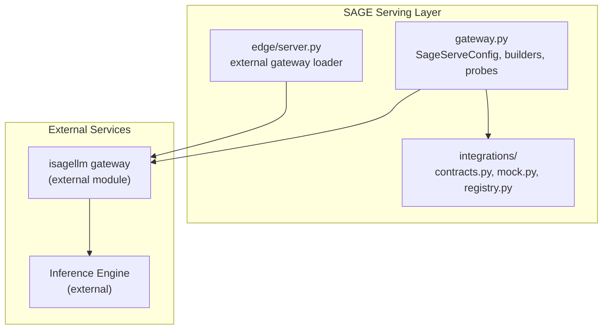
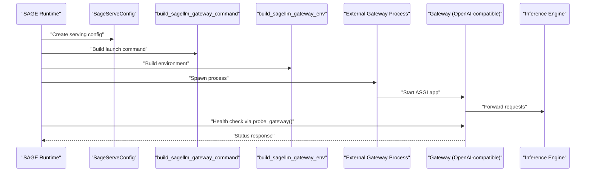
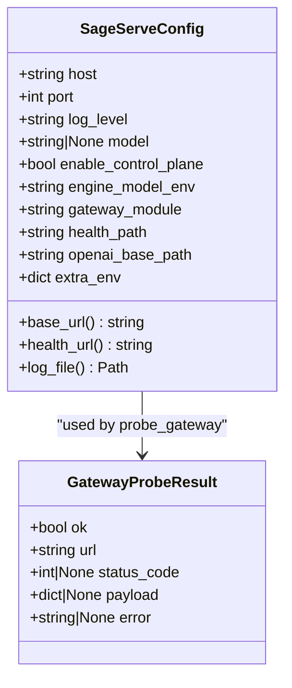
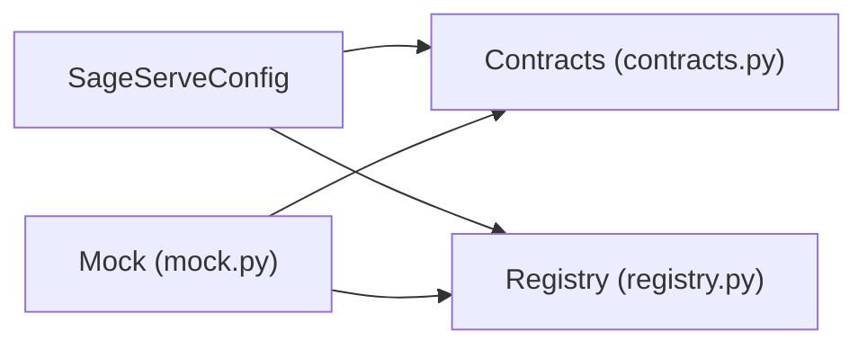
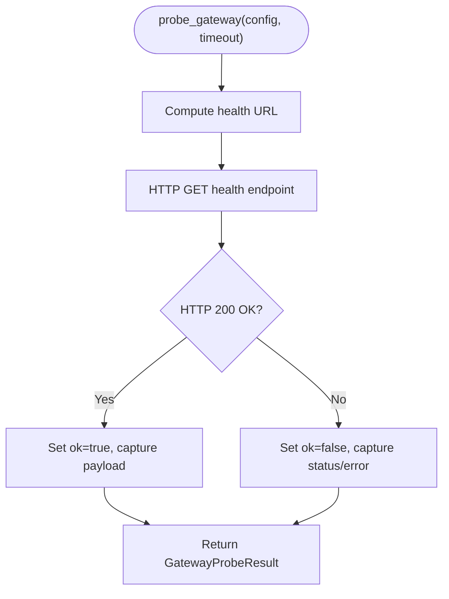
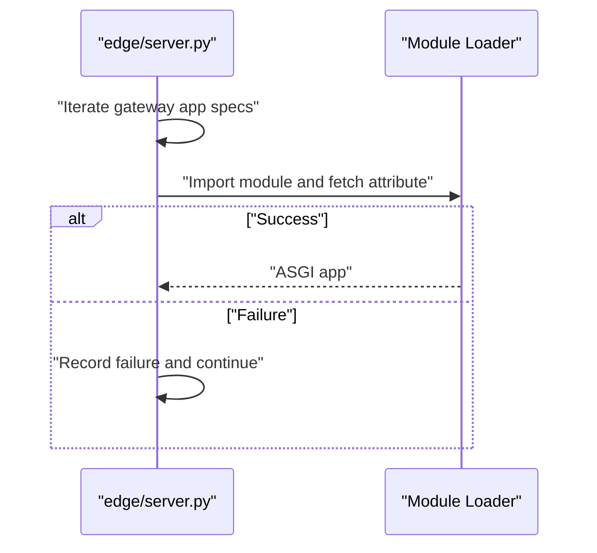
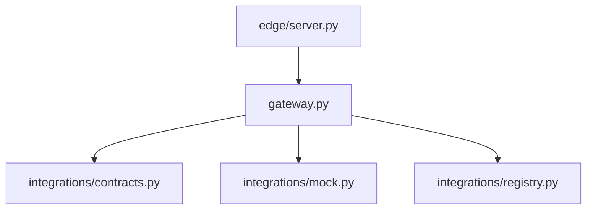

# Serving Layer

<cite>
**Referenced Files in This Document**
- [gateway.py](file://src/sage/serving/gateway.py)
- [contracts.py](file://src/sage/serving/integrations/contracts.py)
- [mock.py](file://src/sage/serving/integrations/mock.py)
- [registry.py](file://src/sage/serving/integrations/registry.py)
- [server.py](file://src/sage/edge/server.py)
- [README.md](file://README.md)
</cite>

## Table of Contents
1. [Introduction](#introduction)
2. [Project Structure](#project-structure)
3. [Core Components](#core-components)
4. [Architecture Overview](#architecture-overview)
5. [Detailed Component Analysis](#detailed-component-analysis)
6. [Dependency Analysis](#dependency-analysis)
7. [Performance Considerations](#performance-considerations)
8. [Troubleshooting Guide](#troubleshooting-guide)
9. [Conclusion](#conclusion)
10. [Appendices](#appendices)

## Introduction
This document describes the Serving Layer of SAGE, focusing on the HTTP gateway and inference engine integration capabilities. The Serving Layer acts as the interface between SAGE’s streaming execution runtime and external services, most notably an OpenAI-compatible gateway and external inference engines such as isagellm. It provides:
- A configuration model for orchestrating serving deployments
- Integration contracts and a registry for managing serving configurations
- Utilities for launching external gateways and probing their health
- Edge server integration to load external gateway applications

The goal is to help both beginners and experienced developers understand how SAGE exposes and manages inference APIs, how to connect external engines, and how to operate and troubleshoot serving deployments.

## Project Structure
The Serving Layer is organized under src/sage/serving with three primary areas:
- gateway.py: Defines serving configuration, URLs, command/env builders, and health probing
- integrations/: Contains contracts, mock implementations, and a registry for serving configurations
- edge/server.py: Loads external gateway applications from known entrypoints

**Diagram sources**
- [gateway.py:16-135](file://src/sage/serving/gateway.py#L16-L135)
- [contracts.py](file://src/sage/serving/integrations/contracts.py)
- [mock.py](file://src/sage/serving/integrations/mock.py)
- [registry.py](file://src/sage/serving/integrations/registry.py)
- [server.py:1-46](file://src/sage/edge/server.py#L1-L46)

**Section sources**
- [gateway.py:16-135](file://src/sage/serving/gateway.py#L16-L135)
- [contracts.py](file://src/sage/serving/integrations/contracts.py)
- [mock.py](file://src/sage/serving/integrations/mock.py)
- [registry.py](file://src/sage/serving/integrations/registry.py)
- [server.py:1-46](file://src/sage/edge/server.py#L1-L46)

## Core Components
- SageServeConfig: Encapsulates serving configuration for an external isagellm gateway, including host, port, log level, model selection, control plane toggle, environment variable contract keys, health and OpenAI base paths, and extra environment overrides.
- Builders and helpers:
  - default_gateway_config: Creates a SageServeConfig with sensible defaults.
  - gateway_openai_base_url and gateway_health_url: Compute public URLs for OpenAI-compatible API and health endpoints.
  - infer_module_availability: Checks if the gateway module is importable.
  - build_sagellm_gateway_command: Builds the command to launch the external gateway.
  - build_sagellm_gateway_env: Builds the environment for the external gateway process.
  - ensure_sagellm_model: Ensures the engine model is available locally via SAGE’s model registry.
- Probing:
  - probe_gateway: Performs a health check against the configured gateway and returns a structured result.

These components collectively enable SAGE to orchestrate serving, expose an OpenAI-compatible API surface, and integrate with external inference engines.

**Section sources**
- [gateway.py:16-135](file://src/sage/serving/gateway.py#L16-L135)

## Architecture Overview
The Serving Layer integrates SAGE with external inference engines through a gateway pattern:
- SAGE defines the serving configuration and environment contract
- SAGE launches or coordinates the external gateway process
- The gateway exposes an OpenAI-compatible API and routes requests to the inference engine
- SAGE can probe the gateway for health and manage logs

**Diagram sources**
- [gateway.py:98-135](file://src/sage/serving/gateway.py#L98-L135)
- [server.py:39-46](file://src/sage/edge/server.py#L39-L46)

## Detailed Component Analysis

### SageServeConfig and Serving Orchestration
SageServeConfig centralizes serving orchestration parameters:
- Host and port define where the gateway listens
- Log level controls verbosity
- Model selection and engine model environment key define which model to serve
- Control plane toggle enables optional control-plane features
- Health and OpenAI base paths define the exposed endpoints
- Extra environment allows customizing the gateway process environment

Key helpers:
- default_gateway_config: Provides a quick-start configuration
- gateway_openai_base_url and gateway_health_url: Derive public URLs for clients and monitoring
- infer_module_availability: Validates that the gateway module is importable
- build_sagellm_gateway_command: Constructs the command to launch the external gateway
- build_sagellm_gateway_env: Merges base environment with model and extra environment overrides
- ensure_sagellm_model: Ensures the model is present locally

**Diagram sources**
- [gateway.py:16-53](file://src/sage/serving/gateway.py#L16-L53)

**Section sources**
- [gateway.py:16-135](file://src/sage/serving/gateway.py#L16-L135)

### Integration Contracts and Registry
The integrations package defines:
- contracts.py: Defines integration contracts for serving configurations
- mock.py: Provides mock implementations for testing and development
- registry.py: Manages serving configuration registries and lookups

These components enable SAGE to:
- Standardize how serving configurations are represented and validated
- Provide deterministic test doubles
- Manage multiple serving configurations and resolve them at runtime

**Diagram sources**
- [contracts.py](file://src/sage/serving/integrations/contracts.py)
- [mock.py](file://src/sage/serving/integrations/mock.py)
- [registry.py](file://src/sage/serving/integrations/registry.py)

**Section sources**
- [contracts.py](file://src/sage/serving/integrations/contracts.py)
- [mock.py](file://src/sage/serving/integrations/mock.py)
- [registry.py](file://src/sage/serving/integrations/registry.py)

### Gateway Launch and Health Monitoring
- build_sagellm_gateway_command: Assembles the command-line invocation to start the external gateway, including host, port, log level, and optional control-plane flag
- build_sagellm_gateway_env: Composes the environment for the gateway process, including model selection and extra environment variables
- ensure_sagellm_model: Ensures the model is available locally via SAGE’s model registry
- probe_gateway: Performs a health check against the gateway and returns a structured result with status, payload, and error details

**Diagram sources**
- [gateway.py:44-53](file://src/sage/serving/gateway.py#L44-L53)
- [gateway.py:137-139](file://src/sage/serving/gateway.py#L137-L139)

**Section sources**
- [gateway.py:98-135](file://src/sage/serving/gateway.py#L98-L135)
- [gateway.py:137-139](file://src/sage/serving/gateway.py#L137-L139)

### Edge Server Integration for External Gateways
The edge server supports loading external gateway applications from known entrypoints. It tries a prioritized list of module specs and raises informative errors if none succeed. This enables SAGE to dynamically discover and load gateway applications such as isagellm.

**Diagram sources**
- [server.py:20-46](file://src/sage/edge/server.py#L20-L46)

**Section sources**
- [server.py:1-46](file://src/sage/edge/server.py#L1-L46)

## Dependency Analysis
The Serving Layer components depend on each other as follows:
- gateway.py depends on SagePorts and model availability utilities from SAGE’s foundation
- integrations modules depend on contracts and registry abstractions
- edge/server.py depends on gateway app specs to load external ASGI applications

**Diagram sources**
- [gateway.py:13-13](file://src/sage/serving/gateway.py#L13-L13)
- [contracts.py](file://src/sage/serving/integrations/contracts.py)
- [mock.py](file://src/sage/serving/integrations/mock.py)
- [registry.py](file://src/sage/serving/integrations/registry.py)
- [server.py:10-17](file://src/sage/edge/server.py#L10-L17)

**Section sources**
- [gateway.py:13-13](file://src/sage/serving/gateway.py#L13-L13)
- [server.py:10-17](file://src/sage/edge/server.py#L10-L17)

## Performance Considerations
- Minimize gateway startup overhead by reusing a single long-running process per model and leveraging health probes to avoid redundant restarts
- Tune log levels to balance observability and performance; set log_level appropriately for production vs. development
- Prefer local model caching via ensure_sagellm_model to reduce latency during cold starts
- Use control plane features judiciously; enabling them adds operational complexity and may impact throughput
- Monitor gateway health regularly to detect and recover from transient failures quickly

[No sources needed since this section provides general guidance]

## Troubleshooting Guide
Common issues and remedies:
- Gateway module not importable:
  - Verify the gateway module is installed and importable; use infer_module_availability to confirm
  - Confirm the gateway_module setting in SageServeConfig matches the installed package
- Health check failures:
  - Use probe_gateway to capture status_code and error details
  - Check gateway logs located at the log_file path derived from SageServeConfig
- Model not found:
  - Ensure the model is available locally using ensure_sagellm_model
  - Confirm engine_model_env points to the correct environment variable key
- Port conflicts:
  - Adjust port in SageServeConfig to avoid conflicts with other services
- Environment mismatches:
  - Review build_sagellm_gateway_env and extra_env to ensure required variables are set

**Section sources**
- [gateway.py:93-95](file://src/sage/serving/gateway.py#L93-L95)
- [gateway.py:137-139](file://src/sage/serving/gateway.py#L137-L139)
- [gateway.py:129-135](file://src/sage/serving/gateway.py#L129-L135)

## Conclusion
The Serving Layer provides a robust, extensible framework for integrating SAGE with external inference engines via an OpenAI-compatible gateway. It offers a clear configuration model, standardized integration contracts, and practical utilities for launching, configuring, and monitoring gateway processes. By combining these pieces, teams can deploy scalable serving solutions, maintain compatibility with existing OpenAI tooling, and operate reliably in production environments.

[No sources needed since this section summarizes without analyzing specific files]

## Appendices

### Practical Examples

- OpenAI-compatible API usage
  - Construct the OpenAI base URL using gateway_openai_base_url and issue requests to the /v1 endpoints exposed by the gateway
  - Example path reference: [gateway_openai_base_url:73-80](file://src/sage/serving/gateway.py#L73-L80)

- External engine integration
  - Build the gateway command with build_sagellm_gateway_command and launch it with the environment produced by build_sagellm_gateway_env
  - Example path references:
    - [build_sagellm_gateway_command:98-117](file://src/sage/serving/gateway.py#L98-L117)
    - [build_sagellm_gateway_env:120-126](file://src/sage/serving/gateway.py#L120-L126)

- Serving configuration management
  - Create a SageServeConfig with default_gateway_config and customize host, port, model, and control plane settings
  - Example path references:
    - [default_gateway_config:55-70](file://src/sage/serving/gateway.py#L55-L70)
    - [SageServeConfig:16-42](file://src/sage/serving/gateway.py#L16-L42)

- Health monitoring
  - Probe the gateway using probe_gateway and act on the returned GatewayProbeResult
  - Example path references:
    - [GatewayProbeResult:44-53](file://src/sage/serving/gateway.py#L44-L53)
    - [probe_gateway:137-139](file://src/sage/serving/gateway.py#L137-L139)

- Integration contracts and registry
  - Use contracts.py to validate configurations, mock.py for tests, and registry.py to manage serving setups
  - Example path references:
    - [contracts.py](file://src/sage/serving/integrations/contracts.py)
    - [mock.py](file://src/sage/serving/integrations/mock.py)
    - [registry.py](file://src/sage/serving/integrations/registry.py)

- Edge server gateway loading
  - Load external gateway applications using the edge server’s gateway app spec resolution
  - Example path reference: [edge/server.py:20-46](file://src/sage/edge/server.py#L20-L46)

**Section sources**
- [gateway.py:55-139](file://src/sage/serving/gateway.py#L55-L139)
- [contracts.py](file://src/sage/serving/integrations/contracts.py)
- [mock.py](file://src/sage/serving/integrations/mock.py)
- [registry.py](file://src/sage/serving/integrations/registry.py)
- [server.py:20-46](file://src/sage/edge/server.py#L20-L46)