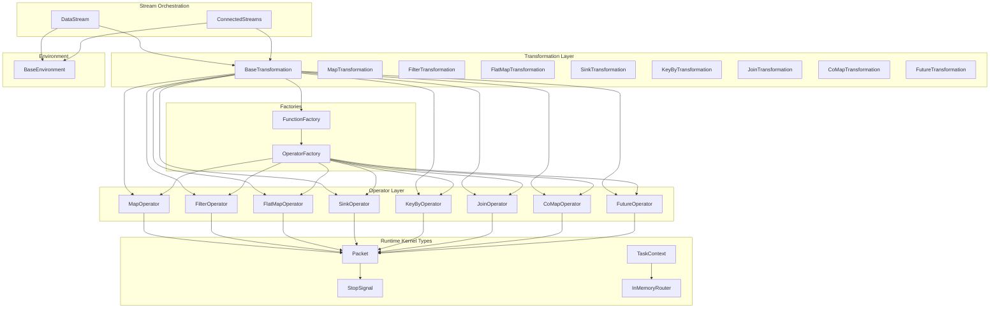
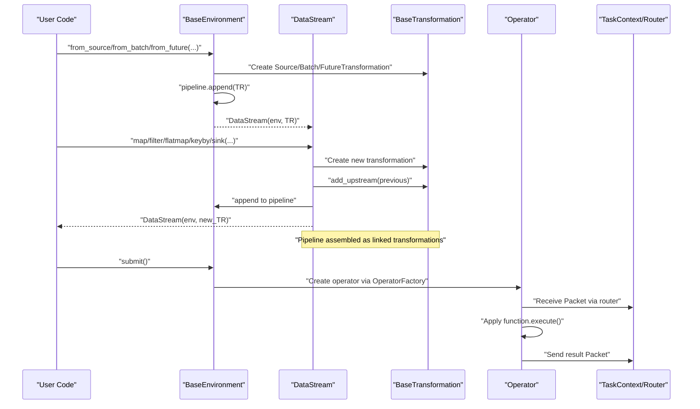
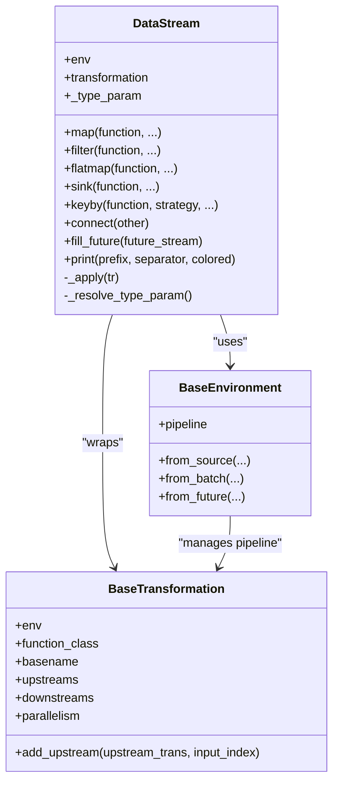
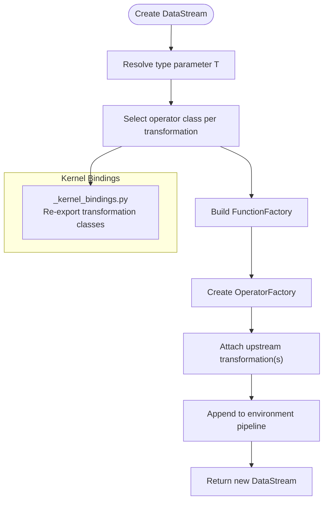
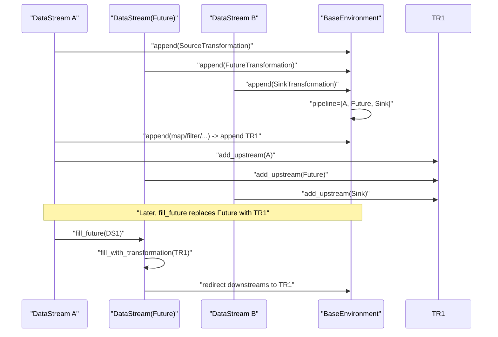
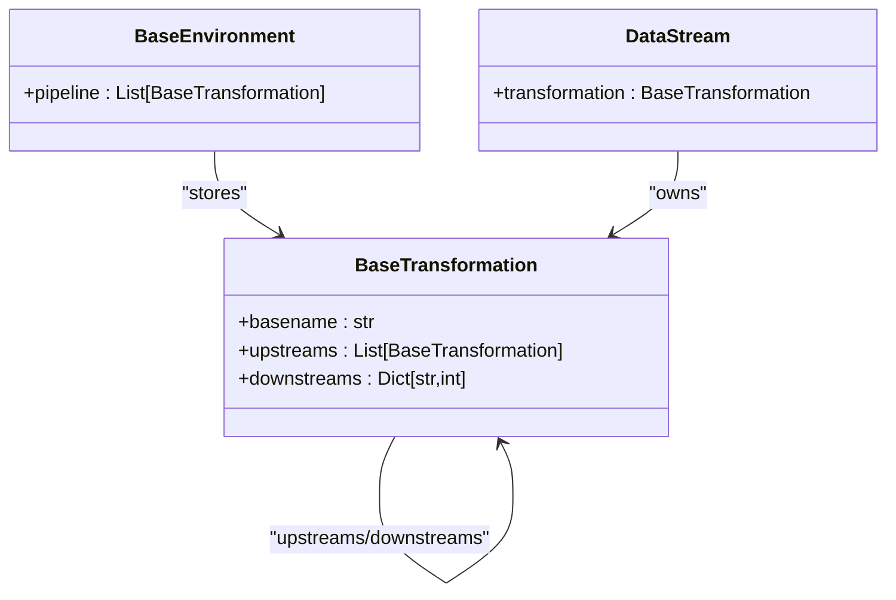
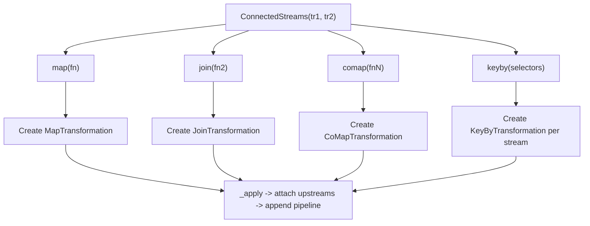
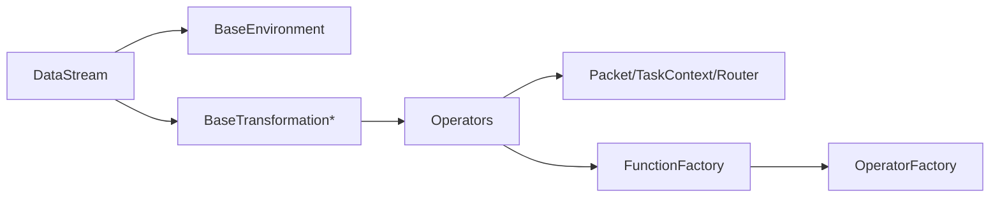

# DataStream Core

<cite>
**Referenced Files in This Document**
- [datastream.py](file://src/sage/stream/datastream.py)
- [_kernel_bindings.py](file://src/sage/stream/_kernel_bindings.py)
- [transformations.py](file://src/sage/stream/transformations.py)
- [operators.py](file://src/sage/stream/operators.py)
- [factories.py](file://src/sage/stream/factories.py)
- [base_environment.py](file://src/sage/runtime/base_environment.py)
- [connected_streams.py](file://src/sage/stream/connected_streams.py)
- [_runtime_kernel_types.py](file://src/sage/stream/_runtime_kernel_types.py)
- [core.py](file://src/sage/foundation/core.py)
- [debug.py](file://src/sage/foundation/debug.py)
</cite>

## Table of Contents
1. [Introduction](#introduction)
2. [Project Structure](#project-structure)
3. [Core Components](#core-components)
4. [Architecture Overview](#architecture-overview)
5. [Detailed Component Analysis](#detailed-component-analysis)
6. [Dependency Analysis](#dependency-analysis)
7. [Performance Considerations](#performance-considerations)
8. [Troubleshooting Guide](#troubleshooting-guide)
9. [Conclusion](#conclusion)

## Introduction
This document explains the DataStream core functionality in the SAGE streaming runtime. DataStream is the primary abstraction for building and orchestrating streaming data processing pipelines. It encapsulates a typed stream of data, manages upstream/downstream relationships, and constructs transformation pipelines by composing operator transformations. The document covers:
- The DataStream class as the central orchestrator for operator chains
- Generic type parameter handling and type safety
- Transformation pipeline construction and kernel binding
- Upstream/downstream relationships and feedback edges via futures
- Integration with BaseEnvironment and the broader SAGE runtime
- Practical usage patterns, performance characteristics, and memory considerations

## Project Structure
The DataStream subsystem is organized around a small set of cohesive modules:
- Stream orchestration: DataStream, ConnectedStreams
- Transformation layer: BaseTransformation and concrete subclasses
- Operator layer: Operators that execute transformations
- Runtime kernel types: Packet, StopSignal, TaskContext, InMemoryRouter
- Factories: FunctionFactory and OperatorFactory
- Environment integration: BaseEnvironment

**Diagram sources**
- [datastream.py:26-182](file://src/sage/stream/datastream.py#L26-L182)
- [connected_streams.py:28-207](file://src/sage/stream/connected_streams.py#L28-L207)
- [transformations.py:63-421](file://src/sage/stream/transformations.py#L63-L421)
- [operators.py:41-526](file://src/sage/stream/operators.py#L41-L526)
- [_runtime_kernel_types.py:22-267](file://src/sage/stream/_runtime_kernel_types.py#L22-L267)
- [factories.py:13-54](file://src/sage/stream/factories.py#L13-L54)
- [base_environment.py:25-269](file://src/sage/runtime/base_environment.py#L25-L269)

**Section sources**
- [datastream.py:26-182](file://src/sage/stream/datastream.py#L26-L182)
- [transformations.py:63-421](file://src/sage/stream/transformations.py#L63-L421)
- [operators.py:41-526](file://src/sage/stream/operators.py#L41-L526)
- [_runtime_kernel_types.py:22-267](file://src/sage/stream/_runtime_kernel_types.py#L22-L267)
- [factories.py:13-54](file://src/sage/stream/factories.py#L13-L54)
- [base_environment.py:25-269](file://src/sage/runtime/base_environment.py#L25-L269)

## Core Components
- DataStream: The primary abstraction representing a typed stream. It holds a reference to the current transformation, the environment, and resolves the stream’s generic type parameter. It exposes transformation methods (map, filter, flatmap, sink, keyby) and pipeline assembly helpers (connect, fill_future).
- BaseTransformation: The base class for all transformations. It tracks upstream/downstream relationships, function metadata, operator class selection, and parallelism. Concrete subclasses define operator classes for Map, Filter, FlatMap, Sink, KeyBy, Join, CoMap, and Future.
- Operators: Executable units that operate on Packet payloads. They use FunctionFactory and OperatorFactory to instantiate functions and operators with a TaskContext and router.
- Runtime kernel types: Packet carries payload and partition metadata; StopSignal terminates streams; TaskContext provides execution context and routing; InMemoryRouter connects operators.
- Factories: FunctionFactory creates function instances bound to a TaskContext; OperatorFactory constructs operator instances with operator-specific kwargs.
- BaseEnvironment: Provides source creation (from_source, from_collection, from_batch, from_kafka_source, from_future) and pipeline assembly. It also resolves DataStream and transformation classes and manages the pipeline list.

**Section sources**
- [datastream.py:26-182](file://src/sage/stream/datastream.py#L26-L182)
- [transformations.py:63-421](file://src/sage/stream/transformations.py#L63-L421)
- [operators.py:41-526](file://src/sage/stream/operators.py#L41-L526)
- [_runtime_kernel_types.py:22-267](file://src/sage/stream/_runtime_kernel_types.py#L22-L267)
- [factories.py:13-54](file://src/sage/stream/factories.py#L13-L54)
- [base_environment.py:25-269](file://src/sage/runtime/base_environment.py#L25-L269)

## Architecture Overview
DataStream sits atop BaseEnvironment and composes BaseTransformation instances into a pipeline. Each transformation selects an operator class and is attached to the environment’s pipeline. Operators receive Packet objects, apply function logic, and route results via TaskContext and InMemoryRouter.

**Diagram sources**
- [base_environment.py:117-194](file://src/sage/runtime/base_environment.py#L117-L194)
- [datastream.py:52-176](file://src/sage/stream/datastream.py#L52-L176)
- [transformations.py:63-124](file://src/sage/stream/transformations.py#L63-L124)
- [operators.py:41-105](file://src/sage/stream/operators.py#L41-L105)
- [_runtime_kernel_types.py:132-214](file://src/sage/stream/_runtime_kernel_types.py#L132-L214)

## Detailed Component Analysis

### DataStream Class
DataStream is the central orchestrator for operator chains. It:
- Stores environment, current transformation, and resolved type parameter
- Exposes transformation methods that construct BaseTransformation subclasses and attach them to the pipeline
- Manages upstream/downstream relationships via BaseTransformation.add_upstream
- Supports connecting multiple streams and filling future placeholders

Key behaviors:
- Generic type parameter resolution: Uses origin/args introspection to capture the type parameter T when DataStream[T] is instantiated.
- Transformation construction: Methods map, filter, flatmap, sink, keyby create corresponding BaseTransformation subclasses and return a new DataStream wrapping the newly created transformation.
- Pipeline assembly: _apply attaches the new transformation to the previous transformation and appends it to the environment’s pipeline.
- Feedback edges: fill_future replaces a FutureTransformation downstream with the actual transformation, enabling feedback loops.

**Diagram sources**
- [datastream.py:26-182](file://src/sage/stream/datastream.py#L26-L182)
- [transformations.py:63-124](file://src/sage/stream/transformations.py#L63-L124)
- [base_environment.py:64-71](file://src/sage/runtime/base_environment.py#L64-L71)

**Section sources**
- [datastream.py:26-182](file://src/sage/stream/datastream.py#L26-L182)
- [transformations.py:96-98](file://src/sage/stream/transformations.py#L96-L98)
- [base_environment.py:64-71](file://src/sage/runtime/base_environment.py#L64-L71)

### Transformation Pipeline Construction and Kernel Bindings
- Transformation class resolution: DataStream and ConnectedStreams maintain a local dictionary of transformation classes to avoid cyclic imports and to centralize class resolution.
- Kernel bindings: _kernel_bindings re-exports transformation classes for internal use, ensuring a single source of truth for transformation names.
- Operator selection: Each BaseTransformation subclass sets operator_class to the corresponding operator (e.g., MapOperator, FilterOperator). OperatorFactory uses this to instantiate operators with FunctionFactory and TaskContext.

**Diagram sources**
- [datastream.py:39-50](file://src/sage/stream/datastream.py#L39-L50)
- [_kernel_bindings.py:18-30](file://src/sage/stream/_kernel_bindings.py#L18-L30)
- [transformations.py:201-230](file://src/sage/stream/transformations.py#L201-L230)
- [operators.py:41-105](file://src/sage/stream/operators.py#L41-L105)
- [factories.py:33-54](file://src/sage/stream/factories.py#L33-L54)

**Section sources**
- [datastream.py:39-50](file://src/sage/stream/datastream.py#L39-L50)
- [_kernel_bindings.py:18-30](file://src/sage/stream/_kernel_bindings.py#L18-L30)
- [transformations.py:201-230](file://src/sage/stream/transformations.py#L201-L230)
- [operators.py:41-105](file://src/sage/stream/operators.py#L41-L105)
- [factories.py:33-54](file://src/sage/stream/factories.py#L33-L54)

### Upstream/Downstream Relationships and Feedback Edges
- Upstream attachment: BaseTransformation.add_upstream registers the upstream transformation and records the input index for multi-input operators.
- Downstream propagation: Downstream dictionaries map downstream basenames to input indices, enabling operators to route packets accordingly.
- Feedback edges: fill_future validates that the target is a FutureTransformation, prevents double-filling, and redirects downstreams to the actual transformation after replacement.

**Diagram sources**
- [datastream.py:150-167](file://src/sage/stream/datastream.py#L150-L167)
- [transformations.py:377-412](file://src/sage/stream/transformations.py#L377-L412)
- [transformations.py:96-98](file://src/sage/stream/transformations.py#L96-L98)
- [base_environment.py:64-71](file://src/sage/runtime/base_environment.py#L64-L71)

**Section sources**
- [datastream.py:150-167](file://src/sage/stream/datastream.py#L150-L167)
- [transformations.py:96-98](file://src/sage/stream/transformations.py#L96-L98)
- [transformations.py:377-412](file://src/sage/stream/transformations.py#L377-L412)

### Relationship Between DataStream Instances and BaseTransformation Objects
- Each DataStream wraps a BaseTransformation and exposes methods that create new transformations and return a new DataStream instance pointing to the latest transformation.
- The environment pipeline stores all transformations in order, enabling later compilation and execution.

**Diagram sources**
- [base_environment.py:64-71](file://src/sage/runtime/base_environment.py#L64-L71)
- [transformations.py:96-98](file://src/sage/stream/transformations.py#L96-L98)
- [datastream.py:29-33](file://src/sage/stream/datastream.py#L29-L33)

**Section sources**
- [base_environment.py:64-71](file://src/sage/runtime/base_environment.py#L64-L71)
- [transformations.py:96-98](file://src/sage/stream/transformations.py#L96-L98)
- [datastream.py:29-33](file://src/sage/stream/datastream.py#L29-L33)

### Generic Type Parameter System and Type Safety
- DataStream is generic over T. The type parameter is resolved from the origin class when DataStream[T] is constructed.
- This enables compile-time type hints and static analysis for user code while preserving runtime flexibility.

Practical implications:
- Users can annotate their streams for clarity and IDE support.
- The resolved type does not constrain runtime behavior but aids development ergonomics.

**Section sources**
- [datastream.py:23-24](file://src/sage/stream/datastream.py#L23-L24)
- [datastream.py:177-182](file://src/sage/stream/datastream.py#L177-L182)

### Transformation Methods: map, filter, flatmap, sink, keyby
- map: Creates a MapTransformation and returns a new DataStream.
- filter: Creates a FilterTransformation and returns a new DataStream.
- flatmap: Creates a FlatMapTransformation and returns a new DataStream.
- sink: Creates a SinkTransformation and returns the original DataStream (terminal operation).
- keyby: Creates a KeyByTransformation and returns a new DataStream.

Each method:
- Normalizes callable lambdas into BaseFunction subclasses
- Selects the appropriate transformation class via the internal class map
- Constructs the transformation with environment, function class, and parallelism
- Attaches upstream and appends to the pipeline

**Section sources**
- [datastream.py:52-142](file://src/sage/stream/datastream.py#L52-L142)
- [transformations.py:201-230](file://src/sage/stream/transformations.py#L201-L230)

### ConnectedStreams: Multi-Stream Composition
ConnectedStreams allows composing multiple DataStream or ConnectedStreams transformations into a single logical unit. It supports:
- map, sink, comap, join, and keyby on grouped transformations
- Automatic upstream attachment across all member transformations
- Validation of function contracts for comap and join

**Diagram sources**
- [connected_streams.py:28-207](file://src/sage/stream/connected_streams.py#L28-L207)
- [transformations.py:263-335](file://src/sage/stream/transformations.py#L263-L335)
- [transformations.py:337-375](file://src/sage/stream/transformations.py#L337-L375)

**Section sources**
- [connected_streams.py:28-207](file://src/sage/stream/connected_streams.py#L28-L207)
- [transformations.py:263-335](file://src/sage/stream/transformations.py#L263-L335)
- [transformations.py:337-375](file://src/sage/stream/transformations.py#L337-L375)

### Internal Kernel Bindings and Transformation Class Resolution
- _kernel_bindings re-exports transformation classes for internal use, ensuring consistent naming and availability.
- DataStream and ConnectedStreams maintain an internal class map to resolve transformation classes locally, avoiding import cycles and centralizing resolution.

**Section sources**
- [_kernel_bindings.py:18-30](file://src/sage/stream/_kernel_bindings.py#L18-L30)
- [datastream.py:39-50](file://src/sage/stream/datastream.py#L39-L50)
- [connected_streams.py:42-50](file://src/sage/stream/connected_streams.py#L42-L50)

### Pipeline Assembly Mechanism
- BaseEnvironment provides source creation methods that construct transformations and append them to the pipeline.
- DataStream._apply and ConnectedStreams._apply attach upstreams and append the new transformation to the environment’s pipeline, returning a new DataStream instance.

**Section sources**
- [base_environment.py:117-194](file://src/sage/runtime/base_environment.py#L117-L194)
- [datastream.py:172-176](file://src/sage/stream/datastream.py#L172-L176)
- [connected_streams.py:199-207](file://src/sage/stream/connected_streams.py#L199-L207)

### Integration with BaseEnvironment and the SAGE Runtime
- BaseEnvironment holds the pipeline and provides source creation APIs. It also resolves DataStream and transformation classes and manages services and scheduling.
- DataStream relies on BaseEnvironment for pipeline storage and transformation class resolution.
- Operators execute against TaskContext and InMemoryRouter, receiving and sending Packet objects.

**Section sources**
- [base_environment.py:25-269](file://src/sage/runtime/base_environment.py#L25-L269)
- [operators.py:41-105](file://src/sage/stream/operators.py#L41-L105)
- [_runtime_kernel_types.py:132-214](file://src/sage/stream/_runtime_kernel_types.py#L132-L214)

### Common Usage Patterns
- Building a simple pipeline: from_source(...) -> map(...) -> filter(...) -> sink(...)
- Keyed joins: keyby(...) on both sides -> join(BaseJoinFunction)
- Multi-stream co-processing: connect(ds1, ds2) -> comap(BaseCoMapFunction)
- Debugging: print(...) is a convenience wrapper around sink(PrintSink)
- Feedback loops: from_future(name) -> fill_future(later_stream)

**Section sources**
- [base_environment.py:147-194](file://src/sage/runtime/base_environment.py#L147-L194)
- [datastream.py:169-170](file://src/sage/stream/datastream.py#L169-L170)
- [debug.py:10-37](file://src/sage/foundation/debug.py#L10-L37)

## Dependency Analysis
DataStream depends on:
- BaseEnvironment for pipeline management and transformation class resolution
- BaseTransformation subclasses for operator selection and upstream/downstream tracking
- Operators for execution against Packet payloads
- Runtime kernel types for routing and signaling
- Factories for constructing function/operator instances

**Diagram sources**
- [datastream.py:29-33](file://src/sage/stream/datastream.py#L29-L33)
- [transformations.py:63-124](file://src/sage/stream/transformations.py#L63-L124)
- [operators.py:41-105](file://src/sage/stream/operators.py#L41-L105)
- [_runtime_kernel_types.py:22-130](file://src/sage/stream/_runtime_kernel_types.py#L22-L130)
- [factories.py:13-54](file://src/sage/stream/factories.py#L13-L54)

**Section sources**
- [datastream.py:29-33](file://src/sage/stream/datastream.py#L29-L33)
- [transformations.py:63-124](file://src/sage/stream/transformations.py#L63-L124)
- [operators.py:41-105](file://src/sage/stream/operators.py#L41-L105)
- [_runtime_kernel_types.py:22-130](file://src/sage/stream/_runtime_kernel_types.py#L22-L130)
- [factories.py:13-54](file://src/sage/stream/factories.py#L13-L54)

## Performance Considerations
- Parallelism: Transformation constructors accept a parallelism parameter. Higher parallelism increases throughput but may increase memory and CPU usage.
- Packet routing: InMemoryRouter sends packets to downstream targets; ensure downstream operators are ready to consume to avoid backpressure.
- Stop signals: Operators propagate StopSignal to terminate pipelines gracefully; misuse can lead to premature termination or resource leaks.
- Profiling: Some operators support profiling hooks to record execution durations; enable judiciously to avoid overhead.
- Memory management: FlatMapOperator uses a Collector; ensure collectors are cleared after use to prevent accumulation of intermediate results.

[No sources needed since this section provides general guidance]

## Troubleshooting Guide
- Unexpected type parameter: If type hints behave unexpectedly, verify that DataStream is constructed as DataStream[T] and that the environment pipeline is correctly populated.
- Missing upstream/downstream: Verify that transformations are appended in the correct order and that add_upstream is called during pipeline assembly.
- Future fill errors: fill_future requires a FutureTransformation and prevents double-filling; ensure the future is unfilled and the downstreams are redirected.
- Join validation: JoinTransformation enforces keyed streams and exact input counts; ensure both streams are keyed and the function signature matches expectations.
- Operator errors: Operators log exceptions and may emit error payloads; check logs for detailed error messages and stack traces.

**Section sources**
- [datastream.py:150-167](file://src/sage/stream/datastream.py#L150-L167)
- [transformations.py:263-335](file://src/sage/stream/transformations.py#L263-L335)
- [operators.py:157-187](file://src/sage/stream/operators.py#L157-L187)
- [operators.py:209-242](file://src/sage/stream/operators.py#L209-L242)
- [operators.py:244-262](file://src/sage/stream/operators.py#L244-L262)
- [operators.py:367-459](file://src/sage/stream/operators.py#L367-L459)

## Conclusion
DataStream is the central abstraction for building streaming pipelines in SAGE. It provides a strongly-typed, composable interface for constructing operator chains, managing upstream/downstream relationships, and integrating with BaseEnvironment and the runtime kernel. By leveraging BaseTransformation subclasses, operators, and factories, DataStream enables expressive and efficient streaming workflows, from simple map/filter chains to complex multi-stream joins and feedback loops.