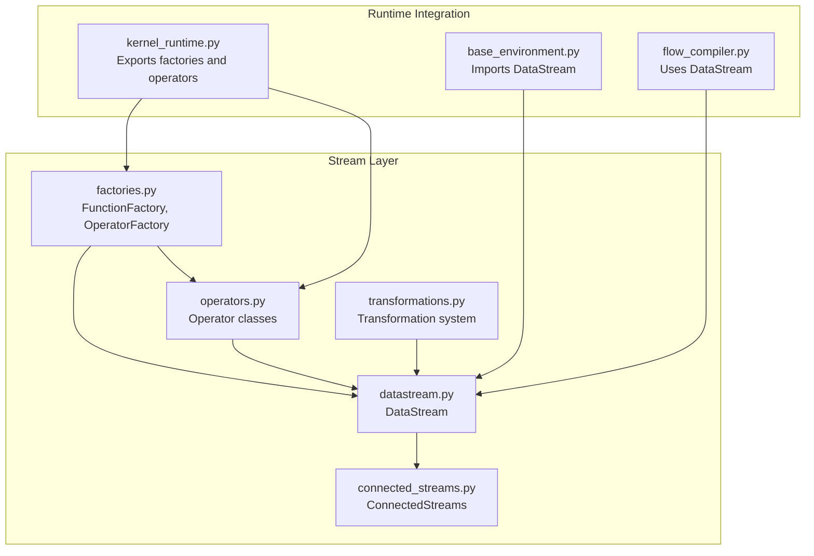
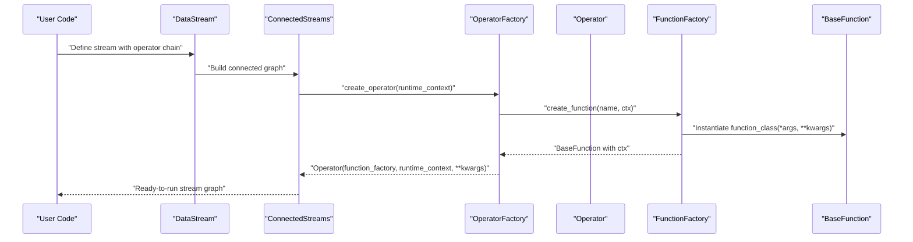
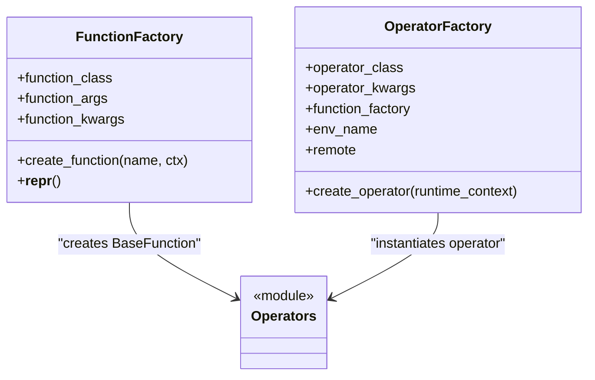
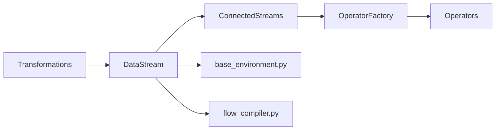
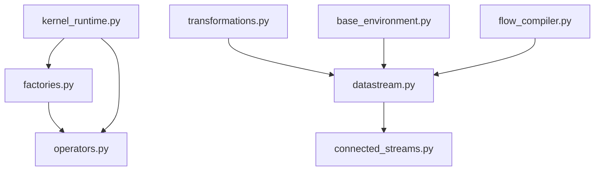

# Factory Patterns

<cite>
**Referenced Files in This Document**
- [factories.py](file://src/sage/stream/factories.py)
- [_kernel_runtime.py](file://src/sage/stream/_kernel_runtime.py)
- [operators.py](file://src/sage/stream/operators.py)
- [datastream.py](file://src/sage/stream/datastream.py)
- [connected_streams.py](file://src/sage/stream/connected_streams.py)
- [transformations.py](file://src/sage/stream/transformations.py)
- [base_environment.py](file://src/sage/runtime/base_environment.py)
- [flow_compiler.py](file://src/sage/runtime/flownet/compiler/flow_compiler.py)
</cite>

## Table of Contents
1. [Introduction](#introduction)
2. [Project Structure](#project-structure)
3. [Core Components](#core-components)
4. [Architecture Overview](#architecture-overview)
5. [Detailed Component Analysis](#detailed-component-analysis)
6. [Dependency Analysis](#dependency-analysis)
7. [Performance Considerations](#performance-considerations)
8. [Troubleshooting Guide](#troubleshooting-guide)
9. [Conclusion](#conclusion)
10. [Appendices](#appendices)

## Introduction
This document explains the Factory Patterns used in SAGE’s Stream Layer to construct operators and DataStream instances. It focuses on how FunctionFactory and OperatorFactory encapsulate operator instantiation, parameterization, and lifecycle wiring, and how these factories integrate with the broader transformation system. The goal is to help both beginners and advanced developers understand how to reliably create, configure, and compose stream operators using factory abstractions.

## Project Structure
The Stream Layer organizes factory logic alongside operator definitions and stream orchestration:

- Factories: define how functions and operators are created and configured
- Operators: concrete streaming primitives (e.g., Map, Filter, FlatMap, Sink, Source)
- Streams: DataStream and ConnectedStreams orchestrate operator graphs
- Transformations: compile-time and runtime transformations that rely on factories

**Diagram sources**
- [factories.py:13-53](file://src/sage/stream/factories.py#L13-L53)
- [operators.py](file://src/sage/stream/operators.py)
- [datastream.py](file://src/sage/stream/datastream.py)
- [connected_streams.py](file://src/sage/stream/connected_streams.py)
- [transformations.py](file://src/sage/stream/transformations.py)
- [_kernel_runtime.py:19-32](file://src/sage/stream/_kernel_runtime.py#L19-L32)
- [base_environment.py:7-31](file://src/sage/runtime/base_environment.py#L7-L31)
- [flow_compiler.py:12](file://src/sage/runtime/flownet/compiler/flow_compiler.py#L12)

**Section sources**
- [factories.py:13-53](file://src/sage/stream/factories.py#L13-L53)
- [_kernel_runtime.py:19-32](file://src/sage/stream/_kernel_runtime.py#L19-L32)
- [operators.py](file://src/sage/stream/operators.py)
- [datastream.py](file://src/sage/stream/datastream.py)
- [connected_streams.py](file://src/sage/stream/connected_streams.py)
- [transformations.py](file://src/sage/stream/transformations.py)
- [base_environment.py:7-31](file://src/sage/runtime/base_environment.py#L7-L31)
- [flow_compiler.py:12](file://src/sage/runtime/flownet/compiler/flow_compiler.py#L12)

## Core Components
- FunctionFactory: encapsulates construction of BaseFunction subclasses with fixed arguments and keyword parameters, injecting runtime context upon creation.
- OperatorFactory: encapsulates construction of operator classes with a FunctionFactory, environment selection, remote execution flag, and operator-specific kwargs.

These factories centralize:
- Parameter validation via constructor arguments
- Consistent wiring of runtime context and function instances
- Reusable operator templates for stream composition

**Section sources**
- [factories.py:13-53](file://src/sage/stream/factories.py#L13-L53)

## Architecture Overview
Factories sit at the center of stream construction, mediating between:
- Transformation definitions (compile-time)
- Runtime operator instantiation (execution-time)
- Stream graph assembly (DataStream and ConnectedStreams)

**Diagram sources**
- [factories.py:24-27](file://src/sage/stream/factories.py#L24-L27)
- [factories.py:48-53](file://src/sage/stream/factories.py#L48-L53)
- [operators.py](file://src/sage/stream/operators.py)
- [datastream.py](file://src/sage/stream/datastream.py)
- [connected_streams.py](file://src/sage/stream/connected_streams.py)

## Detailed Component Analysis

### FunctionFactory
Responsibilities:
- Construct a BaseFunction subclass with fixed positional and keyword arguments
- Inject runtime context into the function instance after creation
- Provide a concise representation for debugging and logging

Key behaviors:
- Arguments are captured at factory construction
- Function creation occurs on demand with a name and runtime TaskContext
- Ensures every created function has access to the current runtime context

Common usage patterns:
- Encapsulate pure or stateless functions with minimal boilerplate
- Share function configurations across multiple operators
- Centralize parameter validation in the function class constructor

Validation and defaults:
- Validates constructor parameters during factory creation
- Defaults to empty kwargs if none provided
- Delegates runtime validation to the BaseFunction subclass

Lifecycle:
- Created once per function template
- Used multiple times to instantiate functions bound to different contexts

**Section sources**
- [factories.py:13-31](file://src/sage/stream/factories.py#L13-L31)

### OperatorFactory
Responsibilities:
- Construct operator instances with a FunctionFactory and runtime context
- Support environment selection and remote execution flags
- Forward operator-specific kwargs to the operator constructor

Key behaviors:
- Captures operator class and kwargs at construction
- Delegates function creation to the embedded FunctionFactory
- Applies environment and remote flags consistently across operator instances

Common usage patterns:
- Template reusable operator configurations
- Compose operators with shared function logic but distinct operator parameters
- Enable environment-aware operator deployment

Validation and defaults:
- Validates operator class and function factory at construction
- Defaults environment to None and remote to False if unspecified
- Delegates operator-specific validation to the operator constructor

Lifecycle:
- Created once per operator template
- Instantiated multiple times with different runtime contexts

**Section sources**
- [factories.py:33-53](file://src/sage/stream/factories.py#L33-L53)

### Relationship to Operators and Streams
- Operators are defined in operators.py and are instantiated by OperatorFactory
- DataStream and ConnectedStreams orchestrate operator graphs and rely on factories for consistent operator creation
- The kernel runtime re-exports factories and operators for convenient imports

**Diagram sources**
- [factories.py:13-53](file://src/sage/stream/factories.py#L13-L53)
- [operators.py](file://src/sage/stream/operators.py)

**Section sources**
- [_kernel_runtime.py:19-32](file://src/sage/stream/_kernel_runtime.py#L19-L32)
- [operators.py](file://src/sage/stream/operators.py)
- [datastream.py](file://src/sage/stream/datastream.py)
- [connected_streams.py](file://src/sage/stream/connected_streams.py)

### Stream Composition and Transformation Integration
- DataStream and ConnectedStreams coordinate operator connections and execution
- Transformations rely on DataStream to assemble operator graphs
- Runtime environment integration pulls in DataStream for execution

**Diagram sources**
- [transformations.py](file://src/sage/stream/transformations.py)
- [datastream.py](file://src/sage/stream/datastream.py)
- [connected_streams.py](file://src/sage/stream/connected_streams.py)
- [base_environment.py:7-31](file://src/sage/runtime/base_environment.py#L7-L31)
- [flow_compiler.py:12](file://src/sage/runtime/flownet/compiler/flow_compiler.py#L12)

**Section sources**
- [transformations.py](file://src/sage/stream/transformations.py)
- [datastream.py](file://src/sage/stream/datastream.py)
- [connected_streams.py](file://src/sage/stream/connected_streams.py)
- [base_environment.py:7-31](file://src/sage/runtime/base_environment.py#L7-L31)
- [flow_compiler.py:12](file://src/sage/runtime/flownet/compiler/flow_compiler.py#L12)

## Dependency Analysis
- factories.py depends on BaseFunction and TaskContext
- _kernel_runtime.py re-exports factories and operators for public consumption
- operators.py defines the operator classes instantiated by factories
- datastream.py and connected_streams.py orchestrate operator graphs
- transformations.py compiles operator graphs into executable streams
- base_environment.py and flow_compiler.py depend on DataStream for runtime orchestration

**Diagram sources**
- [factories.py:13-53](file://src/sage/stream/factories.py#L13-L53)
- [_kernel_runtime.py:19-32](file://src/sage/stream/_kernel_runtime.py#L19-L32)
- [operators.py](file://src/sage/stream/operators.py)
- [datastream.py](file://src/sage/stream/datastream.py)
- [connected_streams.py](file://src/sage/stream/connected_streams.py)
- [transformations.py](file://src/sage/stream/transformations.py)
- [base_environment.py:7-31](file://src/sage/runtime/base_environment.py#L7-L31)
- [flow_compiler.py:12](file://src/sage/runtime/flownet/compiler/flow_compiler.py#L12)

**Section sources**
- [factories.py:13-53](file://src/sage/stream/factories.py#L13-L53)
- [_kernel_runtime.py:19-32](file://src/sage/stream/_kernel_runtime.py#L19-L32)
- [operators.py](file://src/sage/stream/operators.py)
- [datastream.py](file://src/sage/stream/datastream.py)
- [connected_streams.py](file://src/sage/stream/connected_streams.py)
- [transformations.py](file://src/sage/stream/transformations.py)
- [base_environment.py:7-31](file://src/sage/runtime/base_environment.py#L7-L31)
- [flow_compiler.py:12](file://src/sage/runtime/flownet/compiler/flow_compiler.py#L12)

## Performance Considerations
- Factory reuse: Prefer constructing FunctionFactory and OperatorFactory once and reusing them across multiple operator instantiations to avoid repeated argument processing.
- Lazy function creation: FunctionFactory creates functions on demand; defer heavy initialization until create_function is called to minimize startup overhead.
- Minimal allocations: Keep function and operator kwargs minimal and immutable where possible to reduce memory churn.
- Environment and remote flags: Use environment-specific factories judiciously; avoid unnecessary remote execution unless required by operator semantics.

[No sources needed since this section provides general guidance]

## Troubleshooting Guide
Common issues and resolutions:
- Missing runtime context: Ensure FunctionFactory.create_function receives a valid TaskContext; verify that the context is passed through OperatorFactory.create_operator.
- Incorrect operator kwargs: Validate operator constructor signatures; OperatorFactory forwards kwargs directly to the operator class.
- Environment mismatches: Confirm env_name and remote flags align with intended deployment; these flags influence operator behavior and resource allocation.
- Function class compatibility: Verify that function_class derives from BaseFunction and supports the expected interface.

Debugging techniques:
- Inspect factory representations: Use the factory’s string representation to confirm correct configuration.
- Trace operator creation: Log OperatorFactory.create_operator and FunctionFactory.create_function invocations to track instantiation order.
- Validate operator graphs: Use ConnectedStreams to verify operator connections and DataStream to confirm graph readiness.

**Section sources**
- [factories.py:24-27](file://src/sage/stream/factories.py#L24-L27)
- [factories.py:48-53](file://src/sage/stream/factories.py#L48-L53)

## Conclusion
The Factory Patterns in SAGE’s Stream Layer provide a robust, consistent mechanism for creating and configuring operators and functions. FunctionFactory and OperatorFactory encapsulate instantiation logic, parameterization, and context injection, enabling reliable stream composition and execution. By leveraging these factories, developers can build scalable, maintainable stream pipelines while preserving flexibility for customization and environment-specific deployments.

[No sources needed since this section summarizes without analyzing specific files]

## Appendices

### Best Practices for Factory Usage
- Encapsulate shared function logic in FunctionFactory to promote reuse and consistency.
- Use OperatorFactory to define operator templates with consistent environment and remote settings.
- Keep factory kwargs minimal and explicit to improve readability and reduce runtime surprises.
- Validate parameters early in factory construction to surface misconfigurations promptly.

### Extensibility and Custom Factories
- Extend FunctionFactory for specialized function creation patterns (e.g., caching, instrumentation).
- Subclass OperatorFactory for environment-aware operator creation or operator-specific pre/post-processing.
- Integrate custom factories with DataStream and ConnectedStreams by ensuring they conform to expected interfaces.

[No sources needed since this section provides general guidance]