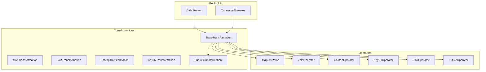
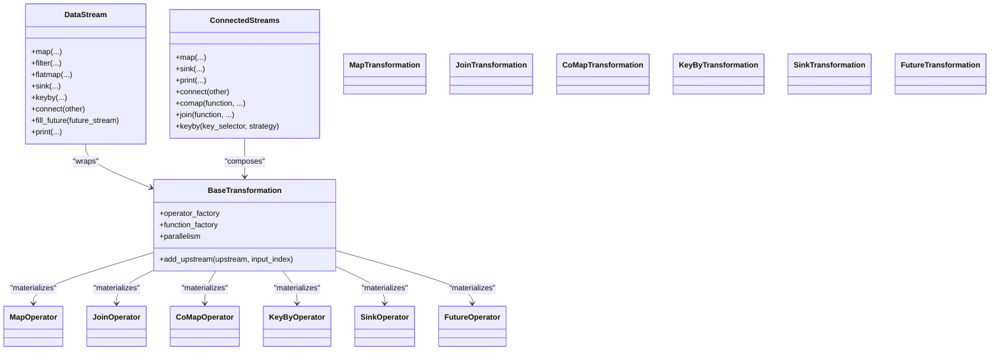
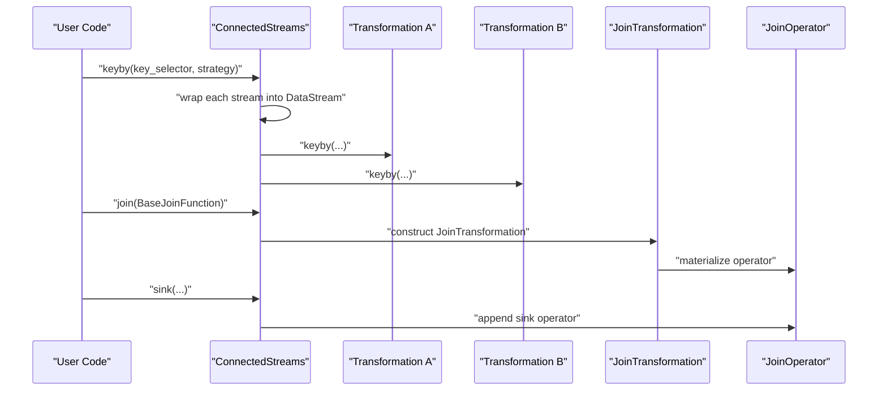
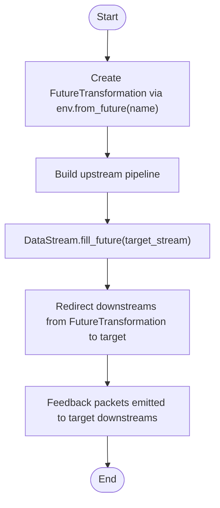
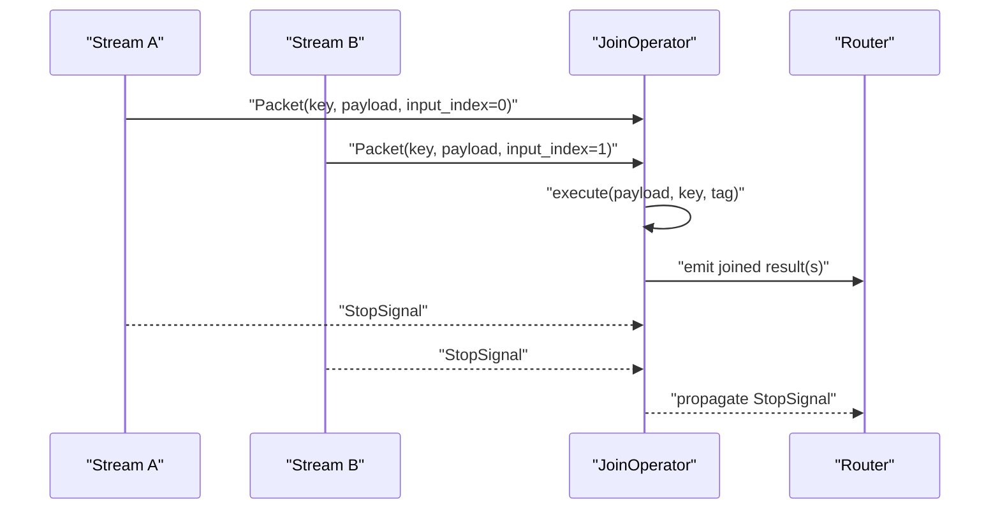
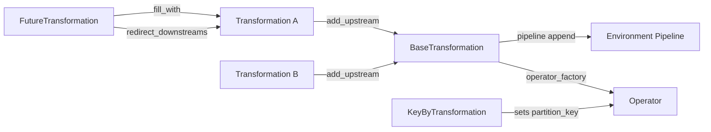
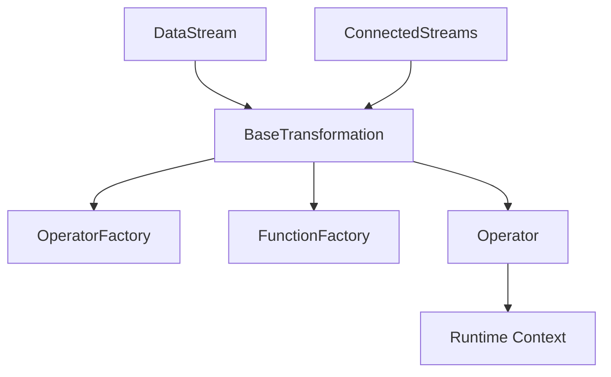

# Multi-Stream Operations

<cite>
**Referenced Files in This Document**
- [connected_streams.py](file://src/sage/stream/connected_streams.py)
- [datastream.py](file://src/sage/stream/datastream.py)
- [operators.py](file://src/sage/stream/operators.py)
- [transformations.py](file://src/sage/stream/transformations.py)
- [factories.py](file://src/sage/stream/factories.py)
- [__init__.py](file://src/sage/stream/__init__.py)
</cite>

## Table of Contents
1. [Introduction](#introduction)
2. [Project Structure](#project-structure)
3. [Core Components](#core-components)
4. [Architecture Overview](#architecture-overview)
5. [Detailed Component Analysis](#detailed-component-analysis)
6. [Dependency Analysis](#dependency-analysis)
7. [Performance Considerations](#performance-considerations)
8. [Troubleshooting Guide](#troubleshooting-guide)
9. [Conclusion](#conclusion)
10. [Appendices](#appendices)

## Introduction
This document explains SAGE’s multi-stream operations with a focus on coordinating multiple data streams via ConnectedStreams and advanced stream composition patterns. It covers how to fuse, synchronize, and jointly process multiple input sources, and how to construct transformation graphs that support stream joining, co-processing, and feedback loops. Practical patterns include stream broadcasting, selective processing, and dynamic composition. Guidance is also provided on performance, resource management, and debugging techniques for robust multi-stream pipelines.

## Project Structure
The stream subsystem centers around two primary abstractions:
- DataStream: a typed wrapper over a single transformation with operator chaining APIs.
- ConnectedStreams: a logical composition of multiple streams enabling join, co-map, and key-based coordination.

Additional supporting pieces:
- Operators: runtime operator implementations for map/filter/flatmap/join/comap/keyby/sink/source and specialized operators for futures and batching.
- Transformations: declarative transformation descriptors that bind functions to operators and manage upstream/downstream relationships.
- Factories: reusable factories to instantiate functions and operators during runtime.

**Diagram sources**
- [datastream.py:26-182](file://src/sage/stream/datastream.py#L26-L182)
- [connected_streams.py:28-207](file://src/sage/stream/connected_streams.py#L28-L207)
- [transformations.py:63-421](file://src/sage/stream/transformations.py#L63-L421)
- [operators.py:41-526](file://src/sage/stream/operators.py#L41-L526)

**Section sources**
- [__init__.py:1-7](file://src/sage/stream/__init__.py#L1-L7)
- [datastream.py:26-182](file://src/sage/stream/datastream.py#L26-L182)
- [connected_streams.py:28-207](file://src/sage/stream/connected_streams.py#L28-L207)
- [transformations.py:63-421](file://src/sage/stream/transformations.py#L63-L421)
- [operators.py:41-526](file://src/sage/stream/operators.py#L41-L526)

## Core Components
- DataStream<T>: Encapsulates a single transformation and exposes map/filter/flatmap/sink/keyby/connect/print plus a feedback mechanism via fill_future().
- ConnectedStreams: Composes multiple transformations into a logical unit, enabling join/co-map operations and keyed coordination across streams.
- Operators: Implementations of runtime behavior for each transformation type, including specialized logic for joins, co-processing, keying, sinks, and futures.
- Transformations: Declarative nodes that carry function classes, parallelism, and upstream/downstream links; they materialize into operators at runtime.
- Factories: Provide consistent instantiation of functions and operators with runtime context.

Key capabilities for multi-stream workflows:
- Join two keyed streams into a single stream using a join function.
- Co-process multiple streams with per-stream map handlers via a comap function.
- Broadcast a stream to multiple downstream consumers using key-based routing.
- Create feedback edges using futures to support iterative algorithms.

**Section sources**
- [datastream.py:26-182](file://src/sage/stream/datastream.py#L26-L182)
- [connected_streams.py:28-207](file://src/sage/stream/connected_streams.py#L28-L207)
- [operators.py:367-526](file://src/sage/stream/operators.py#L367-L526)
- [transformations.py:263-421](file://src/sage/stream/transformations.py#L263-L421)
- [factories.py:13-54](file://src/sage/stream/factories.py#L13-L54)

## Architecture Overview
The multi-stream architecture is a directed acyclic transformation graph:
- Each DataStream or ConnectedStreams corresponds to a BaseTransformation node.
- Upstreams are linked explicitly; downstreams are tracked for routing and lifecycle.
- Operators are created per transformation and operate on packets with optional partition keys.
- Specialized operators implement join semantics, co-processing, and future redirection.

**Diagram sources**
- [datastream.py:26-182](file://src/sage/stream/datastream.py#L26-L182)
- [connected_streams.py:28-207](file://src/sage/stream/connected_streams.py#L28-L207)
- [transformations.py:63-421](file://src/sage/stream/transformations.py#L63-L421)
- [operators.py:107-526](file://src/sage/stream/operators.py#L107-L526)

## Detailed Component Analysis

### ConnectedStreams: Multi-Stream Composition
ConnectedStreams aggregates multiple transformations and enables:
- map/sink/print: apply unary transformations to the composed set.
- connect: concatenate another DataStream or ConnectedStreams to form a larger composition.
- comap: apply a CoMap function that defines per-stream map handlers (e.g., map0, map1, ...).
- join: combine two keyed streams using a Join function.
- keyby: attach key selectors to one or all streams for synchronization and routing.

Operational constraints:
- Requires at least two transformations and consistent environment.
- Validates comap/co-map function signatures and required methods.
- Validates join function type and signature, and ensures both inputs are keyed.

**Diagram sources**
- [connected_streams.py:166-197](file://src/sage/stream/connected_streams.py#L166-L197)
- [connected_streams.py:145-164](file://src/sage/stream/connected_streams.py#L145-L164)
- [transformations.py:263-335](file://src/sage/stream/transformations.py#L263-L335)
- [operators.py:367-459](file://src/sage/stream/operators.py#L367-L459)

**Section sources**
- [connected_streams.py:28-207](file://src/sage/stream/connected_streams.py#L28-L207)
- [transformations.py:263-335](file://src/sage/stream/transformations.py#L263-L335)
- [operators.py:367-459](file://src/sage/stream/operators.py#L367-L459)

### DataStream: Single-Stream Operations and Feedback
DataStream provides unary stream operations and feedback wiring:
- map/filter/flatmap/sink/keyby/connect/print mirror transformation APIs.
- fill_future wires a previously declared future transformation to a concrete transformation, enabling feedback edges.

Feedback loop mechanics:
- A future transformation is created by the environment and marked unfilled.
- The user fills it later with a concrete DataStream transformation.
- Downstreams of the future are redirected to the actual transformation.

**Diagram sources**
- [datastream.py:150-167](file://src/sage/stream/datastream.py#L150-L167)
- [transformations.py:377-421](file://src/sage/stream/transformations.py#L377-L421)
- [operators.py:351-365](file://src/sage/stream/operators.py#L351-L365)

**Section sources**
- [datastream.py:26-182](file://src/sage/stream/datastream.py#L26-L182)
- [transformations.py:377-421](file://src/sage/stream/transformations.py#L377-L421)
- [operators.py:351-365](file://src/sage/stream/operators.py#L351-L365)

### Join and CoMap Operators: Advanced Coordination
- JoinOperator: Requires keyed packets and a join function with execute(payload, key, tag). Emits joined results downstream and coordinates stop signals across both input streams.
- CoMapOperator: Applies per-stream map handlers (map0, map1, ...) based on input_index. Validates function contract and manages stop signal aggregation.

**Diagram sources**
- [operators.py:367-459](file://src/sage/stream/operators.py#L367-L459)
- [operators.py:461-526](file://src/sage/stream/operators.py#L461-L526)

**Section sources**
- [operators.py:367-459](file://src/sage/stream/operators.py#L367-L459)
- [operators.py:461-526](file://src/sage/stream/operators.py#L461-L526)

### Transformation Graph Construction and Routing
- BaseTransformation maintains upstream/downstream links and deduplicates names within the environment pipeline.
- KeyByTransformation sets partition keys and strategies; downstream operators route accordingly.
- FutureTransformation acts as a placeholder that redirects downstreams upon being filled.

**Diagram sources**
- [transformations.py:63-146](file://src/sage/stream/transformations.py#L63-L146)
- [transformations.py:377-421](file://src/sage/stream/transformations.py#L377-L421)
- [operators.py:326-349](file://src/sage/stream/operators.py#L326-L349)

**Section sources**
- [transformations.py:63-146](file://src/sage/stream/transformations.py#L63-L146)
- [operators.py:326-349](file://src/sage/stream/operators.py#L326-L349)

## Dependency Analysis
- DataStream depends on BaseTransformation and operator factories to materialize operators.
- ConnectedStreams composes multiple transformations and enforces function contracts for join/comap.
- Operators depend on function factories and runtime contexts to execute user-defined logic.
- Transformations encapsulate function classes and manage environment-scoped naming and routing.

**Diagram sources**
- [datastream.py:26-182](file://src/sage/stream/datastream.py#L26-L182)
- [connected_streams.py:28-207](file://src/sage/stream/connected_streams.py#L28-L207)
- [transformations.py:63-146](file://src/sage/stream/transformations.py#L63-L146)
- [operators.py:41-105](file://src/sage/stream/operators.py#L41-L105)
- [factories.py:13-54](file://src/sage/stream/factories.py#L13-L54)

**Section sources**
- [datastream.py:26-182](file://src/sage/stream/datastream.py#L26-L182)
- [connected_streams.py:28-207](file://src/sage/stream/connected_streams.py#L28-L207)
- [transformations.py:63-146](file://src/sage/stream/transformations.py#L63-L146)
- [operators.py:41-105](file://src/sage/stream/operators.py#L41-L105)
- [factories.py:13-54](file://src/sage/stream/factories.py#L13-L54)

## Performance Considerations
- Parallelism: Set per-transformation parallelism to scale processing across cores/nodes. Higher parallelism increases throughput but may raise contention and memory usage.
- Batching and Backpressure: Use sink batching and stop-signal propagation to regulate flow and avoid overload.
- Keying and Partitioning: Proper keyby strategies reduce skew and improve parallelization; hash-based partitioning is default but can be tuned.
- Profiling: Enable operator profiling where supported to capture per-operation timing and identify bottlenecks.
- Resource Management: Limit concurrent futures and joins; reuse function instances via factories to reduce overhead.

[No sources needed since this section provides general guidance]

## Troubleshooting Guide
Common issues and resolutions:
- Join requires keyed streams: Ensure each input is keyed before join; otherwise, the transformation validates and raises an error.
- CoMap function contract: Implement required map methods (e.g., map0, map1) and mark the function as a CoMap function.
- Lambda restrictions: Some operations (e.g., comap, keyby) require class-based functions; lambdas are not supported.
- Future already filled: Attempting to fill a future twice raises an error; ensure fill_future is invoked exactly once.
- Stop signal handling: Operators propagate stop signals across streams; verify that all inputs emit stop signals to terminate cleanly.

**Section sources**
- [connected_streams.py:103-143](file://src/sage/stream/connected_streams.py#L103-L143)
- [connected_streams.py:171-174](file://src/sage/stream/connected_streams.py#L171-L174)
- [connected_streams.py:152-158](file://src/sage/stream/connected_streams.py#L152-L158)
- [datastream.py:150-167](file://src/sage/stream/datastream.py#L150-L167)
- [operators.py:367-459](file://src/sage/stream/operators.py#L367-L459)
- [operators.py:461-526](file://src/sage/stream/operators.py#L461-L526)

## Conclusion
SAGE’s multi-stream operations provide a robust framework for complex AI workflows that require data fusion, synchronization, and coordinated processing across multiple input sources. ConnectedStreams and DataStream enable flexible composition, while join and comap operators implement advanced coordination. Feedback edges via futures support iterative algorithms. By leveraging keying, parallelism, and proper stop-signal handling, developers can build scalable and maintainable multi-stream pipelines.

[No sources needed since this section summarizes without analyzing specific files]

## Appendices

### Practical Patterns and Examples
- Ensemble processing: Combine multiple preprocessing streams with a comap function to produce fused features for a single generator.
- Cross-stream correlation: Key streams by a common identifier and join them to correlate events across sources.
- Iterative algorithms: Use fill_future to wire outputs back as inputs, forming feedback loops for refinement cycles.

[No sources needed since this section provides general guidance]