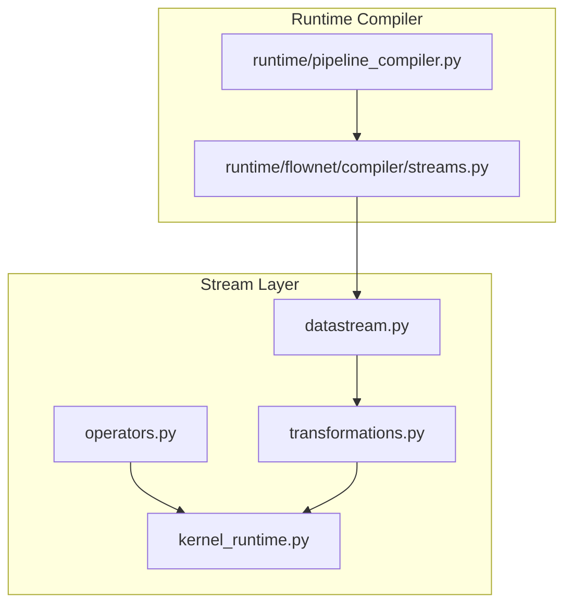
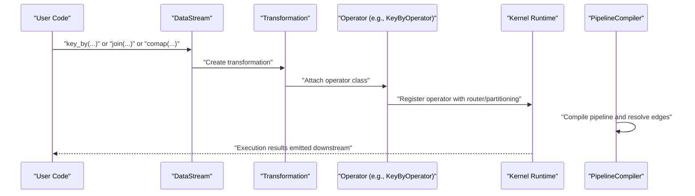
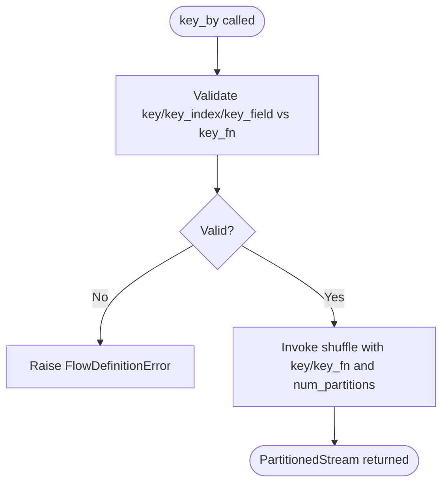
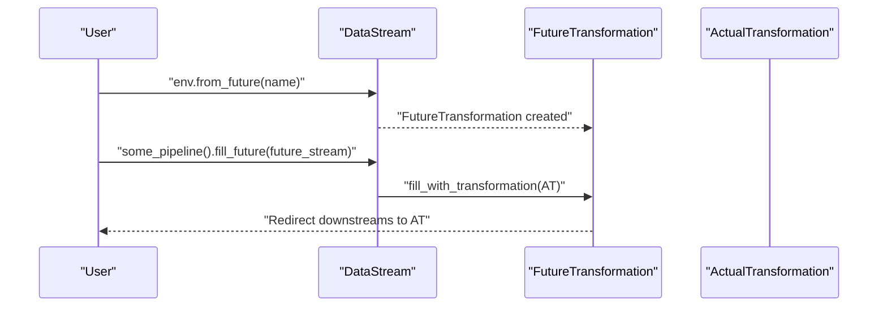
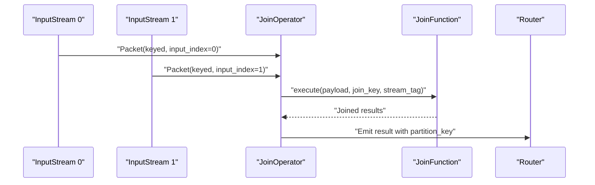
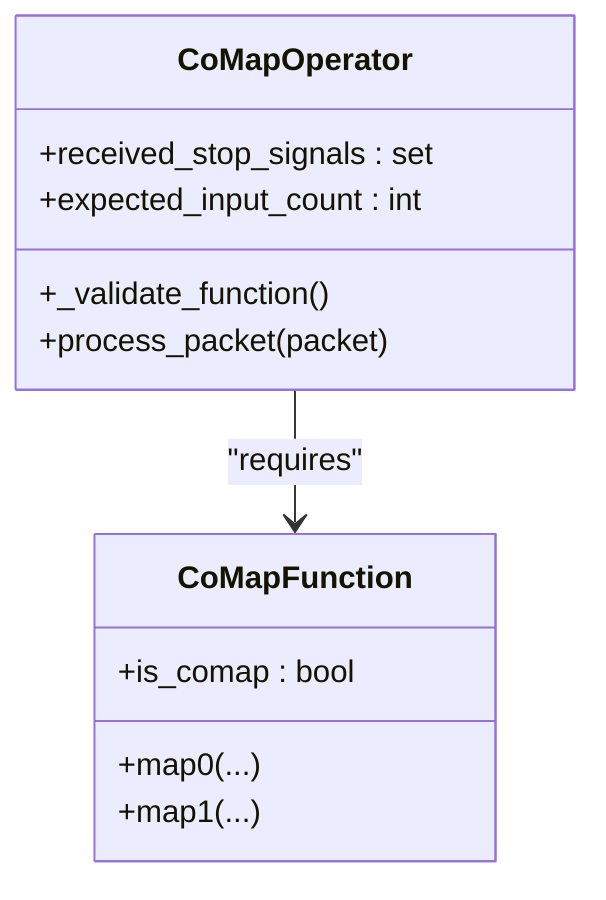
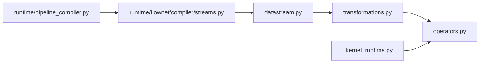

# Advanced Composition Operators

<cite>
**Referenced Files in This Document**
- [operators.py](file://src/sage/stream/operators.py)
- [_kernel_runtime.py](file://src/sage/stream/_kernel_runtime.py)
- [transformations.py](file://src/sage/stream/transformations.py)
- [datastream.py](file://src/sage/stream/datastream.py)
- [streams.py](file://src/sage/runtime/flownet/compiler/streams.py)
- [pipeline_compiler.py](file://src/sage/runtime/pipeline_compiler.py)
</cite>

## Table of Contents
1. [Introduction](#introduction)
2. [Project Structure](#project-structure)
3. [Core Components](#core-components)
4. [Architecture Overview](#architecture-overview)
5. [Detailed Component Analysis](#detailed-component-analysis)
6. [Dependency Analysis](#dependency-analysis)
7. [Performance Considerations](#performance-considerations)
8. [Troubleshooting Guide](#troubleshooting-guide)
9. [Conclusion](#conclusion)

## Introduction
This document focuses on advanced composition operators for complex stream processing in the system. It covers specialized operators for partitioning, batching, deferred execution, and multi-stream coordination. Specifically, it documents:
- KeyByOperator for keyed partitioning and shuffling
- BatchOperator for batch-oriented processing
- FutureOperator for deferred execution and feedback edges
- JoinOperator for multi-input stream joining
- CoMapOperator for coordinated mapping across multiple inputs

It also explains partition strategies, stream coordination, complex data flow patterns, performance implications, memory management, and debugging approaches for multi-stream pipelines.

## Project Structure
The advanced operators live in the stream module and are integrated into the runtime and compiler layers:
- Stream operators and kernels: [operators.py](file://src/sage/stream/operators.py), [_kernel_runtime.py](file://src/sage/stream/_kernel_runtime.py)
- Transformations and futures: [transformations.py](file://src/sage/stream/transformations.py)
- Stream APIs and futures wiring: [datastream.py](file://src/sage/stream/datastream.py)
- Partitioning and multi-input orchestration: [streams.py](file://src/sage/runtime/flownet/compiler/streams.py)
- Pipeline compilation and graph construction: [pipeline_compiler.py](file://src/sage/runtime/pipeline_compiler.py)

**Diagram sources**
- [operators.py:1-60](file://src/sage/stream/operators.py#L1-L60)
- [_kernel_runtime.py:1-32](file://src/sage/stream/_kernel_runtime.py#L1-L32)
- [transformations.py:370-393](file://src/sage/stream/transformations.py#L370-L393)
- [datastream.py:144-181](file://src/sage/stream/datastream.py#L144-L181)
- [streams.py:487-535](file://src/sage/runtime/flownet/compiler/streams.py#L487-L535)
- [pipeline_compiler.py:796-824](file://src/sage/runtime/pipeline_compiler.py#L796-L824)

**Section sources**
- [operators.py:1-60](file://src/sage/stream/operators.py#L1-L60)
- [_kernel_runtime.py:1-32](file://src/sage/stream/_kernel_runtime.py#L1-L32)
- [transformations.py:370-393](file://src/sage/stream/transformations.py#L370-L393)
- [datastream.py:144-181](file://src/sage/stream/datastream.py#L144-L181)
- [streams.py:487-535](file://src/sage/runtime/flownet/compiler/streams.py#L487-L535)
- [pipeline_compiler.py:796-824](file://src/sage/runtime/pipeline_compiler.py#L796-L824)

## Core Components
- KeyByOperator: Partitions and shuffles streams by a key or key function, enabling keyed processing and joins.
- BatchOperator: Supports batch-oriented transformations and aggregation patterns.
- FutureOperator: Defers execution and enables feedback edges via future transformations.
- JoinOperator: Coordinates multi-input joins on a common key, emitting results with preserved partitioning.
- CoMapOperator: Applies coordinated mapping across two or more input streams with synchronized processing.

These operators integrate with the kernel runtime and transformations to form executable stream programs.

**Section sources**
- [_kernel_runtime.py:6-17](file://src/sage/stream/_kernel_runtime.py#L6-L17)
- [operators.py:390-478](file://src/sage/stream/operators.py#L390-L478)
- [transformations.py:377-393](file://src/sage/stream/transformations.py#L377-L393)
- [datastream.py:144-181](file://src/sage/stream/datastream.py#L144-L181)

## Architecture Overview
The advanced operators participate in a layered architecture:
- Stream API constructs transformations and attaches them to DataStream instances.
- PartitionedStream exposes key_by and shuffle-based partitioning.
- Transformations encapsulate operator semantics and future placeholders.
- The pipeline compiler builds the actor graph and manages upstream/downstream edges.

**Diagram sources**
- [streams.py:508-535](file://src/sage/runtime/flownet/compiler/streams.py#L508-L535)
- [datastream.py:144-181](file://src/sage/stream/datastream.py#L144-L181)
- [operators.py:390-478](file://src/sage/stream/operators.py#L390-L478)
- [pipeline_compiler.py:796-824](file://src/sage/runtime/pipeline_compiler.py#L796-L824)

## Detailed Component Analysis

### KeyByOperator: Keyed Partitioning and Shuffling
KeyByOperator enables keyed partitioning of streams. It integrates with PartitionedStream to support:
- Key selection via field/index/key function
- Repartitioning with configurable number of partitions
- Stage-level plans and address hints for placement

Behavior highlights:
- Validates key selection parameters and raises errors when incompatible combinations are used.
- Delegates to shuffle-based partitioning to distribute records by key hash.
- Preserves partition strategy metadata for downstream operators.

**Diagram sources**
- [streams.py:508-535](file://src/sage/runtime/flownet/compiler/streams.py#L508-L535)

**Section sources**
- [streams.py:508-535](file://src/sage/runtime/flownet/compiler/streams.py#L508-L535)

### BatchOperator: Batch Processing Operations
BatchOperator supports batch-oriented processing patterns. Typical use cases include:
- Aggregations requiring bounded windows or thresholds
- Bulk transformations that benefit from reduced per-record overhead

Implementation considerations:
- Integrates with the operator kernel to process batches efficiently.
- Maintains stateful buffers and emits aggregated results according to configured policies.

Note: The operator’s internal mechanics are defined in the operator kernel and are wired through the transformation layer.

**Section sources**
- [_kernel_runtime.py:6-17](file://src/sage/stream/_kernel_runtime.py#L6-L17)
- [operators.py:1-60](file://src/sage/stream/operators.py#L1-L60)

### FutureOperator: Deferred Execution and Feedback Edges
FutureOperator enables deferred execution and feedback edges:
- Futures act as placeholders for transformations that are not yet known.
- Users can “fill” a future later with a concrete transformation, establishing a feedback edge.
- Filling a future redirects downstream edges to the actual operator.

Key behaviors:
- FutureTransformation tracks whether it has been filled and prevents re-filling.
- DataStream.fill_future wires a concrete transformation into a future placeholder.
- Emits a feedback edge log after successful filling.

**Diagram sources**
- [transformations.py:377-393](file://src/sage/stream/transformations.py#L377-L393)
- [datastream.py:144-181](file://src/sage/stream/datastream.py#L144-L181)

**Section sources**
- [transformations.py:377-393](file://src/sage/stream/transformations.py#L377-L393)
- [datastream.py:144-181](file://src/sage/stream/datastream.py#L144-L181)

### JoinOperator: Multi-Stream Stream Joining
JoinOperator coordinates multi-input joins on a common key:
- Accepts packets tagged with input_index and keyed by partition_key.
- Executes a join function per-packet and emits joined results with the same partition_key.
- Emits warnings for non-keyed packets and logs emission failures.

Processing flow:
- Validates keyed packets and extracts join_key and stream_tag.
- Invokes the join function and emits results preserving partitioning.

**Diagram sources**
- [operators.py:390-478](file://src/sage/stream/operators.py#L390-L478)

**Section sources**
- [operators.py:390-478](file://src/sage/stream/operators.py#L390-L478)

### CoMapOperator: Coordinated Mapping Across Multiple Inputs
CoMapOperator applies coordinated mapping across multiple input streams:
- Requires a CoMap function with is_comap=True and methods map0, map1.
- Validates input count against supported_input_count and ensures at least two inputs.
- Tracks stop signals per input and coordinates synchronized processing.

**Diagram sources**
- [operators.py:461-478](file://src/sage/stream/operators.py#L461-L478)
- [transformations.py:367-375](file://src/sage/stream/transformations.py#L367-L375)

**Section sources**
- [operators.py:461-478](file://src/sage/stream/operators.py#L461-L478)
- [transformations.py:367-375](file://src/sage/stream/transformations.py#L367-L375)

## Dependency Analysis
The operators depend on transformations and the kernel runtime. Futures introduce a placeholder mechanism that is resolved during pipeline compilation. Partitioned streams coordinate with shuffle-based partitioning.

**Diagram sources**
- [operators.py:1-60](file://src/sage/stream/operators.py#L1-L60)
- [_kernel_runtime.py:1-32](file://src/sage/stream/_kernel_runtime.py#L1-L32)
- [transformations.py:370-393](file://src/sage/stream/transformations.py#L370-L393)
- [datastream.py:144-181](file://src/sage/stream/datastream.py#L144-L181)
- [streams.py:487-535](file://src/sage/runtime/flownet/compiler/streams.py#L487-L535)
- [pipeline_compiler.py:796-824](file://src/sage/runtime/pipeline_compiler.py#L796-L824)

**Section sources**
- [operators.py:1-60](file://src/sage/stream/operators.py#L1-L60)
- [_kernel_runtime.py:1-32](file://src/sage/stream/_kernel_runtime.py#L1-L32)
- [transformations.py:370-393](file://src/sage/stream/transformations.py#L370-L393)
- [datastream.py:144-181](file://src/sage/stream/datastream.py#L144-L181)
- [streams.py:487-535](file://src/sage/runtime/flownet/compiler/streams.py#L487-L535)
- [pipeline_compiler.py:796-824](file://src/sage/runtime/pipeline_compiler.py#L796-L824)

## Performance Considerations
- Partitioning and shuffling: KeyByOperator leverages shuffle-based partitioning. Tune num_partitions and key distribution to avoid hotspots and ensure balanced workloads.
- Batch processing: BatchOperator reduces per-record overhead but may increase latency; choose batch sizes aligned with downstream consumers.
- Multi-input coordination: JoinOperator and CoMapOperator synchronize on keys and inputs; ensure timely input availability to prevent backpressure.
- Memory management: Futures and multi-input operators can buffer intermediate state; monitor memory usage and apply backpressure or windowing strategies.
- Debugging: Use logging around packet emission and join results to trace data flow and detect misrouted or missing keys.

[No sources needed since this section provides general guidance]

## Troubleshooting Guide
Common issues and remedies:
- Non-keyed packets in JoinOperator: The operator warns and skips non-keyed packets. Ensure upstream key_by or equivalent keyed routing is applied.
- Future already filled: Attempting to fill a future twice raises an error. Verify single-fill semantics and correct placeholder wiring.
- CoMap function validation: Missing is_comap or required mapN methods cause errors. Ensure the function adheres to the CoMap contract.
- Multi-input validation: CoMap requires at least two inputs and does not exceed supported_input_count. Adjust the number of connected streams accordingly.

**Section sources**
- [operators.py:390-478](file://src/sage/stream/operators.py#L390-L478)
- [transformations.py:367-393](file://src/sage/stream/transformations.py#L367-L393)
- [datastream.py:144-181](file://src/sage/stream/datastream.py#L144-L181)

## Conclusion
Advanced composition operators enable sophisticated stream processing patterns:
- KeyByOperator for keyed partitioning and shuffling
- BatchOperator for batch-oriented processing
- FutureOperator for deferred execution and feedback edges
- JoinOperator for multi-input joins
- CoMapOperator for coordinated multi-input mapping

Understanding partition strategies, stream coordination, and complex data flows helps build scalable and maintainable stream pipelines. Apply the performance and troubleshooting guidance to manage large datasets and debug multi-stream compositions effectively.