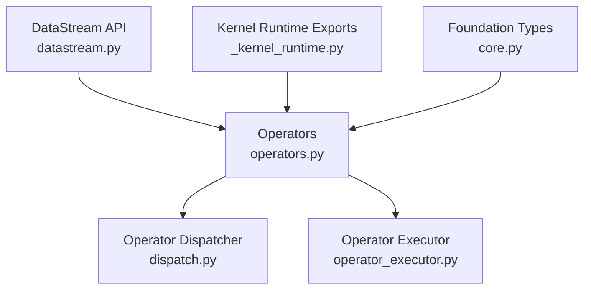
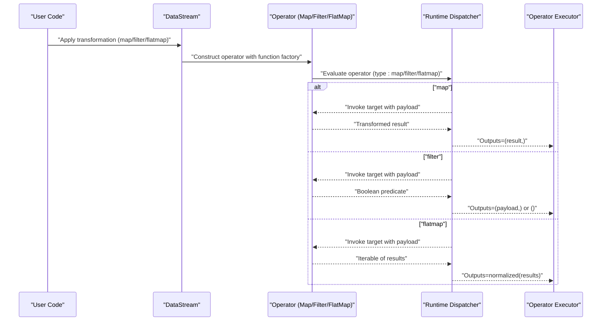
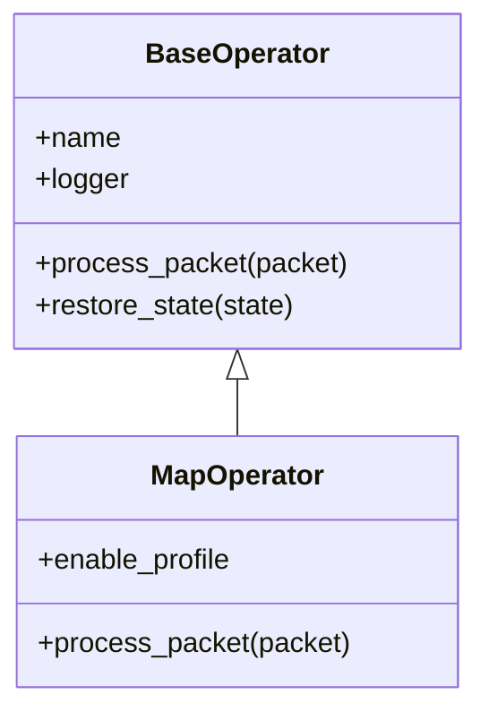
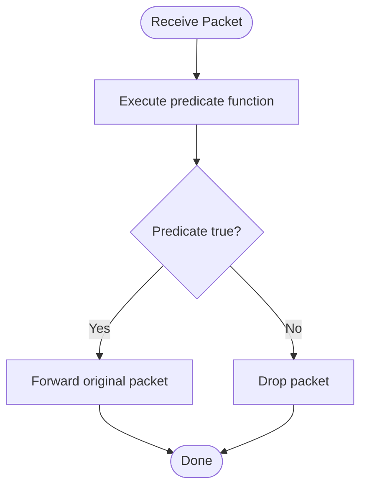
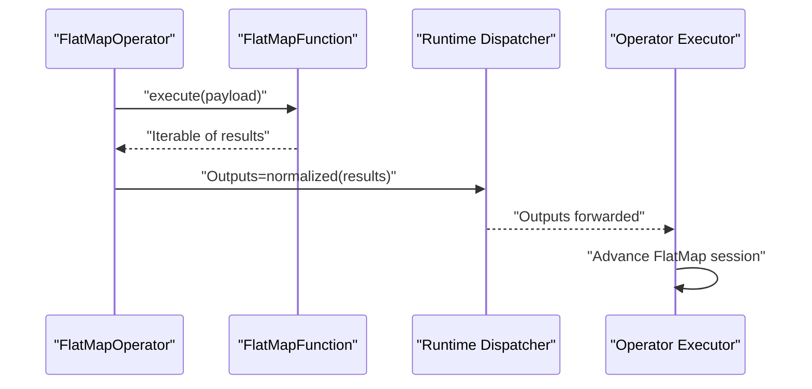
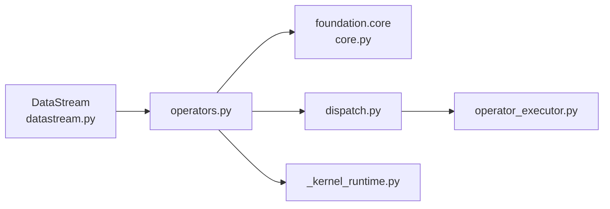

# Basic Transform Operators

<cite>
**Referenced Files in This Document**
- [operators.py](file://src/sage/stream/operators.py)
- [datastream.py](file://src/sage/stream/datastream.py)
- [dispatch.py](file://src/sage/runtime/flownet/runtime/operator_runtime/dispatch.py)
- [_kernel_runtime.py](file://src/sage/stream/_kernel_runtime.py)
- [operator_executor.py](file://src/sage/runtime/flownet/runtime/flowengine/operator_executor.py)
- [core.py](file://src/sage/foundation/core.py)
</cite>

## Table of Contents
1. [Introduction](#introduction)
2. [Project Structure](#project-structure)
3. [Core Components](#core-components)
4. [Architecture Overview](#architecture-overview)
5. [Detailed Component Analysis](#detailed-component-analysis)
6. [Dependency Analysis](#dependency-analysis)
7. [Performance Considerations](#performance-considerations)
8. [Troubleshooting Guide](#troubleshooting-guide)
9. [Conclusion](#conclusion)
10. [Appendices](#appendices)

## Introduction
This document explains the Basic Transform Operators used for simple data transformations in the streaming runtime. It focuses on three fundamental operators:
- MapOperator: element-wise transformations
- FilterOperator: conditional filtering
- FlatMapOperator: one-to-many transformations

It covers implementation patterns, parameter handling, result processing, practical examples for building custom transformation functions, performance and memory considerations, common use cases, and troubleshooting guidance.

## Project Structure
The Basic Transform Operators are implemented in the stream module and integrated into the runtime evaluation pipeline. Key locations:
- Stream operator definitions and processing logic
- Stream API surface for constructing transformations
- Runtime dispatcher that evaluates operator types
- Kernel runtime exports for operator classes
- Flow engine operator executor for FlatMap scoping and iteration
- Foundation core types for function abstractions

**Diagram sources**
- [datastream.py:69-101](file://src/sage/stream/datastream.py#L69-L101)
- [operators.py:106-214](file://src/sage/stream/operators.py#L106-L214)
- [_kernel_runtime.py:1-32](file://src/sage/stream/_kernel_runtime.py#L1-L32)
- [dispatch.py:35-70](file://src/sage/runtime/flownet/runtime/operator_runtime/dispatch.py#L35-L70)
- [operator_executor.py:265-298](file://src/sage/runtime/flownet/runtime/flowengine/operator_executor.py#L265-L298)
- [core.py:315-334](file://src/sage/foundation/core.py#L315-L334)

**Section sources**
- [datastream.py:69-101](file://src/sage/stream/datastream.py#L69-L101)
- [operators.py:106-214](file://src/sage/stream/operators.py#L106-L214)
- [_kernel_runtime.py:1-32](file://src/sage/stream/_kernel_runtime.py#L1-L32)
- [dispatch.py:35-70](file://src/sage/runtime/flownet/runtime/operator_runtime/dispatch.py#L35-L70)
- [operator_executor.py:265-298](file://src/sage/runtime/flownet/runtime/flowengine/operator_executor.py#L265-L298)
- [core.py:315-334](file://src/sage/foundation/core.py#L315-L334)

## Core Components
This section outlines the three operators and their roles:
- MapOperator: Applies a per-element transformation and forwards the transformed item downstream.
- FilterOperator: Evaluates a predicate per element and forwards only those items that satisfy the condition.
- FlatMapOperator: Produces zero or more outputs per input element, expanding the stream.

Implementation highlights:
- Operators inherit from a common BaseOperator and integrate with a FunctionFactory and router for output distribution.
- The runtime dispatcher recognizes operator types and invokes the appropriate evaluation path.
- FlatMapOperator supports a Collector pattern to emit multiple outputs per input.

**Section sources**
- [operators.py:106-214](file://src/sage/stream/operators.py#L106-L214)
- [dispatch.py:35-70](file://src/sage/runtime/flownet/runtime/operator_runtime/dispatch.py#L35-L70)
- [operator_executor.py:265-298](file://src/sage/runtime/flownet/runtime/flowengine/operator_executor.py#L265-L298)

## Architecture Overview
The operator lifecycle spans the stream API, operator classes, runtime dispatcher, and executor:

**Diagram sources**
- [datastream.py:69-101](file://src/sage/stream/datastream.py#L69-L101)
- [operators.py:106-214](file://src/sage/stream/operators.py#L106-L214)
- [dispatch.py:35-70](file://src/sage/runtime/flownet/runtime/operator_runtime/dispatch.py#L35-L70)
- [operator_executor.py:265-298](file://src/sage/runtime/flownet/runtime/flowengine/operator_executor.py#L265-L298)

## Detailed Component Analysis

### MapOperator
Purpose:
- Performs element-wise transformation of stream items.

Key behaviors:
- Delegates transformation to the underlying function via the function factory.
- Forwards the transformed item downstream.

Implementation patterns:
- Inherits from BaseOperator and integrates with router for output emission.
- Supports optional profiling hooks for timing.

Parameter handling:
- Accepts a function_factory and TaskContext.
- Optional enable_profile flag for timing instrumentation.

Result processing:
- The runtime dispatcher captures the single transformed result and emits it as a single-item output tuple.

Practical example patterns:
- Implement a MapFunction subclass or use a lambda-wrapped function to define the transformation.
- Handle different data types by ensuring the function signature matches the expected input type.

State management:
- BaseOperator supports restoring function state and operator attributes from persisted state.

Common use cases:
- Data cleaning (normalizing types, trimming whitespace).
- Validation (producing derived metrics or flags).
- Enrichment (joining with external metadata).
- Restructuring (renaming fields, flattening nested structures).

**Diagram sources**
- [operators.py:79-120](file://src/sage/stream/operators.py#L79-L120)
- [operators.py:106-120](file://src/sage/stream/operators.py#L106-L120)

**Section sources**
- [operators.py:79-120](file://src/sage/stream/operators.py#L79-L120)
- [operators.py:106-120](file://src/sage/stream/operators.py#L106-L120)
- [dispatch.py:35-52](file://src/sage/runtime/flownet/runtime/operator_runtime/dispatch.py#L35-L52)
- [core.py:315-334](file://src/sage/foundation/core.py#L315-L334)

### FilterOperator
Purpose:
- Filters stream items based on a predicate.

Key behaviors:
- Executes the function against each payload.
- Sends the original packet downstream if the predicate is true; otherwise drops it silently.

Parameter handling:
- Uses the function factory to evaluate the predicate.
- Operates on Packet payloads.

Result processing:
- The runtime dispatcher evaluates the boolean result and either forwards the original payload or emits no output.

Practical example patterns:
- Define a FilterFunction that returns a truthy value for items to keep.
- Combine with map to first transform and then filter.

State management:
- Inherits state restoration from BaseOperator.

Common use cases:
- Data cleaning (removing nulls, invalid entries).
- Validation (excluding out-of-range values).
- Sampling (keeping items that meet a probabilistic condition).

**Diagram sources**
- [operators.py:195-207](file://src/sage/stream/operators.py#L195-L207)
- [dispatch.py:54-56](file://src/sage/runtime/flownet/runtime/operator_runtime/dispatch.py#L54-L56)

**Section sources**
- [operators.py:195-207](file://src/sage/stream/operators.py#L195-L207)
- [dispatch.py:54-56](file://src/sage/runtime/flownet/runtime/operator_runtime/dispatch.py#L54-L56)

### FlatMapOperator
Purpose:
- Produces zero or more outputs per input item, enabling one-to-many transformations.

Key behaviors:
- Invokes the function to produce an iterable of results.
- Normalizes the iterable into multiple outputs and forwards them downstream.
- Integrates with a Collector to support emitting multiple items per input.

Implementation patterns:
- If the function is a FlatMapFunction, injects a Collector to capture emitted items.
- The runtime dispatcher normalizes the returned iterable into a tuple of outputs.

Parameter handling:
- Accepts a function_factory and TaskContext.
- Supports parallelism via the DataStream API.

Result processing:
- The runtime dispatcher receives the iterable result and expands it into multiple outputs.

Scoping and iteration:
- The operator executor manages FlatMap sessions, advancing per-item outputs and controlling continuation.

Practical example patterns:
- Emit multiple records from a single input (e.g., split lines, explode arrays).
- Use Collector to push intermediate results during computation.

State management:
- Inherits state restoration from BaseOperator.

Common use cases:
- Tokenization and splitting.
- Exploding nested arrays or JSON objects.
- Multi-output enrichment (e.g., generating multiple variants of an item).

**Diagram sources**
- [operators.py:209-214](file://src/sage/stream/operators.py#L209-L214)
- [dispatch.py:58-60](file://src/sage/runtime/flownet/runtime/operator_runtime/dispatch.py#L58-L60)
- [operator_executor.py:265-298](file://src/sage/runtime/flownet/runtime/flowengine/operator_executor.py#L265-L298)

**Section sources**
- [operators.py:209-214](file://src/sage/stream/operators.py#L209-L214)
- [dispatch.py:58-60](file://src/sage/runtime/flownet/runtime/operator_runtime/dispatch.py#L58-L60)
- [operator_executor.py:265-298](file://src/sage/runtime/flownet/runtime/flowengine/operator_executor.py#L265-L298)

## Dependency Analysis
The operators depend on shared abstractions and are wired through the runtime:

- DataStream constructs operator transformations and wraps lambdas when needed.
- operators.py defines BaseOperator and the three concrete operators.
- foundation.core provides BaseFunction, MapFunction, FilterFunction, FlatMapFunction, and Collector.
- dispatch.py evaluates operator types and invokes targets.
- operator_executor.py coordinates FlatMap session advancement.
- _kernel_runtime.py re-exports operator classes for kernel usage.

**Diagram sources**
- [datastream.py:69-101](file://src/sage/stream/datastream.py#L69-L101)
- [operators.py:106-214](file://src/sage/stream/operators.py#L106-L214)
- [core.py:315-334](file://src/sage/foundation/core.py#L315-L334)
- [dispatch.py:35-70](file://src/sage/runtime/flownet/runtime/operator_runtime/dispatch.py#L35-L70)
- [operator_executor.py:265-298](file://src/sage/runtime/flownet/runtime/flowengine/operator_executor.py#L265-L298)
- [_kernel_runtime.py:1-32](file://src/sage/stream/_kernel_runtime.py#L1-L32)

**Section sources**
- [datastream.py:69-101](file://src/sage/stream/datastream.py#L69-L101)
- [operators.py:106-214](file://src/sage/stream/operators.py#L106-L214)
- [core.py:315-334](file://src/sage/foundation/core.py#L315-L334)
- [dispatch.py:35-70](file://src/sage/runtime/flownet/runtime/operator_runtime/dispatch.py#L35-L70)
- [operator_executor.py:265-298](file://src/sage/runtime/flownet/runtime/flowengine/operator_executor.py#L265-L298)
- [_kernel_runtime.py:1-32](file://src/sage/stream/_kernel_runtime.py#L1-L32)

## Performance Considerations
- Throughput and latency:
  - MapOperator and FilterOperator operate per-item with minimal overhead; keep transformations pure and efficient.
  - FlatMapOperator can increase output volume; consider limiting fan-out and batching downstream work.
- Memory usage:
  - FlatMapOperator may accumulate intermediate outputs; ensure functions avoid retaining large closures or buffers.
  - Collector-based FlatMapFunction can help manage incremental emissions.
- Parallelism:
  - DataStream exposes a parallelism parameter for transformations; tune based on CPU-bound vs I/O-bound workloads.
- Serialization and routing:
  - Router sends packets; minimize expensive serialization in payloads.
- Profiling:
  - MapOperator supports optional profiling hooks to record timing; use for hot-spot identification.

[No sources needed since this section provides general guidance]

## Troubleshooting Guide
Common issues and remedies:
- Empty or None payloads:
  - FilterOperator logs a debug message when receiving empty packets; ensure upstream transformations do not drop required data.
- Exceptions in operator processing:
  - All operators log errors via their logger; inspect logs for operator name and stack traces.
- FlatMap contract violations:
  - FlatMap functions must return an iterable; ensure the function returns a list, generator, or similar.
- State restoration failures:
  - BaseOperator attempts to restore function state and operator attributes; warnings indicate partial or failed restoration.

Debugging techniques:
- Enable operator-level logging to trace packet flow and decisions.
- For FlatMap, verify session advancement and output emission via the operator executor.
- Validate function signatures match expected input types to prevent runtime errors.

**Section sources**
- [operators.py:195-207](file://src/sage/stream/operators.py#L195-L207)
- [operators.py:209-214](file://src/sage/stream/operators.py#L209-L214)
- [operators.py:79-96](file://src/sage/stream/operators.py#L79-L96)

## Conclusion
MapOperator, FilterOperator, and FlatMapOperator form the backbone of simple data transformations in the streaming runtime. They share a common operator framework, integrate with function abstractions, and are evaluated by a dedicated dispatcher. By understanding their implementation patterns, parameter handling, and result processing, you can implement robust custom transformations, optimize performance, and troubleshoot effectively.

[No sources needed since this section summarizes without analyzing specific files]

## Appendices

### Practical Example Patterns
- Implementing a custom MapFunction:
  - Define a function that transforms a single input into a single output; register it via the function factory.
- Implementing a custom FilterFunction:
  - Define a function that returns a boolean indicating whether to keep the input; combine with map for preprocessing.
- Implementing a custom FlatMapFunction:
  - Define a function that yields multiple outputs per input; optionally use Collector for incremental emissions.

**Section sources**
- [core.py:315-334](file://src/sage/foundation/core.py#L315-L334)
- [operators.py:106-120](file://src/sage/stream/operators.py#L106-L120)
- [operators.py:195-207](file://src/sage/stream/operators.py#L195-L207)
- [operators.py:209-214](file://src/sage/stream/operators.py#L209-L214)