# Core Operator Concepts

<cite>
**Referenced Files in This Document**
- [operators.py](file://src/sage/stream/operators.py)
- [_kernel_runtime.py](file://src/sage/stream/_kernel_runtime.py)
- [_kernel_bindings.py](file://src/sage/stream/_kernel_bindings.py)
- [_runtime_kernel_types.py](file://src/sage/stream/_runtime_kernel_types.py)
- [operator_runtime.py](file://src/sage/runtime/flownet/runtime/flowengine/operator_runtime.py)
- [engine.py](file://src/sage/runtime/flownet/runtime/flowengine/engine.py)
- [operator_executor.py](file://src/sage/runtime/flownet/runtime/flowengine/operator_executor.py)
- [flow_process_execution.py](file://src/sage/runtime/flownet/runtime/flowengine/flow_process_execution.py)
- [execution_context.py](file://src/sage/runtime/flownet/runtime/actors/execution_context.py)
- [task_runtime.py](file://src/sage/runtime/flownet/runtime/actors/task_runtime.py)
- [comm_bridge.py](file://src/sage/runtime/flownet/runtime/comm/comm_bridge.py)
- [router.py](file://src/sage/runtime/flownet/runtime/comm/router.py)
- [routing.py](file://src/sage/runtime/flownet/runtime/operator_runtime/routing.py)
- [stateful.py](file://src/sage/runtime/flownet/runtime/operator_runtime/stateful.py)
- [models.py](file://src/sage/runtime/flownet/runtime/operator_runtime/models.py)
- [errors.py](file://src/sage/runtime/flownet/runtime/operator_runtime/errors.py)
- [runtime_telemetry_contract.py](file://src/sage/runtime/flownet/contracts/runtime_telemetry_contract.py)
- [runtime_state_query_contract.py](file://src/sage/runtime/flownet/contracts/runtime_state_query_contract.py)
</cite>

## Table of Contents
1. [Introduction](#introduction)
2. [Project Structure](#project-structure)
3. [Core Components](#core-components)
4. [Architecture Overview](#architecture-overview)
5. [Detailed Component Analysis](#detailed-component-analysis)
6. [Dependency Analysis](#dependency-analysis)
7. [Performance Considerations](#performance-considerations)
8. [Troubleshooting Guide](#troubleshooting-guide)
9. [Conclusion](#conclusion)

## Introduction
This document explains the foundational principles of SAGE’s operator-based stream processing model. It focuses on the BaseOperator class architecture, operator lifecycle, and the packet-based data flow system. It documents operator initialization, the function factory pattern, and task context integration. It also covers operator responsibilities for packet reception, processing, and routing, and describes how operators interact with the kernel runtime, the collector system, and routing mechanisms. Practical examples illustrate instantiation, packet handling patterns, and state management. Finally, it addresses operator profiling, error handling strategies, performance monitoring, best practices, and common pitfalls.

## Project Structure
SAGE organizes operator-related logic across two primary layers:
- Stream layer: Defines operator abstractions and kernel runtime bindings for packet-based processing.
- Runtime layer: Implements the operator execution engine, routing, stateful processing, and telemetry contracts.

Key modules:
- Stream operators and kernel runtime bindings
- Flow engine operator runtime and execution orchestration
- Communication bridge and router for inter-operator messaging
- Stateful operator support and routing utilities
- Telemetry and runtime state contracts

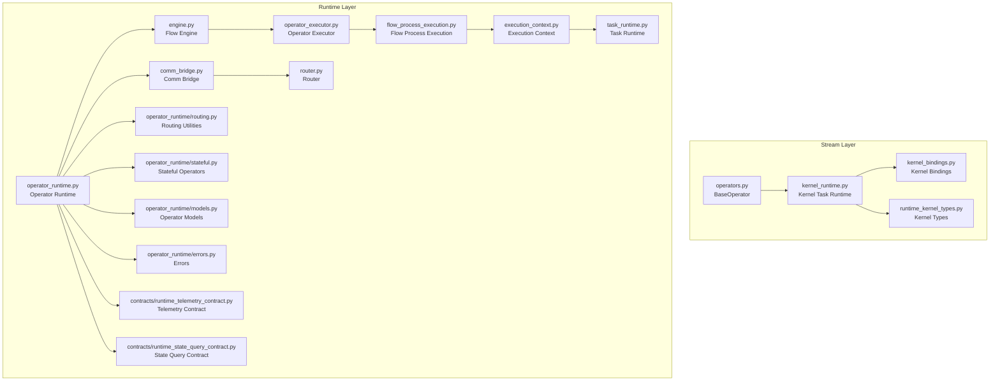

**Diagram sources**
- [operators.py](file://src/sage/stream/operators.py)
- [_kernel_runtime.py](file://src/sage/stream/_kernel_runtime.py)
- [_kernel_bindings.py](file://src/sage/stream/_kernel_bindings.py)
- [_runtime_kernel_types.py](file://src/sage/stream/_runtime_kernel_types.py)
- [operator_runtime.py](file://src/sage/runtime/flownet/runtime/flowengine/operator_runtime.py)
- [engine.py](file://src/sage/runtime/flownet/runtime/flowengine/engine.py)
- [operator_executor.py](file://src/sage/runtime/flownet/runtime/flowengine/operator_executor.py)
- [flow_process_execution.py](file://src/sage/runtime/flownet/runtime/flowengine/flow_process_execution.py)
- [execution_context.py](file://src/sage/runtime/flownet/runtime/actors/execution_context.py)
- [task_runtime.py](file://src/sage/runtime/flownet/runtime/actors/task_runtime.py)
- [comm_bridge.py](file://src/sage/runtime/flownet/runtime/comm/comm_bridge.py)
- [router.py](file://src/sage/runtime/flownet/runtime/comm/router.py)
- [routing.py](file://src/sage/runtime/flownet/runtime/operator_runtime/routing.py)
- [stateful.py](file://src/sage/runtime/flownet/runtime/operator_runtime/stateful.py)
- [models.py](file://src/sage/runtime/flownet/runtime/operator_runtime/models.py)
- [errors.py](file://src/sage/runtime/flownet/runtime/operator_runtime/errors.py)
- [runtime_telemetry_contract.py](file://src/sage/runtime/flownet/contracts/runtime_telemetry_contract.py)
- [runtime_state_query_contract.py](file://src/sage/runtime/flownet/contracts/runtime_state_query_contract.py)

**Section sources**
- [operators.py](file://src/sage/stream/operators.py)
- [_kernel_runtime.py](file://src/sage/stream/_kernel_runtime.py)
- [_kernel_bindings.py](file://src/sage/stream/_kernel_bindings.py)
- [_runtime_kernel_types.py](file://src/sage/stream/_runtime_kernel_types.py)
- [operator_runtime.py](file://src/sage/runtime/flownet/runtime/flowengine/operator_runtime.py)
- [engine.py](file://src/sage/runtime/flownet/runtime/flowengine/engine.py)
- [operator_executor.py](file://src/sage/runtime/flownet/runtime/flowengine/operator_executor.py)
- [flow_process_execution.py](file://src/sage/runtime/flownet/runtime/flowengine/flow_process_execution.py)
- [execution_context.py](file://src/sage/runtime/flownet/runtime/actors/execution_context.py)
- [task_runtime.py](file://src/sage/runtime/flownet/runtime/actors/task_runtime.py)
- [comm_bridge.py](file://src/sage/runtime/flownet/runtime/comm/comm_bridge.py)
- [router.py](file://src/sage/runtime/flownet/runtime/comm/router.py)
- [routing.py](file://src/sage/runtime/flownet/runtime/operator_runtime/routing.py)
- [stateful.py](file://src/sage/runtime/flownet/runtime/operator_runtime/stateful.py)
- [models.py](file://src/sage/runtime/flownet/runtime/operator_runtime/models.py)
- [errors.py](file://src/sage/runtime/flownet/runtime/operator_runtime/errors.py)
- [runtime_telemetry_contract.py](file://src/sage/runtime/flownet/contracts/runtime_telemetry_contract.py)
- [runtime_state_query_contract.py](file://src/sage/runtime/flownet/contracts/runtime_state_query_contract.py)

## Core Components
- BaseOperator: The abstract base class defining the operator contract for packet-based stream processing. It integrates with the kernel runtime task/context and exposes lifecycle hooks for initialization, processing, and shutdown.
- Kernel Runtime: Provides the execution environment for operators, including task scheduling, context injection, and packet delivery semantics.
- Operator Runtime: Orchestrates operator execution, manages routing, and coordinates with the communication bridge and router.
- Stateful Operators: Support persistent state across packets and lifecycle events.
- Routing Utilities: Define how operators route packets to downstream consumers.
- Telemetry Contracts: Expose runtime telemetry and state query capabilities for profiling and monitoring.

**Section sources**
- [operators.py](file://src/sage/stream/operators.py)
- [_kernel_runtime.py](file://src/sage/stream/_kernel_runtime.py)
- [operator_runtime.py](file://src/sage/runtime/flownet/runtime/flowengine/operator_runtime.py)
- [stateful.py](file://src/sage/runtime/flownet/runtime/operator_runtime/stateful.py)
- [routing.py](file://src/sage/runtime/flownet/runtime/operator_runtime/routing.py)
- [runtime_telemetry_contract.py](file://src/sage/runtime/flownet/contracts/runtime_telemetry_contract.py)
- [runtime_state_query_contract.py](file://src/sage/runtime/flownet/contracts/runtime_state_query_contract.py)

## Architecture Overview
The operator model is built around packet-based processing with explicit lifecycle stages. Operators receive packets via the kernel runtime, process them according to their implementation, and route outputs to downstream operators through the communication bridge and router. The flow engine coordinates execution, while telemetry contracts enable profiling and monitoring.

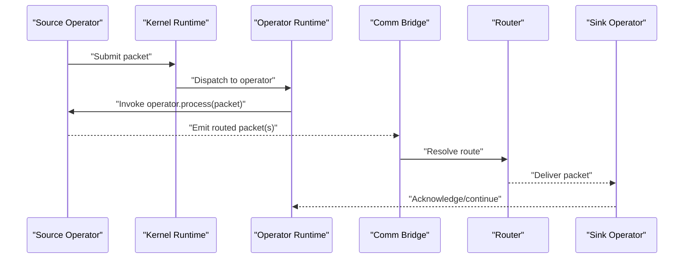

**Diagram sources**
- [_kernel_runtime.py](file://src/sage/stream/_kernel_runtime.py)
- [operator_runtime.py](file://src/sage/runtime/flownet/runtime/flowengine/operator_runtime.py)
- [comm_bridge.py](file://src/sage/runtime/flownet/runtime/comm/comm_bridge.py)
- [router.py](file://src/sage/runtime/flownet/runtime/comm/router.py)

## Detailed Component Analysis

### BaseOperator Class Architecture
BaseOperator defines the operator contract for packet-based stream processing. It integrates with the kernel runtime task/context and exposes lifecycle hooks for initialization, processing, and shutdown. Operators can leverage the function factory pattern to construct processing logic and integrate with the task context for execution.

Key responsibilities:
- Initialization: Prepare resources and context before processing begins.
- Packet reception: Receive incoming packets from upstream operators.
- Processing: Transform or forward packets according to operator logic.
- Routing: Emit packets to downstream operators via the communication bridge.
- Shutdown: Release resources and finalize state.

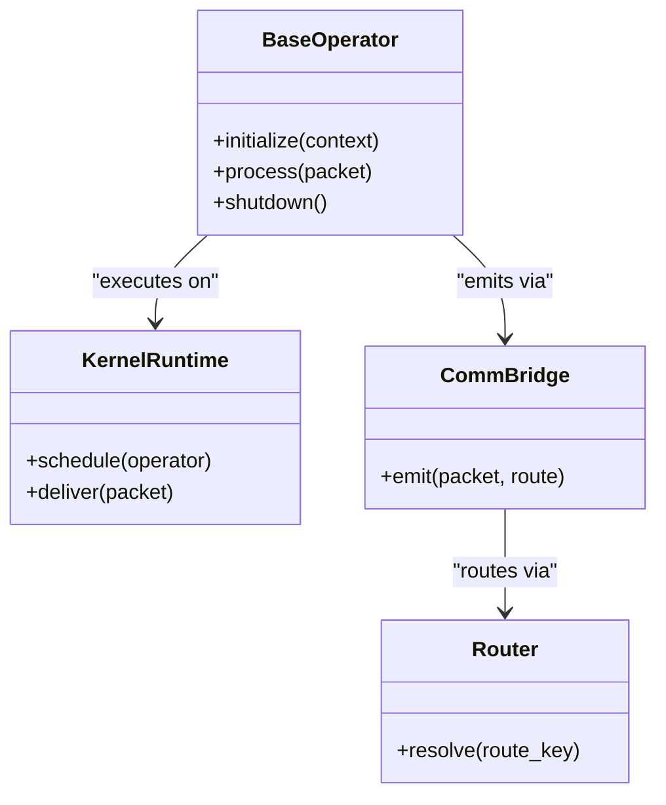

**Diagram sources**
- [operators.py](file://src/sage/stream/operators.py)
- [_kernel_runtime.py](file://src/sage/stream/_kernel_runtime.py)
- [comm_bridge.py](file://src/sage/runtime/flownet/runtime/comm/comm_bridge.py)
- [router.py](file://src/sage/runtime/flownet/runtime/comm/router.py)

**Section sources**
- [operators.py](file://src/sage/stream/operators.py)
- [_kernel_runtime.py](file://src/sage/stream/_kernel_runtime.py)
- [comm_bridge.py](file://src/sage/runtime/flownet/runtime/comm/comm_bridge.py)
- [router.py](file://src/sage/runtime/flownet/runtime/comm/router.py)

### Operator Lifecycle and Initialization
Operators are initialized within the kernel runtime task context. The initialization phase prepares resources and registers the operator with the runtime. The function factory pattern enables dynamic construction of operator logic, allowing operators to adapt to runtime conditions and configuration.

Lifecycle stages:
- Initialization: Allocate resources, bind to kernel runtime, and register with the operator runtime.
- Execution: Process packets received from upstream operators.
- Shutdown: Finalize state and release resources.

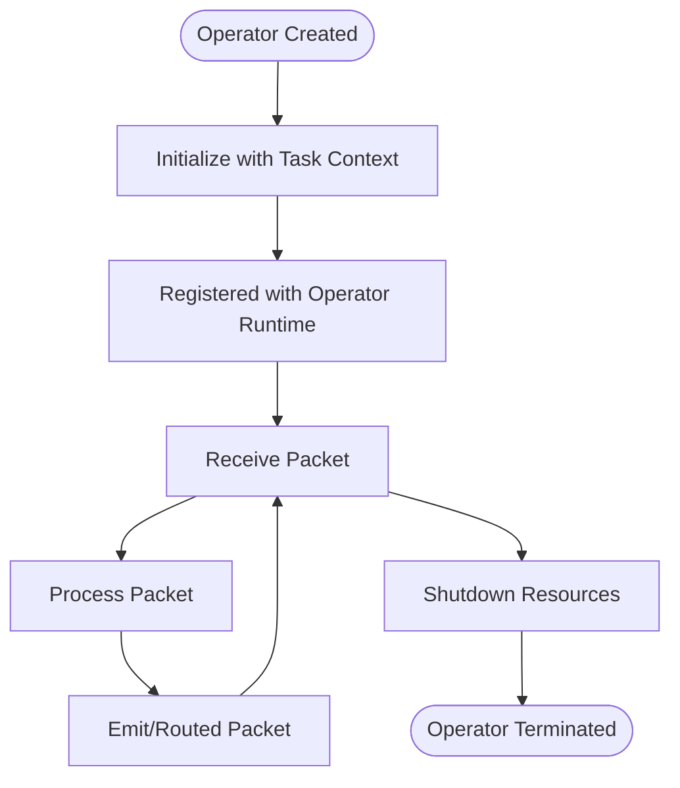

**Diagram sources**
- [_kernel_runtime.py](file://src/sage/stream/_kernel_runtime.py)
- [operator_runtime.py](file://src/sage/runtime/flownet/runtime/flowengine/operator_runtime.py)
- [execution_context.py](file://src/sage/runtime/flownet/runtime/actors/execution_context.py)
- [task_runtime.py](file://src/sage/runtime/flownet/runtime/actors/task_runtime.py)

**Section sources**
- [_kernel_runtime.py](file://src/sage/stream/_kernel_runtime.py)
- [operator_runtime.py](file://src/sage/runtime/flownet/runtime/flowengine/operator_runtime.py)
- [execution_context.py](file://src/sage/runtime/flownet/runtime/actors/execution_context.py)
- [task_runtime.py](file://src/sage/runtime/flownet/runtime/actors/task_runtime.py)

### Packet-Based Data Flow System
Packet-based processing ensures operators handle discrete units of data with explicit routing semantics. The kernel runtime delivers packets to operators, which then emit new packets to downstream operators through the communication bridge and router. This model supports high-throughput, low-latency streaming with clear boundaries between operators.

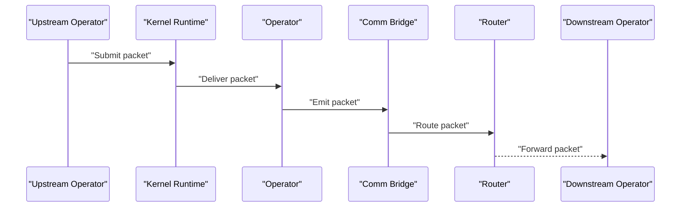

**Diagram sources**
- [_kernel_runtime.py](file://src/sage/stream/_kernel_runtime.py)
- [comm_bridge.py](file://src/sage/runtime/flownet/runtime/comm/comm_bridge.py)
- [router.py](file://src/sage/runtime/flownet/runtime/comm/router.py)

**Section sources**
- [_kernel_runtime.py](file://src/sage/stream/_kernel_runtime.py)
- [comm_bridge.py](file://src/sage/runtime/flownet/runtime/comm/comm_bridge.py)
- [router.py](file://src/sage/runtime/flownet/runtime/comm/router.py)

### Function Factory Pattern and Task Context Integration
Operators can be constructed using a function factory pattern, enabling dynamic operator creation and configuration. Task context integration ensures operators execute within the proper runtime environment, with access to execution context and task runtime services.

Integration points:
- Function factory constructs operator instances with runtime-aware logic.
- Task context provides execution environment, scheduling, and resource access.
- Operator runtime coordinates execution and routing.

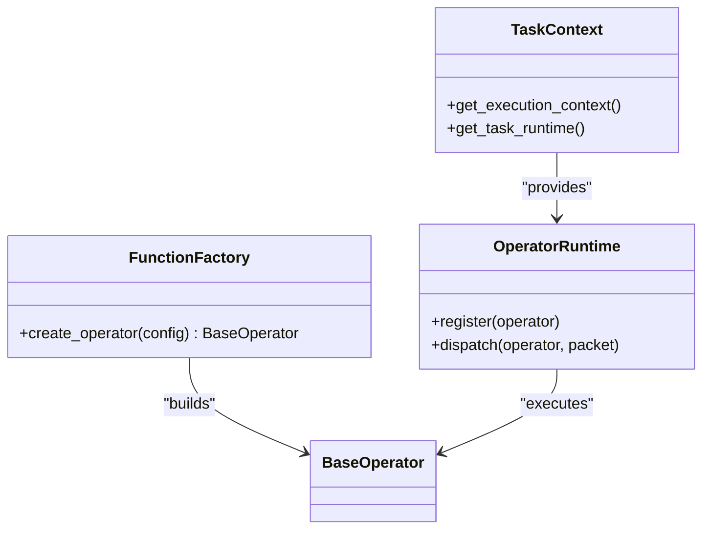

**Diagram sources**
- [operators.py](file://src/sage/stream/operators.py)
- [execution_context.py](file://src/sage/runtime/flownet/runtime/actors/execution_context.py)
- [task_runtime.py](file://src/sage/runtime/flownet/runtime/actors/task_runtime.py)
- [operator_runtime.py](file://src/sage/runtime/flownet/runtime/flowengine/operator_runtime.py)

**Section sources**
- [operators.py](file://src/sage/stream/operators.py)
- [execution_context.py](file://src/sage/runtime/flownet/runtime/actors/execution_context.py)
- [task_runtime.py](file://src/sage/runtime/flownet/runtime/actors/task_runtime.py)
- [operator_runtime.py](file://src/sage/runtime/flownet/runtime/flowengine/operator_runtime.py)

### Operator Responsibilities: Reception, Processing, and Routing
Operators receive packets from upstream operators via the kernel runtime, process them according to their logic, and route outputs to downstream operators through the communication bridge and router. The operator runtime coordinates these responsibilities and ensures correct sequencing and error handling.

Responsibilities:
- Reception: Accept packets delivered by the kernel runtime.
- Processing: Apply operator-specific logic to transform or forward packets.
- Routing: Emit packets to downstream operators using the communication bridge and router.

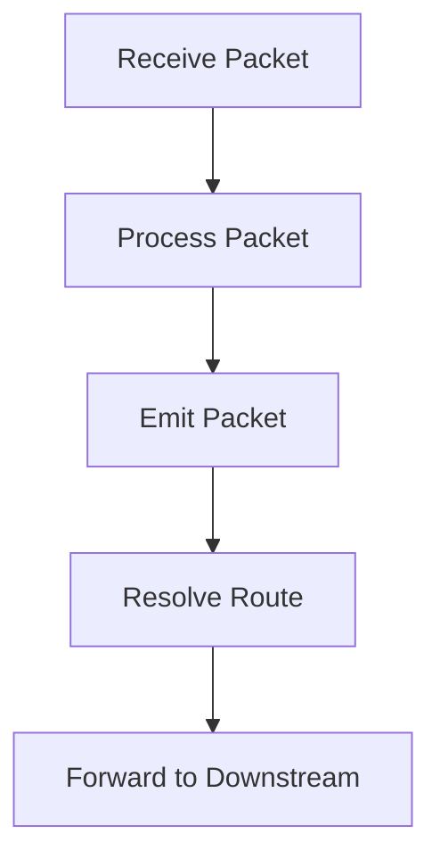

**Diagram sources**
- [_kernel_runtime.py](file://src/sage/stream/_kernel_runtime.py)
- [comm_bridge.py](file://src/sage/runtime/flownet/runtime/comm/comm_bridge.py)
- [router.py](file://src/sage/runtime/flownet/runtime/comm/router.py)

**Section sources**
- [_kernel_runtime.py](file://src/sage/stream/_kernel_runtime.py)
- [comm_bridge.py](file://src/sage/runtime/flownet/runtime/comm/comm_bridge.py)
- [router.py](file://src/sage/runtime/flownet/runtime/comm/router.py)

### Relationship Between Operators and Kernel Runtime
Operators execute on top of the kernel runtime, which provides task scheduling, context injection, and packet delivery semantics. The kernel runtime binds operators to tasks and ensures correct execution order and resource allocation.

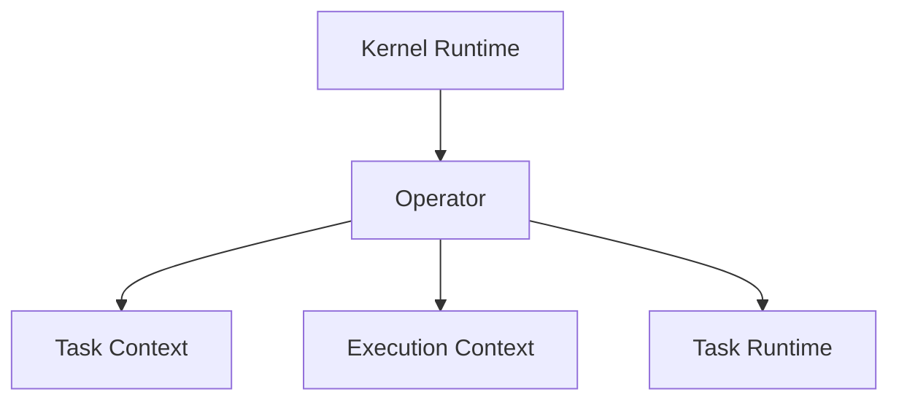

**Diagram sources**
- [_kernel_runtime.py](file://src/sage/stream/_kernel_runtime.py)
- [execution_context.py](file://src/sage/runtime/flownet/runtime/actors/execution_context.py)
- [task_runtime.py](file://src/sage/runtime/flownet/runtime/actors/task_runtime.py)

**Section sources**
- [_kernel_runtime.py](file://src/sage/stream/_kernel_runtime.py)
- [execution_context.py](file://src/sage/runtime/flownet/runtime/actors/execution_context.py)
- [task_runtime.py](file://src/sage/runtime/flownet/runtime/actors/task_runtime.py)

### Collector System and Routing Mechanisms
Operators interact with the collector system through the communication bridge and router. The collector system aggregates and forwards packets to downstream operators, while the router resolves routing keys to appropriate destinations.

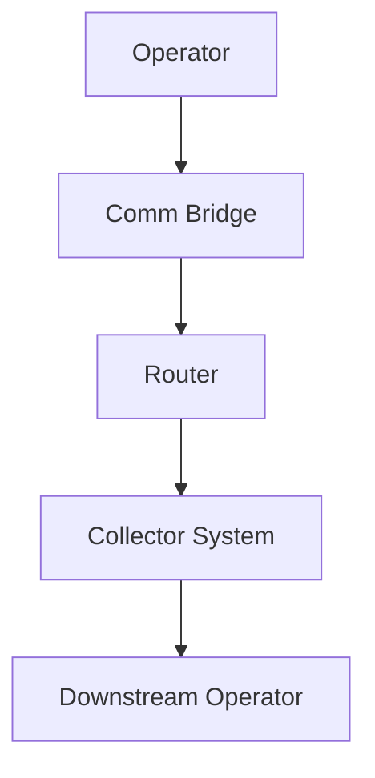

**Diagram sources**
- [comm_bridge.py](file://src/sage/runtime/flownet/runtime/comm/comm_bridge.py)
- [router.py](file://src/sage/runtime/flownet/runtime/comm/router.py)

**Section sources**
- [comm_bridge.py](file://src/sage/runtime/flownet/runtime/comm/comm_bridge.py)
- [router.py](file://src/sage/runtime/flownet/runtime/comm/router.py)

### Practical Examples
- Operator instantiation: Use the function factory pattern to construct operators with runtime-aware logic.
- Packet handling patterns: Implement packet reception, processing, and emission within the operator lifecycle.
- State management: Utilize stateful operators to maintain state across packets and lifecycle events.

Note: Example code is not included here. See the referenced files for implementation details.

**Section sources**
- [operators.py](file://src/sage/stream/operators.py)
- [stateful.py](file://src/sage/runtime/flownet/runtime/operator_runtime/stateful.py)
- [routing.py](file://src/sage/runtime/flownet/runtime/operator_runtime/routing.py)

### Operator Profiling, Error Handling, and Performance Monitoring
- Profiling: Leverage telemetry contracts to collect runtime metrics and operator performance data.
- Error handling: Use operator runtime errors to capture and propagate exceptions during operator execution.
- Performance monitoring: Combine telemetry and state query contracts to observe operator behavior and throughput.

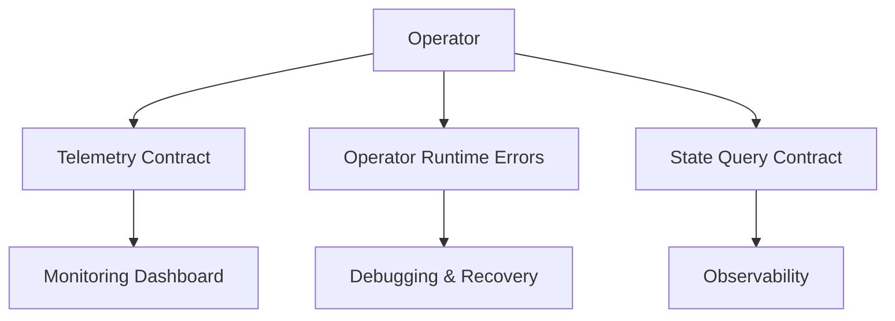

**Diagram sources**
- [runtime_telemetry_contract.py](file://src/sage/runtime/flownet/contracts/runtime_telemetry_contract.py)
- [errors.py](file://src/sage/runtime/flownet/runtime/operator_runtime/errors.py)
- [runtime_state_query_contract.py](file://src/sage/runtime/flownet/contracts/runtime_state_query_contract.py)

**Section sources**
- [runtime_telemetry_contract.py](file://src/sage/runtime/flownet/contracts/runtime_telemetry_contract.py)
- [errors.py](file://src/sage/runtime/flownet/runtime/operator_runtime/errors.py)
- [runtime_state_query_contract.py](file://src/sage/runtime/flownet/contracts/runtime_state_query_contract.py)

### Best Practices and Common Pitfalls
Best practices:
- Keep operators focused and composable; each operator should have a single responsibility.
- Use the function factory pattern for dynamic operator creation and configuration.
- Integrate with task context for proper resource management and scheduling.
- Implement robust error handling and logging within operators.
- Prefer stateless operators when possible; use stateful operators judiciously.

Common pitfalls to avoid:
- Blocking operations inside operators; keep processing non-blocking.
- Ignoring routing semantics; ensure emitted packets are properly routed.
- Overusing global state; favor explicit stateful operator patterns.
- Not handling exceptions; always define clear error handling strategies.

[No sources needed since this section provides general guidance]

## Dependency Analysis
The operator runtime depends on the kernel runtime for task execution and packet delivery. The flow engine orchestrates operator execution, while the communication bridge and router handle inter-operator messaging. Telemetry and state query contracts provide observability.

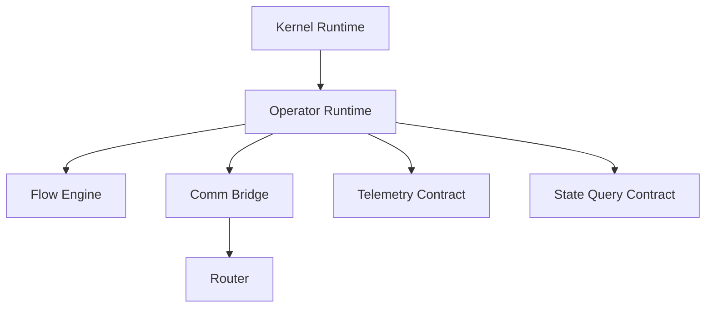

**Diagram sources**
- [_kernel_runtime.py](file://src/sage/stream/_kernel_runtime.py)
- [operator_runtime.py](file://src/sage/runtime/flownet/runtime/flowengine/operator_runtime.py)
- [engine.py](file://src/sage/runtime/flownet/runtime/flowengine/engine.py)
- [comm_bridge.py](file://src/sage/runtime/flownet/runtime/comm/comm_bridge.py)
- [router.py](file://src/sage/runtime/flownet/runtime/comm/router.py)
- [runtime_telemetry_contract.py](file://src/sage/runtime/flownet/contracts/runtime_telemetry_contract.py)
- [runtime_state_query_contract.py](file://src/sage/runtime/flownet/contracts/runtime_state_query_contract.py)

**Section sources**
- [_kernel_runtime.py](file://src/sage/stream/_kernel_runtime.py)
- [operator_runtime.py](file://src/sage/runtime/flownet/runtime/flowengine/operator_runtime.py)
- [engine.py](file://src/sage/runtime/flownet/runtime/flowengine/engine.py)
- [comm_bridge.py](file://src/sage/runtime/flownet/runtime/comm/comm_bridge.py)
- [router.py](file://src/sage/runtime/flownet/runtime/comm/router.py)
- [runtime_telemetry_contract.py](file://src/sage/runtime/flownet/contracts/runtime_telemetry_contract.py)
- [runtime_state_query_contract.py](file://src/sage/runtime/flownet/contracts/runtime_state_query_contract.py)

## Performance Considerations
- Non-blocking processing: Operators should avoid blocking operations to maintain throughput.
- Efficient routing: Minimize unnecessary packet duplication and optimize route resolution.
- State management: Use stateful operators sparingly and ensure efficient state updates.
- Telemetry sampling: Balance telemetry overhead with observability needs.

[No sources needed since this section provides general guidance]

## Troubleshooting Guide
- Error handling: Operators should define clear error handling strategies and propagate exceptions using operator runtime errors.
- Telemetry inspection: Use telemetry contracts to diagnose performance bottlenecks and operator failures.
- State queries: Employ state query contracts to inspect operator state and runtime conditions.

**Section sources**
- [errors.py](file://src/sage/runtime/flownet/runtime/operator_runtime/errors.py)
- [runtime_telemetry_contract.py](file://src/sage/runtime/flownet/contracts/runtime_telemetry_contract.py)
- [runtime_state_query_contract.py](file://src/sage/runtime/flownet/contracts/runtime_state_query_contract.py)

## Conclusion
SAGE’s operator-based stream processing model centers on packet-based data flow, lifecycle-driven execution, and integration with the kernel runtime. Operators rely on the function factory pattern and task context integration to execute efficiently and reliably. The operator runtime coordinates execution, routing, and observability through telemetry and state query contracts. By following best practices and avoiding common pitfalls, developers can build scalable, maintainable operators that integrate seamlessly with the broader SAGE runtime ecosystem.