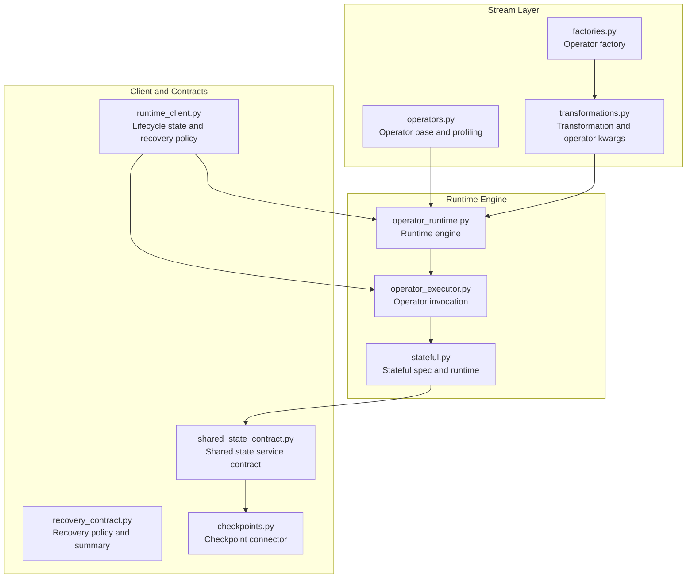
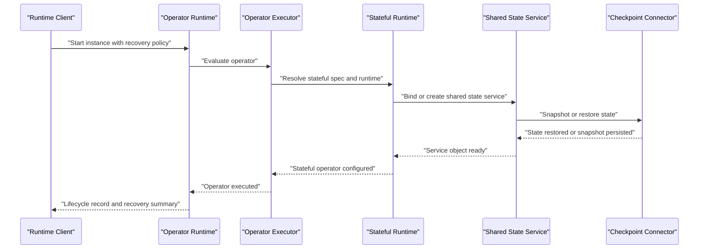
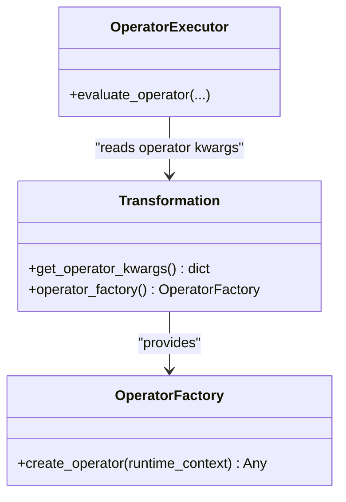
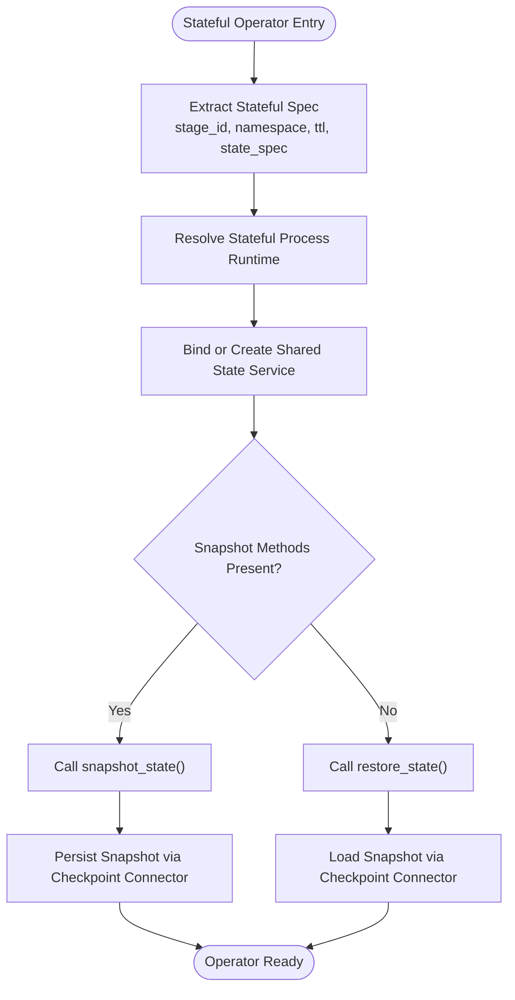
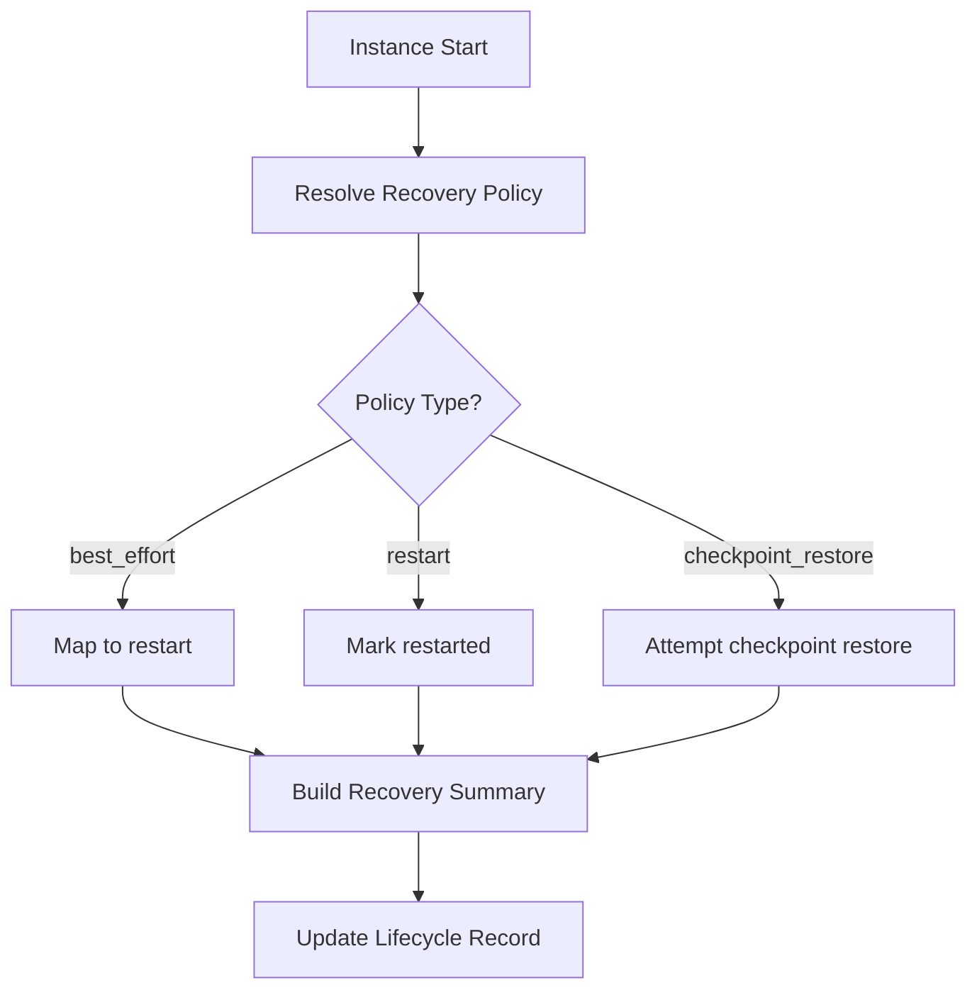
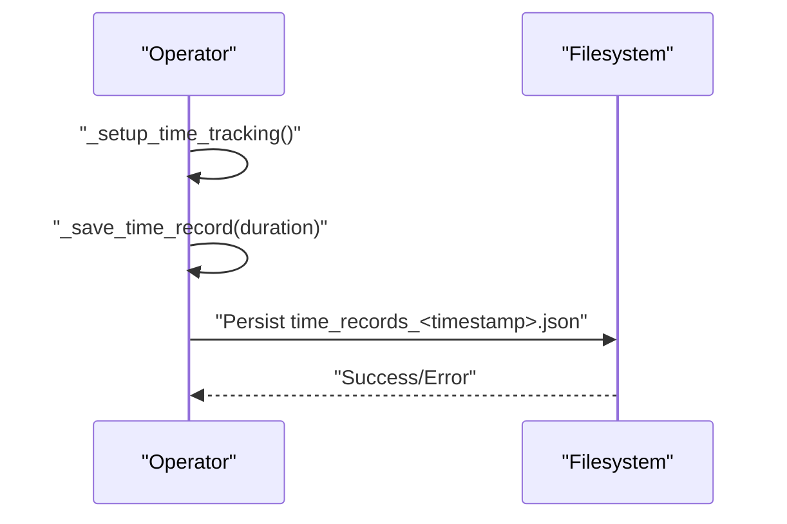
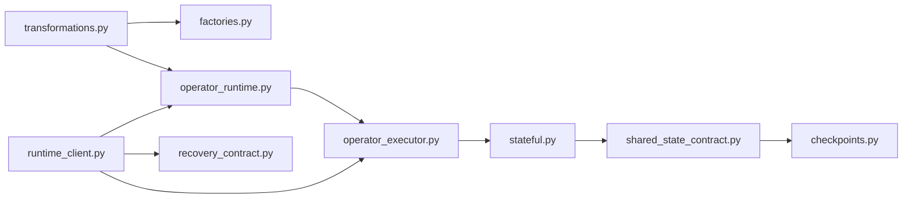

# Operator Lifecycle Management

<cite>
**Referenced Files in This Document**
- [operators.py](file://src/sage/stream/operators.py)
- [factories.py](file://src/sage/stream/factories.py)
- [transformations.py](file://src/sage/stream/transformations.py)
- [operator_runtime.py](file://src/sage/runtime/flownet/runtime/flowengine/operator_runtime.py)
- [operator_executor.py](file://src/sage/runtime/flownet/runtime/flowengine/operator_executor.py)
- [stateful.py](file://src/sage/runtime/flownet/runtime/operator_runtime/stateful.py)
- [runtime_client.py](file://src/sage/runtime/flownet/client/runtime_client.py)
- [recovery_contract.py](file://src/sage/runtime/flownet/contracts/recovery_contract.py)
- [checkpoints.py](file://src/sage/runtime/flownet/data/connectors/checkpoints.py)
- [shared_state_contract.py](file://src/sage/runtime/flownet/contracts/shared_state_contract.py)
- [test_flownet_shared_state_service_contract.py](file://src/tests/test_flownet_shared_state_service_contract.py)
</cite>

## Table of Contents
1. [Introduction](#introduction)
2. [Project Structure](#project-structure)
3. [Core Components](#core-components)
4. [Architecture Overview](#architecture-overview)
5. [Detailed Component Analysis](#detailed-component-analysis)
6. [Dependency Analysis](#dependency-analysis)
7. [Performance Considerations](#performance-considerations)
8. [Troubleshooting Guide](#troubleshooting-guide)
9. [Conclusion](#conclusion)
10. [Appendices](#appendices)

## Introduction
This document explains the complete lifecycle of operators in the system, from initialization and execution to failure recovery and cleanup. It covers operator state persistence and restoration, checkpointing strategies, the relationship between operators and their underlying functions (including function factory patterns and dynamic function loading), profiling and performance monitoring, debugging aids, memory/resource management, disposal patterns, and testing strategies. The goal is to provide a practical guide for implementing robust, observable, and efficient operators.

## Project Structure
The operator lifecycle spans several subsystems:
- Stream-level operator definitions and factories
- Transformation and operator factory wiring
- Runtime engine for operator execution and stateful orchestration
- Client-side lifecycle management and recovery policies
- Contracts for recovery and shared state services
- Data connectors for checkpoint persistence

**Diagram sources**
- [operators.py](file://src/sage/stream/operators.py)
- [factories.py](file://src/sage/stream/factories.py)
- [transformations.py](file://src/sage/stream/transformations.py)
- [operator_runtime.py](file://src/sage/runtime/flownet/runtime/flowengine/operator_runtime.py)
- [operator_executor.py](file://src/sage/runtime/flownet/runtime/flowengine/operator_executor.py)
- [stateful.py](file://src/sage/runtime/flownet/runtime/operator_runtime/stateful.py)
- [runtime_client.py](file://src/sage/runtime/flownet/client/runtime_client.py)
- [recovery_contract.py](file://src/sage/runtime/flownet/contracts/recovery_contract.py)
- [shared_state_contract.py](file://src/sage/runtime/flownet/contracts/shared_state_contract.py)
- [checkpoints.py](file://src/sage/runtime/flownet/data/connectors/checkpoints.py)

**Section sources**
- [operators.py](file://src/sage/stream/operators.py)
- [factories.py](file://src/sage/stream/factories.py)
- [transformations.py](file://src/sage/stream/transformations.py)
- [operator_runtime.py](file://src/sage/runtime/flownet/runtime/flowengine/operator_runtime.py)
- [operator_executor.py](file://src/sage/runtime/flownet/runtime/flowengine/operator_executor.py)
- [stateful.py](file://src/sage/runtime/flownet/runtime/operator_runtime/stateful.py)
- [runtime_client.py](file://src/sage/runtime/flownet/client/runtime_client.py)
- [recovery_contract.py](file://src/sage/runtime/flownet/contracts/recovery_contract.py)
- [shared_state_contract.py](file://src/sage/runtime/flownet/contracts/shared_state_contract.py)
- [checkpoints.py](file://src/sage/runtime/flownet/data/connectors/checkpoints.py)

## Core Components
- Operators and profiling: Operators expose timing and profiling hooks for performance measurement and persistence of time records.
- Operator factories and dynamic loading: Transformations define operator factories and keyword arguments to dynamically construct operators at runtime.
- Stateful operators: Stateful specifications and runtime orchestrate stateful processes, namespaces, TTL, and snapshot/restore.
- Lifecycle and recovery: The runtime client manages lifecycle records, recovery policies, and recovery summaries; recovery contract defines supported policies and statuses.
- Checkpointing: Shared state services and checkpoint connectors enable persistent snapshots and restoration.

**Section sources**
- [operators.py](file://src/sage/stream/operators.py)
- [transformations.py](file://src/sage/stream/transformations.py)
- [stateful.py](file://src/sage/runtime/flownet/runtime/operator_runtime/stateful.py)
- [runtime_client.py](file://src/sage/runtime/flownet/client/runtime_client.py)
- [recovery_contract.py](file://src/sage/runtime/flownet/contracts/recovery_contract.py)
- [checkpoints.py](file://src/sage/runtime/flownet/data/connectors/checkpoints.py)

## Architecture Overview
The operator lifecycle is orchestrated by the runtime engine and governed by recovery policies resolved by the client. Stateful operators integrate with shared state services and checkpoint connectors to persist and restore state.

**Diagram sources**
- [runtime_client.py](file://src/sage/runtime/flownet/client/runtime_client.py)
- [operator_runtime.py](file://src/sage/runtime/flownet/runtime/flowengine/operator_runtime.py)
- [operator_executor.py](file://src/sage/runtime/flownet/runtime/flowengine/operator_executor.py)
- [stateful.py](file://src/sage/runtime/flownet/runtime/operator_runtime/stateful.py)
- [shared_state_contract.py](file://src/sage/runtime/flownet/contracts/shared_state_contract.py)
- [checkpoints.py](file://src/sage/runtime/flownet/data/connectors/checkpoints.py)

## Detailed Component Analysis

### Operator Initialization and Dynamic Function Loading
Operators are constructed via transformation-defined factories and operator kwargs. The transformation layer wires operator classes to runtime execution, enabling dynamic loading of operator functions.

**Diagram sources**
- [factories.py](file://src/sage/stream/factories.py)
- [transformations.py](file://src/sage/stream/transformations.py)
- [operator_executor.py](file://src/sage/runtime/flownet/runtime/flowengine/operator_executor.py)

**Section sources**
- [factories.py](file://src/sage/stream/factories.py)
- [transformations.py](file://src/sage/stream/transformations.py)
- [operator_executor.py](file://src/sage/runtime/flownet/runtime/flowengine/operator_executor.py)

### Operator State Persistence and Restoration
Stateful operators rely on stateful specifications and runtime orchestration. Shared state services and checkpoint connectors implement snapshot and restore semantics.

**Diagram sources**
- [stateful.py](file://src/sage/runtime/flownet/runtime/operator_runtime/stateful.py)
- [shared_state_contract.py](file://src/sage/runtime/flownet/contracts/shared_state_contract.py)
- [checkpoints.py](file://src/sage/runtime/flownet/data/connectors/checkpoints.py)

**Section sources**
- [stateful.py](file://src/sage/runtime/flownet/runtime/operator_runtime/stateful.py)
- [shared_state_contract.py](file://src/sage/runtime/flownet/contracts/shared_state_contract.py)
- [checkpoints.py](file://src/sage/runtime/flownet/data/connectors/checkpoints.py)

### Lifecycle Records, Recovery Policies, and Recovery Summaries
The runtime client maintains lifecycle records and resolves recovery policies and summaries. Recovery policies include best-effort, restart, and checkpoint restore. Recovery summaries track status, last action, timestamps, and metadata.

**Diagram sources**
- [runtime_client.py](file://src/sage/runtime/flownet/client/runtime_client.py)
- [recovery_contract.py](file://src/sage/runtime/flownet/contracts/recovery_contract.py)

**Section sources**
- [runtime_client.py](file://src/sage/runtime/flownet/client/runtime_client.py)
- [recovery_contract.py](file://src/sage/runtime/flownet/contracts/recovery_contract.py)

### Operator Profiling, Performance Monitoring, and Debugging
Operators support profiling by recording durations and persisting time records to disk. This enables performance monitoring and debugging of operator execution.

**Diagram sources**
- [operators.py](file://src/sage/stream/operators.py)

**Section sources**
- [operators.py](file://src/sage/stream/operators.py)

### Cleanup and Disposal Patterns
- Shared state services: Recovery policies determine whether to recreate services without restoring state (restart) or to restore state from snapshots (checkpoint restore).
- Operator resources: Operators should release resources during teardown; profiling persists buffered records to avoid data loss.

**Section sources**
- [test_flownet_shared_state_service_contract.py](file://src/tests/test_flownet_shared_state_service_contract.py)
- [operators.py](file://src/sage/stream/operators.py)

### Practical Examples

#### Implementing Custom State Management
- Define a stateful operator with a stateful specification containing stage_id, namespace, TTL, and optional state_spec.
- Implement snapshot and restore methods in the shared state service to support checkpoint restore.
- Use the runtime client to start the operator with a recovery policy that enables checkpoint restore.

**Section sources**
- [stateful.py](file://src/sage/runtime/flownet/runtime/operator_runtime/stateful.py)
- [shared_state_contract.py](file://src/sage/runtime/flownet/contracts/shared_state_contract.py)
- [runtime_client.py](file://src/sage/runtime/flownet/client/runtime_client.py)
- [test_flownet_shared_state_service_contract.py](file://src/tests/test_flownet_shared_state_service_contract.py)

#### Handling Operator Failures and Recovery
- Configure fault tolerance options with a recovery policy (restart or checkpoint restore).
- The runtime client resolves the recovery policy and updates recovery summaries accordingly.
- For checkpoint restore, ensure snapshot_state and restore_state are implemented; otherwise, fallback to restart behavior.

**Section sources**
- [runtime_client.py](file://src/sage/runtime/flownet/client/runtime_client.py)
- [recovery_contract.py](file://src/sage/runtime/flownet/contracts/recovery_contract.py)
- [test_flownet_shared_state_service_contract.py](file://src/tests/test_flownet_shared_state_service_contract.py)

#### Optimizing Operator Performance
- Enable operator profiling to capture per-operator timing data.
- Persist time records periodically to minimize risk of data loss.
- Use profiling metrics to identify hotspots and tune operator configurations.

**Section sources**
- [operators.py](file://src/sage/stream/operators.py)

## Dependency Analysis
The operator lifecycle depends on coordinated interactions among stream-level factories, transformation wiring, runtime engine, stateful orchestration, and recovery contracts.

**Diagram sources**
- [transformations.py](file://src/sage/stream/transformations.py)
- [factories.py](file://src/sage/stream/factories.py)
- [operator_runtime.py](file://src/sage/runtime/flownet/runtime/flowengine/operator_runtime.py)
- [operator_executor.py](file://src/sage/runtime/flownet/runtime/flowengine/operator_executor.py)
- [stateful.py](file://src/sage/runtime/flownet/runtime/operator_runtime/stateful.py)
- [shared_state_contract.py](file://src/sage/runtime/flownet/contracts/shared_state_contract.py)
- [checkpoints.py](file://src/sage/runtime/flownet/data/connectors/checkpoints.py)
- [runtime_client.py](file://src/sage/runtime/flownet/client/runtime_client.py)
- [recovery_contract.py](file://src/sage/runtime/flownet/contracts/recovery_contract.py)

**Section sources**
- [transformations.py](file://src/sage/stream/transformations.py)
- [factories.py](file://src/sage/stream/factories.py)
- [operator_runtime.py](file://src/sage/runtime/flownet/runtime/flowengine/operator_runtime.py)
- [operator_executor.py](file://src/sage/runtime/flownet/runtime/flowengine/operator_executor.py)
- [stateful.py](file://src/sage/runtime/flownet/runtime/operator_runtime/stateful.py)
- [shared_state_contract.py](file://src/sage/runtime/flownet/contracts/shared_state_contract.py)
- [checkpoints.py](file://src/sage/runtime/flownet/data/connectors/checkpoints.py)
- [runtime_client.py](file://src/sage/runtime/flownet/client/runtime_client.py)
- [recovery_contract.py](file://src/sage/runtime/flownet/contracts/recovery_contract.py)

## Performance Considerations
- Prefer checkpoint restore for long-running stateful operators to minimize re-initialization costs.
- Use operator profiling to identify slow operators and optimize their internal logic.
- Persist time records regularly to reduce overhead and avoid losing profiling data.
- Tune TTL and stateful spec parameters to balance memory usage and performance.

[No sources needed since this section provides general guidance]

## Troubleshooting Guide
- Recovery policy mismatch: If a shared state service does not implement snapshot and restore methods, checkpoint restore will fail; the system falls back to restart behavior.
- Lifecycle state inconsistencies: Verify recovery summaries and metadata to diagnose recovery attempts and reasons.
- Profiling data missing: Ensure operator profiling is enabled and time records are persisted to disk.

**Section sources**
- [test_flownet_shared_state_service_contract.py](file://src/tests/test_flownet_shared_state_service_contract.py)
- [runtime_client.py](file://src/sage/runtime/flownet/client/runtime_client.py)
- [operators.py](file://src/sage/stream/operators.py)

## Conclusion
The operator lifecycle in this system integrates dynamic operator construction, stateful orchestration, robust recovery policies, and profiling capabilities. By leveraging shared state services, checkpoint connectors, and lifecycle management, operators can be built to persist state, recover from failures, and remain observable and efficient. Proper disposal and cleanup patterns ensure reliable operation and predictable resource usage.

[No sources needed since this section summarizes without analyzing specific files]

## Appendices

### Appendix A: Operator Factory Pattern and Dynamic Function Loading
- Transformation provides operator kwargs and an operator factory.
- The executor reads operator kwargs and constructs operators dynamically.

**Section sources**
- [transformations.py](file://src/sage/stream/transformations.py)
- [operator_executor.py](file://src/sage/runtime/flownet/runtime/flowengine/operator_executor.py)

### Appendix B: Stateful Specification Extraction
- Extract stage_id, namespace, TTL, and state_spec from operator configuration.
- Validate mappings and raise explicit errors for invalid configurations.

**Section sources**
- [stateful.py](file://src/sage/runtime/flownet/runtime/operator_runtime/stateful.py)

### Appendix C: Recovery Policy and Summary Semantics
- Supported policies: best_effort, restart, checkpoint_restore.
- Summary fields include status, last_action, updated_at_epoch_ms, detail, and metadata.

**Section sources**
- [recovery_contract.py](file://src/sage/runtime/flownet/contracts/recovery_contract.py)