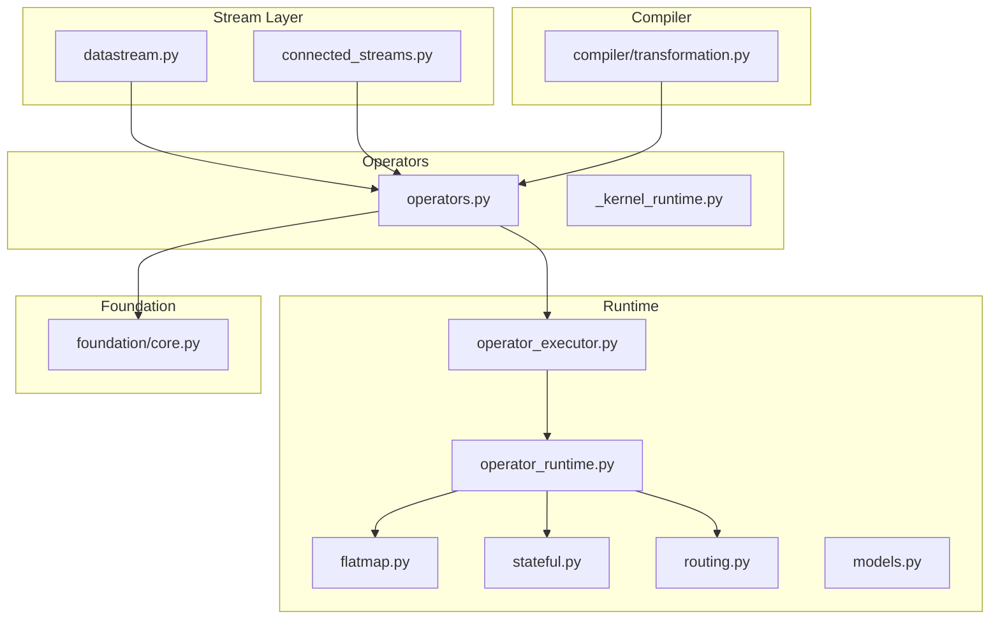
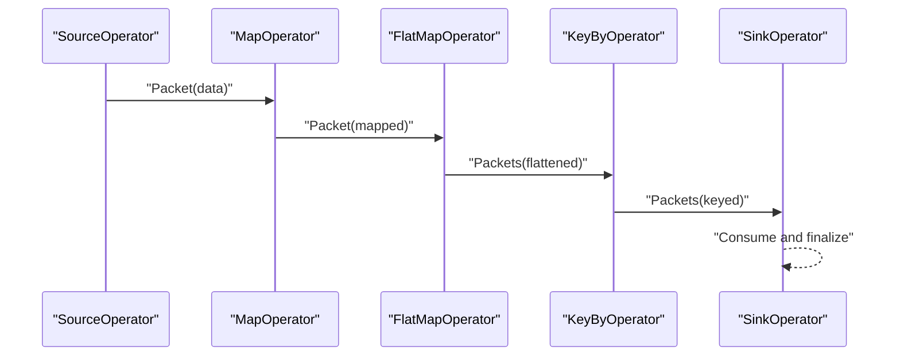
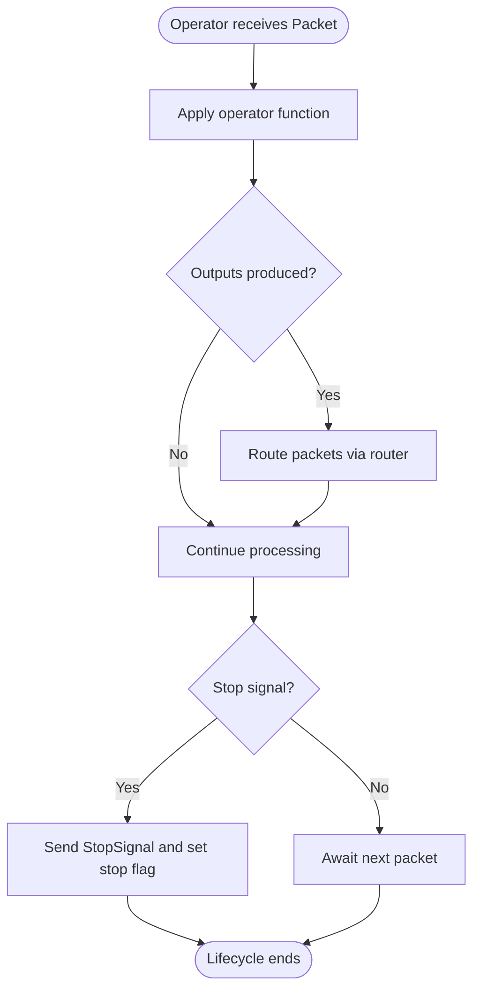
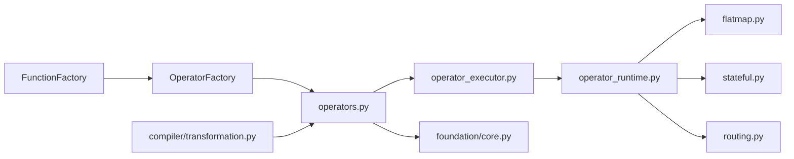

# Operator System

<cite>
**Referenced Files in This Document**
- [operators.py](file://src/sage/stream/operators.py)
- [_kernel_runtime.py](file://src/sage/stream/_kernel_runtime.py)
- [datastream.py](file://src/sage/stream/datastream.py)
- [factories.py](file://src/sage/stream/factories.py)
- [connected_streams.py](file://src/sage/stream/connected_streams.py)
- [core.py](file://src/sage/foundation/core.py)
- [operator_executor.py](file://src/sage/runtime/flownet/runtime/operator_executor.py)
- [operator_runtime.py](file://src/sage/runtime/flownet/runtime/operator_runtime.py)
- [flatmap.py](file://src/sage/runtime/flownet/operator_runtime/flatmap.py)
- [stateful.py](file://src/sage/runtime/flownet/operator_runtime/stateful.py)
- [routing.py](file://src/sage/runtime/flownet/operator_runtime/routing.py)
- [models.py](file://src/sage/runtime/flownet/operator_runtime/models.py)
- [transformation.py](file://src/sage/runtime/flownet/compiler/transformation.py)
- [flows.py](file://src/sage/runtime/flownet/runtime/flow_process_execution.py)
</cite>

## Table of Contents
1. [Introduction](#introduction)
2. [Project Structure](#project-structure)
3. [Core Components](#core-components)
4. [Architecture Overview](#architecture-overview)
5. [Detailed Component Analysis](#detailed-component-analysis)
6. [Dependency Analysis](#dependency-analysis)
7. [Performance Considerations](#performance-considerations)
8. [Troubleshooting Guide](#troubleshooting-guide)
9. [Conclusion](#conclusion)
10. [Appendices](#appendices)

## Introduction
This document explains SAGE’s operator-based stream processing model. Operators are the fundamental building blocks that transform data packets flowing through a pipeline. They enable declarative composition via method chaining, supporting parallelism, stateful processing, and robust routing. The system integrates with a packet-based runtime where operators receive, transform, and forward packets along directed edges in a dataflow graph.

## Project Structure
The operator system spans several modules:
- Stream definition and chaining: datastream.py, connected_streams.py
- Operator implementations: operators.py
- Runtime integration: _kernel_runtime.py, operator_executor.py, operator_runtime.py
- Operator-specific runtime behaviors: flatmap.py, stateful.py, routing.py
- Function abstractions: foundation/core.py
- Compiler support: compiler/transformation.py
- Flow orchestration: runtime/flow_process_execution.py

**Diagram sources**
- [datastream.py](file://src/sage/stream/datastream.py)
- [connected_streams.py](file://src/sage/stream/connected_streams.py)
- [operators.py](file://src/sage/stream/operators.py)
- [_kernel_runtime.py](file://src/sage/stream/_kernel_runtime.py)
- [operator_executor.py](file://src/sage/runtime/flownet/runtime/operator_executor.py)
- [operator_runtime.py](file://src/sage/runtime/flownet/runtime/operator_runtime.py)
- [flatmap.py](file://src/sage/runtime/flownet/operator_runtime/flatmap.py)
- [stateful.py](file://src/sage/runtime/flownet/operator_runtime/stateful.py)
- [routing.py](file://src/sage/runtime/flownet/operator_runtime/routing.py)
- [models.py](file://src/sage/runtime/flownet/operator_runtime/models.py)
- [core.py](file://src/sage/foundation/core.py)
- [transformation.py](file://src/sage/runtime/flownet/compiler/transformation.py)

**Section sources**
- [operators.py](file://src/sage/stream/operators.py)
- [datastream.py](file://src/sage/stream/datastream.py)
- [connected_streams.py](file://src/sage/stream/connected_streams.py)
- [_kernel_runtime.py](file://src/sage/stream/_kernel_runtime.py)
- [operator_executor.py](file://src/sage/runtime/flownet/runtime/operator_executor.py)
- [operator_runtime.py](file://src/sage/runtime/flownet/runtime/operator_runtime.py)
- [flatmap.py](file://src/sage/runtime/flownet/operator_runtime/flatmap.py)
- [stateful.py](file://src/sage/runtime/flownet/operator_runtime/stateful.py)
- [routing.py](file://src/sage/runtime/flownet/operator_runtime/routing.py)
- [models.py](file://src/sage/runtime/flownet/operator_runtime/models.py)
- [core.py](file://src/sage/foundation/core.py)
- [transformation.py](file://src/sage/runtime/flownet/compiler/transformation.py)

## Core Components
- BaseOperator: Abstract base for all operators, defining lifecycle hooks and packet handling.
- Concrete operators:
  - MapOperator: Transforms each input packet into zero or more output packets.
  - FilterOperator: Selectively forwards packets based on a predicate.
  - FlatMapOperator: Emits multiple outputs per input packet.
  - SinkOperator: Consumes packets without emitting further outputs.
  - SourceOperator: Produces initial packets into the stream.
  - BatchOperator: Executes a batch function and emits a single result packet.
  - KeyByOperator: Partitions data by a key for downstream keyed operations.
  - JoinOperator: Joins two input streams based on keys.
  - CoMapOperator: Applies a function to a co-stream element.
  - FutureOperator: Handles asynchronous futures in the pipeline.
- Function wrappers: MapFunction, FilterFunction, FlatMapFunction, SinkFunction, SourceFunction, BatchFunction, KeyByFunction, BaseJoinFunction, BaseCoMapFunction, FutureFunction.

Key responsibilities:
- Lifecycle: Initialization, packet reception, processing, stop signaling, and teardown.
- Parallelism: Throughput achieved by multiple operator instances and partitioned routing.
- State: Optional stateful operators maintain state across packets.
- Routing: KeyBy and other operators route packets to appropriate downstream partitions.

**Section sources**
- [operators.py](file://src/sage/stream/operators.py)
- [_kernel_runtime.py](file://src/sage/stream/_kernel_runtime.py)
- [core.py](file://src/sage/foundation/core.py)

## Architecture Overview
The operator system integrates with a packet-based runtime. Operators are instantiated by factories, receive packets, apply transformations, and route outputs. The runtime orchestrates execution, manages state, and coordinates parallel lanes.

**Diagram sources**
- [operators.py](file://src/sage/stream/operators.py)
- [_kernel_runtime.py](file://src/sage/stream/_kernel_runtime.py)

## Detailed Component Analysis

### Operator Lifecycle and Packet Flow
- Initialization: Operators are constructed with function wrappers, router, and context.
- Packet reception: Operators implement receive_packet and process_packet to handle incoming packets.
- Transformation: Operators apply their function to produce zero or more output packets.
- Routing: Packets are sent via router; routing strategies depend on operator type (e.g., hash partitioning for KeyBy).
- Stop signaling: Operators propagate StopSignal to halt downstream processing.
- Teardown: Operators set internal stop signals and notify context.

**Diagram sources**
- [operators.py](file://src/sage/stream/operators.py)
- [operator_runtime.py](file://src/sage/runtime/flownet/runtime/operator_runtime.py)

**Section sources**
- [operators.py](file://src/sage/stream/operators.py)
- [operator_runtime.py](file://src/sage/runtime/flownet/runtime/operator_runtime.py)

### MapOperator
Behavior:
- Applies a map function to each input packet.
- Emits zero or more output packets per input.
- Supports parallelism by distributing work across lanes.

Use cases:
- Transforming records (e.g., JSON to structured objects).
- Filtering out invalid entries during transformation.

Implementation pattern:
- Receive packet -> execute function -> send outputs -> continue.

Parallelism and state:
- Stateless by default; can be combined with keyed routing for partitioned processing.

**Section sources**
- [operators.py](file://src/sage/stream/operators.py)
- [core.py](file://src/sage/foundation/core.py)

### FilterOperator
Behavior:
- Evaluates a predicate on each packet.
- Forwards only packets satisfying the predicate.

Use cases:
- Pre-filtering noisy or irrelevant data.
- Early termination of pipelines.

Implementation pattern:
- Receive packet -> evaluate predicate -> conditionally emit -> continue.

Parallelism and state:
- Stateless filter; benefits from horizontal scaling across lanes.

**Section sources**
- [operators.py](file://src/sage/stream/operators.py)
- [core.py](file://src/sage/foundation/core.py)

### FlatMapOperator
Behavior:
- Produces multiple outputs per input packet.
- Useful for splitting, exploding arrays, or generating synthetic records.

Use cases:
- Tokenization, nested record expansion, multi-output branching.

Implementation pattern:
- Receive packet -> expand into multiple outputs -> send each -> continue.

Parallelism and state:
- Stateless; leverages partitioning to scale across flattened outputs.

**Section sources**
- [operators.py](file://src/sage/stream/operators.py)
- [flatmap.py](file://src/sage/runtime/flownet/operator_runtime/flatmap.py)
- [core.py](file://src/sage/foundation/core.py)

### SinkOperator
Behavior:
- Consumes packets without emitting further outputs.
- Often used for writing to external systems or metrics collection.

Use cases:
- Persisting results, emitting telemetry, triggering side effects.

Implementation pattern:
- Receive packet -> apply sink function -> finalize.

Parallelism and state:
- Stateless sink; can be replicated for throughput.

**Section sources**
- [operators.py](file://src/sage/stream/operators.py)
- [core.py](file://src/sage/foundation/core.py)

### SourceOperator
Behavior:
- Generates initial packets into the stream.
- Acts as the entry point of a pipeline.

Use cases:
- Reading from external sources (files, queues, APIs).

Implementation pattern:
- Periodically emit packets until stopped.

Parallelism and state:
- Stateless source; can fan out across lanes.

**Section sources**
- [operators.py](file://src/sage/stream/operators.py)
- [core.py](file://src/sage/foundation/core.py)

### BatchOperator
Behavior:
- Executes a batch function once and emits a single result packet.
- Stops the operator after completion.

Use cases:
- Aggregations, one-time computations, or initialization steps.

Implementation pattern:
- Execute function -> emit result -> send StopSignal -> stop.

Parallelism and state:
- Single-shot execution; integrates with stop propagation.

**Section sources**
- [operators.py](file://src/sage/stream/operators.py)
- [core.py](file://src/sage/foundation/core.py)

### KeyByOperator
Behavior:
- Partitions input packets by a key using a partition strategy (default hash).
- Enables downstream keyed operations and partitioned processing.

Use cases:
- Grouping by user ID, product category, or session key.

Implementation pattern:
- Extract key -> route to partition -> forward to downstream keyed operators.

Parallelism and state:
- Partitioned parallelism; maintains routing metadata.

**Section sources**
- [operators.py](file://src/sage/stream/operators.py)
- [routing.py](file://src/sage/runtime/flownet/operator_runtime/routing.py)
- [models.py](file://src/sage/runtime/flownet/operator_runtime/models.py)

### JoinOperator
Behavior:
- Joins two input streams based on keys.
- Supports various join strategies (e.g., equi-join, windowed joins).

Use cases:
- Correlating events, enriching data, or maintaining temporal coherence.

Implementation pattern:
- Buffer inputs by key -> match pairs -> emit joined packets.

Parallelism and state:
- Requires stateful buffering; leverages keyed routing.

**Section sources**
- [operators.py](file://src/sage/stream/operators.py)
- [stateful.py](file://src/sage/runtime/flownet/operator_runtime/stateful.py)

### CoMapOperator
Behavior:
- Applies a function to a co-stream element (e.g., second input of a dual-input operator).
- Enables cross-stream transformations.

Use cases:
- Side-input joins, enrichment via lookup tables.

Implementation pattern:
- Receive co-stream element -> apply function -> combine with primary stream.

Parallelism and state:
- Stateless operation; benefits from keyed alignment.

**Section sources**
- [operators.py](file://src/sage/stream/operators.py)
- [core.py](file://src/sage/foundation/core.py)

### FutureOperator
Behavior:
- Handles asynchronous futures in the pipeline.
- Bridges async operations with synchronous packet processing.

Use cases:
- Async I/O, delayed computations, or external service calls.

Implementation pattern:
- Submit future -> await completion -> emit result -> continue.

Parallelism and state:
- Stateless wrapper around futures; scales with concurrency.

**Section sources**
- [operators.py](file://src/sage/stream/operators.py)
- [core.py](file://src/sage/foundation/core.py)

### Operator Composition Patterns
- Method chaining: Operators are composed by connecting outputs to inputs, forming directed acyclic graphs.
- Conditional transformations: Combine filters and maps to express complex predicates and transformations.
- Fan-out and fan-in: Use FlatMap to explode inputs and KeyBy to group outputs for joins or aggregations.
- Windowing and state: Use stateful operators and keyed routing to implement time-based windows and aggregations.

**Section sources**
- [datastream.py](file://src/sage/stream/datastream.py)
- [connected_streams.py](file://src/sage/stream/connected_streams.py)
- [transformation.py](file://src/sage/runtime/flownet/compiler/transformation.py)

## Dependency Analysis
- Factories: FunctionFactory and OperatorFactory construct operators and wrap user functions.
- Operators depend on function wrappers from foundation/core.py.
- Runtime integrates operators via operator_executor.py and operator_runtime.py.
- Specialized runtime modules handle flatmap, stateful, and routing behaviors.
- Compiler transformation.py transforms high-level stream definitions into executable operator graphs.

**Diagram sources**
- [factories.py](file://src/sage/stream/factories.py)
- [operators.py](file://src/sage/stream/operators.py)
- [operator_executor.py](file://src/sage/runtime/flownet/runtime/operator_executor.py)
- [operator_runtime.py](file://src/sage/runtime/flownet/runtime/operator_runtime.py)
- [flatmap.py](file://src/sage/runtime/flownet/operator_runtime/flatmap.py)
- [stateful.py](file://src/sage/runtime/flownet/operator_runtime/stateful.py)
- [routing.py](file://src/sage/runtime/flownet/operator_runtime/routing.py)
- [core.py](file://src/sage/foundation/core.py)
- [transformation.py](file://src/sage/runtime/flownet/compiler/transformation.py)

**Section sources**
- [factories.py](file://src/sage/stream/factories.py)
- [operators.py](file://src/sage/stream/operators.py)
- [operator_executor.py](file://src/sage/runtime/flownet/runtime/operator_executor.py)
- [operator_runtime.py](file://src/sage/runtime/flownet/runtime/operator_runtime.py)
- [flatmap.py](file://src/sage/runtime/flownet/operator_runtime/flatmap.py)
- [stateful.py](file://src/sage/runtime/flownet/operator_runtime/stateful.py)
- [routing.py](file://src/sage/runtime/flownet/operator_runtime/routing.py)
- [core.py](file://src/sage/foundation/core.py)
- [transformation.py](file://src/sage/runtime/flownet/compiler/transformation.py)

## Performance Considerations
- Parallelism
  - Horizontal scaling: Multiple operator instances increase throughput.
  - Partitioning: KeyBy enables partitioned processing to avoid hotspots.
- Backpressure and batching
  - Router-based routing prevents overload; consider batching outputs for efficiency.
- State management
  - Stateful operators require careful memory management; use keyed state to limit cardinality.
- Function overhead
  - Keep transformations lightweight; offload heavy computation to batch operators or external services.
- Compilation and optimization
  - Compiler transformation.py optimizes operator graphs; minimize redundant operators and branches.

[No sources needed since this section provides general guidance]

## Troubleshooting Guide
Common issues and remedies:
- No outputs observed
  - Verify operator chain connectivity and absence of filters blocking data.
  - Confirm SourceOperator is emitting and SinkOperator is reachable.
- Stalls or deadlocks
  - Check for missing StopSignal propagation; ensure BatchOperator completes and signals stop.
  - Inspect KeyBy partitioning; incorrect keys can cause uneven distribution.
- Memory pressure
  - Reduce stateful operator cardinality; prefer streaming joins over large in-memory buffers.
  - Use FlatMap judiciously to avoid explosion of packet volume.
- Performance bottlenecks
  - Increase parallelism by adding lanes; ensure operators are stateless where possible.
  - Profile function execution time; move CPU-intensive tasks to batch operators.

**Section sources**
- [operators.py](file://src/sage/stream/operators.py)
- [operator_runtime.py](file://src/sage/runtime/flownet/runtime/operator_runtime.py)
- [stateful.py](file://src/sage/runtime/flownet/operator_runtime/stateful.py)
- [routing.py](file://src/sage/runtime/flownet/operator_runtime/routing.py)

## Conclusion
SAGE’s operator system provides a powerful, declarative model for stream processing. By composing operators—Map, Filter, FlatMap, Sink, Source, Batch, KeyBy, Join, CoMap, and Future—developers can build scalable, parallel pipelines. The packet-based runtime ensures robust routing, stop signaling, and stateful coordination. Following best practices around parallelism, partitioning, and state management yields efficient and maintainable stream applications.

[No sources needed since this section summarizes without analyzing specific files]

## Appendices

### Practical Scenarios and Patterns
- Real-time enrichment
  - Use SourceOperator to ingest events, FilterOperator to drop invalid entries, MapOperator to transform, and SinkOperator to persist.
- Event correlation
  - Use KeyByOperator to partition by correlation key, JoinOperator to correlate streams, and SinkOperator to emit results.
- Exploding and flattening
  - Use FlatMapOperator to split arrays or generate synthetic records, followed by downstream transformations.

[No sources needed since this section provides general guidance]