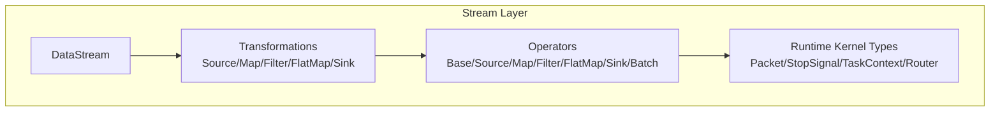
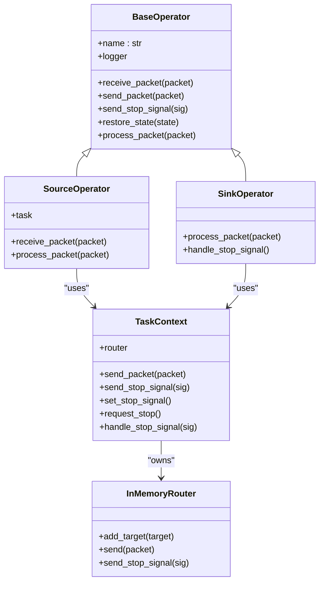
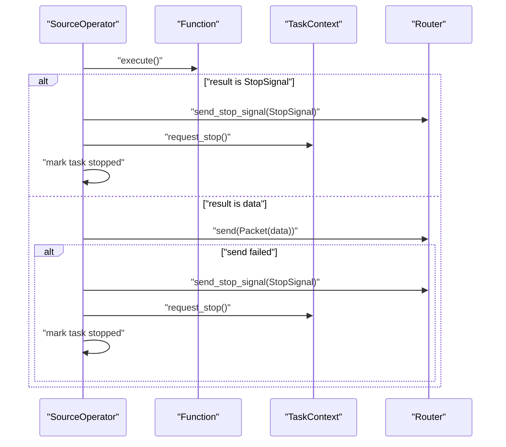
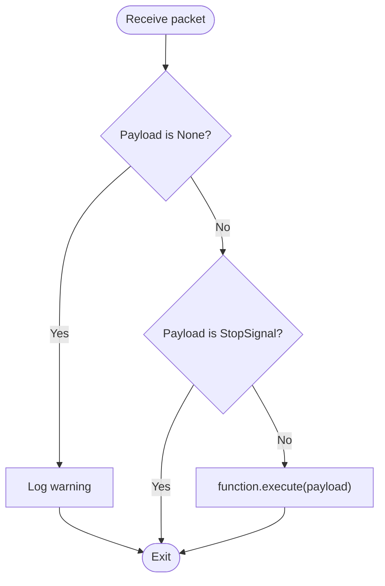
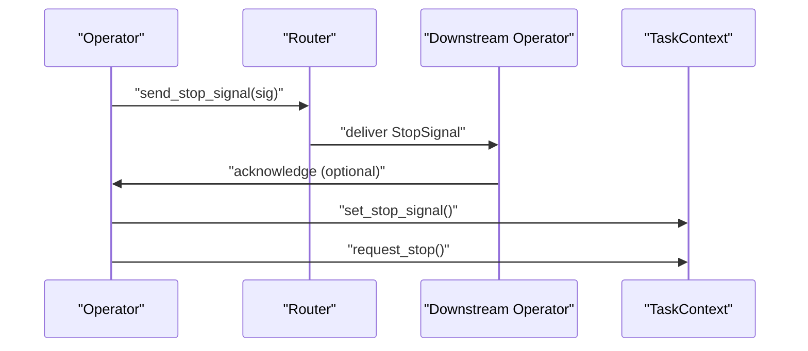
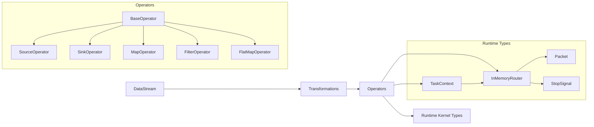

# Source and Sink Operators

<cite>
**Referenced Files in This Document**
- [operators.py](file://src/sage/stream/operators.py)
- [_runtime_kernel_types.py](file://src/sage/stream/_runtime_kernel_types.py)
- [transformations.py](file://src/sage/stream/transformations.py)
- [datastream.py](file://src/sage/stream/datastream.py)
- [factories.py](file://src/sage/stream/factories.py)
- [checkpoints.py](file://src/sage/runtime/flownet/data/connectors/checkpoints.py)
</cite>

## Table of Contents
1. [Introduction](#introduction)
2. [Project Structure](#project-structure)
3. [Core Components](#core-components)
4. [Architecture Overview](#architecture-overview)
5. [Detailed Component Analysis](#detailed-component-analysis)
6. [Dependency Analysis](#dependency-analysis)
7. [Performance Considerations](#performance-considerations)
8. [Troubleshooting Guide](#troubleshooting-guide)
9. [Conclusion](#conclusion)
10. [Appendices](#appendices)

## Introduction
This document explains Source and Sink Operators in the SAGE stream processing layer. It focuses on how initial data streams are generated (SourceOperator), how processed data is consumed (SinkOperator), and how stop signals and lifecycle events propagate through the pipeline. It also covers differences between active and passive operators, graceful shutdown procedures, integration patterns with external systems, error handling, and performance optimization for high-throughput scenarios.

## Project Structure
The stream processing layer centers around operator abstractions, transformation builders, and runtime kernel types. Operators are thin wrappers around user-defined functions, orchestrated by a TaskContext and routed via an InMemoryRouter. Transformations define how operators are instantiated and wired into the pipeline.

**Diagram sources**
- [datastream.py:26-182](file://src/sage/stream/datastream.py#L26-L182)
- [transformations.py:63-421](file://src/sage/stream/transformations.py#L63-L421)
- [operators.py:41-526](file://src/sage/stream/operators.py#L41-L526)
- [_runtime_kernel_types.py:13-267](file://src/sage/stream/_runtime_kernel_types.py#L13-L267)

**Section sources**
- [datastream.py:26-182](file://src/sage/stream/datastream.py#L26-L182)
- [transformations.py:63-421](file://src/sage/stream/transformations.py#L63-L421)
- [operators.py:41-526](file://src/sage/stream/operators.py#L41-L526)
- [_runtime_kernel_types.py:13-267](file://src/sage/stream/_runtime_kernel_types.py#L13-L267)

## Core Components
- SourceOperator: Produces data items and signals termination by emitting StopSignal and requesting shutdown.
- SinkOperator: Consumes data items, ignores StopSignal, and invokes optional close() on the underlying function during stop.
- BaseOperator: Shared base providing packet routing, stop propagation, state restoration, and logging.
- TaskContext and Router: Provide execution context, stop signaling, and inter-operator communication.
- Transformations: Define how operators are created and attached to DataStream.

Key responsibilities:
- SourceOperator lifecycle: execute function, detect StopSignal, send stop signal, request stop, mark task stopped.
- SinkOperator lifecycle: execute function, ignore StopSignal, call close() on stop.
- StopSignal propagation: emitted by routers to downstream operators; handled by TaskContext to coordinate shutdown.

**Section sources**
- [operators.py:244-303](file://src/sage/stream/operators.py#L244-L303)
- [operators.py:264-303](file://src/sage/stream/operators.py#L264-L303)
- [_runtime_kernel_types.py:13-267](file://src/sage/stream/_runtime_kernel_types.py#L13-L267)
- [transformations.py:148-235](file://src/sage/stream/transformations.py#L148-L235)

## Architecture Overview
The stream architecture separates concerns:
- DataStream exposes high-level APIs (map/filter/flatmap/sink).
- Transformations encapsulate operator creation and wiring.
- Operators implement per-packet processing and lifecycle callbacks.
- Runtime kernel types provide routing, stop signaling, and context.

**Diagram sources**
- [operators.py:41-303](file://src/sage/stream/operators.py#L41-L303)
- [_runtime_kernel_types.py:86-267](file://src/sage/stream/_runtime_kernel_types.py#L86-L267)

## Detailed Component Analysis

### SourceOperator
Purpose:
- Generate data items from a function and forward them downstream.
- Detect StopSignal from the function and propagate it upstream.
- Request shutdown and mark task as stopped.

Lifecycle and stop handling:
- On each invocation, the function is executed. If the result is StopSignal, a StopSignal is sent to downstream operators, request_stop() is invoked, and the task’s stop flag is set.
- If sending fails, a StopSignal is synthesized and sent, request_stop() is invoked, and the task is marked stopped.

**Diagram sources**
- [operators.py:264-303](file://src/sage/stream/operators.py#L264-L303)
- [_runtime_kernel_types.py:188-213](file://src/sage/stream/_runtime_kernel_types.py#L188-L213)

**Section sources**
- [operators.py:264-303](file://src/sage/stream/operators.py#L264-L303)
- [_runtime_kernel_types.py:188-213](file://src/sage/stream/_runtime_kernel_types.py#L188-L213)

### SinkOperator
Purpose:
- Consume data items produced by upstream operators.
- Ignore StopSignal payloads.
- On stop, invoke optional close() on the underlying function.

Graceful shutdown:
- handle_stop_signal() checks for a close() method on the function and calls it to release resources.

**Diagram sources**
- [operators.py:244-262](file://src/sage/stream/operators.py#L244-L262)

**Section sources**
- [operators.py:244-262](file://src/sage/stream/operators.py#L244-L262)

### Stop Signal Propagation and Graceful Shutdown
StopSignal semantics:
- StopSignal is a sentinel payload indicating end-of-stream or end-of-batch.
- Routers deliver StopSignal to all connected targets via receive_packet or direct put/call.
- TaskContext coordinates shutdown by setting stop_event and invoking request_stop().

**Diagram sources**
- [_runtime_kernel_types.py:119-127](file://src/sage/stream/_runtime_kernel_types.py#L119-L127)
- [_runtime_kernel_types.py:188-213](file://src/sage/stream/_runtime_kernel_types.py#L188-L213)

**Section sources**
- [_runtime_kernel_types.py:13-213](file://src/sage/stream/_runtime_kernel_types.py#L13-L213)

### Active vs Passive Operators
- Active operators (e.g., SourceOperator, BatchOperator) actively produce or drive data and can emit StopSignal.
- Passive operators (e.g., Map/Filter/FlatMap) react to incoming packets and do not initiate stop conditions themselves.

Evidence:
- SourceOperator detects StopSignal from function execution and emits StopSignal.
- BatchOperator emits StopSignal when function returns None or StopSignal.
- SinkOperator ignores StopSignal payloads.

**Section sources**
- [operators.py:264-303](file://src/sage/stream/operators.py#L264-L303)
- [operators.py:305-324](file://src/sage/stream/operators.py#L305-L324)
- [operators.py:244-262](file://src/sage/stream/operators.py#L244-L262)

### Practical Examples and Integration Patterns
Note: The following describe implementation patterns and integration points. Replace the placeholders with your own function classes and external clients.

- Implement a custom data source:
  - Create a function class compatible with SourceOperator (no input; returns either data items or StopSignal).
  - Use DataStream.map/filter/flatmap to transform the stream.
  - Add a SinkOperator to consume results (e.g., write to external sink).
  - Reference: [operators.py:264-303](file://src/sage/stream/operators.py#L264-L303), [transformations.py:148-168](file://src/sage/stream/transformations.py#L148-L168), [datastream.py:52-119](file://src/sage/stream/datastream.py#L52-L119).

- Handle streaming data feeds:
  - Emit StopSignal from the source function to signal completion.
  - Use TaskContext.request_stop() to propagate shutdown upstream.
  - Reference: [operators.py:283-290](file://src/sage/stream/operators.py#L283-L290), [_runtime_kernel_types.py:203-204](file://src/sage/stream/_runtime_kernel_types.py#L203-L204).

- Manage sink resources:
  - Implement close() in your sink function to flush buffers, close connections, or release resources.
  - SinkOperator.handle_stop_signal() will call close() if present.
  - Reference: [operators.py:256-262](file://src/sage/stream/operators.py#L256-L262).

- Integration with external systems:
  - Source function can poll external APIs or read from message queues and emit StopSignal upon exhaustion.
  - Sink function can write to databases, message brokers, or cloud storage; implement retry/backoff and idempotency as needed.
  - Reference: [operators.py:244-262](file://src/sage/stream/operators.py#L244-L262), [operators.py:264-303](file://src/sage/stream/operators.py#L264-L303).

- Fault tolerance and resumption:
  - Use connector checkpoints to resume from known offsets after restarts.
  - Reference: [checkpoints.py:32-97](file://src/sage/runtime/flownet/data/connectors/checkpoints.py#L32-L97).

**Section sources**
- [operators.py:244-303](file://src/sage/stream/operators.py#L244-L303)
- [transformations.py:148-168](file://src/sage/stream/transformations.py#L148-L168)
- [datastream.py:52-119](file://src/sage/stream/datastream.py#L52-L119)
- [checkpoints.py:32-97](file://src/sage/runtime/flownet/data/connectors/checkpoints.py#L32-L97)

## Dependency Analysis
Relationships among core components:

**Diagram sources**
- [datastream.py:26-182](file://src/sage/stream/datastream.py#L26-L182)
- [transformations.py:63-421](file://src/sage/stream/transformations.py#L63-L421)
- [operators.py:41-526](file://src/sage/stream/operators.py#L41-L526)
- [_runtime_kernel_types.py:86-267](file://src/sage/stream/_runtime_kernel_types.py#L86-L267)

**Section sources**
- [operators.py:41-526](file://src/sage/stream/operators.py#L41-L526)
- [_runtime_kernel_types.py:86-267](file://src/sage/stream/_runtime_kernel_types.py#L86-L267)
- [transformations.py:63-421](file://src/sage/stream/transformations.py#L63-L421)
- [datastream.py:26-182](file://src/sage/stream/datastream.py#L26-L182)

## Performance Considerations
- Backpressure and throughput:
  - Monitor router send success; if send fails, emit StopSignal and request stop to avoid unbounded buffering.
  - Reference: [operators.py:292-303](file://src/sage/stream/operators.py#L292-L303).

- Profiling and latency:
  - MapOperator supports optional profiling to record execution durations; consider enabling for latency-sensitive stages.
  - Reference: [operators.py:157-194](file://src/sage/stream/operators.py#L157-L194).

- Batching sinks:
  - Configure SinkTransformation with batch_size to reduce I/O overhead when writing to external systems.
  - Reference: [transformations.py:219-235](file://src/sage/stream/transformations.py#L219-L235).

- Parallelism:
  - Use parallelism parameters in DataStream methods to scale processing horizontally.
  - Reference: [datastream.py:52-142](file://src/sage/stream/datastream.py#L52-L142).

[No sources needed since this section provides general guidance]

## Troubleshooting Guide
Common issues and resolutions:
- Empty or None payloads:
  - Operators log warnings and skip processing; ensure function returns valid data or StopSignal.
  - References: [operators.py:159-161](file://src/sage/stream/operators.py#L159-L161), [operators.py:247-249](file://src/sage/stream/operators.py#L247-L249).

- StopSignal not propagated:
  - Verify router targets implement receive_packet or put/call; ensure TaskContext.request_stop() is invoked.
  - References: [_runtime_kernel_types.py:119-127](file://src/sage/stream/_runtime_kernel_types.py#L119-L127), [_runtime_kernel_types.py:203-204](file://src/sage/stream/_runtime_kernel_types.py#L203-L204).

- Sink resource cleanup:
  - Implement close() in your sink function; SinkOperator.handle_stop_signal() will call it.
  - Reference: [operators.py:256-262](file://src/sage/stream/operators.py#L256-L262).

- Resuming after failure:
  - Use connector checkpoints to resume from last known offset.
  - Reference: [checkpoints.py:65-74](file://src/sage/runtime/flownet/data/connectors/checkpoints.py#L65-L74).

**Section sources**
- [operators.py:159-161](file://src/sage/stream/operators.py#L159-L161)
- [operators.py:247-249](file://src/sage/stream/operators.py#L247-L249)
- [_runtime_kernel_types.py:119-127](file://src/sage/stream/_runtime_kernel_types.py#L119-L127)
- [_runtime_kernel_types.py:203-204](file://src/sage/stream/_runtime_kernel_types.py#L203-L204)
- [operators.py:256-262](file://src/sage/stream/operators.py#L256-L262)
- [checkpoints.py:65-74](file://src/sage/runtime/flownet/data/connectors/checkpoints.py#L65-L74)

## Conclusion
Source and Sink Operators form the boundaries of stream processing pipelines. SourceOperator drives data generation and stop propagation, while SinkOperator consumes data and manages resource cleanup. Proper stop signal handling, graceful shutdown, and integration with external systems are ensured by TaskContext and Router. For high-throughput scenarios, leverage batching, profiling, and parallelism judiciously, and use checkpoints for fault tolerance.

[No sources needed since this section summarizes without analyzing specific files]

## Appendices
- Factory pattern:
  - FunctionFactory creates function instances bound to TaskContext.
  - OperatorFactory constructs operators with function factories and runtime context.
  - Reference: [factories.py:13-54](file://src/sage/stream/factories.py#L13-L54).

**Section sources**
- [factories.py:13-54](file://src/sage/stream/factories.py#L13-L54)