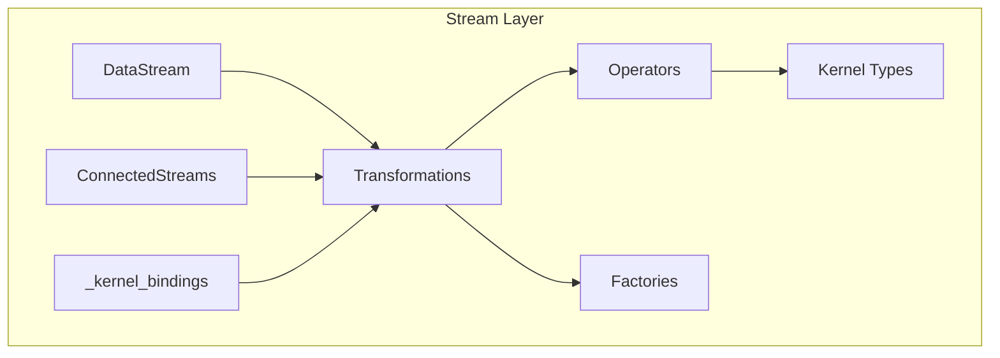
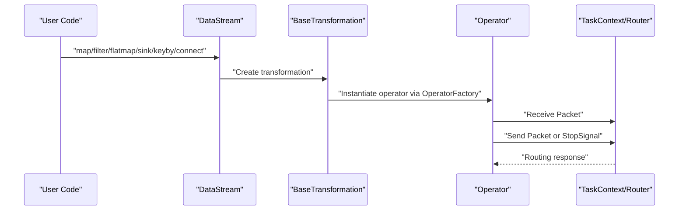
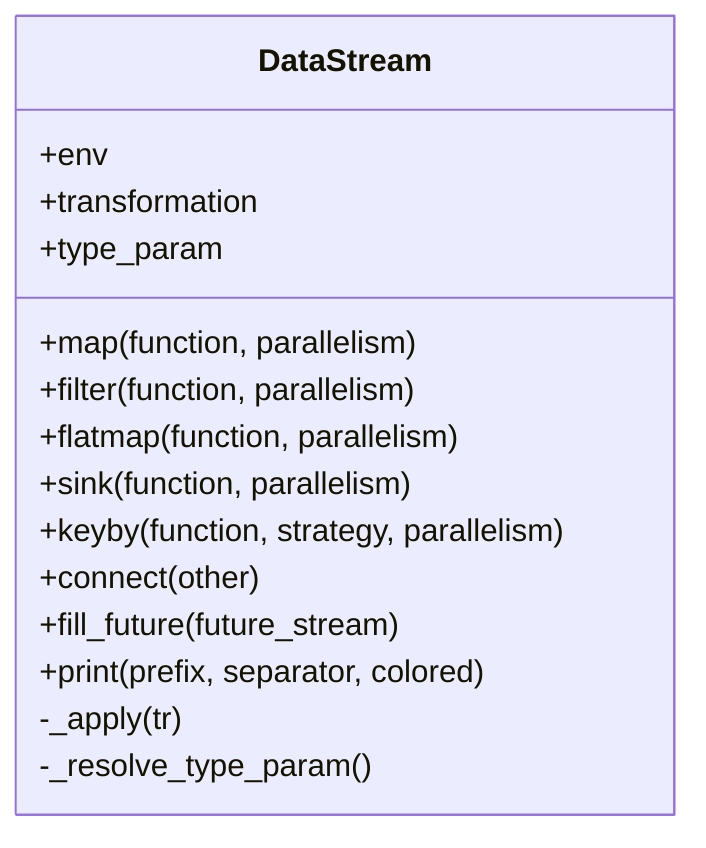
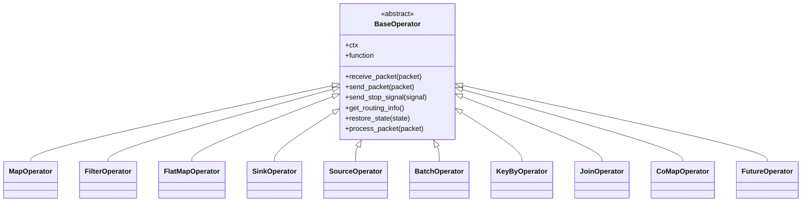
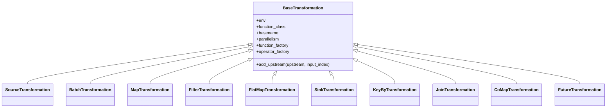
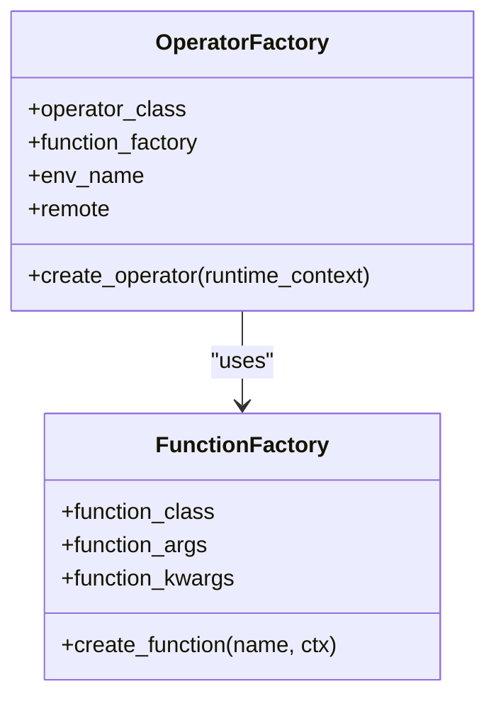
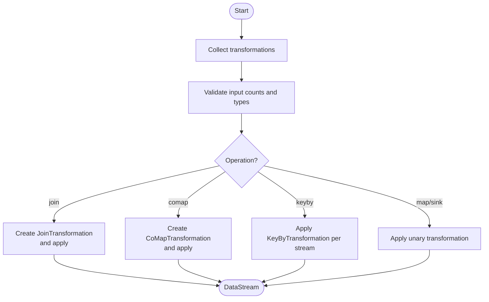
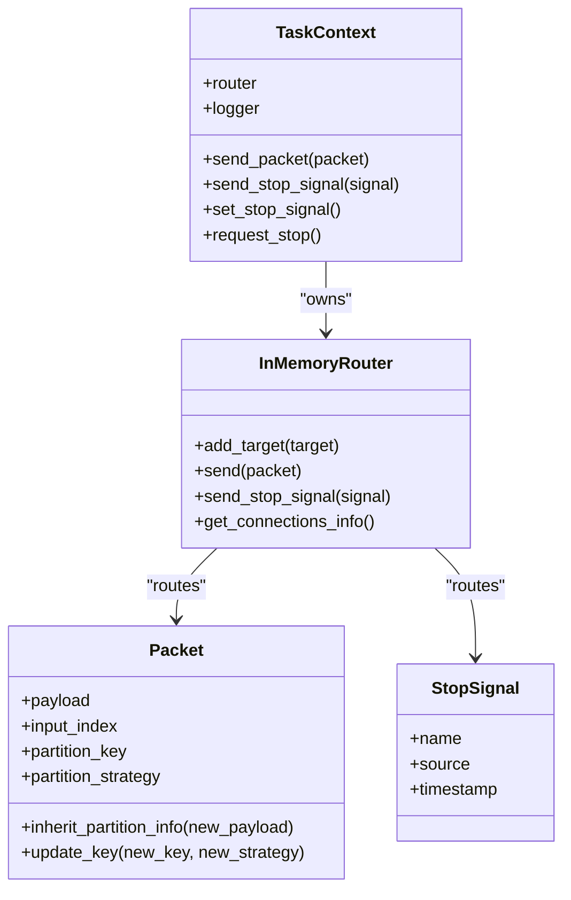
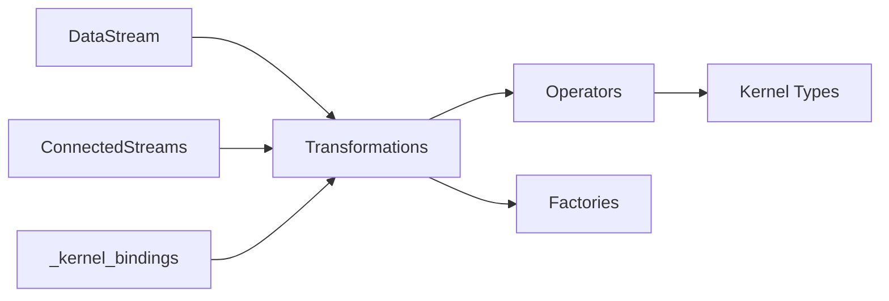

# Stream Layer

<cite>
**Referenced Files in This Document**
- [datastream.py](file://src/sage/stream/datastream.py)
- [operators.py](file://src/sage/stream/operators.py)
- [factories.py](file://src/sage/stream/factories.py)
- [transformations.py](file://src/sage/stream/transformations.py)
- [connected_streams.py](file://src/sage/stream/connected_streams.py)
- [_kernel_bindings.py](file://src/sage/stream/_kernel_bindings.py)
- [_runtime_kernel_types.py](file://src/sage/stream/_runtime_kernel_types.py)
- [streams.py](file://src/sage/runtime/flownet/compiler/streams.py)
</cite>

## Table of Contents
1. [Introduction](#introduction)
2. [Project Structure](#project-structure)
3. [Core Components](#core-components)
4. [Architecture Overview](#architecture-overview)
5. [Detailed Component Analysis](#detailed-component-analysis)
6. [Dependency Analysis](#dependency-analysis)
7. [Performance Considerations](#performance-considerations)
8. [Troubleshooting Guide](#troubleshooting-guide)
9. [Conclusion](#conclusion)
10. [Appendices](#appendices)

## Introduction
This document explains the Stream Layer of SAGE’s streaming data processing system. The layer centers on DataStream and operator abstractions to enable declarative pipeline composition. Through chaining operators—map, filter, flat_map, join, and sink—users can express complex AI workflows. The underlying packet-based data flow ensures efficient, partition-aware processing across single or multiple streams. This guide provides both beginner-friendly overviews of stream processing fundamentals and technical insights for advanced performance tuning and multi-stream coordination.

## Project Structure
The Stream Layer is organized into cohesive modules:
- DataStream: The primary user-facing abstraction for building and composing pipelines.
- Operators: Runtime operator implementations that process Packet payloads.
- Transformations: Declarative transformation classes that define operator wiring and metadata.
- Factories: Factory helpers to instantiate functions and operators consistently.
- ConnectedStreams: Abstraction for multi-stream operations (join, co-map).
- Kernel Types: Lightweight packet, router, and context primitives powering the runtime.
- Kernel Bindings: Public re-exports of transformation classes for external use.
- Runtime Compiler DataStream: A separate, lower-level DataStream used by the flow compiler.

**Diagram sources**
- [datastream.py:26-182](file://src/sage/stream/datastream.py#L26-L182)
- [connected_streams.py:28-207](file://src/sage/stream/connected_streams.py#L28-L207)
- [transformations.py:63-421](file://src/sage/stream/transformations.py#L63-L421)
- [operators.py:41-526](file://src/sage/stream/operators.py#L41-L526)
- [factories.py:13-54](file://src/sage/stream/factories.py#L13-L54)
- [_kernel_bindings.py:5-30](file://src/sage/stream/_kernel_bindings.py#L5-L30)
- [_runtime_kernel_types.py:22-267](file://src/sage/stream/_runtime_kernel_types.py#L22-L267)

**Section sources**
- [datastream.py:26-182](file://src/sage/stream/datastream.py#L26-L182)
- [connected_streams.py:28-207](file://src/sage/stream/connected_streams.py#L28-L207)
- [transformations.py:63-421](file://src/sage/stream/transformations.py#L63-L421)
- [operators.py:41-526](file://src/sage/stream/operators.py#L41-L526)
- [factories.py:13-54](file://src/sage/stream/factories.py#L13-L54)
- [_kernel_bindings.py:5-30](file://src/sage/stream/_kernel_bindings.py#L5-L30)
- [_runtime_kernel_types.py:22-267](file://src/sage/stream/_runtime_kernel_types.py#L22-L267)

## Core Components
- DataStream: A generic, declarative handle representing a single stream. It exposes map, filter, flatmap, sink, keyby, connect, and print APIs. Internally, it attaches transformations to the environment pipeline and returns a new DataStream bound to the resulting transformation.
- Operators: Concrete operator implementations that operate on Packet payloads. They include MapOperator, FilterOperator, FlatMapOperator, SinkOperator, SourceOperator, BatchOperator, KeyByOperator, JoinOperator, CoMapOperator, and FutureOperator.
- Transformations: Declarative transformation classes that encapsulate operator selection, parallelism, naming, and upstream/downstream wiring. Examples include MapTransformation, FilterTransformation, FlatMapTransformation, SinkTransformation, KeyByTransformation, JoinTransformation, CoMapTransformation, and FutureTransformation.
- Factories: FunctionFactory and OperatorFactory provide consistent instantiation of BaseFunction subclasses and operator instances with proper context injection.
- ConnectedStreams: Enables multi-stream operations by aggregating multiple transformations and applying join, co-map, keyby, map, and sink operations across them.
- Kernel Types: Packet carries payload and partition metadata; StopSignal marks termination; TaskContext and InMemoryRouter provide minimal runtime context and inter-operator routing.

Practical usage patterns:
- Single-stream pipelines: env.from_source(...).map(...).filter(...).sink(...)
- Multi-stream pipelines: env.from_source(...).connect(env.from_source(...)).keyby(...).join(...)
- Debugging: .print(prefix="...") to inspect intermediate results.

**Section sources**
- [datastream.py:26-182](file://src/sage/stream/datastream.py#L26-L182)
- [operators.py:41-526](file://src/sage/stream/operators.py#L41-L526)
- [transformations.py:63-421](file://src/sage/stream/transformations.py#L63-L421)
- [factories.py:13-54](file://src/sage/stream/factories.py#L13-L54)
- [connected_streams.py:28-207](file://src/sage/stream/connected_streams.py#L28-L207)
- [_runtime_kernel_types.py:22-267](file://src/sage/stream/_runtime_kernel_types.py#L22-L267)

## Architecture Overview
The Stream Layer sits between user-facing DataStream and the runtime kernel. DataStream and ConnectedStreams translate high-level operations into transformations. Transformations select operator classes and wire upstream/downstream links. Operators consume Packet payloads via TaskContext and InMemoryRouter, emitting results or StopSignal to downstream operators.

**Diagram sources**
- [datastream.py:52-175](file://src/sage/stream/datastream.py#L52-L175)
- [transformations.py:63-146](file://src/sage/stream/transformations.py#L63-L146)
- [operators.py:41-105](file://src/sage/stream/operators.py#L41-L105)
- [_runtime_kernel_types.py:86-267](file://src/sage/stream/_runtime_kernel_types.py#L86-L267)

## Detailed Component Analysis

### DataStream: Declarative Pipeline Builder
DataStream is the primary abstraction for constructing pipelines. It:
- Wraps a BaseTransformation and environment.
- Exposes map, filter, flatmap, sink, keyby, connect, print, and fill_future.
- Applies transformations by adding upstream links and appending to the environment pipeline.
- Resolves type parameters for generic safety.

**Diagram sources**
- [datastream.py:26-182](file://src/sage/stream/datastream.py#L26-L182)

**Section sources**
- [datastream.py:26-182](file://src/sage/stream/datastream.py#L26-L182)

### Operators: Packet-Based Execution
Operators implement the BaseOperator interface and process Packet payloads:
- MapOperator: Executes a function and forwards a derived Packet.
- FilterOperator: Passes packets that satisfy a predicate.
- FlatMapOperator: Emits zero or more packets per input using a collector.
- SinkOperator: Consumes packets without forwarding.
- SourceOperator: Produces packets and emits StopSignal to terminate.
- BatchOperator: Drives batch-style processing and stop signaling.
- KeyByOperator: Extracts keys and updates partition metadata.
- JoinOperator: Joins keyed data from two streams using a join function.
- CoMapOperator: Applies per-stream mapping functions across multiple inputs.
- FutureOperator: Placeholder for deferred transformations.

**Diagram sources**
- [operators.py:41-526](file://src/sage/stream/operators.py#L41-L526)

**Section sources**
- [operators.py:41-526](file://src/sage/stream/operators.py#L41-L526)

### Transformations: Declarative Wiring
Transformations define operator selection, naming, parallelism, and upstream/downstream relationships:
- BaseTransformation: Shared behavior for all transformations.
- SourceTransformation/BatchTransformation: Spout-like sources.
- MapTransformation/FilterTransformation/FlatMapTransformation: Unary transformations.
- SinkTransformation: Terminal transformation.
- KeyByTransformation: Adds partition metadata.
- JoinTransformation/CoMapTransformation: Multi-input transformations.
- FutureTransformation: Placeholder for feedback edges.

**Diagram sources**
- [transformations.py:63-421](file://src/sage/stream/transformations.py#L63-L421)

**Section sources**
- [transformations.py:63-421](file://src/sage/stream/transformations.py#L63-L421)

### Factories: Consistent Instantiation
- FunctionFactory: Creates BaseFunction instances and injects TaskContext.
- OperatorFactory: Builds operator instances with function_factory and runtime context.

**Diagram sources**
- [factories.py:13-54](file://src/sage/stream/factories.py#L13-L54)

**Section sources**
- [factories.py:13-54](file://src/sage/stream/factories.py#L13-L54)

### ConnectedStreams: Multi-Stream Coordination
ConnectedStreams enables:
- Joining exactly two keyed streams.
- Applying CoMap across N streams with per-stream mapN methods.
- Keying streams uniformly or per-stream.
- Chaining map and sink operations across multiple streams.

**Diagram sources**
- [connected_streams.py:96-197](file://src/sage/stream/connected_streams.py#L96-L197)

**Section sources**
- [connected_streams.py:28-207](file://src/sage/stream/connected_streams.py#L28-L207)

### Kernel Types: Packet-Based Data Flow
- Packet: Carries payload, input index, partition key, and partition strategy.
- StopSignal: Sentinel indicating end-of-stream or batch.
- InMemoryRouter: Routes packets to downstream operators or callables.
- TaskContext: Provides logging, routing, stop signaling, and queue descriptors.

**Diagram sources**
- [_runtime_kernel_types.py:22-267](file://src/sage/stream/_runtime_kernel_types.py#L22-L267)

**Section sources**
- [_runtime_kernel_types.py:22-267](file://src/sage/stream/_runtime_kernel_types.py#L22-L267)

### Relationship to Flow Compiler DataStream
There is a separate DataStream in the runtime compiler that operates at a different layer. It is used during compilation and planning, distinct from the in-tree stream layer documented here.

**Section sources**
- [streams.py:129-200](file://src/sage/runtime/flownet/compiler/streams.py#L129-L200)

## Dependency Analysis
The Stream Layer exhibits clean separation of concerns:
- DataStream depends on Transformations and Environment to construct pipelines.
- Transformations depend on Operators and Factories to materialize runtime behavior.
- Operators depend on Kernel Types for packet routing and context.
- ConnectedStreams composes multiple transformations and enforces multi-stream semantics.

**Diagram sources**
- [datastream.py:26-182](file://src/sage/stream/datastream.py#L26-L182)
- [connected_streams.py:28-207](file://src/sage/stream/connected_streams.py#L28-L207)
- [transformations.py:63-421](file://src/sage/stream/transformations.py#L63-L421)
- [operators.py:41-526](file://src/sage/stream/operators.py#L41-L526)
- [factories.py:13-54](file://src/sage/stream/factories.py#L13-L54)
- [_kernel_bindings.py:5-30](file://src/sage/stream/_kernel_bindings.py#L5-L30)
- [_runtime_kernel_types.py:22-267](file://src/sage/stream/_runtime_kernel_types.py#L22-L267)

**Section sources**
- [datastream.py:26-182](file://src/sage/stream/datastream.py#L26-L182)
- [connected_streams.py:28-207](file://src/sage/stream/connected_streams.py#L28-L207)
- [transformations.py:63-421](file://src/sage/stream/transformations.py#L63-L421)
- [operators.py:41-526](file://src/sage/stream/operators.py#L41-L526)
- [factories.py:13-54](file://src/sage/stream/factories.py#L13-L54)
- [_kernel_bindings.py:5-30](file://src/sage/stream/_kernel_bindings.py#L5-L30)
- [_runtime_kernel_types.py:22-267](file://src/sage/stream/_runtime_kernel_types.py#L22-L267)

## Performance Considerations
- Parallelism: Set per operator via parallelism arguments to scale throughput. Higher parallelism increases resource usage; tune based on workload characteristics.
- Partitioning: Use keyby to distribute load and enable joins. Choose partition strategies aligned with downstream fan-out needs.
- Backpressure and stop signals: Operators propagate StopSignal to halt processing gracefully. Ensure sinks and sources handle stop signals to avoid stalls.
- Memory management: FlatMapOperator uses a Collector to batch emissions; ensure functions avoid excessive memory retention per packet.
- Profiling: MapOperator supports optional profiling to record execution durations; use for performance diagnostics.
- Batch operations: BatchOperator is suited for periodic or batch-driven sources; adjust delay and progress logging intervals for responsiveness.

[No sources needed since this section provides general guidance]

## Troubleshooting Guide
Common issues and resolutions:
- Join requires keyed streams: Ensure each input stream is keyed before join. Use keyby on each stream prior to join.
- CoMap method mismatch: Provide a function class implementing map0, map1, ... up to the number of input streams.
- Lambda limitations: Some operations (e.g., keyby, comap) require class-based functions inheriting from specific base classes.
- Feedback edges: fill_future must target a FutureTransformation created by the environment’s future mechanism; avoid filling twice.
- Stop signal propagation: If a downstream operator stops, verify upstream operators handle StopSignal and stop events.

**Section sources**
- [connected_streams.py:104-136](file://src/sage/stream/connected_streams.py#L104-L136)
- [transformations.py:263-335](file://src/sage/stream/transformations.py#L263-L335)
- [operators.py:326-348](file://src/sage/stream/operators.py#L326-L348)
- [datastream.py:150-167](file://src/sage/stream/datastream.py#L150-L167)

## Conclusion
The Stream Layer provides a robust, declarative abstraction for building streaming pipelines. DataStream and ConnectedStreams enable intuitive composition, while Transformations and Operators implement efficient, packet-based processing. By leveraging keyby, join, and co-map, users can coordinate multi-stream workflows. The kernel types and factories ensure consistent, testable runtime behavior. For advanced scenarios, tune parallelism, partitioning, and stop signaling to achieve optimal performance and reliability.

[No sources needed since this section summarizes without analyzing specific files]

## Appendices

### Practical Patterns and Examples
- Basic pipeline: Source → map → filter → sink
- Multi-stream join: Two keyed streams joined via a join function
- Multi-stream co-map: Combine outputs from N streams using per-stream mapN methods
- Batch processing: Periodic or batch-driven source with BatchOperator
- Windowing and multi-stream coordination: Use keyby to align partitions, then join or co-map to combine streams

[No sources needed since this section provides general guidance]