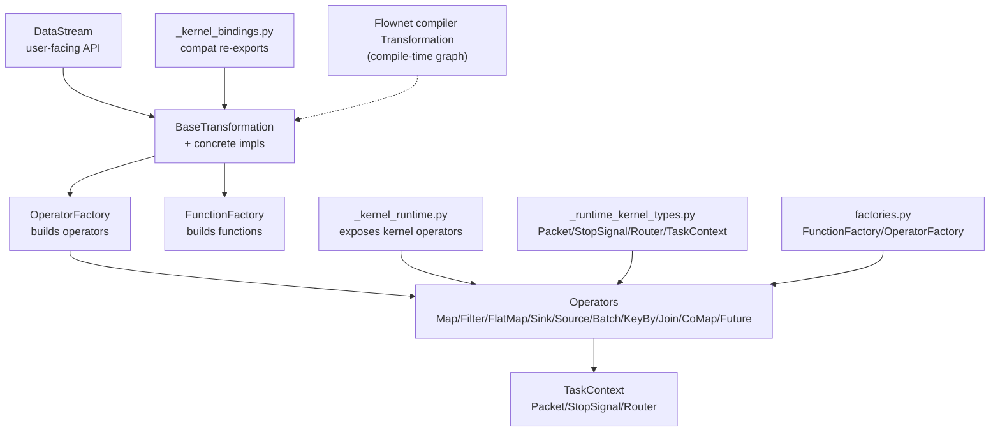
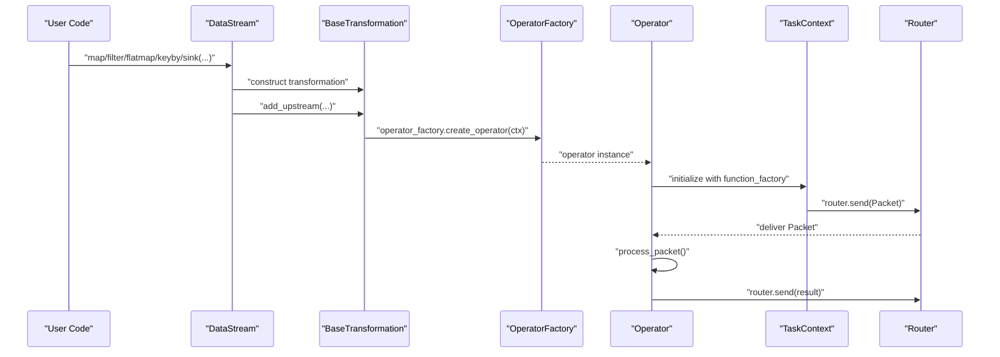
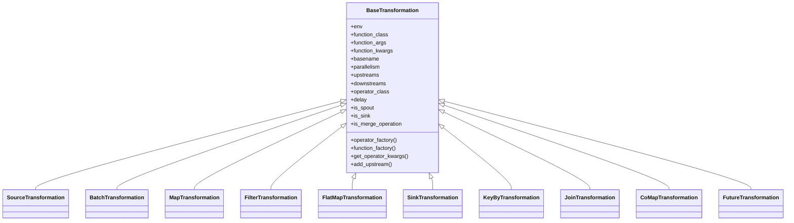
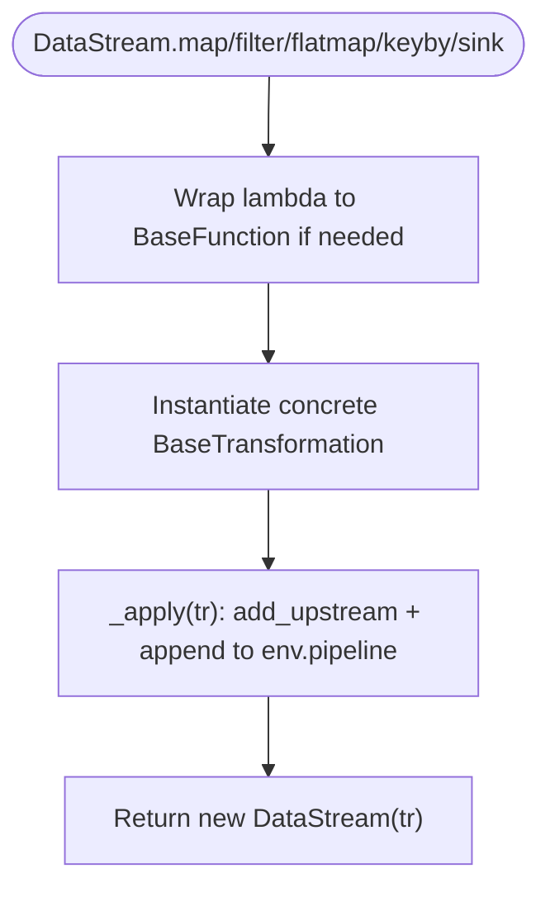
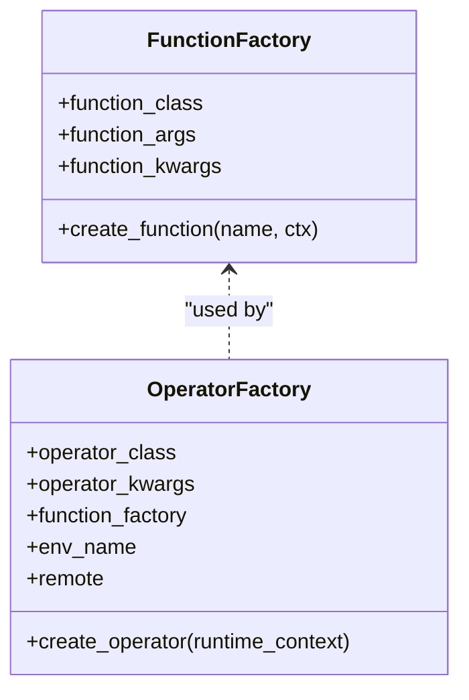
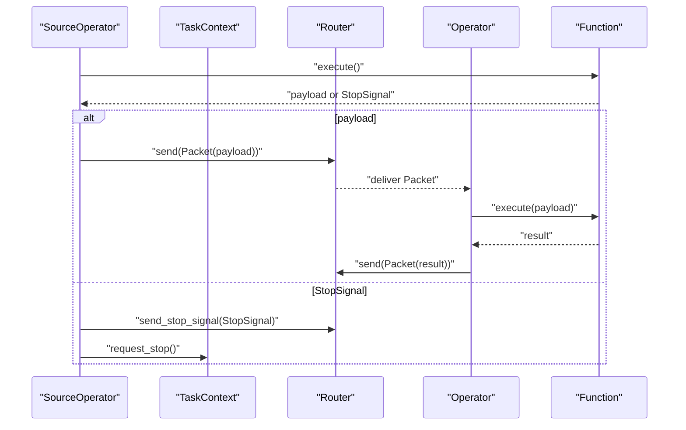
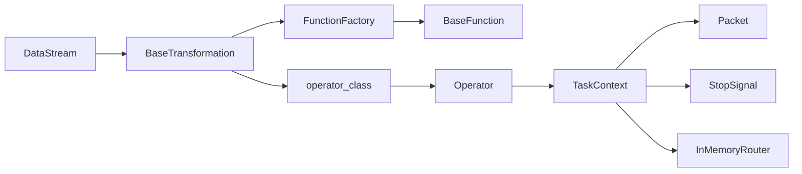

# Transformation System

<cite>
**Referenced Files in This Document**
- [transformations.py](file://src/sage/stream/transformations.py)
- [operators.py](file://src/sage/stream/operators.py)
- [datastream.py](file://src/sage/stream/datastream.py)
- [_kernel_bindings.py](file://src/sage/stream/_kernel_bindings.py)
- [_kernel_runtime.py](file://src/sage/stream/_kernel_runtime.py)
- [factories.py](file://src/sage/stream/factories.py)
- [_runtime_kernel_types.py](file://src/sage/stream/_runtime_kernel_types.py)
- [transformation.py](file://src/sage/runtime/flownet/compiler/transformation.py)
</cite>

## Table of Contents
1. [Introduction](#introduction)
2. [Project Structure](#project-structure)
3. [Core Components](#core-components)
4. [Architecture Overview](#architecture-overview)
5. [Detailed Component Analysis](#detailed-component-analysis)
6. [Dependency Analysis](#dependency-analysis)
7. [Performance Considerations](#performance-considerations)
8. [Troubleshooting Guide](#troubleshooting-guide)
9. [Conclusion](#conclusion)
10. [Appendices](#appendices)

## Introduction
This document explains SAGE’s transformation system that powers operator execution in streaming pipelines. It focuses on the BaseTransformation abstract class and its concrete implementations (MapTransformation, FilterTransformation, FlatMapTransformation, SinkTransformation, SourceTransformation, KeyByTransformation, JoinTransformation, CoMapTransformation, FutureTransformation, BatchTransformation). It documents the transformation lifecycle, execution model, and how transformations interact with the runtime environment. It also covers transformation registration, type resolution, and the kernel binding system, along with performance considerations, memory management, and debugging techniques.

## Project Structure
The transformation system spans several modules:
- Stream transformation layer: defines transformation abstractions and concrete transformations.
- Stream operator layer: defines kernel-side operators that execute functions.
- Runtime kernel types: provides packets, stop signals, routers, and task contexts.
- Factories: construct function and operator instances for runtime.
- Kernel bindings: compatibility re-exports for the in-tree stream surface.
- DataStream: user-facing API that builds pipelines via transformations.
- Flownet compiler transformation: a separate representation used during compilation.

**Diagram sources**
- [datastream.py:26-182](file://src/sage/stream/datastream.py#L26-L182)
- [transformations.py:63-421](file://src/sage/stream/transformations.py#L63-L421)
- [_kernel_bindings.py:5-29](file://src/sage/stream/_kernel_bindings.py#L5-L29)
- [_kernel_runtime.py:5-32](file://src/sage/stream/_kernel_runtime.py#L5-L32)
- [operators.py:41-526](file://src/sage/stream/operators.py#L41-L526)
- [_runtime_kernel_types.py:22-267](file://src/sage/stream/_runtime_kernel_types.py#L22-L267)
- [factories.py:13-54](file://src/sage/stream/factories.py#L13-L54)
- [transformation.py:23-101](file://src/sage/runtime/flownet/compiler/transformation.py#L23-L101)

**Section sources**
- [datastream.py:26-182](file://src/sage/stream/datastream.py#L26-L182)
- [transformations.py:63-421](file://src/sage/stream/transformations.py#L63-L421)
- [_kernel_bindings.py:5-29](file://src/sage/stream/_kernel_bindings.py#L5-L29)
- [_kernel_runtime.py:5-32](file://src/sage/stream/_kernel_runtime.py#L5-L32)
- [operators.py:41-526](file://src/sage/stream/operators.py#L41-L526)
- [_runtime_kernel_types.py:22-267](file://src/sage/stream/_runtime_kernel_types.py#L22-L267)
- [factories.py:13-54](file://src/sage/stream/factories.py#L13-L54)
- [transformation.py:23-101](file://src/sage/runtime/flownet/compiler/transformation.py#L23-L101)

## Core Components
- BaseTransformation: Abstract base for all transformations. Manages environment, function class and arguments, naming, upstream/downstream links, parallelism, and operator factory creation.
- Concrete transformations:
  - SourceTransformation, BatchTransformation: spout-like sources with configurable delays and progress logging.
  - MapTransformation, FilterTransformation, FlatMapTransformation: unary transformations operating on packets.
  - SinkTransformation: terminal operator consuming packets.
  - KeyByTransformation: partitions stream by keys using a partition strategy.
  - JoinTransformation: joins two keyed streams using a join function with signature validation.
  - CoMapTransformation: multi-input mapping using map0, map1, … methods.
  - FutureTransformation: placeholder transformation resolved later to another transformation for feedback edges.
- Operators: Kernel-side implementations of transformations. They receive packets, invoke functions, route results, and handle stop signals.
- Factories: FunctionFactory constructs function instances per task context; OperatorFactory constructs operator instances with function factory and runtime context.
- Runtime kernel types: Packet carries payload and partition metadata; StopSignal terminates streams; TaskContext provides routing and lifecycle hooks; InMemoryRouter connects operators.

**Section sources**
- [transformations.py:63-421](file://src/sage/stream/transformations.py#L63-L421)
- [operators.py:41-526](file://src/sage/stream/operators.py#L41-L526)
- [factories.py:13-54](file://src/sage/stream/factories.py#L13-L54)
- [_runtime_kernel_types.py:22-267](file://src/sage/stream/_runtime_kernel_types.py#L22-L267)

## Architecture Overview
The transformation system separates the user-facing DataStream API from kernel-side operators. DataStream builds a pipeline of BaseTransformation nodes. Each transformation encapsulates:
- Environment and function metadata
- Upstream/downstream links
- Parallelism and naming
- An operator factory that creates a kernel operator bound to a TaskContext

Kernel operators receive Packet objects, execute functions, and route outputs via TaskContext.router. Stop signals propagate to halt processing.

**Diagram sources**
- [datastream.py:52-176](file://src/sage/stream/datastream.py#L52-L176)
- [transformations.py:114-124](file://src/sage/stream/transformations.py#L114-L124)
- [operators.py:41-105](file://src/sage/stream/operators.py#L41-L105)
- [_kernel_runtime.py:5-32](file://src/sage/stream/_kernel_runtime.py#L5-L32)
- [_runtime_kernel_types.py:86-131](file://src/sage/stream/_runtime_kernel_types.py#L86-L131)

## Detailed Component Analysis

### BaseTransformation and Lifecycle
- Construction: Stores environment, function class/args, name deduplication, parallelism, and initializes operator/function factories lazily.
- Upstream/Downstream: add_upstream wires transformations and tracks input indices.
- Operator Factory: operator_factory builds an OperatorFactory with operator_class, function_factory, and extra operator kwargs.
- Properties: delay, is_spout, is_sink, is_merge_operation influence runtime behavior and scheduling.
- Execution: Not implemented here; delegated to kernel operators.

**Diagram sources**
- [transformations.py:63-421](file://src/sage/stream/transformations.py#L63-L421)

**Section sources**
- [transformations.py:63-146](file://src/sage/stream/transformations.py#L63-L146)
- [transformations.py:148-421](file://src/sage/stream/transformations.py#L148-L421)

### DataStream API and Pipeline Construction
- DataStream wraps a BaseTransformation and exposes fluent methods:
  - map, filter, flatmap, sink, keyby
  - connect to combine streams
  - fill_future to resolve FutureTransformation placeholders
- Each method constructs the corresponding transformation, applies it, and appends to the environment pipeline.

**Diagram sources**
- [datastream.py:52-176](file://src/sage/stream/datastream.py#L52-L176)

**Section sources**
- [datastream.py:26-182](file://src/sage/stream/datastream.py#L26-L182)

### Kernel Binding and Operator Creation
- _kernel_bindings.py re-exports transformation classes for internal use.
- _kernel_runtime.py re-exports operator classes and function/operator factories.
- factories.py defines FunctionFactory and OperatorFactory used by transformations to create function/operator instances bound to TaskContext.

**Diagram sources**
- [factories.py:13-54](file://src/sage/stream/factories.py#L13-L54)
- [_kernel_runtime.py:5-32](file://src/sage/stream/_kernel_runtime.py#L5-L32)
- [_kernel_bindings.py:5-29](file://src/sage/stream/_kernel_bindings.py#L5-L29)

**Section sources**
- [_kernel_bindings.py:5-29](file://src/sage/stream/_kernel_bindings.py#L5-L29)
- [_kernel_runtime.py:5-32](file://src/sage/stream/_kernel_runtime.py#L5-L32)
- [factories.py:13-54](file://src/sage/stream/factories.py#L13-L54)

### Operator Execution Model
- Operators receive Packet objects via TaskContext.router and call process_packet.
- Operators invoke function.execute(...) and route results; they handle StopSignal propagation and special cases (e.g., SourceOperator emitting StopSignal and requesting stop).
- KeyByOperator updates partition_key and partition_strategy; JoinOperator validates keyed packets and executes join function; CoMapOperator selects mapN based on input_index.

**Diagram sources**
- [operators.py:264-304](file://src/sage/stream/operators.py#L264-L304)
- [_runtime_kernel_types.py:22-131](file://src/sage/stream/_runtime_kernel_types.py#L22-L131)

**Section sources**
- [operators.py:107-526](file://src/sage/stream/operators.py#L107-L526)
- [_runtime_kernel_types.py:22-267](file://src/sage/stream/_runtime_kernel_types.py#L22-L267)

### Concrete Transformations and Their Operators

#### MapTransformation
- Purpose: Unary transform applying function.execute to each packet.
- Operator: MapOperator invokes function.execute and forwards Packet with inherited partition info.

**Section sources**
- [transformations.py:201-205](file://src/sage/stream/transformations.py#L201-L205)
- [operators.py:107-194](file://src/sage/stream/operators.py#L107-L194)

#### FilterTransformation
- Purpose: Pass-through filter using function.execute to decide whether to forward a packet.
- Operator: FilterOperator evaluates predicate and sends packet if true.

**Section sources**
- [transformations.py:207-211](file://src/sage/stream/transformations.py#L207-L211)
- [operators.py:196-207](file://src/sage/stream/operators.py#L196-L207)

#### FlatMapTransformation
- Purpose: One-to-many mapping; function.execute returns iterable or single item.
- Operator: FlatMapOperator collects outputs via Collector and emits each item preserving partition info.

**Section sources**
- [transformations.py:213-217](file://src/sage/stream/transformations.py#L213-L217)
- [operators.py:209-242](file://src/sage/stream/operators.py#L209-L242)

#### SinkTransformation
- Purpose: Terminal operator; consumes payloads without forwarding.
- Operator: SinkOperator calls function.execute and optionally closes resources on stop.

**Section sources**
- [transformations.py:219-235](file://src/sage/stream/transformations.py#L219-L235)
- [operators.py:244-262](file://src/sage/stream/operators.py#L244-L262)

#### SourceTransformation
- Purpose: Producer operator; generates initial packets or StopSignal.
- Operator: SourceOperator executes function and emits StopSignal to halt; requests stop and sets flags.

**Section sources**
- [transformations.py:148-168](file://src/sage/stream/transformations.py#L148-L168)
- [operators.py:264-304](file://src/sage/stream/operators.py#L264-L304)

#### BatchTransformation
- Purpose: Batch-producing operator; emits a batch and may terminate with StopSignal.
- Operator: BatchOperator executes function and forwards result or StopSignal.

**Section sources**
- [transformations.py:170-199](file://src/sage/stream/transformations.py#L170-L199)
- [operators.py:305-324](file://src/sage/stream/operators.py#L305-L324)

#### KeyByTransformation
- Purpose: Partitions stream by extracting keys via function.execute.
- Operator: KeyByOperator computes key and updates Packet partition_key and partition_strategy.

**Section sources**
- [transformations.py:237-261](file://src/sage/stream/transformations.py#L237-L261)
- [operators.py:326-349](file://src/sage/stream/operators.py#L326-L349)

#### JoinTransformation
- Purpose: Joins two keyed streams using a join function with validated signature.
- Validation: Requires is_join=True and execute method with expected parameters.
- Operator: JoinOperator ensures keyed packets, calls function.execute, and emits joined results.

**Section sources**
- [transformations.py:263-335](file://src/sage/stream/transformations.py#L263-L335)
- [operators.py:367-459](file://src/sage/stream/operators.py#L367-L459)

#### CoMapTransformation
- Purpose: Multi-input mapping using map0, map1, … methods.
- Validation: Requires is_comap=True and presence of map0/map1; counts supported inputs dynamically.
- Operator: CoMapOperator routes to mapN based on input_index and handles stop signals when all expected inputs finish.

**Section sources**
- [transformations.py:337-375](file://src/sage/stream/transformations.py#L337-L375)
- [operators.py:461-526](file://src/sage/stream/operators.py#L461-L526)

#### FutureTransformation
- Purpose: Placeholder transformation resolved later to another transformation for feedback edges.
- Behavior: Validates fill_once semantics and redirects downstream edges after resolution.

**Section sources**
- [transformations.py:377-421](file://src/sage/stream/transformations.py#L377-L421)
- [datastream.py:150-168](file://src/sage/stream/datastream.py#L150-L168)

### Relationship Between Transformations and Operators
- Each BaseTransformation stores operator_class and uses operator_factory to create a kernel operator bound to a TaskContext.
- The operator receives packets, executes the function, and routes results; it interacts with TaskContext for routing and lifecycle.

**Section sources**
- [transformations.py:114-124](file://src/sage/stream/transformations.py#L114-L124)
- [operators.py:41-105](file://src/sage/stream/operators.py#L41-L105)
- [factories.py:33-54](file://src/sage/stream/factories.py#L33-L54)

### Parallelism and Resource Allocation
- Parallelism is stored in BaseTransformation and used by the environment to schedule multiple operator instances.
- Operators rely on TaskContext for parallel_index and parallelism; routers fan out packets to downstream targets.
- Memory management: FlatMapOperator uses Collector to buffer outputs; Packet copies preserve partition info without deep cloning payloads unless necessary.

**Section sources**
- [transformations.py:92-94](file://src/sage/stream/transformations.py#L92-L94)
- [_runtime_kernel_types.py:86-131](file://src/sage/stream/_runtime_kernel_types.py#L86-L131)
- [operators.py:210-242](file://src/sage/stream/operators.py#L210-L242)

### Transformation Registration and Type Resolution
- DataStream maintains a mapping of transformation classes and constructs them on demand.
- Type resolution: DataStream resolves generic type parameters for DataStream[T] using typing introspection.
- Kernel bindings: _kernel_bindings.py re-exports transformation classes for internal use.

**Section sources**
- [datastream.py:39-50](file://src/sage/stream/datastream.py#L39-L50)
- [datastream.py:177-182](file://src/sage/stream/datastream.py#L177-L182)
- [_kernel_bindings.py:5-29](file://src/sage/stream/_kernel_bindings.py#L5-L29)

### Kernel Binding System
- FunctionFactory: Creates function instances with injected TaskContext.
- OperatorFactory: Builds operator instances with function factory and operator-specific kwargs.
- Kernel runtime exposure: _kernel_runtime.py re-exports operator classes and factories for use by transformations.

**Section sources**
- [factories.py:13-54](file://src/sage/stream/factories.py#L13-L54)
- [_kernel_runtime.py:5-32](file://src/sage/stream/_kernel_runtime.py#L5-L32)

### Flownet Compiler Transformation (Compile-Time Graph)
- Transformation (compile-time): Represents a node in the compiled flow graph with target validation, upstream/downstream links, and operator configuration.
- Used during compilation to validate targets and normalize symbolic references.

**Section sources**
- [transformation.py:23-101](file://src/sage/runtime/flownet/compiler/transformation.py#L23-L101)

## Dependency Analysis
- DataStream depends on BaseTransformation subclasses and environment pipeline.
- BaseTransformation depends on operator classes and function classes.
- Operators depend on TaskContext, Packet, StopSignal, and InMemoryRouter.
- Factories decouple function/operator creation from runtime specifics.

**Diagram sources**
- [datastream.py:26-182](file://src/sage/stream/datastream.py#L26-L182)
- [transformations.py:63-146](file://src/sage/stream/transformations.py#L63-L146)
- [operators.py:41-105](file://src/sage/stream/operators.py#L41-L105)
- [_runtime_kernel_types.py:22-131](file://src/sage/stream/_runtime_kernel_types.py#L22-L131)
- [factories.py:13-54](file://src/sage/stream/factories.py#L13-L54)

**Section sources**
- [datastream.py:26-182](file://src/sage/stream/datastream.py#L26-L182)
- [transformations.py:63-146](file://src/sage/stream/transformations.py#L63-L146)
- [operators.py:41-105](file://src/sage/stream/operators.py#L41-L105)
- [_runtime_kernel_types.py:22-131](file://src/sage/stream/_runtime_kernel_types.py#L22-L131)
- [factories.py:13-54](file://src/sage/stream/factories.py#L13-L54)

## Performance Considerations
- Minimize payload copying: Packet inherits partition info; avoid unnecessary deep copies.
- Use FlatMapOperator Collector judiciously; flush and clear buffers after emission.
- Profile MapOperator execution when enable_profile is configured; persist timing records periodically.
- Control throughput via parallelism and operator delay; tune environment settings.
- Avoid excessive stop signal churn; ensure StopSignal propagation is intentional.

[No sources needed since this section provides general guidance]

## Troubleshooting Guide
- Validation failures:
  - JoinTransformation validates is_join=True and execute signature; ensure function meets requirements.
  - CoMapTransformation validates is_comap=True and presence of map0/map1; ensure methods exist and are not abstract.
- Missing or invalid targets:
  - Flownet Transformation validates targets and normalizes symbolic references; check target types and normalization.
- Operator errors:
  - Operators log exceptions and attempt graceful forwarding of error payloads (CoMapOperator).
  - SinkOperator.handle_stop_signal invokes close when available.
- Debugging:
  - Enable operator profiling in MapOperator to capture execution durations.
  - Inspect TaskContext logs and router connections for routing issues.

**Section sources**
- [transformations.py:263-335](file://src/sage/stream/transformations.py#L263-L335)
- [transformations.py:337-375](file://src/sage/stream/transformations.py#L337-L375)
- [transformation.py:51-79](file://src/sage/runtime/flownet/compiler/transformation.py#L51-L79)
- [operators.py:107-194](file://src/sage/stream/operators.py#L107-L194)
- [operators.py:461-526](file://src/sage/stream/operators.py#L461-L526)
- [operators.py:244-262](file://src/sage/stream/operators.py#L244-L262)

## Conclusion
SAGE’s transformation system cleanly separates user-facing stream APIs from kernel-side operators. BaseTransformation encapsulates environment, function metadata, and operator creation, while concrete transformations define operator semantics. Operators execute functions against Packet payloads, route results, and coordinate stop signaling. Factories and kernel types provide a robust runtime foundation. Understanding this architecture enables building efficient, maintainable transformations and diagnosing issues quickly.

[No sources needed since this section summarizes without analyzing specific files]

## Appendices

### Example References
- Constructing a map transformation and applying it:
  - [datastream.py:52-68](file://src/sage/stream/datastream.py#L52-L68)
  - [transformations.py:201-205](file://src/sage/stream/transformations.py#L201-L205)
- Building a keyed stream:
  - [datastream.py:121-142](file://src/sage/stream/datastream.py#L121-L142)
  - [transformations.py:237-261](file://src/sage/stream/transformations.py#L237-L261)
- Resolving a FutureTransformation:
  - [datastream.py:150-168](file://src/sage/stream/datastream.py#L150-L168)
  - [transformations.py:377-421](file://src/sage/stream/transformations.py#L377-L421)