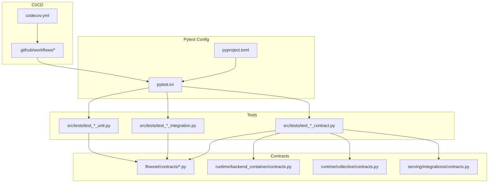
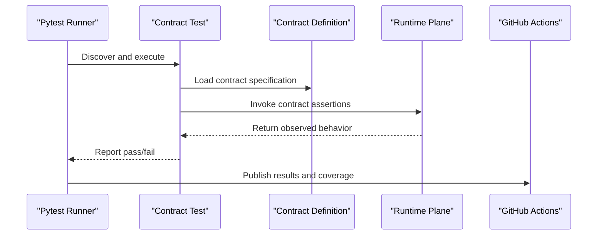
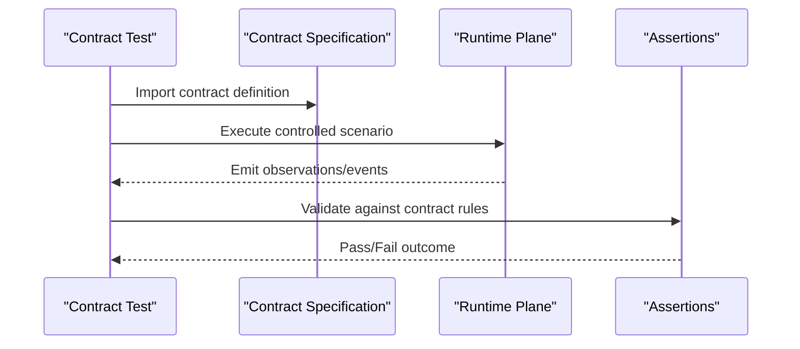
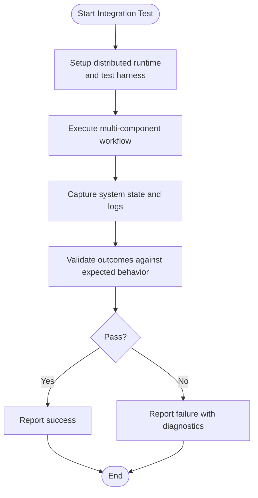
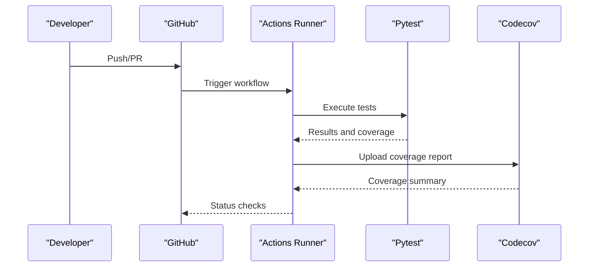
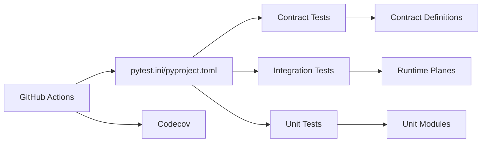

# Testing Framework

<cite>
**Referenced Files in This Document**
- [pytest.ini](file://pytest.ini)
- [pyproject.toml](file://pyproject.toml)
- [test_flownet_endpoint_plane_contract.py](file://src/tests/test_flownet_endpoint_plane_contract.py)
- [test_flownet_runtime_state_query.py](file://src/tests/test_flownet_runtime_state_query.py)
- [test_flownet_shared_state_service_contract.py](file://src/tests/test_flownet_shared_state_service_contract.py)
- [test_flownet_backend_container_plane_contract.py](file://src/tests/test_flownet_backend_container_plane_contract.py)
- [test_flownet_collective_executor_contract.py](file://src/tests/test_flownet_collective_executor_contract.py)
- [test_runtime_parallelism_contract.py](file://src/tests/test_runtime_parallelism_contract.py)
- [test_workflow_product_integration_contract.py](file://src/tests/test_workflow_product_integration_contract.py)
- [test_vamos_launcher_contract_runner.py](file://src/tests/test_vamos_launcher_contract_runner.py)
- [endpoint_plane_contract.py](file://src/sage/runtime/flownet/contracts/endpoint_plane_contract.py)
- [runtime_state_query_contract.py](file://src/sage/runtime/flownet/contracts/runtime_state_query_contract.py)
- [shared_state_contract.py](file://src/sage/runtime/flownet/contracts/shared_state_contract.py)
- [backend_container/contracts.py](file://src/sage/runtime/flownet/runtime/backend_container/contracts.py)
- [collective/contracts.py](file://src/sage/runtime/flownet/runtime/collective/contracts.py)
- [serving/integrations/contracts.py](file://src/sage/serving/integrations/contracts.py)
- [test_flownet_connector_checkpoint_fault_tolerance.py](file://src/tests/test_flownet_connector_checkpoint_fault_tolerance.py)
- [test_runtime_local_consolidation.py](file://src/tests/test_runtime_local_consolidation.py)
- [test_flownet_service_lifecycle_runner.py](file://src/tests/test_flownet_service_lifecycle_runner.py)
- [test_cli_main.py](file://src/tests/test_cli_main.py)
- [test_edge_app.py](file://src/tests/test_edge_app.py)
- [test_edge_core.py](file://src/tests/test_edge_core.py)
- [test_edge_server.py](file://src/tests/test_edge_server.py)
- [test_benchmark_carrier_stub.py](file://src/tests/test_benchmark_carrier_stub.py)
- [test_openai_replay_carrier.py](file://src/tests/test_openai_replay_carrier.py)
- [run_vamos_launcher_contract.py](file://tools/scripts/run_vamos_launcher_contract.py)
- [.github/workflows](file://github/workflows)
- [codecov.yml](file://codecov.yml)
</cite>

## Table of Contents
1. [Introduction](#introduction)
2. [Project Structure](#project-structure)
3. [Core Components](#core-components)
4. [Architecture Overview](#architecture-overview)
5. [Detailed Component Analysis](#detailed-component-analysis)
6. [Dependency Analysis](#dependency-analysis)
7. [Performance Considerations](#performance-considerations)
8. [Troubleshooting Guide](#troubleshooting-guide)
9. [Conclusion](#conclusion)
10. [Appendices](#appendices)

## Introduction
This document describes SAGE’s comprehensive testing framework and quality assurance system. The framework ensures code quality, validates functionality across all framework components, and maintains reliability through automated testing. It encompasses:
- Contract tests that define and enforce behavioral guarantees between distributed components
- Integration tests that validate end-to-end workflows and distributed system behavior
- Unit tests that verify isolated functionality and edge cases
- Pytest configuration and CI/CD integration for continuous quality assurance

The testing system is organized around layered testing strategies, contract validation, distributed system testing, and continuous integration workflows. It supports both beginner-friendly explanations of testing concepts and advanced guidance for writing, debugging, and extending tests.

## Project Structure
The testing system is primarily located under src/tests and integrates with pytest configuration and GitHub Actions workflows. Contracts defining cross-service behavior live under src/sage/runtime/flownet/contracts and related runtime packages. Supporting scripts and tools assist in contract runner execution and CI tasks.

**Diagram sources**
- [pytest.ini](file://pytest.ini)
- [pyproject.toml](file://pyproject.toml)
- [test_flownet_endpoint_plane_contract.py](file://src/tests/test_flownet_endpoint_plane_contract.py)
- [endpoint_plane_contract.py](file://src/sage/runtime/flownet/contracts/endpoint_plane_contract.py)
- [backend_container/contracts.py](file://src/sage/runtime/flownet/runtime/backend_container/contracts.py)
- [collective/contracts.py](file://src/sage/runtime/flownet/runtime/collective/contracts.py)
- [serving/integrations/contracts.py](file://src/sage/serving/integrations/contracts.py)
- [.github/workflows](file://github/workflows)
- [codecov.yml](file://codecov.yml)

**Section sources**
- [pytest.ini](file://pytest.ini)
- [pyproject.toml](file://pyproject.toml)

## Core Components
- Contract tests: Validate cross-service contracts such as endpoint plane, runtime state query, shared state, backend container plane, collective executor, and workflow product integration. These tests assert deterministic behavior and compatibility across distributed components.
- Integration tests: Cover end-to-end scenarios including connector checkpoint fault tolerance, local consolidation, service lifecycle, and parallelism contracts.
- Unit tests: Validate CLI entry points, edge components, and auxiliary utilities.
- Pytest configuration: Centralized settings for test discovery, markers, plugins, and coverage reporting.
- CI/CD integration: Automated test runs and coverage reporting via GitHub Actions and Codecov.

Key test categories and representative files:
- Contract tests: [test_flownet_endpoint_plane_contract.py], [test_flownet_runtime_state_query.py], [test_flownet_shared_state_service_contract.py], [test_flownet_backend_container_plane_contract.py], [test_flownet_collective_executor_contract.py], [test_runtime_parallelism_contract.py], [test_workflow_product_integration_contract.py], [test_vamos_launcher_contract_runner.py]
- Integration tests: [test_flownet_connector_checkpoint_fault_tolerance.py], [test_runtime_local_consolidation.py], [test_flownet_service_lifecycle_runner.py]
- Unit tests: [test_cli_main.py], [test_edge_app.py], [test_edge_core.py], [test_edge_server.py], [test_benchmark_carrier_stub.py], [test_openai_replay_carrier.py]

**Section sources**
- [test_flownet_endpoint_plane_contract.py](file://src/tests/test_flownet_endpoint_plane_contract.py)
- [test_flownet_runtime_state_query.py](file://src/tests/test_flownet_runtime_state_query.py)
- [test_flownet_shared_state_service_contract.py](file://src/tests/test_flownet_shared_state_service_contract.py)
- [test_flownet_backend_container_plane_contract.py](file://src/tests/test_flownet_backend_container_plane_contract.py)
- [test_flownet_collective_executor_contract.py](file://src/tests/test_flownet_collective_executor_contract.py)
- [test_runtime_parallelism_contract.py](file://src/tests/test_runtime_parallelism_contract.py)
- [test_workflow_product_integration_contract.py](file://src/tests/test_workflow_product_integration_contract.py)
- [test_vamos_launcher_contract_runner.py](file://src/tests/test_vamos_launcher_contract_runner.py)
- [test_flownet_connector_checkpoint_fault_tolerance.py](file://src/tests/test_flownet_connector_checkpoint_fault_tolerance.py)
- [test_runtime_local_consolidation.py](file://src/tests/test_runtime_local_consolidation.py)
- [test_flownet_service_lifecycle_runner.py](file://src/tests/test_flownet_service_lifecycle_runner.py)
- [test_cli_main.py](file://src/tests/test_cli_main.py)
- [test_edge_app.py](file://src/tests/test_edge_app.py)
- [test_edge_core.py](file://src/tests/test_edge_core.py)
- [test_edge_server.py](file://src/tests/test_edge_server.py)
- [test_benchmark_carrier_stub.py](file://src/tests/test_benchmark_carrier_stub.py)
- [test_openai_replay_carrier.py](file://src/tests/test_openai_replay_carrier.py)

## Architecture Overview
The testing architecture centers on contract-driven validation and layered integration testing. Contract tests load and execute contract definitions, asserting expected behaviors across runtime planes. Integration tests orchestrate multi-component workflows, while unit tests validate isolated units. Pytest coordinates discovery and execution, and CI pipelines automate runs and coverage reporting.

**Diagram sources**
- [pytest.ini](file://pytest.ini)
- [pyproject.toml](file://pyproject.toml)
- [test_flownet_endpoint_plane_contract.py](file://src/tests/test_flownet_endpoint_plane_contract.py)
- [endpoint_plane_contract.py](file://src/sage/runtime/flownet/contracts/endpoint_plane_contract.py)

## Detailed Component Analysis

### Contract Tests
Contract tests validate cross-service contracts by loading contract definitions and asserting runtime behavior. They are named consistently with the pattern test_*_contract.py and target specific runtime planes such as endpoint plane, runtime state query, shared state, backend container plane, collective executor, and workflow product integration.

Representative contracts and tests:
- Endpoint plane contract: [endpoint_plane_contract.py] and [test_flownet_endpoint_plane_contract.py]
- Runtime state query contract: [runtime_state_query_contract.py] and [test_flownet_runtime_state_query.py]
- Shared state contract: [shared_state_contract.py] and [test_flownet_shared_state_service_contract.py]
- Backend container plane contract: [backend_container/contracts.py] and [test_flownet_backend_container_plane_contract.py]
- Collective executor contract: [collective/contracts.py] and [test_flownet_collective_executor_contract.py]
- Parallelism contract: [test_runtime_parallelism_contract.py]
- Workflow product integration contract: [test_workflow_product_integration_contract.py]
- VAMOS launcher contract runner: [test_vamos_launcher_contract_runner.py] and [run_vamos_launcher_contract.py]

Contract test flow:

**Diagram sources**
- [test_flownet_endpoint_plane_contract.py](file://src/tests/test_flownet_endpoint_plane_contract.py)
- [endpoint_plane_contract.py](file://src/sage/runtime/flownet/contracts/endpoint_plane_contract.py)
- [test_flownet_runtime_state_query.py](file://src/tests/test_flownet_runtime_state_query.py)
- [runtime_state_query_contract.py](file://src/sage/runtime/flownet/contracts/runtime_state_query_contract.py)
- [test_flownet_shared_state_service_contract.py](file://src/tests/test_flownet_shared_state_service_contract.py)
- [shared_state_contract.py](file://src/sage/runtime/flownet/contracts/shared_state_contract.py)
- [test_flownet_backend_container_plane_contract.py](file://src/tests/test_flownet_backend_container_plane_contract.py)
- [backend_container/contracts.py](file://src/sage/runtime/flownet/runtime/backend_container/contracts.py)
- [test_flownet_collective_executor_contract.py](file://src/tests/test_flownet_collective_executor_contract.py)
- [collective/contracts.py](file://src/sage/runtime/flownet/runtime/collective/contracts.py)
- [test_runtime_parallelism_contract.py](file://src/tests/test_runtime_parallelism_contract.py)
- [test_workflow_product_integration_contract.py](file://src/tests/test_workflow_product_integration_contract.py)
- [test_vamos_launcher_contract_runner.py](file://src/tests/test_vamos_launcher_contract_runner.py)
- [run_vamos_launcher_contract.py](file://tools/scripts/run_vamos_launcher_contract.py)

Contract validation patterns:
- Scenario construction: Define inputs and environment states for the runtime plane
- Observation capture: Record emitted events or returned state snapshots
- Rule evaluation: Compare captured observations against contract-defined expectations
- Failure reporting: Surface mismatches with actionable diagnostics

Contract test structure example (conceptual):
- Import contract module
- Build controlled scenario
- Execute runtime plane under test
- Capture observations
- Assert per contract rules
- Report outcome

**Section sources**
- [test_flownet_endpoint_plane_contract.py](file://src/tests/test_flownet_endpoint_plane_contract.py)
- [endpoint_plane_contract.py](file://src/sage/runtime/flownet/contracts/endpoint_plane_contract.py)
- [test_flownet_runtime_state_query.py](file://src/tests/test_flownet_runtime_state_query.py)
- [runtime_state_query_contract.py](file://src/sage/runtime/flownet/contracts/runtime_state_query_contract.py)
- [test_flownet_shared_state_service_contract.py](file://src/tests/test_flownet_shared_state_service_contract.py)
- [shared_state_contract.py](file://src/sage/runtime/flownet/contracts/shared_state_contract.py)
- [test_flownet_backend_container_plane_contract.py](file://src/tests/test_flownet_backend_container_plane_contract.py)
- [backend_container/contracts.py](file://src/sage/runtime/flownet/runtime/backend_container/contracts.py)
- [test_flownet_collective_executor_contract.py](file://src/tests/test_flownet_collective_executor_contract.py)
- [collective/contracts.py](file://src/sage/runtime/flownet/runtime/collective/contracts.py)
- [test_runtime_parallelism_contract.py](file://src/tests/test_runtime_parallelism_contract.py)
- [test_workflow_product_integration_contract.py](file://src/tests/test_workflow_product_integration_contract.py)
- [test_vamos_launcher_contract_runner.py](file://src/tests/test_vamos_launcher_contract_runner.py)
- [run_vamos_launcher_contract.py](file://tools/scripts/run_vamos_launcher_contract.py)

### Integration Tests
Integration tests validate end-to-end workflows and distributed system behavior. Examples include connector checkpoint fault tolerance, local consolidation, service lifecycle, and parallelism contracts.

Representative integration tests:
- Connector checkpoint fault tolerance: [test_flownet_connector_checkpoint_fault_tolerance.py]
- Local consolidation: [test_runtime_local_consolidation.py]
- Service lifecycle runner: [test_flownet_service_lifecycle_runner.py]

Integration test flow:

**Diagram sources**
- [test_flownet_connector_checkpoint_fault_tolerance.py](file://src/tests/test_flownet_connector_checkpoint_fault_tolerance.py)
- [test_runtime_local_consolidation.py](file://src/tests/test_runtime_local_consolidation.py)
- [test_flownet_service_lifecycle_runner.py](file://src/tests/test_flownet_service_lifecycle_runner.py)

**Section sources**
- [test_flownet_connector_checkpoint_fault_tolerance.py](file://src/tests/test_flownet_connector_checkpoint_fault_tolerance.py)
- [test_runtime_local_consolidation.py](file://src/tests/test_runtime_local_consolidation.py)
- [test_flownet_service_lifecycle_runner.py](file://src/tests/test_flownet_service_lifecycle_runner.py)

### Unit Tests
Unit tests validate isolated functionality, including CLI entry points and edge components.

Representative unit tests:
- CLI main: [test_cli_main.py]
- Edge app: [test_edge_app.py]
- Edge core: [test_edge_core.py]
- Edge server: [test_edge_server.py]
- Benchmark carrier stub: [test_benchmark_carrier_stub.py]
- OpenAI replay carrier: [test_openai_replay_carrier.py]

Unit test patterns:
- Mock external dependencies
- Exercise single functions or small classes
- Assert deterministic outputs for given inputs
- Validate error handling and edge cases

**Section sources**
- [test_cli_main.py](file://src/tests/test_cli_main.py)
- [test_edge_app.py](file://src/tests/test_edge_app.py)
- [test_edge_core.py](file://src/tests/test_edge_core.py)
- [test_edge_server.py](file://src/tests/test_edge_server.py)
- [test_benchmark_carrier_stub.py](file://src/tests/test_benchmark_carrier_stub.py)
- [test_openai_replay_carrier.py](file://src/tests/test_openai_replay_carrier.py)

### Pytest Configuration and Coverage
Pytest configuration defines discovery, markers, plugins, and coverage reporting. Coverage is integrated with CI via Codecov.

Key configuration areas:
- Discovery and markers: Configure test collection and selective execution
- Plugins: Enable additional capabilities (e.g., fixtures, markers)
- Coverage: Integrate coverage reporting for PRs and merges

**Section sources**
- [pytest.ini](file://pytest.ini)
- [pyproject.toml](file://pyproject.toml)
- [codecov.yml](file://codecov.yml)

### Continuous Integration Workflows
CI workflows automate test execution and coverage reporting. Workflows are defined under .github/workflows and integrate with pytest and Codecov.

Typical CI flow:
- Checkout repository
- Set up Python environment
- Install dependencies
- Run pytest with configured markers and coverage
- Upload coverage to Codecov

**Diagram sources**
- [.github/workflows](file://github/workflows)
- [pytest.ini](file://pytest.ini)
- [codecov.yml](file://codecov.yml)

## Dependency Analysis
The testing framework exhibits strong cohesion within test categories and clear separation of concerns:
- Contract tests depend on contract definitions and runtime planes
- Integration tests depend on distributed runtime components and harnesses
- Unit tests depend on isolated modules and mocks
- Pytest configuration orchestrates discovery and execution
- CI pipelines depend on pytest and coverage artifacts

**Diagram sources**
- [pytest.ini](file://pytest.ini)
- [pyproject.toml](file://pyproject.toml)
- [test_flownet_endpoint_plane_contract.py](file://src/tests/test_flownet_endpoint_plane_contract.py)
- [endpoint_plane_contract.py](file://src/sage/runtime/flownet/contracts/endpoint_plane_contract.py)
- [test_flownet_connector_checkpoint_fault_tolerance.py](file://src/tests/test_flownet_connector_checkpoint_fault_tolerance.py)
- [test_cli_main.py](file://src/tests/test_cli_main.py)
- [.github/workflows](file://github/workflows)
- [codecov.yml](file://codecov.yml)

**Section sources**
- [pytest.ini](file://pytest.ini)
- [pyproject.toml](file://pyproject.toml)

## Performance Considerations
- Prefer targeted test selection using pytest markers to reduce runtime during development
- Use fixtures to minimize repeated setup costs in integration tests
- Keep contract tests deterministic and bounded in scope to maintain fast feedback
- Leverage parallelization where safe to avoid increasing CI duration

## Troubleshooting Guide
Common issues and resolutions:
- Test discovery failures: Verify pytest configuration and file naming conventions
- Contract assertion failures: Inspect captured observations and compare against contract expectations
- Integration test flakiness: Add retries, stabilize timing assumptions, and improve isolation
- Coverage gaps: Add unit tests for untested modules and expand contract coverage for critical paths

Debugging tips:
- Run specific tests with verbose output to isolate failures
- Use fixtures to create reproducible test states
- Log intermediate observations in integration tests for diagnosis

**Section sources**
- [pytest.ini](file://pytest.ini)
- [pyproject.toml](file://pyproject.toml)

## Conclusion
SAGE’s testing framework provides a robust, layered approach to quality assurance. Contract tests ensure behavioral consistency across distributed components, integration tests validate end-to-end workflows, and unit tests cover isolated functionality. With centralized pytest configuration and CI/CD integration, the framework supports continuous quality assurance and scalable test expansion.

## Appendices

### Practical Examples Index
- Contract validation patterns: See [test_flownet_endpoint_plane_contract.py] and [endpoint_plane_contract.py]
- Distributed testing approaches: See [test_flownet_connector_checkpoint_fault_tolerance.py] and [test_flownet_service_lifecycle_runner.py]
- Continuous integration setup: See [.github/workflows] and [codecov.yml]
- Contract runner execution: See [test_vamos_launcher_contract_runner.py] and [run_vamos_launcher_contract.py]