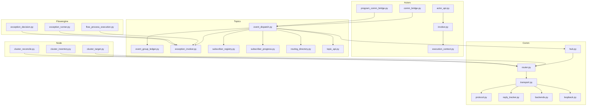
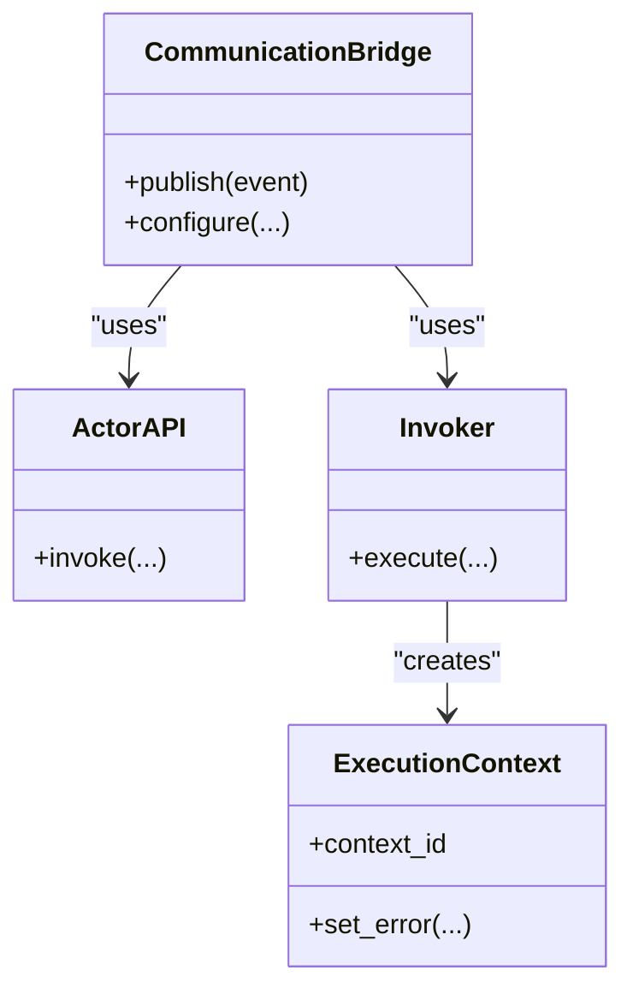
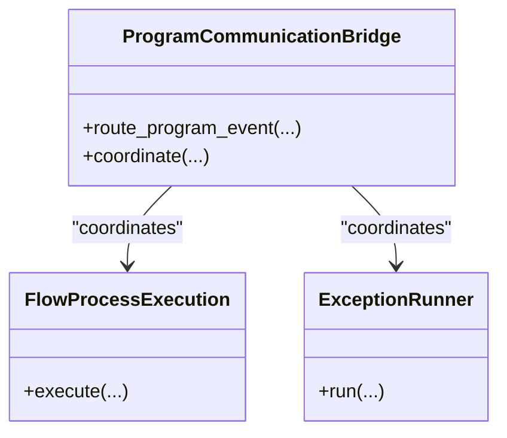
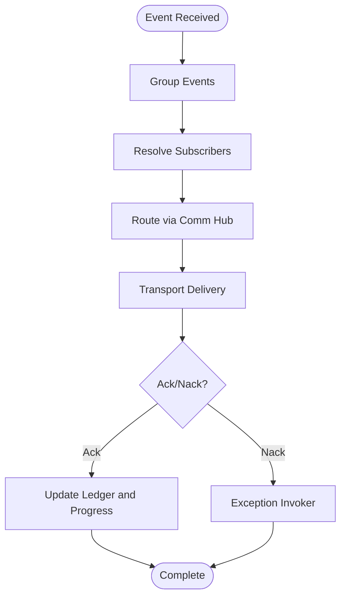
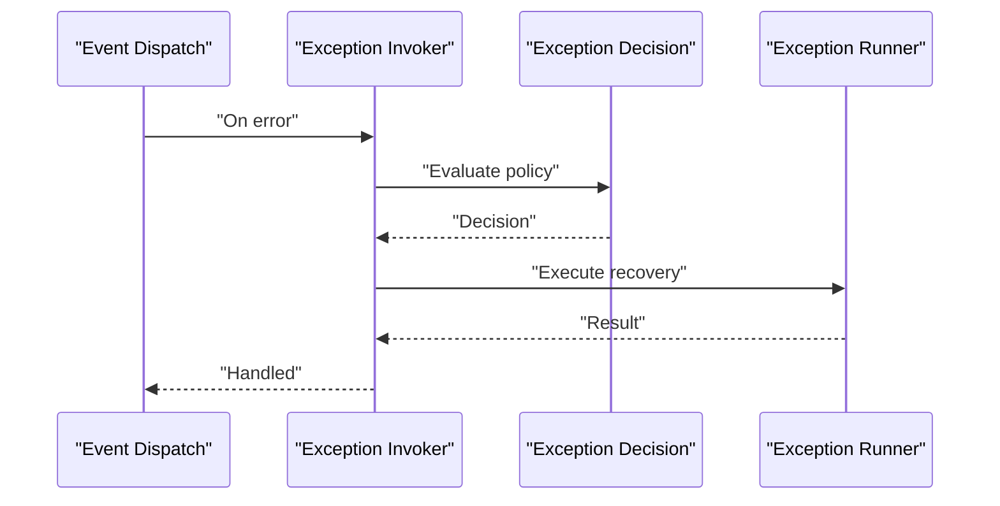
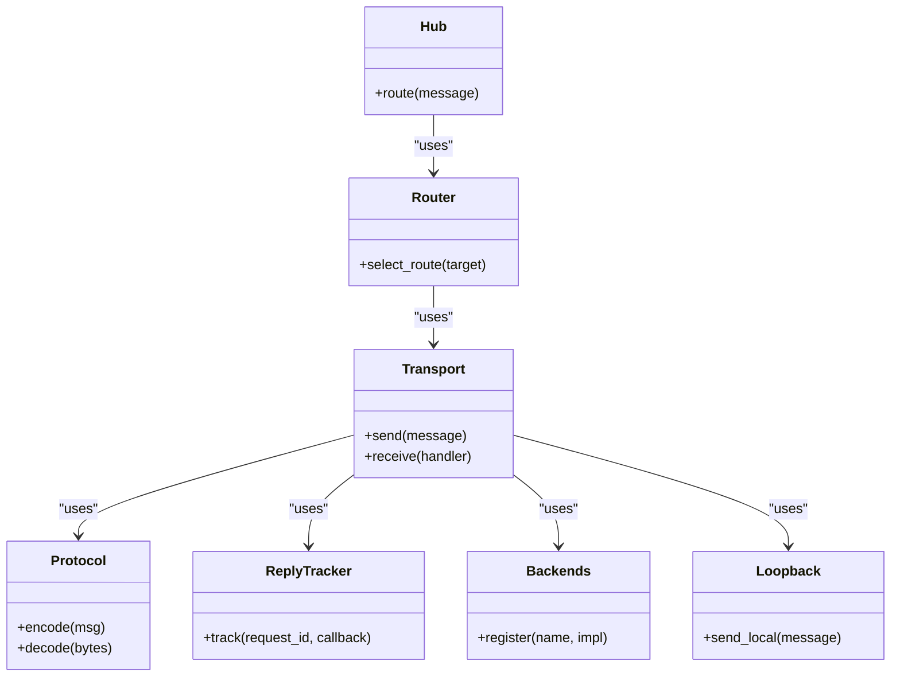
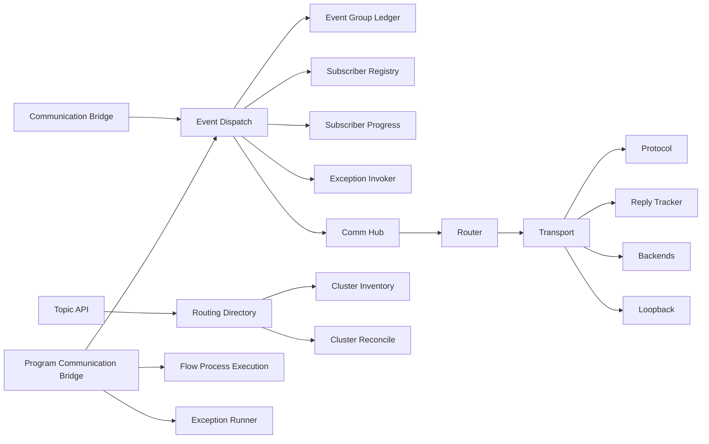

# Communication Bridge and Event Handling

<cite>
**Referenced Files in This Document**
- [comm_bridge.py](file://src/sage/runtime/flownet/runtime/actors/comm_bridge.py)
- [program_comm_bridge.py](file://src/sage/runtime/flownet/runtime/flowengine/program_comm_bridge.py)
- [event_dispatch.py](file://src/sage/runtime/flownet/runtime/topics/event_dispatch.py)
- [event_group_ledger.py](file://src/sage/runtime/flownet/runtime/topics/event_group_ledger.py)
- [exception_invoker.py](file://src/sage/runtime/flownet/runtime/topics/exception_invoker.py)
- [subscriber_registry.py](file://src/sage/runtime/flownet/runtime/topics/subscriber_registry.py)
- [subscriber_progress.py](file://src/sage/runtime/flownet/runtime/topics/subscriber_progress.py)
- [routing_directory.py](file://src/sage/runtime/flownet/runtime/topics/routing_directory.py)
- [routing.py](file://src/sage/runtime/flownet/runtime/operator_runtime/routing.py)
- [hub.py](file://src/sage/runtime/flownet/runtime/comm/hub.py)
- [router.py](file://src/sage/runtime/flownet/runtime/comm/router.py)
- [transport.py](file://src/sage/runtime/flownet/runtime/comm/transport.py)
- [protocol.py](file://src/sage/runtime/flownet/runtime/comm/protocol.py)
- [reply_tracker.py](file://src/sage/runtime/flownet/runtime/comm/reply_tracker.py)
- [backends.py](file://src/sage/runtime/flownet/runtime/comm/backends.py)
- [loopback.py](file://src/sage/runtime/flownet/runtime/comm/loopback.py)
- [cluster_target.py](file://src/sage/runtime/flownet/runtime/node/cluster_target.py)
- [cluster_inventory.py](file://src/sage/runtime/flownet/runtime/node/cluster_inventory.py)
- [cluster_reconcile.py](file://src/sage/runtime/flownet/runtime/node/cluster_reconcile.py)
- [callback_registry.py](file://src/sage/runtime/flownet/runtime/actors/callback_registry.py)
- [callback_handle.py](file://src/sage/runtime/flownet/runtime/actors/callback_handle.py)
- [actor_api.py](file://src/sage/runtime/flownet/runtime/actors/actor_api.py)
- [execution_context.py](file://src/sage/runtime/flownet/runtime/actors/execution_context.py)
- [invoker.py](file://src/sage/runtime/flownet/runtime/actors/invoker.py)
- [task_runtime.py](file://src/sage/runtime/flownet/runtime/actors/task_runtime.py)
- [error_codes.py](file://src/sage/runtime/flownet/runtime/actors/error_codes.py)
- [flow_process_execution.py](file://src/sage/runtime/flownet/runtime/flowengine/flow_process_execution.py)
- [exception_runner.py](file://src/sage/runtime/flownet/runtime/flowengine/exception_runner.py)
- [exception_decision.py](file://src/sage/runtime/flownet/runtime/flowengine/exception_decision.py)
- [topic_api.py](file://src/sage/runtime/flownet/runtime/topics/topic_api.py)
</cite>

## Table of Contents
1. [Introduction](#introduction)
2. [Project Structure](#project-structure)
3. [Core Components](#core-components)
4. [Architecture Overview](#architecture-overview)
5. [Detailed Component Analysis](#detailed-component-analysis)
6. [Dependency Analysis](#dependency-analysis)
7. [Performance Considerations](#performance-considerations)
8. [Troubleshooting Guide](#troubleshooting-guide)
9. [Conclusion](#conclusion)
10. [Appendices](#appendices)

## Introduction
This document explains the Communication Bridge and Event Handling subsystem that powers distributed event distribution across nodes in the runtime. It covers how events are published, grouped, dispatched, tracked, and recovered from failures. It also documents the exception handling pipeline, routing and clustering integration, and operational guidance for tuning and debugging.

## Project Structure
The subsystem spans several packages:
- Actors: runtime-level primitives for event publishing and invocation
- Topics: event lifecycle tracking and subscription management
- Comm: transport, routing, and protocol abstractions
- Flowengine: higher-level orchestration around event-driven flows
- Node: cluster membership and target resolution



**Diagram sources**
- [comm_bridge.py](file://src/sage/runtime/flownet/runtime/actors/comm_bridge.py)
- [program_comm_bridge.py](file://src/sage/runtime/flownet/runtime/flowengine/program_comm_bridge.py)
- [event_dispatch.py](file://src/sage/runtime/flownet/runtime/topics/event_dispatch.py)
- [event_group_ledger.py](file://src/sage/runtime/flownet/runtime/topics/event_group_ledger.py)
- [exception_invoker.py](file://src/sage/runtime/flownet/runtime/topics/exception_invoker.py)
- [subscriber_registry.py](file://src/sage/runtime/flownet/runtime/topics/subscriber_registry.py)
- [subscriber_progress.py](file://src/sage/runtime/flownet/runtime/topics/subscriber_progress.py)
- [routing_directory.py](file://src/sage/runtime/flownet/runtime/topics/routing_directory.py)
- [topic_api.py](file://src/sage/runtime/flownet/runtime/topics/topic_api.py)
- [hub.py](file://src/sage/runtime/flownet/runtime/comm/hub.py)
- [router.py](file://src/sage/runtime/flownet/runtime/comm/router.py)
- [transport.py](file://src/sage/runtime/flownet/runtime/comm/transport.py)
- [protocol.py](file://src/sage/runtime/flownet/runtime/comm/protocol.py)
- [reply_tracker.py](file://src/sage/runtime/flownet/runtime/comm/reply_tracker.py)
- [backends.py](file://src/sage/runtime/flownet/runtime/comm/backends.py)
- [loopback.py](file://src/sage/runtime/flownet/runtime/comm/loopback.py)
- [cluster_target.py](file://src/sage/runtime/flownet/runtime/node/cluster_target.py)
- [cluster_inventory.py](file://src/sage/runtime/flownet/runtime/node/cluster_inventory.py)
- [cluster_reconcile.py](file://src/sage/runtime/flownet/runtime/node/cluster_reconcile.py)
- [actor_api.py](file://src/sage/runtime/flownet/runtime/actors/actor_api.py)
- [invoker.py](file://src/sage/runtime/flownet/runtime/actors/invoker.py)
- [execution_context.py](file://src/sage/runtime/flownet/runtime/actors/execution_context.py)
- [flow_process_execution.py](file://src/sage/runtime/flownet/runtime/flowengine/flow_process_execution.py)
- [exception_runner.py](file://src/sage/runtime/flownet/runtime/flowengine/exception_runner.py)
- [exception_decision.py](file://src/sage/runtime/flownet/runtime/flowengine/exception_decision.py)

**Section sources**
- [comm_bridge.py](file://src/sage/runtime/flownet/runtime/actors/comm_bridge.py)
- [event_dispatch.py](file://src/sage/runtime/flownet/runtime/topics/event_dispatch.py)
- [hub.py](file://src/sage/runtime/flownet/runtime/comm/hub.py)

## Core Components
- Communication Bridge (actors): Publishes events and coordinates with the event dispatch subsystem.
- Program Communication Bridge (flowengine): Bridges program-level operations with the event infrastructure.
- Event Dispatch: Central dispatcher that routes events to subscribers, tracks groups, and manages exceptions.
- Event Group Ledger: Tracks event lifecycles and groupings for ordering and deduplication.
- Exception Invoker: Manages error propagation and recovery decisions across the event pipeline.
- Subscriber Registry and Progress: Maintains subscriptions and tracks subscriber offsets/progress.
- Routing Directory and Topic API: Provides topic-to-target routing and topic-level APIs.
- Comm Layer: Transport, router, protocol, reply tracking, backends, and loopback support.
- Actor Invocation and Execution Context: Provides runtime context for event execution and error handling.

**Section sources**
- [comm_bridge.py](file://src/sage/runtime/flownet/runtime/actors/comm_bridge.py)
- [program_comm_bridge.py](file://src/sage/runtime/flownet/runtime/flowengine/program_comm_bridge.py)
- [event_dispatch.py](file://src/sage/runtime/flownet/runtime/topics/event_dispatch.py)
- [event_group_ledger.py](file://src/sage/runtime/flownet/runtime/topics/event_group_ledger.py)
- [exception_invoker.py](file://src/sage/runtime/flownet/runtime/topics/exception_invoker.py)
- [subscriber_registry.py](file://src/sage/runtime/flownet/runtime/topics/subscriber_registry.py)
- [subscriber_progress.py](file://src/sage/runtime/flownet/runtime/topics/subscriber_progress.py)
- [routing_directory.py](file://src/sage/runtime/flownet/runtime/topics/routing_directory.py)
- [topic_api.py](file://src/sage/runtime/flownet/runtime/topics/topic_api.py)
- [hub.py](file://src/sage/runtime/flownet/runtime/comm/hub.py)
- [router.py](file://src/sage/runtime/flownet/runtime/comm/router.py)
- [transport.py](file://src/sage/runtime/flownet/runtime/comm/transport.py)
- [protocol.py](file://src/sage/runtime/flownet/runtime/comm/protocol.py)
- [reply_tracker.py](file://src/sage/runtime/flownet/runtime/comm/reply_tracker.py)
- [backends.py](file://src/sage/runtime/flownet/runtime/comm/backends.py)
- [loopback.py](file://src/sage/runtime/flownet/runtime/comm/loopback.py)
- [actor_api.py](file://src/sage/runtime/flownet/runtime/actors/actor_api.py)
- [invoker.py](file://src/sage/runtime/flownet/runtime/actors/invoker.py)
- [execution_context.py](file://src/sage/runtime/flownet/runtime/actors/execution_context.py)

## Architecture Overview
The system separates concerns across layers:
- Actors publish events via the Communication Bridge.
- The Program Communication Bridge integrates program-level operations with the event system.
- The Event Dispatch subsystem routes events to subscribers, maintains group ledgers, and invokes exception handling.
- The Comm layer provides transport, routing, and protocol abstractions.
- Cluster inventory and reconciliation keep routing accurate across nodes.
- Operator runtime routing complements topic routing for fine-grained control.

```mermaid
sequenceDiagram
participant Actor as "Actor Runtime"
participant CB as "Communication Bridge"
participant ED as "Event Dispatch"
participant EGL as "Event Group Ledger"
participant SR as "Subscriber Registry"
participant SP as "Subscriber Progress"
participant HUB as "Comm Hub"
participant ROUTER as "Router"
participant TRANS as "Transport"
Actor->>CB : "Publish event"
CB->>ED : "Dispatch event"
ED->>EGL : "Record lifecycle/group"
ED->>SR : "Resolve subscribers"
ED->>SP : "Track progress"
ED->>HUB : "Route to targets"
HUB->>ROUTER : "Select route"
ROUTER->>TRANS : "Send via transport"
TRANS-->>ROUTER : "Delivery ack/nack"
ROUTER-->>HUB : "Route result"
HUB-->>ED : "Delivery feedback"
ED-->>Actor : "Completion/exception"
```

**Diagram sources**
- [comm_bridge.py](file://src/sage/runtime/flownet/runtime/actors/comm_bridge.py)
- [event_dispatch.py](file://src/sage/runtime/flownet/runtime/topics/event_dispatch.py)
- [event_group_ledger.py](file://src/sage/runtime/flownet/runtime/topics/event_group_ledger.py)
- [subscriber_registry.py](file://src/sage/runtime/flownet/runtime/topics/subscriber_registry.py)
- [subscriber_progress.py](file://src/sage/runtime/flownet/runtime/topics/subscriber_progress.py)
- [hub.py](file://src/sage/runtime/flownet/runtime/comm/hub.py)
- [router.py](file://src/sage/runtime/flownet/runtime/comm/router.py)
- [transport.py](file://src/sage/runtime/flownet/runtime/comm/transport.py)

## Detailed Component Analysis

### Communication Bridge (Actors)
Responsibilities:
- Accepts event publication requests from actors.
- Coordinates with the event dispatch subsystem to enqueue and route events.
- Integrates with the actor execution context for error propagation.

Key interactions:
- Delegates to Event Dispatch for routing and delivery.
- Uses Actor API and Invoker for execution context and error handling.



**Diagram sources**
- [comm_bridge.py](file://src/sage/runtime/flownet/runtime/actors/comm_bridge.py)
- [actor_api.py](file://src/sage/runtime/flownet/runtime/actors/actor_api.py)
- [invoker.py](file://src/sage/runtime/flownet/runtime/actors/invoker.py)
- [execution_context.py](file://src/sage/runtime/flownet/runtime/actors/execution_context.py)

**Section sources**
- [comm_bridge.py](file://src/sage/runtime/flownet/runtime/actors/comm_bridge.py)
- [actor_api.py](file://src/sage/runtime/flownet/runtime/actors/actor_api.py)
- [invoker.py](file://src/sage/runtime/flownet/runtime/actors/invoker.py)
- [execution_context.py](file://src/sage/runtime/flownet/runtime/actors/execution_context.py)

### Program Communication Bridge (Flowengine)
Responsibilities:
- Bridges program-level operations with the event infrastructure.
- Ensures program execution aligns with event-driven coordination.

Key interactions:
- Works with Flow Process Execution and Exception Runner for error handling.



**Diagram sources**
- [program_comm_bridge.py](file://src/sage/runtime/flownet/runtime/flowengine/program_comm_bridge.py)
- [flow_process_execution.py](file://src/sage/runtime/flownet/runtime/flowengine/flow_process_execution.py)
- [exception_runner.py](file://src/sage/runtime/flownet/runtime/flowengine/exception_runner.py)

**Section sources**
- [program_comm_bridge.py](file://src/sage/runtime/flownet/runtime/flowengine/program_comm_bridge.py)
- [flow_process_execution.py](file://src/sage/runtime/flownet/runtime/flowengine/flow_process_execution.py)
- [exception_runner.py](file://src/sage/runtime/flownet/runtime/flowengine/exception_runner.py)

### Event Dispatch
Responsibilities:
- Receives events from publishers.
- Groups events, resolves subscribers, and routes to targets.
- Updates the Event Group Ledger and Subscriber Progress.
- Invokes Exception Invoker on failures.



**Diagram sources**
- [event_dispatch.py](file://src/sage/runtime/flownet/runtime/topics/event_dispatch.py)
- [event_group_ledger.py](file://src/sage/runtime/flownet/runtime/topics/event_group_ledger.py)
- [subscriber_registry.py](file://src/sage/runtime/flownet/runtime/topics/subscriber_registry.py)
- [subscriber_progress.py](file://src/sage/runtime/flownet/runtime/topics/subscriber_progress.py)
- [exception_invoker.py](file://src/sage/runtime/flownet/runtime/topics/exception_invoker.py)
- [hub.py](file://src/sage/runtime/flownet/runtime/comm/hub.py)

**Section sources**
- [event_dispatch.py](file://src/sage/runtime/flownet/runtime/topics/event_dispatch.py)
- [event_group_ledger.py](file://src/sage/runtime/flownet/runtime/topics/event_group_ledger.py)
- [subscriber_registry.py](file://src/sage/runtime/flownet/runtime/topics/subscriber_registry.py)
- [subscriber_progress.py](file://src/sage/runtime/flownet/runtime/topics/subscriber_progress.py)
- [exception_invoker.py](file://src/sage/runtime/flownet/runtime/topics/exception_invoker.py)
- [hub.py](file://src/sage/runtime/flownet/runtime/comm/hub.py)

### Event Group Ledger
Responsibilities:
- Tracks event lifecycles and groupings.
- Supports ordering and deduplication guarantees.

Key operations:
- Record lifecycle transitions.
- Group events by correlation keys.

**Section sources**
- [event_group_ledger.py](file://src/sage/runtime/flownet/runtime/topics/event_group_ledger.py)

### Exception Invoker
Responsibilities:
- Manages error propagation across the event pipeline.
- Coordinates with Exception Decision and Exception Runner.



**Diagram sources**
- [exception_invoker.py](file://src/sage/runtime/flownet/runtime/topics/exception_invoker.py)
- [exception_decision.py](file://src/sage/runtime/flownet/runtime/flowengine/exception_decision.py)
- [exception_runner.py](file://src/sage/runtime/flownet/runtime/flowengine/exception_runner.py)

**Section sources**
- [exception_invoker.py](file://src/sage/runtime/flownet/runtime/topics/exception_invoker.py)
- [exception_decision.py](file://src/sage/runtime/flownet/runtime/flowengine/exception_decision.py)
- [exception_runner.py](file://src/sage/runtime/flownet/runtime/flowengine/exception_runner.py)

### Subscriber Registry and Progress
Responsibilities:
- Maintains subscriber registrations and tracks progress per subscriber.
- Supports offset management and recovery.

**Section sources**
- [subscriber_registry.py](file://src/sage/runtime/flownet/runtime/topics/subscriber_registry.py)
- [subscriber_progress.py](file://src/sage/runtime/flownet/runtime/topics/subscriber_progress.py)

### Routing Directory and Topic API
Responsibilities:
- Provides topic-to-target routing and topic-level APIs.
- Integrates with cluster inventory and reconciliation.

**Section sources**
- [routing_directory.py](file://src/sage/runtime/flownet/runtime/topics/routing_directory.py)
- [topic_api.py](file://src/sage/runtime/flownet/runtime/topics/topic_api.py)
- [cluster_inventory.py](file://src/sage/runtime/flownet/runtime/node/cluster_inventory.py)
- [cluster_reconcile.py](file://src/sage/runtime/flownet/runtime/node/cluster_reconcile.py)

### Comm Layer (Hub, Router, Transport, Protocol, Reply Tracker, Backends, Loopback)
Responsibilities:
- Transport abstraction for event delivery.
- Router selects routes based on routing directory and cluster topology.
- Protocol defines message framing and semantics.
- Reply Tracker tracks replies for request-response patterns.
- Backends and Loopback provide transport implementations.



**Diagram sources**
- [hub.py](file://src/sage/runtime/flownet/runtime/comm/hub.py)
- [router.py](file://src/sage/runtime/flownet/runtime/comm/router.py)
- [transport.py](file://src/sage/runtime/flownet/runtime/comm/transport.py)
- [protocol.py](file://src/sage/runtime/flownet/runtime/comm/protocol.py)
- [reply_tracker.py](file://src/sage/runtime/flownet/runtime/comm/reply_tracker.py)
- [backends.py](file://src/sage/runtime/flownet/runtime/comm/backends.py)
- [loopback.py](file://src/sage/runtime/flownet/runtime/comm/loopback.py)

**Section sources**
- [hub.py](file://src/sage/runtime/flownet/runtime/comm/hub.py)
- [router.py](file://src/sage/runtime/flownet/runtime/comm/router.py)
- [transport.py](file://src/sage/runtime/flownet/runtime/comm/transport.py)
- [protocol.py](file://src/sage/runtime/flownet/runtime/comm/protocol.py)
- [reply_tracker.py](file://src/sage/runtime/flownet/runtime/comm/reply_tracker.py)
- [backends.py](file://src/sage/runtime/flownet/runtime/comm/backends.py)
- [loopback.py](file://src/sage/runtime/flownet/runtime/comm/loopback.py)

### Operator Runtime Routing
Responsibilities:
- Provides routing utilities for operators within the runtime.
- Complements topic routing for fine-grained control.

**Section sources**
- [routing.py](file://src/sage/runtime/flownet/runtime/operator_runtime/routing.py)

### Actor Invocation and Execution Context
Responsibilities:
- Provides execution context for event invocation.
- Manages error propagation and actor lifecycle.

**Section sources**
- [actor_api.py](file://src/sage/runtime/flownet/runtime/actors/actor_api.py)
- [invoker.py](file://src/sage/runtime/flownet/runtime/actors/invoker.py)
- [execution_context.py](file://src/sage/runtime/flownet/runtime/actors/execution_context.py)
- [callback_registry.py](file://src/sage/runtime/flownet/runtime/actors/callback_registry.py)
- [callback_handle.py](file://src/sage/runtime/flownet/runtime/actors/callback_handle.py)
- [task_runtime.py](file://src/sage/runtime/flownet/runtime/actors/task_runtime.py)
- [error_codes.py](file://src/sage/runtime/flownet/runtime/actors/error_codes.py)

## Dependency Analysis
The subsystem exhibits layered dependencies:
- Actors depend on Actor API and Invoker.
- Event Dispatch depends on Ledger, Registry, Progress, and Exception Invoker.
- Comm Hub depends on Router, Transport, Protocol, Reply Tracker, Backends, and Loopback.
- Topic API and Routing Directory depend on cluster inventory and reconciliation.
- Program Communication Bridge depends on Flow Process Execution and Exception Runner.



**Diagram sources**
- [comm_bridge.py](file://src/sage/runtime/flownet/runtime/actors/comm_bridge.py)
- [program_comm_bridge.py](file://src/sage/runtime/flownet/runtime/flowengine/program_comm_bridge.py)
- [event_dispatch.py](file://src/sage/runtime/flownet/runtime/topics/event_dispatch.py)
- [event_group_ledger.py](file://src/sage/runtime/flownet/runtime/topics/event_group_ledger.py)
- [subscriber_registry.py](file://src/sage/runtime/flownet/runtime/topics/subscriber_registry.py)
- [subscriber_progress.py](file://src/sage/runtime/flownet/runtime/topics/subscriber_progress.py)
- [exception_invoker.py](file://src/sage/runtime/flownet/runtime/topics/exception_invoker.py)
- [hub.py](file://src/sage/runtime/flownet/runtime/comm/hub.py)
- [router.py](file://src/sage/runtime/flownet/runtime/comm/router.py)
- [transport.py](file://src/sage/runtime/flownet/runtime/comm/transport.py)
- [protocol.py](file://src/sage/runtime/flownet/runtime/comm/protocol.py)
- [reply_tracker.py](file://src/sage/runtime/flownet/runtime/comm/reply_tracker.py)
- [backends.py](file://src/sage/runtime/flownet/runtime/comm/backends.py)
- [loopback.py](file://src/sage/runtime/flownet/runtime/comm/loopback.py)
- [topic_api.py](file://src/sage/runtime/flownet/runtime/topics/topic_api.py)
- [routing_directory.py](file://src/sage/runtime/flownet/runtime/topics/routing_directory.py)
- [cluster_inventory.py](file://src/sage/runtime/flownet/runtime/node/cluster_inventory.py)
- [cluster_reconcile.py](file://src/sage/runtime/flownet/runtime/node/cluster_reconcile.py)
- [flow_process_execution.py](file://src/sage/runtime/flownet/runtime/flowengine/flow_process_execution.py)
- [exception_runner.py](file://src/sage/runtime/flownet/runtime/flowengine/exception_runner.py)

**Section sources**
- [comm_bridge.py](file://src/sage/runtime/flownet/runtime/actors/comm_bridge.py)
- [program_comm_bridge.py](file://src/sage/runtime/flownet/runtime/flowengine/program_comm_bridge.py)
- [event_dispatch.py](file://src/sage/runtime/flownet/runtime/topics/event_dispatch.py)
- [hub.py](file://src/sage/runtime/flownet/runtime/comm/hub.py)
- [router.py](file://src/sage/runtime/flownet/runtime/comm/router.py)
- [transport.py](file://src/sage/runtime/flownet/runtime/comm/transport.py)

## Performance Considerations
- Event batching and grouping: Use event grouping strategies to reduce overhead and improve throughput.
- Backpressure and flow control: Implement subscriber progress tracking to avoid overload.
- Transport tuning: Adjust transport buffer sizes and timeouts based on network conditions.
- Routing efficiency: Keep routing directory updated via cluster inventory and reconciliation to minimize route lookup latency.
- Exception handling cost: Prefer fast-path success and minimize exception invoker work to reduce tail latencies.

[No sources needed since this section provides general guidance]

## Troubleshooting Guide
Common issues and remedies:
- Event ordering: Verify Event Group Ledger and Subscriber Progress to ensure correct ordering and detect gaps.
- Duplicate handling: Use event grouping and deduplication keys; confirm ledger entries reflect expected duplicates.
- Network partition recovery: Inspect cluster inventory and reconciliation logs; ensure routing directory updates propagate.
- Delivery guarantees: Confirm transport acknowledgments and reply tracker entries; investigate nack scenarios.
- Exception propagation: Review Exception Invoker decisions and Exception Runner outcomes; validate error codes and policies.

Operational tips:
- Enable verbose logging for Comm Hub, Router, and Transport during incidents.
- Monitor subscriber progress offsets to detect stalled consumers.
- Validate routing directory against cluster membership to prevent misrouted events.

**Section sources**
- [event_group_ledger.py](file://src/sage/runtime/flownet/runtime/topics/event_group_ledger.py)
- [subscriber_progress.py](file://src/sage/runtime/flownet/runtime/topics/subscriber_progress.py)
- [hub.py](file://src/sage/runtime/flownet/runtime/comm/hub.py)
- [router.py](file://src/sage/runtime/flownet/runtime/comm/router.py)
- [transport.py](file://src/sage/runtime/flownet/runtime/comm/transport.py)
- [reply_tracker.py](file://src/sage/runtime/flownet/runtime/comm/reply_tracker.py)
- [cluster_inventory.py](file://src/sage/runtime/flownet/runtime/node/cluster_inventory.py)
- [cluster_reconcile.py](file://src/sage/runtime/flownet/runtime/node/cluster_reconcile.py)
- [exception_invoker.py](file://src/sage/runtime/flownet/runtime/topics/exception_invoker.py)
- [exception_runner.py](file://src/sage/runtime/flownet/runtime/flowengine/exception_runner.py)
- [error_codes.py](file://src/sage/runtime/flownet/runtime/actors/error_codes.py)

## Conclusion
The Communication Bridge and Event Handling subsystem provides a robust, layered framework for distributed event distribution. By combining actor-level publishing, centralized event dispatch, ledger-based lifecycle tracking, and a resilient comm layer, it supports ordering, deduplication, and failure recovery. Operators can tune routing, batching, and transport parameters to meet performance goals while leveraging built-in exception handling and progress tracking for reliability.

[No sources needed since this section summarizes without analyzing specific files]

## Appendices
- Example references:
  - Event publication via Communication Bridge: [comm_bridge.py](file://src/sage/runtime/flownet/runtime/actors/comm_bridge.py)
  - Event dispatch and grouping: [event_dispatch.py](file://src/sage/runtime/flownet/runtime/topics/event_dispatch.py)
  - Exception handling flow: [exception_invoker.py](file://src/sage/runtime/flownet/runtime/topics/exception_invoker.py), [exception_runner.py](file://src/sage/runtime/flownet/runtime/flowengine/exception_runner.py)
  - Routing and cluster integration: [routing_directory.py](file://src/sage/runtime/flownet/runtime/topics/routing_directory.py), [cluster_inventory.py](file://src/sage/runtime/flownet/runtime/node/cluster_inventory.py), [cluster_reconcile.py](file://src/sage/runtime/flownet/runtime/node/cluster_reconcile.py)
  - Comm layer internals: [hub.py](file://src/sage/runtime/flownet/runtime/comm/hub.py), [router.py](file://src/sage/runtime/flownet/runtime/comm/router.py), [transport.py](file://src/sage/runtime/flownet/runtime/comm/transport.py)

[No sources needed since this section lists references without analysis]