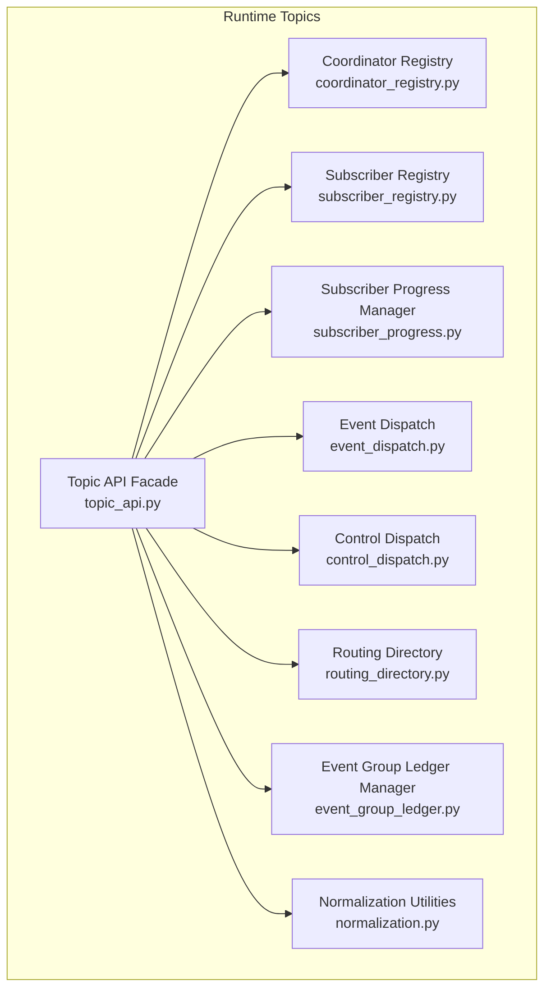
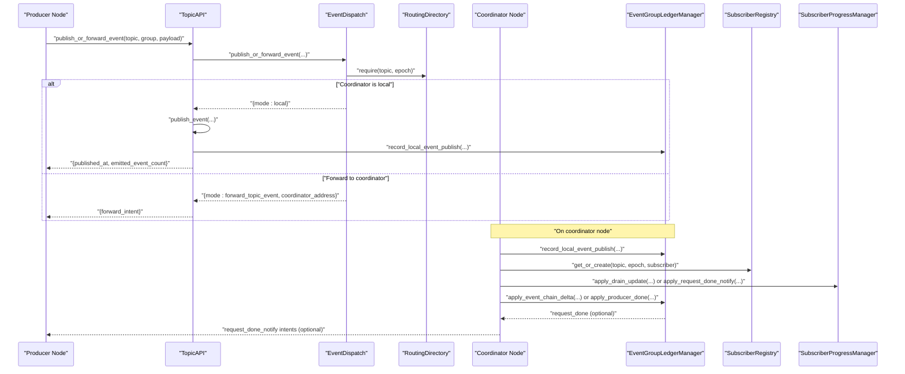
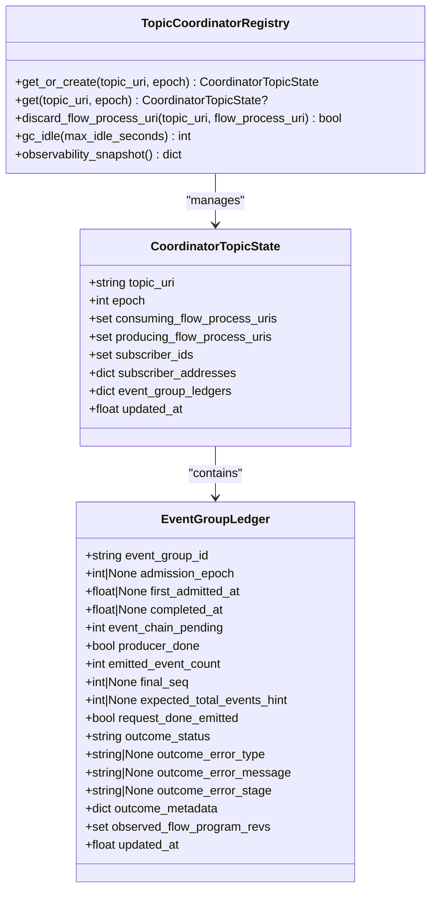
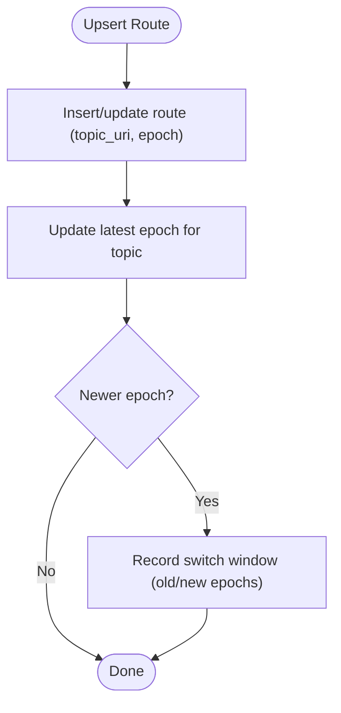
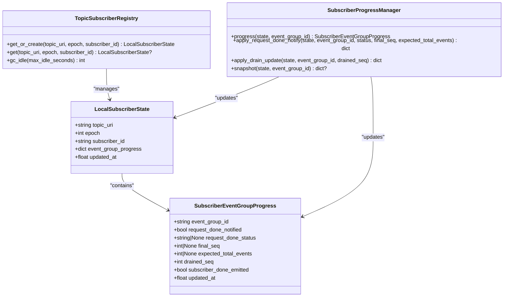
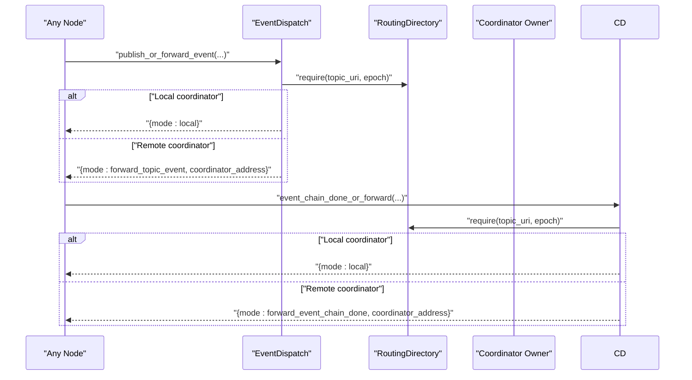
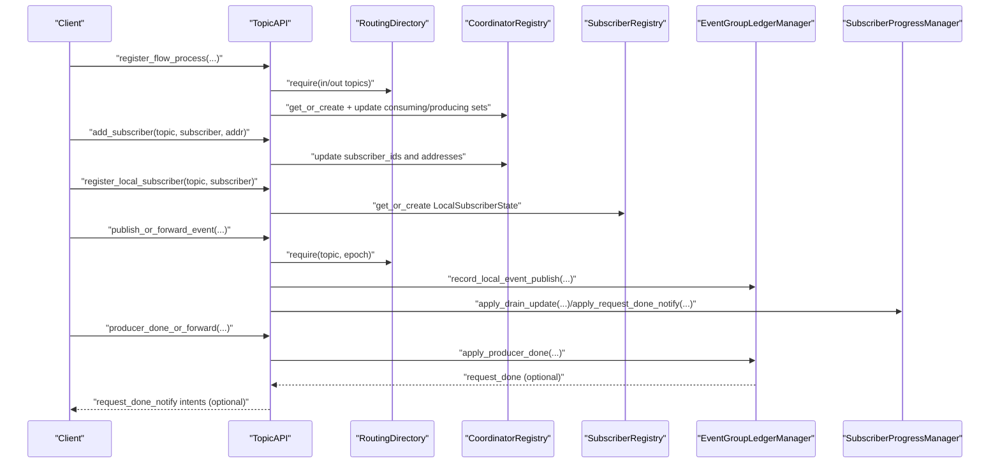
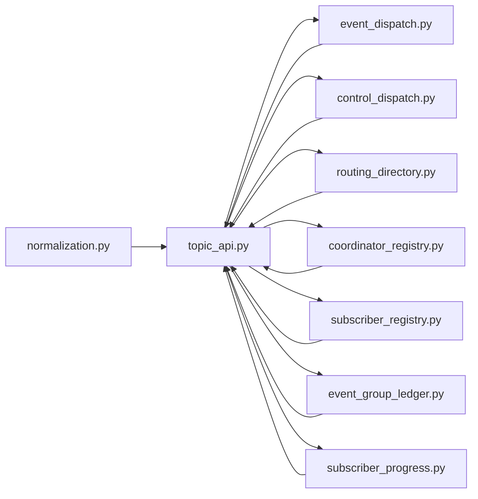

# Coordinator and Subscriber Management

<cite>
**Referenced Files in This Document**
- [coordinator_registry.py](file://src/sage/runtime/flownet/runtime/topics/coordinator_registry.py)
- [subscriber_registry.py](file://src/sage/runtime/flownet/runtime/topics/subscriber_registry.py)
- [subscriber_progress.py](file://src/sage/runtime/flownet/runtime/topics/subscriber_progress.py)
- [event_dispatch.py](file://src/sage/runtime/flownet/runtime/topics/event_dispatch.py)
- [routing_directory.py](file://src/sage/runtime/flownet/runtime/topics/routing_directory.py)
- [event_group_ledger.py](file://src/sage/runtime/flownet/runtime/topics/event_group_ledger.py)
- [control_dispatch.py](file://src/sage/runtime/flownet/runtime/topics/control_dispatch.py)
- [topic_api.py](file://src/sage/runtime/flownet/runtime/topics/topic_api.py)
- [normalization.py](file://src/sage/runtime/flownet/runtime/topics/normalization.py)
- [config.yaml](file://config/config.yaml)
- [cluster.yaml](file://config/cluster.yaml)
</cite>

## Table of Contents
1. [Introduction](#introduction)
2. [Project Structure](#project-structure)
3. [Core Components](#core-components)
4. [Architecture Overview](#architecture-overview)
5. [Detailed Component Analysis](#detailed-component-analysis)
6. [Dependency Analysis](#dependency-analysis)
7. [Performance Considerations](#performance-considerations)
8. [Troubleshooting Guide](#troubleshooting-guide)
9. [Conclusion](#conclusion)
10. [Appendices](#appendices)

## Introduction
This document explains the Coordinator and Subscriber Management subsystem in the FlowNet runtime. It covers:
- Coordinator registry and topic routing for distributed coordination across FlowNet nodes
- Subscriber registry and progress tracking for event subscribers
- Control and data plane dispatch flows that coordinate producers, consumers, and subscribers
- Configuration options and operational guidance for elections, timeouts, and persistence
- Practical examples from the codebase showing registration, lifecycle management, and progress tracking

The goal is to make distributed coordination patterns accessible to beginners while providing deep technical insights for advanced implementers.

## Project Structure
The subsystem resides under the FlowNet runtime topics package. Key modules include:
- Coordinator registry and event group ledgers
- Routing directory for topic-to-coordinator routing
- Subscriber registry and progress manager
- Event and control dispatch helpers
- Topic API facade that orchestrates the above

**Diagram sources**
- [coordinator_registry.py:48-256](file://src/sage/runtime/flownet/runtime/topics/coordinator_registry.py#L48-L256)
- [subscriber_registry.py:36-105](file://src/sage/runtime/flownet/runtime/topics/subscriber_registry.py#L36-L105)
- [subscriber_progress.py:16-162](file://src/sage/runtime/flownet/runtime/topics/subscriber_progress.py#L16-L162)
- [event_dispatch.py:10-86](file://src/sage/runtime/flownet/runtime/topics/event_dispatch.py#L10-L86)
- [control_dispatch.py:13-235](file://src/sage/runtime/flownet/runtime/topics/control_dispatch.py#L13-L235)
- [routing_directory.py:61-348](file://src/sage/runtime/flownet/runtime/topics/routing_directory.py#L61-L348)
- [event_group_ledger.py:16-361](file://src/sage/runtime/flownet/runtime/topics/event_group_ledger.py#L16-L361)
- [topic_api.py:38-112](file://src/sage/runtime/flownet/runtime/topics/topic_api.py#L38-L112)
- [normalization.py:13-77](file://src/sage/runtime/flownet/runtime/topics/normalization.py#L13-L77)

**Section sources**
- [topic_api.py:38-112](file://src/sage/runtime/flownet/runtime/topics/topic_api.py#L38-L112)

## Core Components
- Coordinator Registry: Maintains per-topic, per-epoch coordinator state locally, tracks producers/consumers, subscribers, and event group ledgers. Provides GC and observability snapshots.
- Routing Directory: Holds topic-to-coordinator address and epoch mappings; supports epoch transitions and switch window diagnostics.
- Subscriber Registry: Tracks per-subscriber progress per event group, keyed by topic, epoch, and subscriber ID.
- Subscriber Progress Manager: Computes convergence (subscriber_done) when request_done and drained_seq meet thresholds.
- Event Dispatch: Routes events either locally or forwards them to the coordinator owner.
- Control Dispatch: Routes control signals (event chain deltas, producer_done, outcomes) to the coordinator owner.
- Event Group Ledger Manager: Coordinates request completion, outcome propagation, and versioning diagnostics.

**Section sources**
- [coordinator_registry.py:48-256](file://src/sage/runtime/flownet/runtime/topics/coordinator_registry.py#L48-L256)
- [routing_directory.py:61-348](file://src/sage/runtime/flownet/runtime/topics/routing_directory.py#L61-L348)
- [subscriber_registry.py:36-105](file://src/sage/runtime/flownet/runtime/topics/subscriber_registry.py#L36-L105)
- [subscriber_progress.py:16-162](file://src/sage/runtime/flownet/runtime/topics/subscriber_progress.py#L16-L162)
- [event_dispatch.py:10-86](file://src/sage/runtime/flownet/runtime/topics/event_dispatch.py#L10-L86)
- [control_dispatch.py:13-235](file://src/sage/runtime/flownet/runtime/topics/control_dispatch.py#L13-L235)
- [event_group_ledger.py:16-361](file://src/sage/runtime/flownet/runtime/topics/event_group_ledger.py#L16-L361)

## Architecture Overview
The Topic API acts as a facade integrating routing, coordination, and dispatch. Producers publish events; consumers subscribe; subscribers report progress; the coordinator tracks convergence and emits outcomes.

**Diagram sources**
- [topic_api.py:417-487](file://src/sage/runtime/flownet/runtime/topics/topic_api.py#L417-L487)
- [event_dispatch.py:22-54](file://src/sage/runtime/flownet/runtime/topics/event_dispatch.py#L22-L54)
- [routing_directory.py:128-143](file://src/sage/runtime/flownet/runtime/topics/routing_directory.py#L128-L143)
- [event_group_ledger.py:156-243](file://src/sage/runtime/flownet/runtime/topics/event_group_ledger.py#L156-L243)
- [subscriber_registry.py:44-83](file://src/sage/runtime/flownet/runtime/topics/subscriber_registry.py#L44-L83)
- [subscriber_progress.py:87-103](file://src/sage/runtime/flownet/runtime/topics/subscriber_progress.py#L87-L103)

## Detailed Component Analysis

### Coordinator Registry and Event Group Ledgers
CoordinatorTopicState captures:
- Topic URI and epoch
- Sets of consuming/producing flow process URIs
- Subscriber IDs and addresses
- Event group ledgers keyed by event_group_id

Key operations:
- get_or_create: lazily creates or updates state with timestamps
- discard_flow_process_uri: removes a flow process from all matching states
- gc_idle: prunes idle states and finished ledgers after a TTL
- observability_snapshot: aggregates queue metrics across ledgers

EventGroupLedger tracks:
- Admission epoch, admission/completion timestamps
- Pending event chain count and total counts
- Outcome status and error metadata
- Observed flow program revisions for version diagnostics

**Diagram sources**
- [coordinator_registry.py:15-83](file://src/sage/runtime/flownet/runtime/topics/coordinator_registry.py#L15-L83)
- [coordinator_registry.py:113-141](file://src/sage/runtime/flownet/runtime/topics/coordinator_registry.py#L113-L141)
- [event_group_ledger.py:31-77](file://src/sage/runtime/flownet/runtime/topics/event_group_ledger.py#L31-L77)

**Section sources**
- [coordinator_registry.py:48-256](file://src/sage/runtime/flownet/runtime/topics/coordinator_registry.py#L48-L256)
- [event_group_ledger.py:16-361](file://src/sage/runtime/flownet/runtime/topics/event_group_ledger.py#L16-L361)

### Routing Directory and Epoch Transitions
TopicRoutingDirectory maintains:
- Route snapshots (topic_uri, epoch, coordinator_address)
- Latest epoch per topic
- Switch window state for epoch transitions

Operations:
- upsert_route: inserts or updates a route and records epoch switch window
- resolve/require: resolves latest or specific epoch route
- observe_admission/completion: marks markers for switch window diagnostics
- switch_window: builds a diagnostic view of the transition window

**Diagram sources**
- [routing_directory.py:76-108](file://src/sage/runtime/flownet/runtime/topics/routing_directory.py#L76-L108)
- [routing_directory.py:145-216](file://src/sage/runtime/flownet/runtime/topics/routing_directory.py#L145-L216)

**Section sources**
- [routing_directory.py:61-348](file://src/sage/runtime/flownet/runtime/topics/routing_directory.py#L61-L348)

### Subscriber Registry and Progress Tracking
LocalSubscriberState captures:
- Topic URI, epoch, subscriber_id
- Per-event-group progress keyed by event_group_id

SubscriberEventGroupProgress tracks:
- Request done notification and status
- Final and expected total event counts
- Drained sequence and subscriber_done emission flag

SubscriberProgressManager:
- Ensures monotonic updates for drained_seq and final_seq
- Computes subscriber_done when request_done is received and drained_seq meets required threshold
- Emits subscriber_done via callback and returns a snapshot

**Diagram sources**
- [subscriber_registry.py:27-83](file://src/sage/runtime/flownet/runtime/topics/subscriber_registry.py#L27-L83)
- [subscriber_progress.py:16-103](file://src/sage/runtime/flownet/runtime/topics/subscriber_progress.py#L16-L103)
- [subscriber_progress.py:124-151](file://src/sage/runtime/flownet/runtime/topics/subscriber_progress.py#L124-L151)

**Section sources**
- [subscriber_registry.py:36-105](file://src/sage/runtime/flownet/runtime/topics/subscriber_registry.py#L36-L105)
- [subscriber_progress.py:16-162](file://src/sage/runtime/flownet/runtime/topics/subscriber_progress.py#L16-L162)

### Event and Control Dispatch
TopicEventDispatch:
- Resolves current route by topic and epoch
- Publishes locally or builds a forward intent to the coordinator owner

TopicControlDispatch:
- Routes control signals to the coordinator owner
- Builds forward intents for event_chain_done, producer_done, and request_outcome

**Diagram sources**
- [event_dispatch.py:22-54](file://src/sage/runtime/flownet/runtime/topics/event_dispatch.py#L22-L54)
- [control_dispatch.py:25-82](file://src/sage/runtime/flownet/runtime/topics/control_dispatch.py#L25-L82)
- [routing_directory.py:128-143](file://src/sage/runtime/flownet/runtime/topics/routing_directory.py#L128-L143)

**Section sources**
- [event_dispatch.py:10-86](file://src/sage/runtime/flownet/runtime/topics/event_dispatch.py#L10-L86)
- [control_dispatch.py:13-235](file://src/sage/runtime/flownet/runtime/topics/control_dispatch.py#L13-L235)

### Topic API Orchestration
TopicAPI integrates all subsystems:
- Registers/unregisters flow processes and updates coordinator state
- Manages subscribers (add/remove) and registers local subscriber state
- Publishes events and forwards control signals
- Applies forwarded intents safely (address validation)
- Garbage collects idle coordinator and subscriber states

**Diagram sources**
- [topic_api.py:174-242](file://src/sage/runtime/flownet/runtime/topics/topic_api.py#L174-L242)
- [topic_api.py:244-276](file://src/sage/runtime/flownet/runtime/topics/topic_api.py#L244-L276)
- [topic_api.py:278-296](file://src/sage/runtime/flownet/runtime/topics/topic_api.py#L278-L296)
- [topic_api.py:417-487](file://src/sage/runtime/flownet/runtime/topics/topic_api.py#L417-L487)
- [topic_api.py:526-590](file://src/sage/runtime/flownet/runtime/topics/topic_api.py#L526-L590)

**Section sources**
- [topic_api.py:38-112](file://src/sage/runtime/flownet/runtime/topics/topic_api.py#L38-L112)
- [topic_api.py:174-276](file://src/sage/runtime/flownet/runtime/topics/topic_api.py#L174-L276)
- [topic_api.py:278-296](file://src/sage/runtime/flownet/runtime/topics/topic_api.py#L278-L296)
- [topic_api.py:417-590](file://src/sage/runtime/flownet/runtime/topics/topic_api.py#L417-L590)

## Dependency Analysis
- TopicAPI depends on:
  - RoutingDirectory for route resolution
  - CoordinatorRegistry for coordinator state
  - SubscriberRegistry for subscriber state
  - EventGroupLedgerManager for request convergence
  - SubscriberProgressManager for subscriber-done computation
  - EventDispatch and ControlDispatch for routing decisions
- Normalization utilities ensure consistent identifiers and values across modules.

**Diagram sources**
- [topic_api.py:8-34](file://src/sage/runtime/flownet/runtime/topics/topic_api.py#L8-L34)
- [normalization.py:13-77](file://src/sage/runtime/flownet/runtime/topics/normalization.py#L13-L77)

**Section sources**
- [topic_api.py:8-34](file://src/sage/runtime/flownet/runtime/topics/topic_api.py#L8-L34)

## Performance Considerations
- State locality: CoordinatorTopicState and LocalSubscriberState are keyed by topic and epoch, minimizing cross-node state sharing.
- Lazy creation and updates: get_or_create and monotonic updates reduce contention.
- GC idle: Periodic pruning of idle states prevents memory bloat; tune max_idle_seconds based on workload.
- Observability snapshot: Aggregates queue metrics efficiently; avoid excessive polling in hot paths.
- Forwarding overhead: Control and event forwarding incur network hops; co-locate producers/consumers/subscribers near the coordinator when possible.

[No sources needed since this section provides general guidance]

## Troubleshooting Guide
Common issues and mitigations:
- Coordinator failures
  - Symptom: publish_or_forward_event returns a forward intent; eventual consistency requires retries.
  - Action: Ensure routing directory is updated when ownership changes; verify local_address matches expected owner.
  - Reference: [event_dispatch.py:33-54](file://src/sage/runtime/flownet/runtime/topics/event_dispatch.py#L33-L54), [control_dispatch.py:34-51](file://src/sage/runtime/flownet/runtime/topics/control_dispatch.py#L34-L51)

- Subscriber disconnections
  - Symptom: subscriber_progress returns None; subscriber state pruned after idle TTL.
  - Action: Re-register local subscriber; ensure periodic progress updates; adjust GC idle threshold.
  - Reference: [subscriber_registry.py:85-97](file://src/sage/runtime/flownet/runtime/topics/subscriber_registry.py#L85-L97), [topic_api.py:762-774](file://src/sage/runtime/flownet/runtime/topics/topic_api.py#L762-L774)

- Progress synchronization delays
  - Symptom: subscriber_done not emitted; request_done received but drained_seq lag.
  - Action: Verify apply_drain_update monotonicity; confirm expected_total_events or final_seq alignment.
  - Reference: [subscriber_progress.py:87-103](file://src/sage/runtime/flownet/runtime/topics/subscriber_progress.py#L87-L103), [subscriber_progress.py:124-151](file://src/sage/runtime/flownet/runtime/topics/subscriber_progress.py#L124-L151)

- Epoch transitions and switch windows
  - Symptom: Inconsistent admission/completion markers during epoch switches.
  - Action: Inspect switch_window diagnostics; ensure observe_admission/observe_completion called consistently.
  - Reference: [routing_directory.py:145-216](file://src/sage/runtime/flownet/runtime/topics/routing_directory.py#L145-L216)

- Validation errors
  - Symptom: ValueError on empty/non-negative fields or unsupported outcome status.
  - Action: Normalize inputs via normalization utilities; use supported outcome statuses.
  - Reference: [normalization.py:13-27](file://src/sage/runtime/flownet/runtime/topics/normalization.py#L13-L27), [event_group_ledger.py:319-340](file://src/sage/runtime/flownet/runtime/topics/event_group_ledger.py#L319-L340)

**Section sources**
- [event_dispatch.py:33-54](file://src/sage/runtime/flownet/runtime/topics/event_dispatch.py#L33-L54)
- [control_dispatch.py:34-51](file://src/sage/runtime/flownet/runtime/topics/control_dispatch.py#L34-L51)
- [subscriber_registry.py:85-97](file://src/sage/runtime/flownet/runtime/topics/subscriber_registry.py#L85-L97)
- [topic_api.py:762-774](file://src/sage/runtime/flownet/runtime/topics/topic_api.py#L762-L774)
- [subscriber_progress.py:87-103](file://src/sage/runtime/flownet/runtime/topics/subscriber_progress.py#L87-L103)
- [routing_directory.py:145-216](file://src/sage/runtime/flownet/runtime/topics/routing_directory.py#L145-L216)
- [normalization.py:13-27](file://src/sage/runtime/flownet/runtime/topics/normalization.py#L13-L27)
- [event_group_ledger.py:319-340](file://src/sage/runtime/flownet/runtime/topics/event_group_ledger.py#L319-L340)

## Conclusion
The Coordinator and Subscriber Management subsystem provides a robust, localized coordination model for FlowNet:
- Coordinator registry and routing directory enable deterministic ownership and epoch transitions.
- Subscriber registry and progress manager ensure reliable convergence with minimal external dependencies.
- Event and control dispatch cleanly separate local execution from cross-node forwarding.
Adopt the provided patterns and configurations to implement resilient distributed coordination in FlowNet.

[No sources needed since this section summarizes without analyzing specific files]

## Appendices

### Configuration Options
- Cluster and gateway settings influence runtime availability and communication:
  - Gateway port and session backend
  - Cluster name and provider configuration
  - Remote and daemon ports for job management
- These settings indirectly impact coordinator election and subscriber connectivity by defining network topology and service endpoints.

**Section sources**
- [config.yaml:1-60](file://config/config.yaml#L1-L60)
- [cluster.yaml:1-91](file://config/cluster.yaml#L1-L91)

### Example Workflows from the Codebase
- Coordinator registration and flow process updates
  - Register flow process and update consuming/producing sets on coordinator nodes
  - Remove flow process and prune coordinator state
  - References: [topic_api.py:174-242](file://src/sage/runtime/flownet/runtime/topics/topic_api.py#L174-L242)

- Subscriber management
  - Add/remove subscribers and maintain subscriber addresses
  - Register local subscriber state for progress tracking
  - References: [topic_api.py:244-276](file://src/sage/runtime/flownet/runtime/topics/topic_api.py#L244-L276), [topic_api.py:278-296](file://src/sage/runtime/flownet/runtime/topics/topic_api.py#L278-L296)

- Progress tracking and convergence
  - Apply drain updates and request_done notifications
  - Compute subscriber_done when thresholds are met
  - References: [topic_api.py:298-350](file://src/sage/runtime/flownet/runtime/topics/topic_api.py#L298-L350), [subscriber_progress.py:87-103](file://src/sage/runtime/flownet/runtime/topics/subscriber_progress.py#L87-L103)

- Event publishing and forwarding
  - Resolve route and publish locally or forward to coordinator
  - References: [topic_api.py:417-487](file://src/sage/runtime/flownet/runtime/topics/topic_api.py#L417-L487), [event_dispatch.py:22-54](file://src/sage/runtime/flownet/runtime/topics/event_dispatch.py#L22-L54)

- Control signaling
  - Forward event_chain_done, producer_done, and request_outcome to coordinator
  - References: [topic_api.py:489-590](file://src/sage/runtime/flownet/runtime/topics/topic_api.py#L489-L590), [control_dispatch.py:53-122](file://src/sage/runtime/flownet/runtime/topics/control_dispatch.py#L53-L122)