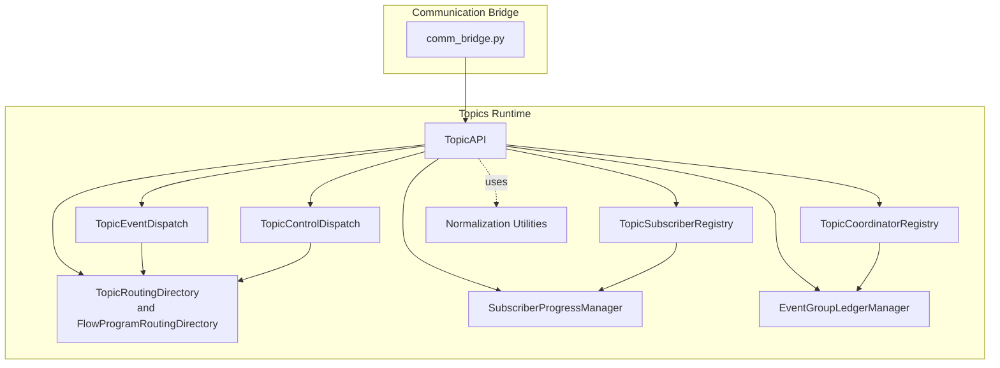
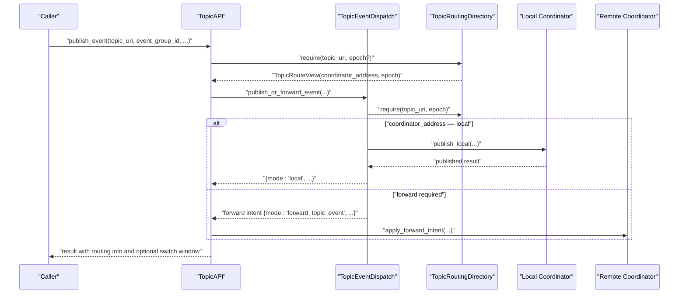
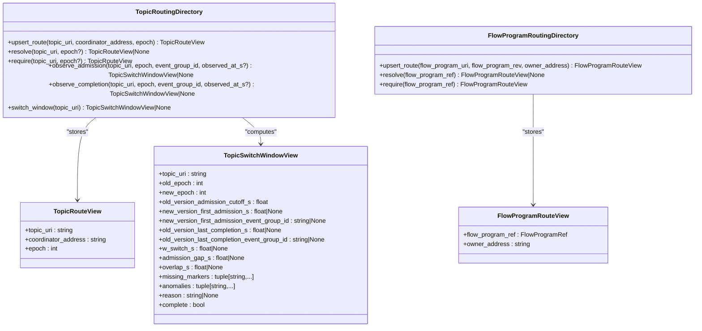
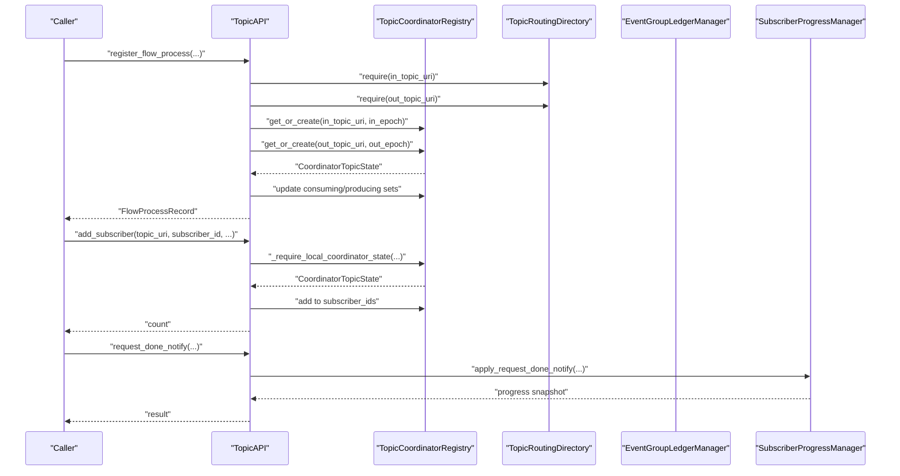
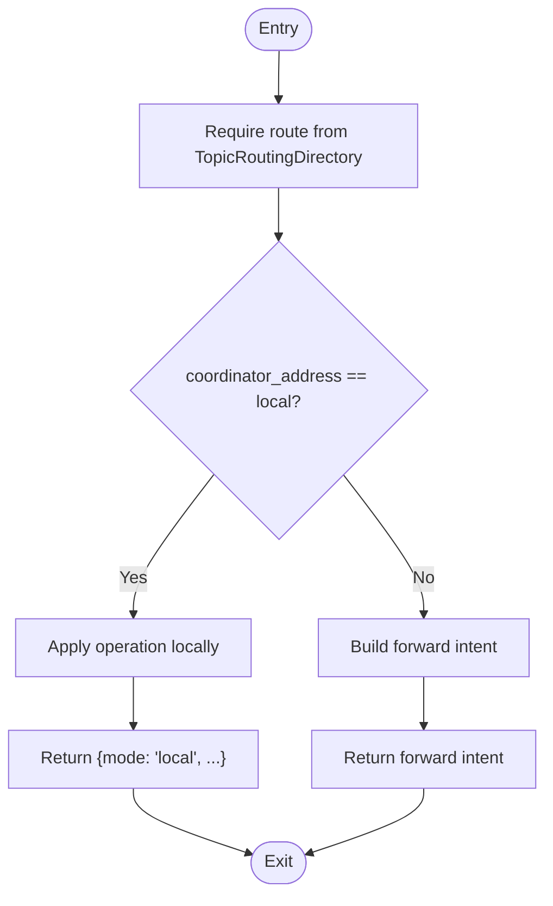
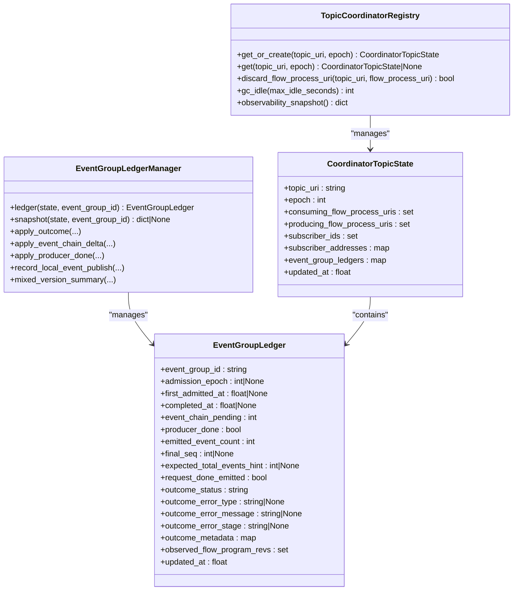
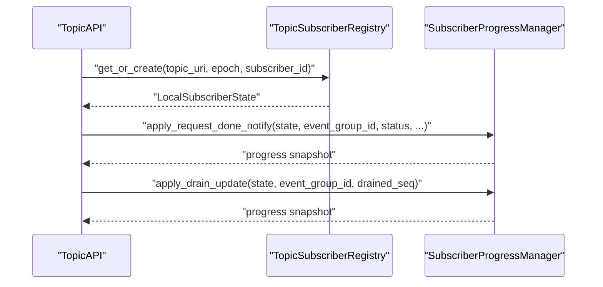
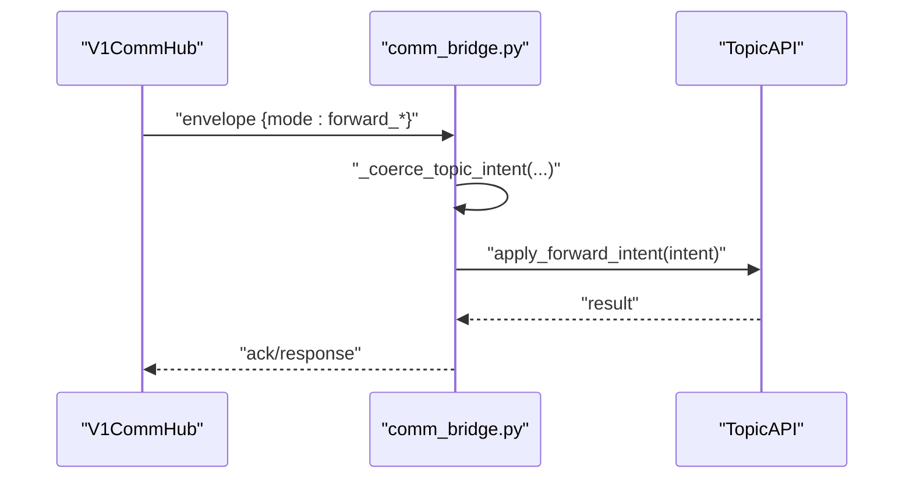
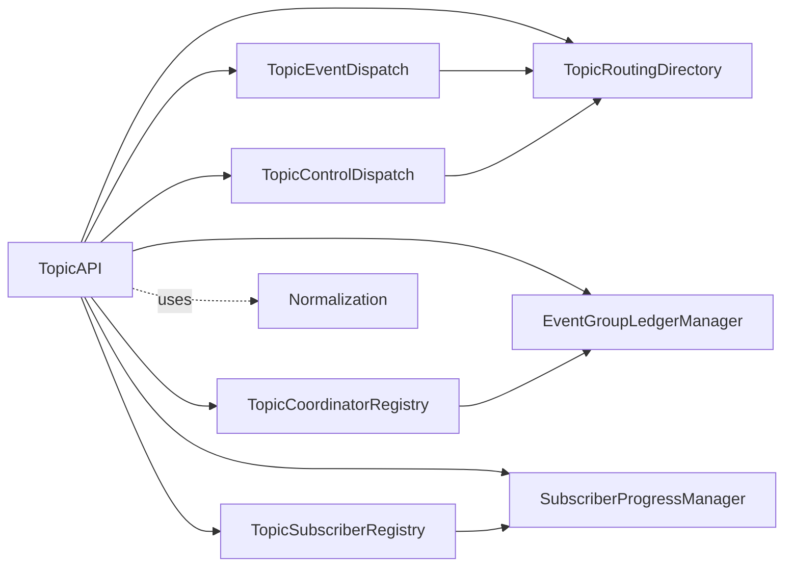

# Routing Directory and Topic API

<cite>
**Referenced Files in This Document**
- [routing_directory.py](file://src/sage/runtime/flownet/runtime/topics/routing_directory.py)
- [topic_api.py](file://src/sage/runtime/flownet/runtime/topics/topic_api.py)
- [comm_bridge.py](file://src/sage/runtime/flownet/runtime/topics/comm_bridge.py)
- [subscriber_registry.py](file://src/sage/runtime/flownet/runtime/topics/subscriber_registry.py)
- [event_dispatch.py](file://src/sage/runtime/flownet/runtime/topics/event_dispatch.py)
- [coordinator_registry.py](file://src/sage/runtime/flownet/runtime/topics/coordinator_registry.py)
- [subscriber_progress.py](file://src/sage/runtime/flownet/runtime/topics/subscriber_progress.py)
- [normalization.py](file://src/sage/runtime/flownet/runtime/topics/normalization.py)
- [event_group_ledger.py](file://src/sage/runtime/flownet/runtime/topics/event_group_ledger.py)
- [control_dispatch.py](file://src/sage/runtime/flownet/runtime/topics/control_dispatch.py)
</cite>

## Table of Contents
1. [Introduction](#introduction)
2. [Project Structure](#project-structure)
3. [Core Components](#core-components)
4. [Architecture Overview](#architecture-overview)
5. [Detailed Component Analysis](#detailed-component-analysis)
6. [Dependency Analysis](#dependency-analysis)
7. [Performance Considerations](#performance-considerations)
8. [Troubleshooting Guide](#troubleshooting-guide)
9. [Conclusion](#conclusion)
10. [Appendices](#appendices)

## Introduction
This document explains the Routing Directory and Topic API subsystem that powers topic-to-node routing, event distribution, and coordination across a distributed runtime. It covers:
- How topic routes are maintained and queried
- How the Topic API orchestrates publishing, control signaling, subscriber progress, and routing updates
- How routing tables are maintained during epoch transitions and how switch windows are computed
- How the communication bridge integrates with the Topic API to forward requests across nodes
- Lifecycle management of topics, subscribers, and flow processes
- Practical usage patterns and examples drawn from the codebase

## Project Structure
The subsystem resides under the topics package and composes several specialized modules:
- Routing and views: routing_directory.py
- Topic API facade: topic_api.py
- Communication bridge: comm_bridge.py
- Dispatch helpers: event_dispatch.py, control_dispatch.py
- Coordinator state: coordinator_registry.py
- Subscriber state: subscriber_registry.py, subscriber_progress.py
- Normalization utilities: normalization.py
- Ledger and outcomes: event_group_ledger.py

**Diagram sources**
- [routing_directory.py:61-347](file://src/sage/runtime/flownet/runtime/topics/routing_directory.py#L61-L347)
- [topic_api.py:38-800](file://src/sage/runtime/flownet/runtime/topics/topic_api.py#L38-L800)
- [event_dispatch.py:10-86](file://src/sage/runtime/flownet/runtime/topics/event_dispatch.py#L10-L86)
- [control_dispatch.py:13-235](file://src/sage/runtime/flownet/runtime/topics/control_dispatch.py#L13-L235)
- [coordinator_registry.py:48-256](file://src/sage/runtime/flownet/runtime/topics/coordinator_registry.py#L48-L256)
- [subscriber_registry.py:36-105](file://src/sage/runtime/flownet/runtime/topics/subscriber_registry.py#L36-L105)
- [subscriber_progress.py:16-162](file://src/sage/runtime/flownet/runtime/topics/subscriber_progress.py#L16-L162)
- [event_group_ledger.py:16-361](file://src/sage/runtime/flownet/runtime/topics/event_group_ledger.py#L16-L361)
- [comm_bridge.py:43-157](file://src/sage/runtime/flownet/runtime/topics/comm_bridge.py#L43-L157)
- [normalization.py:13-77](file://src/sage/runtime/flownet/runtime/topics/normalization.py#L13-L77)

**Section sources**
- [routing_directory.py:61-347](file://src/sage/runtime/flownet/runtime/topics/routing_directory.py#L61-L347)
- [topic_api.py:38-800](file://src/sage/runtime/flownet/runtime/topics/topic_api.py#L38-L800)
- [comm_bridge.py:43-157](file://src/sage/runtime/flownet/runtime/topics/comm_bridge.py#L43-L157)
- [event_dispatch.py:10-86](file://src/sage/runtime/flownet/runtime/topics/event_dispatch.py#L10-L86)
- [control_dispatch.py:13-235](file://src/sage/runtime/flownet/runtime/topics/control_dispatch.py#L13-L235)
- [coordinator_registry.py:48-256](file://src/sage/runtime/flownet/runtime/topics/coordinator_registry.py#L48-L256)
- [subscriber_registry.py:36-105](file://src/sage/runtime/flownet/runtime/topics/subscriber_registry.py#L36-L105)
- [subscriber_progress.py:16-162](file://src/sage/runtime/flownet/runtime/topics/subscriber_progress.py#L16-L162)
- [normalization.py:13-77](file://src/sage/runtime/flownet/runtime/topics/normalization.py#L13-L77)
- [event_group_ledger.py:16-361](file://src/sage/runtime/flownet/runtime/topics/event_group_ledger.py#L16-L361)

## Core Components
- TopicRoutingDirectory: Maintains topic-to-coordinator address mappings per epoch and tracks switch windows for epoch transitions.
- FlowProgramRoutingDirectory: Tracks owners of flow programs keyed by canonical FlowProgramRef.
- TopicAPI: Orchestrates topic lifecycle, routing, publishing, control signals, subscriber progress, and ledger management.
- TopicEventDispatch and TopicControlDispatch: Helpers to decide whether to apply operations locally or forward them via the communication bridge.
- TopicCoordinatorRegistry: Holds local coordinator state per topic+epoch, including subscribers, producers/consumers, and event group ledgers.
- TopicSubscriberRegistry and SubscriberProgressManager: Track per-subscriber progress and derive completion signals.
- EventGroupLedgerManager: Coordinates request lifecycle, outcomes, and convergence.
- Normalization utilities: Enforce canonical topic URIs, non-empty strings, and non-negative integers.
- Communication bridge: Registers handlers and sends forward intents over the wire.

**Section sources**
- [routing_directory.py:61-347](file://src/sage/runtime/flownet/runtime/topics/routing_directory.py#L61-L347)
- [topic_api.py:38-800](file://src/sage/runtime/flownet/runtime/topics/topic_api.py#L38-L800)
- [event_dispatch.py:10-86](file://src/sage/runtime/flownet/runtime/topics/event_dispatch.py#L10-L86)
- [control_dispatch.py:13-235](file://src/sage/runtime/flownet/runtime/topics/control_dispatch.py#L13-L235)
- [coordinator_registry.py:48-256](file://src/sage/runtime/flownet/runtime/topics/coordinator_registry.py#L48-L256)
- [subscriber_registry.py:36-105](file://src/sage/runtime/flownet/runtime/topics/subscriber_registry.py#L36-L105)
- [subscriber_progress.py:16-162](file://src/sage/runtime/flownet/runtime/topics/subscriber_progress.py#L16-L162)
- [event_group_ledger.py:16-361](file://src/sage/runtime/flownet/runtime/topics/event_group_ledger.py#L16-L361)
- [normalization.py:13-77](file://src/sage/runtime/flownet/runtime/topics/normalization.py#L13-L77)
- [comm_bridge.py:43-157](file://src/sage/runtime/flownet/runtime/topics/comm_bridge.py#L43-L157)

## Architecture Overview
The Topic API acts as a facade that coordinates routing, dispatch, coordination, and subscriber state. It delegates:
- Data-plane publishes to TopicEventDispatch, which consults TopicRoutingDirectory to route locally or build a forward intent.
- Control-plane signals to TopicControlDispatch, which similarly decides local vs. forward.
- Coordinator state and outcomes to TopicCoordinatorRegistry and EventGroupLedgerManager.
- Subscriber progress to TopicSubscriberRegistry and SubscriberProgressManager.
- Owner routing for flow programs to FlowProgramRoutingDirectory.

**Diagram sources**
- [topic_api.py:417-487](file://src/sage/runtime/flownet/runtime/topics/topic_api.py#L417-L487)
- [event_dispatch.py:22-54](file://src/sage/runtime/flownet/runtime/topics/event_dispatch.py#L22-L54)
- [routing_directory.py:110-126](file://src/sage/runtime/flownet/runtime/topics/routing_directory.py#L110-L126)

**Section sources**
- [topic_api.py:417-487](file://src/sage/runtime/flownet/runtime/topics/topic_api.py#L417-L487)
- [event_dispatch.py:22-54](file://src/sage/runtime/flownet/runtime/topics/event_dispatch.py#L22-L54)
- [routing_directory.py:110-126](file://src/sage/runtime/flownet/runtime/topics/routing_directory.py#L110-L126)

## Detailed Component Analysis

### TopicRoutingDirectory
Responsibilities:
- Upsert topic routes with normalized topic URIs, coordinator addresses, and epochs.
- Resolve latest or specific epoch routes.
- Observe admission and completion timestamps to compute a switch window view during epoch transitions.
- Expose switch window summaries for diagnostics and convergence checks.

Key behaviors:
- Thread-safe via a lock.
- Maintains:
  - Routes keyed by (topic_uri, epoch)
  - Latest epoch per topic
  - Switch window state for the latest epoch transition

**Diagram sources**
- [routing_directory.py:61-347](file://src/sage/runtime/flownet/runtime/topics/routing_directory.py#L61-L347)

**Section sources**
- [routing_directory.py:61-347](file://src/sage/runtime/flownet/runtime/topics/routing_directory.py#L61-L347)

### TopicAPI
Responsibilities:
- Provides a single facade for topic lifecycle and operations.
- Manages flow program registration and ownership routing.
- Registers/unregisters flow processes and updates coordinator state.
- Adds/removes subscribers and manages subscriber progress.
- Publishes events and forwards control signals.
- Computes switch windows and exposes observability.

Usage highlights:
- Register flow program and upsert owner route
- Register flow process and update coordinator consuming/producing sets
- Add/remove local subscribers and register local subscriber state
- Publish event and optionally trigger ingress handler
- Forward control signals (event chain done, producer done, request outcome)
- Apply forward intents received from the communication bridge

**Diagram sources**
- [topic_api.py:174-242](file://src/sage/runtime/flownet/runtime/topics/topic_api.py#L174-L242)
- [topic_api.py:244-276](file://src/sage/runtime/flownet/runtime/topics/topic_api.py#L244-L276)
- [topic_api.py:298-326](file://src/sage/runtime/flownet/runtime/topics/topic_api.py#L298-L326)

**Section sources**
- [topic_api.py:113-242](file://src/sage/runtime/flownet/runtime/topics/topic_api.py#L113-L242)
- [topic_api.py:244-326](file://src/sage/runtime/flownet/runtime/topics/topic_api.py#L244-L326)

### TopicEventDispatch and TopicControlDispatch
Responsibilities:
- Decide whether to apply operations locally or build forward intents.
- Build intents with required fields and modes for the communication bridge.

**Diagram sources**
- [event_dispatch.py:22-54](file://src/sage/runtime/flownet/runtime/topics/event_dispatch.py#L22-L54)
- [control_dispatch.py:25-122](file://src/sage/runtime/flownet/runtime/topics/control_dispatch.py#L25-L122)

**Section sources**
- [event_dispatch.py:22-82](file://src/sage/runtime/flownet/runtime/topics/event_dispatch.py#L22-L82)
- [control_dispatch.py:25-231](file://src/sage/runtime/flownet/runtime/topics/control_dispatch.py#L25-L231)

### TopicCoordinatorRegistry and EventGroupLedgerManager
Responsibilities:
- Maintain per-topic, per-epoch coordinator state (consumers/producers, subscribers, addresses).
- Track event group ledgers with admission epoch, pending chains, producer done, outcomes, and convergence.
- Compute observability snapshots and prune idle finished ledgers.

**Diagram sources**
- [coordinator_registry.py:36-141](file://src/sage/runtime/flownet/runtime/topics/coordinator_registry.py#L36-L141)
- [event_group_ledger.py:16-306](file://src/sage/runtime/flownet/runtime/topics/event_group_ledger.py#L16-L306)

**Section sources**
- [coordinator_registry.py:48-256](file://src/sage/runtime/flownet/runtime/topics/coordinator_registry.py#L48-L256)
- [event_group_ledger.py:16-361](file://src/sage/runtime/flownet/runtime/topics/event_group_ledger.py#L16-L361)

### Subscriber Management
Responsibilities:
- Track per-subscriber progress per event group and derive completion when conditions are met.
- Normalize identifiers and maintain local subscriber state keyed by topic_uri, epoch, and subscriber_id.

**Diagram sources**
- [topic_api.py:278-350](file://src/sage/runtime/flownet/runtime/topics/topic_api.py#L278-L350)
- [subscriber_registry.py:44-97](file://src/sage/runtime/flownet/runtime/topics/subscriber_registry.py#L44-L97)
- [subscriber_progress.py:59-150](file://src/sage/runtime/flownet/runtime/topics/subscriber_progress.py#L59-L150)

**Section sources**
- [subscriber_registry.py:36-105](file://src/sage/runtime/flownet/runtime/topics/subscriber_registry.py#L36-L105)
- [subscriber_progress.py:16-162](file://src/sage/runtime/flownet/runtime/topics/subscriber_progress.py#L16-L162)
- [topic_api.py:278-350](file://src/sage/runtime/flownet/runtime/topics/topic_api.py#L278-L350)

### Communication Bridge Integration
Responsibilities:
- Register handlers for forward operations on the communication hub.
- Send forward intents over the wire with appropriate planes and opcodes.
- Validate and coerce incoming intents before applying them via TopicAPI.

**Diagram sources**
- [comm_bridge.py:43-157](file://src/sage/runtime/flownet/runtime/topics/comm_bridge.py#L43-L157)
- [topic_api.py:616-724](file://src/sage/runtime/flownet/runtime/topics/topic_api.py#L616-L724)

**Section sources**
- [comm_bridge.py:43-157](file://src/sage/runtime/flownet/runtime/topics/comm_bridge.py#L43-L157)
- [topic_api.py:616-724](file://src/sage/runtime/flownet/runtime/topics/topic_api.py#L616-L724)

## Dependency Analysis
- TopicAPI depends on TopicRoutingDirectory, TopicCoordinatorRegistry, TopicSubscriberRegistry, SubscriberProgressManager, EventGroupLedgerManager, TopicEventDispatch, TopicControlDispatch, and normalization utilities.
- TopicEventDispatch and TopicControlDispatch depend on TopicRoutingDirectory.
- Coordinator state and ledgers are tightly coupled with event lifecycle and outcomes.
- Subscriber state is decoupled from routing but participates in convergence.

**Diagram sources**
- [topic_api.py:38-112](file://src/sage/runtime/flownet/runtime/topics/topic_api.py#L38-L112)
- [event_dispatch.py:10-21](file://src/sage/runtime/flownet/runtime/topics/event_dispatch.py#L10-L21)
- [control_dispatch.py:13-23](file://src/sage/runtime/flownet/runtime/topics/control_dispatch.py#L13-L23)
- [coordinator_registry.py:48-58](file://src/sage/runtime/flownet/runtime/topics/coordinator_registry.py#L48-L58)
- [subscriber_registry.py:36-42](file://src/sage/runtime/flownet/runtime/topics/subscriber_registry.py#L36-L42)
- [subscriber_progress.py:16-26](file://src/sage/runtime/flownet/runtime/topics/subscriber_progress.py#L16-L26)
- [event_group_ledger.py:16-26](file://src/sage/runtime/flownet/runtime/topics/event_group_ledger.py#L16-L26)
- [normalization.py:13-27](file://src/sage/runtime/flownet/runtime/topics/normalization.py#L13-L27)

**Section sources**
- [topic_api.py:38-112](file://src/sage/runtime/flownet/runtime/topics/topic_api.py#L38-L112)
- [event_dispatch.py:10-21](file://src/sage/runtime/flownet/runtime/topics/event_dispatch.py#L10-L21)
- [control_dispatch.py:13-23](file://src/sage/runtime/flownet/runtime/topics/control_dispatch.py#L13-L23)
- [coordinator_registry.py:48-58](file://src/sage/runtime/flownet/runtime/topics/coordinator_registry.py#L48-L58)
- [subscriber_registry.py:36-42](file://src/sage/runtime/flownet/runtime/topics/subscriber_registry.py#L36-L42)
- [subscriber_progress.py:16-26](file://src/sage/runtime/flownet/runtime/topics/subscriber_progress.py#L16-L26)
- [event_group_ledger.py:16-26](file://src/sage/runtime/flownet/runtime/topics/event_group_ledger.py#L16-L26)
- [normalization.py:13-27](file://src/sage/runtime/flownet/runtime/topics/normalization.py#L13-L27)

## Performance Considerations
- Lock contention: All routing and registry classes use locks; minimize contention by batching operations and avoiding long work inside critical sections.
- Epoch transitions: Switch window computations rely on observed timestamps; ensure monotonic time sources to avoid anomalies.
- GC policies: Idle coordinator and subscriber states are pruned; tune max_idle_seconds to balance memory and responsiveness.
- Event sequencing: Using sequence hints or tags can reduce recomputation of final sequence; leverage expected_total_events for early completion detection.
- Forwarding overhead: Forward intents incur network latency; prefer local execution when possible and co-locate producers/consumers with the coordinator.

[No sources needed since this section provides general guidance]

## Troubleshooting Guide
Common issues and resolutions:
- Routing table consistency
  - Symptom: Resolving a route fails or returns None.
  - Actions: Verify topic URI normalization and epoch values; ensure upsert_route was called with the correct coordinator address and epoch.
  - References: [routing_directory.py:110-143](file://src/sage/runtime/flownet/runtime/topics/routing_directory.py#L110-L143)

- Topic resolution failures
  - Symptom: require raises an error indicating missing route or epoch-specific route.
  - Actions: Confirm the topic exists in routing directory and epoch matches expectations; re-upsert route if epoch changed.
  - References: [routing_directory.py:128-143](file://src/sage/runtime/flownet/runtime/topics/routing_directory.py#L128-L143)

- Switch window anomalies
  - Symptom: Switch window reports missing markers or inconsistencies.
  - Actions: Ensure admission and completion observations are recorded; verify timestamps are non-negative and monotonic.
  - References: [routing_directory.py:296-338](file://src/sage/runtime/flownet/runtime/topics/routing_directory.py#L296-L338)

- Subscriber progress not completing
  - Symptom: Subscriber never emits done despite producer completion and drain updates.
  - Actions: Provide expected_total_events or final_seq; confirm subscriber_id normalization and progress updates.
  - References: [subscriber_progress.py:124-150](file://src/sage/runtime/flownet/runtime/topics/subscriber_progress.py#L124-L150)

- Forward intent mismatches
  - Symptom: Errors indicating mismatched owner or subscriber address for forwarded intents.
  - Actions: Validate intent fields and target addresses; ensure local address matches expected owner/subscriber.
  - References: [topic_api.py:626-651](file://src/sage/runtime/flownet/runtime/topics/topic_api.py#L626-L651)

**Section sources**
- [routing_directory.py:110-143](file://src/sage/runtime/flownet/runtime/topics/routing_directory.py#L110-L143)
- [routing_directory.py:296-338](file://src/sage/runtime/flownet/runtime/topics/routing_directory.py#L296-L338)
- [subscriber_progress.py:124-150](file://src/sage/runtime/flownet/runtime/topics/subscriber_progress.py#L124-L150)
- [topic_api.py:626-651](file://src/sage/runtime/flownet/runtime/topics/topic_api.py#L626-L651)

## Conclusion
The Routing Directory and Topic API subsystem provides a robust, thread-safe foundation for topic routing, event distribution, and coordination across nodes. By combining routing directories, dispatch helpers, coordinator ledgers, and subscriber progress managers, it supports reliable convergence, observability, and scalable forwarding. Proper use of normalization, epoch-aware routing, and GC policies ensures correctness and performance in distributed deployments.

[No sources needed since this section summarizes without analyzing specific files]

## Appendices

### Example Usage Patterns (paths only)
- Register a flow program and upsert owner route
  - [topic_api.py:113-133](file://src/sage/runtime/flownet/runtime/topics/topic_api.py#L113-L133)
- Register a flow process and update coordinator state
  - [topic_api.py:174-218](file://src/sage/runtime/flownet/runtime/topics/topic_api.py#L174-L218)
- Add a local subscriber and register local subscriber state
  - [topic_api.py:278-296](file://src/sage/runtime/flownet/runtime/topics/topic_api.py#L278-L296)
- Publish an event and observe switch window
  - [topic_api.py:438-487](file://src/sage/runtime/flownet/runtime/topics/topic_api.py#L438-L487)
- Forward a control signal (event chain done)
  - [topic_api.py:489-504](file://src/sage/runtime/flownet/runtime/topics/topic_api.py#L489-L504)
- Apply a forward intent via communication bridge
  - [topic_api.py:616-724](file://src/sage/runtime/flownet/runtime/topics/topic_api.py#L616-L724)
  - [comm_bridge.py:93-124](file://src/sage/runtime/flownet/runtime/topics/comm_bridge.py#L93-L124)

**Section sources**
- [topic_api.py:113-133](file://src/sage/runtime/flownet/runtime/topics/topic_api.py#L113-L133)
- [topic_api.py:174-218](file://src/sage/runtime/flownet/runtime/topics/topic_api.py#L174-L218)
- [topic_api.py:278-296](file://src/sage/runtime/flownet/runtime/topics/topic_api.py#L278-L296)
- [topic_api.py:438-487](file://src/sage/runtime/flownet/runtime/topics/topic_api.py#L438-L487)
- [topic_api.py:489-504](file://src/sage/runtime/flownet/runtime/topics/topic_api.py#L489-L504)
- [topic_api.py:616-724](file://src/sage/runtime/flownet/runtime/topics/topic_api.py#L616-L724)
- [comm_bridge.py:93-124](file://src/sage/runtime/flownet/runtime/topics/comm_bridge.py#L93-L124)