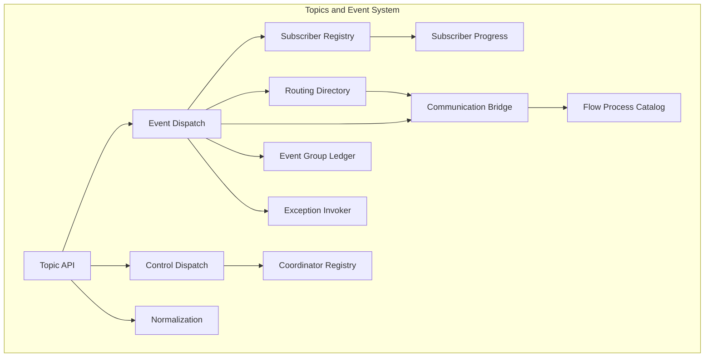
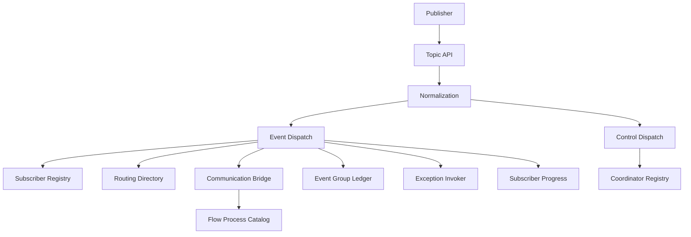
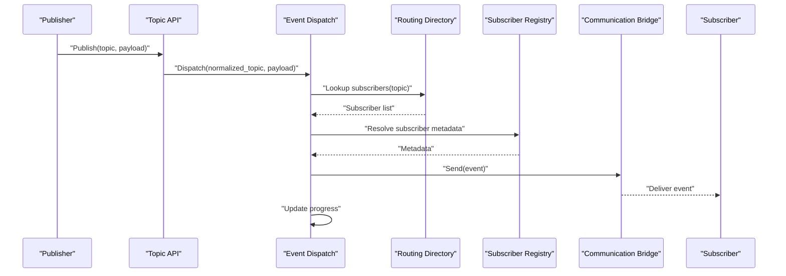
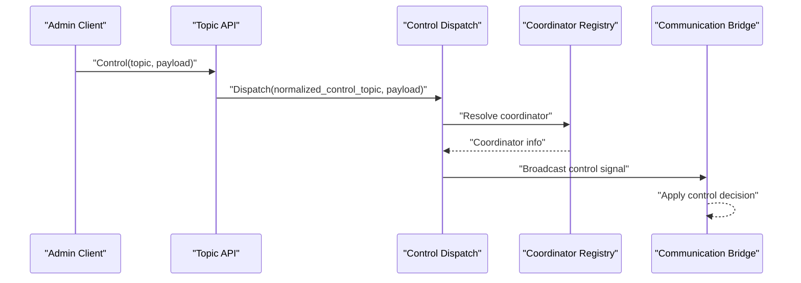
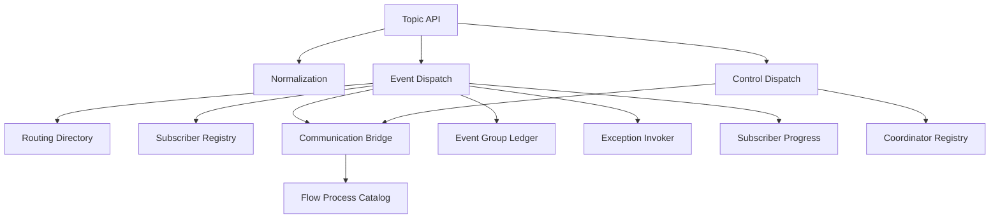

# Topics and Event System

<cite>
**Referenced Files in This Document**
- [topic_api.py](file://src/sage/runtime/flownet/runtime/topics/topic_api.py)
- [event_dispatch.py](file://src/sage/runtime/flownet/runtime/topics/event_dispatch.py)
- [control_dispatch.py](file://src/sage/runtime/flownet/runtime/topics/control_dispatch.py)
- [coordinator_registry.py](file://src/sage/runtime/flownet/runtime/topics/coordinator_registry.py)
- [subscriber_registry.py](file://src/sage/runtime/flownet/runtime/topics/subscriber_registry.py)
- [routing_directory.py](file://src/sage/runtime/flownet/runtime/topics/routing_directory.py)
- [comm_bridge.py](file://src/sage/runtime/flownet/runtime/topics/comm_bridge.py)
- [flow_process_catalog.py](file://src/sage/runtime/flownet/runtime/topics/flow_process_catalog.py)
- [event_group_ledger.py](file://src/sage/runtime/flownet/runtime/topics/event_group_ledger.py)
- [exception_invoker.py](file://src/sage/runtime/flownet/runtime/topics/exception_invoker.py)
- [subscriber_progress.py](file://src/sage/runtime/flownet/runtime/topics/subscriber_progress.py)
- [normalization.py](file://src/sage/runtime/flownet/runtime/topics/normalization.py)
- [__init__.py](file://src/sage/runtime/flownet/runtime/topics/__init__.py)
</cite>

## Table of Contents
1. [Introduction](#introduction)
2. [Project Structure](#project-structure)
3. [Core Components](#core-components)
4. [Architecture Overview](#architecture-overview)
5. [Detailed Component Analysis](#detailed-component-analysis)
6. [Dependency Analysis](#dependency-analysis)
7. [Performance Considerations](#performance-considerations)
8. [Troubleshooting Guide](#troubleshooting-guide)
9. [Conclusion](#conclusion)
10. [Appendices](#appendices)

## Introduction
The Topics and Event System in SAGE provides an event-driven communication and coordination framework for the FlowNet cluster. It enables decoupled, asynchronous interactions among distributed components using a publish-subscribe model. Through topic-based channels, the system distributes events, coordinates execution across nodes, and maintains state for reliable distributed workflows. The system integrates with the actor runtime and communication layer to deliver scalable, fault-tolerant coordination primitives suitable for large-scale distributed computing.

## Project Structure
The Topics and Event System resides under the runtime topics package and comprises several specialized modules:
- Topic API: Public interface for publishing and subscribing to topics.
- Event Dispatch: Core dispatcher for routing and delivering events to subscribers.
- Control Dispatch: Specialized dispatcher for control-plane messages and coordination signals.
- Coordinator Registry: Central registry for coordinating entities and their capabilities.
- Subscriber Registry: Tracks subscriptions and subscriber metadata.
- Routing Directory: Maintains routing tables for topic-to-subscriber mappings.
- Communication Bridge: Bridges topic operations to the underlying communication layer.
- Flow Process Catalog: Catalogs flow processes and their topic-related attributes.
- Event Group Ledger: Tracks groups of related events for ordering and recovery.
- Exception Invoker: Handles exceptions during event processing.
- Subscriber Progress: Tracks subscriber progress and offsets for reliability.
- Normalization: Normalizes topic identifiers and ensures consistent routing keys.
- Initialization: Package initialization and exports.

**Diagram sources**
- [topic_api.py](file://src/sage/runtime/flownet/runtime/topics/topic_api.py)
- [event_dispatch.py](file://src/sage/runtime/flownet/runtime/topics/event_dispatch.py)
- [control_dispatch.py](file://src/sage/runtime/flownet/runtime/topics/control_dispatch.py)
- [coordinator_registry.py](file://src/sage/runtime/flownet/runtime/topics/coordinator_registry.py)
- [subscriber_registry.py](file://src/sage/runtime/flownet/runtime/topics/subscriber_registry.py)
- [routing_directory.py](file://src/sage/runtime/flownet/runtime/topics/routing_directory.py)
- [comm_bridge.py](file://src/sage/runtime/flownet/runtime/topics/comm_bridge.py)
- [flow_process_catalog.py](file://src/sage/runtime/flownet/runtime/topics/flow_process_catalog.py)
- [event_group_ledger.py](file://src/sage/runtime/flownet/runtime/topics/event_group_ledger.py)
- [exception_invoker.py](file://src/sage/runtime/flownet/runtime/topics/exception_invoker.py)
- [subscriber_progress.py](file://src/sage/runtime/flownet/runtime/topics/subscriber_progress.py)
- [normalization.py](file://src/sage/runtime/flownet/runtime/topics/normalization.py)

**Section sources**
- [__init__.py](file://src/sage/runtime/flownet/runtime/topics/__init__.py)

## Core Components
- Topic API: Provides the primary interface for publishing events to topics and managing subscriptions. It normalizes topic identifiers and delegates to the event/control dispatchers.
- Event Dispatch: Routes inbound events to subscribers via the routing directory and subscriber registry, tracks progress, and manages delivery guarantees.
- Control Dispatch: Handles control-plane coordination messages and signals, leveraging the coordinator registry for authoritative routing.
- Coordinator Registry: Maintains authoritative state for coordinators and their capabilities, enabling control-plane decisions.
- Subscriber Registry: Tracks subscriber identities, subscription metadata, and lifecycle states.
- Routing Directory: Stores topic-to-subscriber mappings and supports efficient lookup and updates.
- Communication Bridge: Translates topic operations into network-level messages and coordinates with the runtime’s communication layer.
- Flow Process Catalog: Associates flow processes with topic attributes and runtime context.
- Event Group Ledger: Groups related events for ordering and recovery, supporting transaction-like semantics.
- Exception Invoker: Centralizes exception handling during event processing to maintain system resilience.
- Subscriber Progress: Tracks subscriber offsets and progress to support reliable delivery and recovery.
- Normalization: Ensures consistent topic identifiers and routing keys across the cluster.

**Section sources**
- [topic_api.py](file://src/sage/runtime/flownet/runtime/topics/topic_api.py)
- [event_dispatch.py](file://src/sage/runtime/flownet/runtime/topics/event_dispatch.py)
- [control_dispatch.py](file://src/sage/runtime/flownet/runtime/topics/control_dispatch.py)
- [coordinator_registry.py](file://src/sage/runtime/flownet/runtime/topics/coordinator_registry.py)
- [subscriber_registry.py](file://src/sage/runtime/flownet/runtime/topics/subscriber_registry.py)
- [routing_directory.py](file://src/sage/runtime/flownet/runtime/topics/routing_directory.py)
- [comm_bridge.py](file://src/sage/runtime/flownet/runtime/topics/comm_bridge.py)
- [flow_process_catalog.py](file://src/sage/runtime/flownet/runtime/topics/flow_process_catalog.py)
- [event_group_ledger.py](file://src/sage/runtime/flownet/runtime/topics/event_group_ledger.py)
- [exception_invoker.py](file://src/sage/runtime/flownet/runtime/topics/exception_invoker.py)
- [subscriber_progress.py](file://src/sage/runtime/flownet/runtime/topics/subscriber_progress.py)
- [normalization.py](file://src/sage/runtime/flownet/runtime/topics/normalization.py)

## Architecture Overview
The Topics and Event System orchestrates event-driven coordination across FlowNet. Publishers submit events to the Topic API, which normalizes topic identifiers and forwards to either the Event Dispatch or Control Dispatch subsystems. Event Dispatch resolves routing via the Routing Directory and Subscriber Registry, delivers to subscribers, and tracks progress. Control Dispatch leverages the Coordinator Registry for authoritative control-plane coordination. The Communication Bridge integrates with the runtime’s communication layer to ensure reliable delivery across nodes. Supporting modules like the Event Group Ledger, Exception Invoker, and Subscriber Progress provide reliability, ordering, and recovery.

**Diagram sources**
- [topic_api.py](file://src/sage/runtime/flownet/runtime/topics/topic_api.py)
- [event_dispatch.py](file://src/sage/runtime/flownet/runtime/topics/event_dispatch.py)
- [control_dispatch.py](file://src/sage/runtime/flownet/runtime/topics/control_dispatch.py)
- [coordinator_registry.py](file://src/sage/runtime/flownet/runtime/topics/coordinator_registry.py)
- [subscriber_registry.py](file://src/sage/runtime/flownet/runtime/topics/subscriber_registry.py)
- [routing_directory.py](file://src/sage/runtime/flownet/runtime/topics/routing_directory.py)
- [comm_bridge.py](file://src/sage/runtime/flownet/runtime/topics/comm_bridge.py)
- [flow_process_catalog.py](file://src/sage/runtime/flownet/runtime/topics/flow_process_catalog.py)
- [event_group_ledger.py](file://src/sage/runtime/flownet/runtime/topics/event_group_ledger.py)
- [exception_invoker.py](file://src/sage/runtime/flownet/runtime/topics/exception_invoker.py)
- [subscriber_progress.py](file://src/sage/runtime/flownet/runtime/topics/subscriber_progress.py)
- [normalization.py](file://src/sage/runtime/flownet/runtime/topics/normalization.py)

## Detailed Component Analysis

### Topic API
The Topic API is the primary entry point for publishers and subscribers. It normalizes topic identifiers, validates inputs, and routes requests to the appropriate dispatcher. It also exposes subscription management operations and integrates with the actor runtime for coordinated execution.

Key responsibilities:
- Normalize topic identifiers for consistent routing.
- Delegate to Event Dispatch for data-plane events.
- Delegate to Control Dispatch for control-plane coordination.
- Manage subscription lifecycles and metadata.

Practical usage patterns:
- Publishing an event to a topic.
- Subscribing to a topic with filters or offsets.
- Unsubscribing and cleaning up resources.

**Section sources**
- [topic_api.py](file://src/sage/runtime/flownet/runtime/topics/topic_api.py)

### Event Dispatch
Event Dispatch is responsible for distributing events to subscribers. It consults the Routing Directory and Subscriber Registry to resolve destinations, uses the Communication Bridge for cross-node delivery, and tracks progress via Subscriber Progress. It also coordinates with the Event Group Ledger for ordering and recovery.

Processing logic:
- Resolve topic to subscribers via Routing Directory.
- Retrieve subscriber metadata from Subscriber Registry.
- Deliver events through Communication Bridge.
- Update Subscriber Progress after successful delivery.
- Log group membership in Event Group Ledger.

**Diagram sources**
- [event_dispatch.py](file://src/sage/runtime/flownet/runtime/topics/event_dispatch.py)
- [routing_directory.py](file://src/sage/runtime/flownet/runtime/topics/routing_directory.py)
- [subscriber_registry.py](file://src/sage/runtime/flownet/runtime/topics/subscriber_registry.py)
- [comm_bridge.py](file://src/sage/runtime/flownet/runtime/topics/comm_bridge.py)

**Section sources**
- [event_dispatch.py](file://src/sage/runtime/flownet/runtime/topics/event_dispatch.py)

### Control Dispatch
Control Dispatch handles control-plane coordination messages and signals. It relies on the Coordinator Registry to ensure authoritative routing and decision-making. This subsystem is critical for cluster-wide coordination tasks such as leader election, membership changes, and global state updates.

Processing logic:
- Receive control message via Topic API.
- Resolve coordinator identity and capability via Coordinator Registry.
- Apply control logic and propagate decisions to relevant nodes.
- Maintain consistency with Event Group Ledger for ordered control sequences.

**Diagram sources**
- [control_dispatch.py](file://src/sage/runtime/flownet/runtime/topics/control_dispatch.py)
- [coordinator_registry.py](file://src/sage/runtime/flownet/runtime/topics/coordinator_registry.py)
- [comm_bridge.py](file://src/sage/runtime/flownet/runtime/topics/comm_bridge.py)

**Section sources**
- [control_dispatch.py](file://src/sage/runtime/flownet/runtime/topics/control_dispatch.py)

### Coordinator Registry
The Coordinator Registry maintains authoritative state for coordinators and their capabilities. It ensures that control-plane decisions are made by the correct entity and supports failover and recovery scenarios.

Responsibilities:
- Register and discover coordinators.
- Track coordinator health and capabilities.
- Provide authoritative routing for control messages.

**Section sources**
- [coordinator_registry.py](file://src/sage/runtime/flownet/runtime/topics/coordinator_registry.py)

### Subscriber Registry
The Subscriber Registry tracks subscriber identities, subscription metadata, and lifecycle states. It provides fast lookups and updates for routing and delivery decisions.

Responsibilities:
- Maintain subscriber records and filters.
- Support subscription creation, updates, and removal.
- Integrate with Subscriber Progress for reliability.

**Section sources**
- [subscriber_registry.py](file://src/sage/runtime/flownet/runtime/topics/subscriber_registry.py)

### Routing Directory
The Routing Directory stores topic-to-subscriber mappings and supports efficient lookup and updates. It is the backbone of event distribution, ensuring that events reach the correct subscribers.

Responsibilities:
- Store and update topic-to-subscriber mappings.
- Provide fast resolution for event routing.
- Coordinate with Subscriber Registry for metadata.

**Section sources**
- [routing_directory.py](file://src/sage/runtime/flownet/runtime/topics/routing_directory.py)

### Communication Bridge
The Communication Bridge translates topic operations into network-level messages and coordinates with the runtime’s communication layer. It ensures reliable delivery across nodes and integrates with the Flow Process Catalog for runtime context.

Responsibilities:
- Translate topic operations to transport messages.
- Coordinate with runtime communication layer.
- Integrate with Flow Process Catalog for context.

**Section sources**
- [comm_bridge.py](file://src/sage/runtime/flownet/runtime/topics/comm_bridge.py)
- [flow_process_catalog.py](file://src/sage/runtime/flownet/runtime/topics/flow_process_catalog.py)

### Event Group Ledger
The Event Group Ledger groups related events for ordering and recovery. It supports transaction-like semantics and helps maintain consistency across distributed operations.

Responsibilities:
- Group related events for ordering.
- Support recovery and replay scenarios.
- Coordinate with Event Dispatch for sequencing.

**Section sources**
- [event_group_ledger.py](file://src/sage/runtime/flownet/runtime/topics/event_group_ledger.py)

### Exception Invoker
The Exception Invoker centralizes exception handling during event processing. It ensures that failures are handled consistently and system resilience is maintained.

Responsibilities:
- Intercept and handle exceptions during event processing.
- Trigger recovery or escalation policies.
- Coordinate with Event Dispatch and Subscriber Progress.

**Section sources**
- [exception_invoker.py](file://src/sage/runtime/flownet/runtime/topics/exception_invoker.py)

### Subscriber Progress
Subscriber Progress tracks subscriber offsets and progress to support reliable delivery and recovery. It ensures that subscribers can resume from the correct position after failures.

Responsibilities:
- Track subscriber offsets and progress.
- Support recovery and resumption.
- Coordinate with Event Dispatch for progress updates.

**Section sources**
- [subscriber_progress.py](file://src/sage/runtime/flownet/runtime/topics/subscriber_progress.py)

### Normalization
Normalization ensures consistent topic identifiers and routing keys across the cluster. It prevents ambiguity and improves routing accuracy.

Responsibilities:
- Normalize topic identifiers.
- Enforce consistent routing keys.
- Integrate with Topic API for preprocessing.

**Section sources**
- [normalization.py](file://src/sage/runtime/flownet/runtime/topics/normalization.py)

### Conceptual Overview
For beginners, event-driven architecture decouples producers and consumers by exchanging events over topics. Publishers emit events without knowing who will consume them. Subscribers register interest in topics and receive filtered events. The system scales horizontally by adding more subscribers and nodes, and it tolerates failures by redistributing work and maintaining progress.

Pub-sub patterns:
- Publish: Emit an event to a topic.
- Subscribe: Register interest with optional filters.
- Route: Distribute events to matching subscribers.
- Deliver: Ensure reliable delivery and progress tracking.

Distributed coordination:
- Use control dispatch for cluster-wide decisions.
- Use coordinator registry for authoritative routing.
- Use event group ledger for ordering and recovery.

[No sources needed since this section provides conceptual guidance]

## Dependency Analysis
The Topics and Event System exhibits strong cohesion within its modules and clear separation of concerns. Topic API depends on Normalization and dispatchers. Event Dispatch depends on Routing Directory, Subscriber Registry, Communication Bridge, Event Group Ledger, Exception Invoker, and Subscriber Progress. Control Dispatch depends on Coordinator Registry and Communication Bridge. Communication Bridge integrates with Flow Process Catalog. Supporting modules provide auxiliary functions for reliability and correctness.

**Diagram sources**
- [topic_api.py](file://src/sage/runtime/flownet/runtime/topics/topic_api.py)
- [event_dispatch.py](file://src/sage/runtime/flownet/runtime/topics/event_dispatch.py)
- [control_dispatch.py](file://src/sage/runtime/flownet/runtime/topics/control_dispatch.py)
- [coordinator_registry.py](file://src/sage/runtime/flownet/runtime/topics/coordinator_registry.py)
- [subscriber_registry.py](file://src/sage/runtime/flownet/runtime/topics/subscriber_registry.py)
- [routing_directory.py](file://src/sage/runtime/flownet/runtime/topics/routing_directory.py)
- [comm_bridge.py](file://src/sage/runtime/flownet/runtime/topics/comm_bridge.py)
- [flow_process_catalog.py](file://src/sage/runtime/flownet/runtime/topics/flow_process_catalog.py)
- [event_group_ledger.py](file://src/sage/runtime/flownet/runtime/topics/event_group_ledger.py)
- [exception_invoker.py](file://src/sage/runtime/flownet/runtime/topics/exception_invoker.py)
- [subscriber_progress.py](file://src/sage/runtime/flownet/runtime/topics/subscriber_progress.py)
- [normalization.py](file://src/sage/runtime/flownet/runtime/topics/normalization.py)

**Section sources**
- [topic_api.py](file://src/sage/runtime/flownet/runtime/topics/topic_api.py)
- [event_dispatch.py](file://src/sage/runtime/flownet/runtime/topics/event_dispatch.py)
- [control_dispatch.py](file://src/sage/runtime/flownet/runtime/topics/control_dispatch.py)
- [coordinator_registry.py](file://src/sage/runtime/flownet/runtime/topics/coordinator_registry.py)
- [subscriber_registry.py](file://src/sage/runtime/flownet/runtime/topics/subscriber_registry.py)
- [routing_directory.py](file://src/sage/runtime/flownet/runtime/topics/routing_directory.py)
- [comm_bridge.py](file://src/sage/runtime/flownet/runtime/topics/comm_bridge.py)
- [flow_process_catalog.py](file://src/sage/runtime/flownet/runtime/topics/flow_process_catalog.py)
- [event_group_ledger.py](file://src/sage/runtime/flownet/runtime/topics/event_group_ledger.py)
- [exception_invoker.py](file://src/sage/runtime/flownet/runtime/topics/exception_invoker.py)
- [subscriber_progress.py](file://src/sage/runtime/flownet/runtime/topics/subscriber_progress.py)
- [normalization.py](file://src/sage/runtime/flownet/runtime/topics/normalization.py)

## Performance Considerations
- Minimize routing overhead: Use normalized topic identifiers and compact routing keys to reduce lookup costs.
- Batch deliveries: Aggregate events where safe to reduce network overhead and improve throughput.
- Tune subscriber progress intervals: Balance progress persistence frequency with durability requirements.
- Control dispatch prioritization: Separate control and data planes to avoid contention and latency spikes.
- Backpressure and throttling: Implement subscriber-side throttling to prevent overload during bursts.
- Caching: Cache frequent routing lookups and subscriber metadata to reduce repeated queries.
- Transport optimization: Leverage the Communication Bridge’s transport capabilities for efficient cross-node messaging.

[No sources needed since this section provides general guidance]

## Troubleshooting Guide
Common issues and resolutions:
- Events not delivered: Verify routing directory entries and subscriber registry state. Check Communication Bridge connectivity and logs.
- Duplicate deliveries: Inspect Subscriber Progress offsets and Event Group Ledger to identify reprocessing conditions.
- Control-plane inconsistencies: Review Coordinator Registry state and ensure authoritative routing is applied.
- Exceptions during processing: Use Exception Invoker to capture and escalate errors; correlate with Event Dispatch logs.
- Subscription lifecycle problems: Confirm Topic API subscription operations and Subscriber Registry updates.

Debugging tips:
- Enable structured logging around Topic API, Event Dispatch, and Control Dispatch.
- Monitor routing directory updates and subscriber metadata changes.
- Validate normalization rules for topic identifiers.
- Trace Communication Bridge messages and Flow Process Catalog context.

**Section sources**
- [exception_invoker.py](file://src/sage/runtime/flownet/runtime/topics/exception_invoker.py)
- [subscriber_progress.py](file://src/sage/runtime/flownet/runtime/topics/subscriber_progress.py)
- [event_group_ledger.py](file://src/sage/runtime/flownet/runtime/topics/event_group_ledger.py)
- [routing_directory.py](file://src/sage/runtime/flownet/runtime/topics/routing_directory.py)
- [subscriber_registry.py](file://src/sage/runtime/flownet/runtime/topics/subscriber_registry.py)
- [comm_bridge.py](file://src/sage/runtime/flownet/runtime/topics/comm_bridge.py)
- [flow_process_catalog.py](file://src/sage/runtime/flownet/runtime/topics/flow_process_catalog.py)

## Conclusion
The Topics and Event System in SAGE provides a robust, scalable foundation for event-driven communication and coordination across the FlowNet cluster. By separating concerns into Topic API, Event Dispatch, Control Dispatch, and supporting modules, it achieves decoupling, reliability, and performance. Integrations with the actor system and communication layer ensure seamless operation in distributed environments. The system’s design supports practical patterns for publication, subscription management, and distributed coordination, while offering advanced capabilities for ordering, recovery, and control-plane orchestration.

[No sources needed since this section summarizes without analyzing specific files]

## Appendices
- Practical examples:
  - Event publication: Use Topic API to publish to a normalized topic; observe delivery via Event Dispatch and Subscriber Progress.
  - Subscription management: Subscribe with filters; update subscriptions; unsubscribe and verify cleanup.
  - Distributed coordination: Use Control Dispatch with Coordinator Registry for cluster-wide decisions; broadcast control signals via Communication Bridge.

[No sources needed since this section provides general guidance]