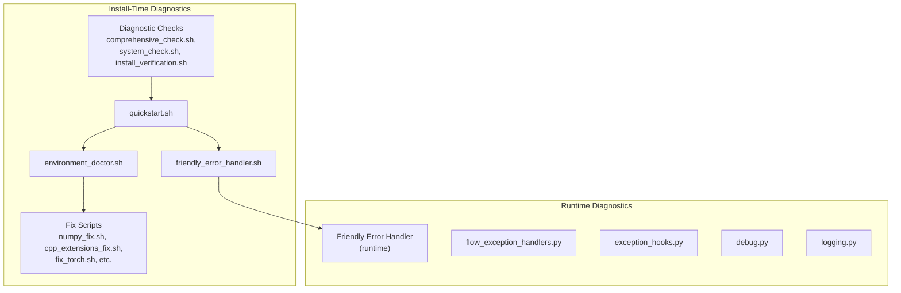
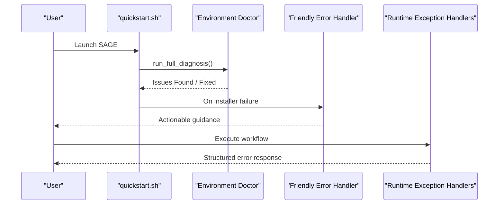
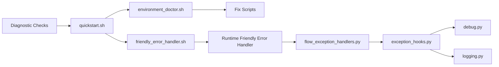

# Troubleshooting and FAQ

<cite>
**Referenced Files in This Document**
- [quickstart.sh](file://quickstart.sh)
- [environment_doctor.sh](file://tools/install/fixes/environment_doctor.sh)
- [friendly_error_handler.sh](file://tools/install/fixes/friendly_error_handler.sh)
- [numpy_fix.sh](file://tools/install/fixes/numpy_fix.sh)
- [cpp_extensions_fix.sh](file://tools/install/fixes/cpp_extensions_fix.sh)
- [fix_torch.sh](file://tools/install/fixes/fix_torch.sh)
- [log_management.sh](file://tools/install/fixes/log_management.sh)
- [build_cache_cleaner.sh](file://tools/install/fixes/build_cache_cleaner.sh)
- [checkpoint_manager.sh](file://tools/install/fixes/checkpoint_manager.sh)
- [libstdcxx_fix.sh](file://tools/install/fixes/libstdcxx_fix.sh)
- [pytorch_cuda_installer.sh](file://tools/install/fixes/pytorch_cuda_installer.sh)
- [comprehensive_check.sh](file://tools/install/checks/comprehensive_check.sh)
- [system_check.sh](file://tools/install/checks/system_check.sh)
- [system_environment_check.sh](file://tools/install/checks/system_environment_check.sh)
- [install_verification.sh](file://tools/install/checks/install_verification.sh)
- [installation_consistency_check.sh](file://tools/install/checks/installation_consistency_check.sh)
- [diagnose_cpp_extensions.sh](file://tools/install/checks/diagnose_cpp_extensions.sh)
- [log_analyzer.sh](file://tools/install/checks/log_analyzer.sh)
- [verify_dependencies.py](file://tools/install/checks/verify_dependencies.py)
- [argument_parser.sh](file://tools/install/installers/argument_parser.sh)
- [core_installer.sh](file://tools/install/installers/core_installer.sh)
- [main_installer.sh](file://tools/install/installers/main_installer.sh)
- [flow_exception_handlers.py](file://src/sage/runtime/flownet/api/flow_exception_handlers.py)
- [exception_hooks.py](file://src/sage/runtime/exception_hooks.py)
- [debug.py](file://src/sage/foundation/debug.py)
- [logging.py](file://src/sage/foundation/logging.py)
- [README_CONSISTENCY.md](file://tools/install/docs/README_CONSISTENCY.md)
</cite>

## Table of Contents
1. [Introduction](#introduction)
2. [Project Structure](#project-structure)
3. [Core Components](#core-components)
4. [Architecture Overview](#architecture-overview)
5. [Detailed Component Analysis](#detailed-component-analysis)
6. [Dependency Analysis](#dependency-analysis)
7. [Performance Considerations](#performance-considerations)
8. [Troubleshooting Guide](#troubleshooting-guide)
9. [FAQ](#faq)
10. [Conclusion](#conclusion)

## Introduction
This Troubleshooting and FAQ section documents SAGE's comprehensive diagnostic and resolution system. It covers the friendly error handler, environment doctor utilities, system fixes, and troubleshooting utilities designed to help users resolve installation problems, runtime issues, configuration errors, and development workflow challenges. The system emphasizes user-friendly diagnostics, automated fixes, and progressive remediation to minimize downtime and elevate user confidence.

## Project Structure
The troubleshooting system spans two primary areas:
- Install-time diagnostics and fixes under tools/install
- Runtime diagnostics and error handling under src/sage/runtime and src/sage/foundation

Key integration points:
- quickstart.sh orchestrates environment doctor runs during startup
- tools/install/installers integrate the friendly error handler into installer flows
- runtime modules provide exception handling and debugging utilities

**Diagram sources**
- [quickstart.sh](file://quickstart.sh)
- [environment_doctor.sh](file://tools/install/fixes/environment_doctor.sh)
- [friendly_error_handler.sh](file://tools/install/fixes/friendly_error_handler.sh)
- [comprehensive_check.sh](file://tools/install/checks/comprehensive_check.sh)
- [system_check.sh](file://tools/install/checks/system_check.sh)
- [install_verification.sh](file://tools/install/checks/install_verification.sh)
- [flow_exception_handlers.py](file://src/sage/runtime/flownet/api/flow_exception_handlers.py)
- [exception_hooks.py](file://src/sage/runtime/exception_hooks.py)
- [debug.py](file://src/sage/foundation/debug.py)
- [logging.py](file://src/sage/foundation/logging.py)

**Section sources**
- [quickstart.sh](file://quickstart.sh)
- [environment_doctor.sh](file://tools/install/fixes/environment_doctor.sh)
- [friendly_error_handler.sh](file://tools/install/fixes/friendly_error_handler.sh)
- [comprehensive_check.sh](file://tools/install/checks/comprehensive_check.sh)
- [system_check.sh](file://tools/install/checks/system_check.sh)
- [install_verification.sh](file://tools/install/checks/install_verification.sh)

## Core Components
- Environment Doctor: Automated environment analysis and repair with progressive fixes and user prompts
- Friendly Error Handler: User-centric error interpretation and actionable guidance integrated into installers and runtime
- Diagnostic Checks: Pre-flight verification of system health, dependencies, and installation consistency
- Runtime Exception Handlers: Structured error handling for flow execution failures with recovery decisions
- Logging and Debugging Utilities: Centralized logging and debug helpers for diagnosing issues

**Section sources**
- [environment_doctor.sh](file://tools/install/fixes/environment_doctor.sh)
- [friendly_error_handler.sh](file://tools/install/fixes/friendly_error_handler.sh)
- [flow_exception_handlers.py](file://src/sage/runtime/flownet/api/flow_exception_handlers.py)
- [exception_hooks.py](file://src/sage/runtime/exception_hooks.py)
- [debug.py](file://src/sage/foundation/debug.py)
- [logging.py](file://src/sage/foundation/logging.py)

## Architecture Overview
The troubleshooting architecture combines proactive environment checks with reactive runtime error handling. At startup, quickstart.sh optionally triggers the environment doctor to detect and fix common issues. During installation, the friendly error handler interprets failures and suggests solutions. Runtime exceptions are captured and routed through structured handlers that decide between retries, fallbacks, and user notifications.

**Diagram sources**
- [quickstart.sh](file://quickstart.sh)
- [environment_doctor.sh](file://tools/install/fixes/environment_doctor.sh)
- [friendly_error_handler.sh](file://tools/install/fixes/friendly_error_handler.sh)
- [flow_exception_handlers.py](file://src/sage/runtime/flownet/api/flow_exception_handlers.py)

## Detailed Component Analysis

### Environment Doctor
Purpose:
- Detect environment issues, suggest fixes, and apply automatic remedies when safe
- Provide user prompts for manual confirmations and escalate when necessary

Key behaviors:
- Progressive diagnosis and repair
- Safe auto-fixes followed by manual steps
- Exit codes for shell restart signals

Integration points:
- quickstart.sh invokes environment doctor and auto-fixes based on flags
- Supports doctor-only mode and auto-confirm for CI

Common scenarios:
- Dependency mismatches
- Build cache corruption
- Torch/CUDA configuration issues
- Library version conflicts

**Section sources**
- [quickstart.sh](file://quickstart.sh)
- [environment_doctor.sh](file://tools/install/fixes/environment_doctor.sh)

### Friendly Error Handler
Purpose:
- Translate low-level errors into human-readable guidance
- Provide multiple solution paths and links to documentation
- Integrate into installer flows for immediate user feedback

Key behaviors:
- Error categorization and explanation
- Step-by-step remediation suggestions
- Escalation to community/support channels

Integration points:
- core_installer.sh and main_installer.sh
- argument_parser.sh adds doctor-related CLI options

**Section sources**
- [friendly_error_handler.sh](file://tools/install/fixes/friendly_error_handler.sh)
- [argument_parser.sh](file://tools/install/installers/argument_parser.sh)
- [core_installer.sh](file://tools/install/installers/core_installer.sh)
- [main_installer.sh](file://tools/install/installers/main_installer.sh)

### Diagnostic Checks
Purpose:
- Verify system prerequisites, dependencies, and installation integrity
- Catch issues early to reduce runtime failures

Categories:
- System health checks
- Environment configuration verification
- Installation consistency validation
- Extension compilation diagnostics
- Log analysis for hidden issues

**Section sources**
- [comprehensive_check.sh](file://tools/install/checks/comprehensive_check.sh)
- [system_check.sh](file://tools/install/checks/system_check.sh)
- [system_environment_check.sh](file://tools/install/checks/system_environment_check.sh)
- [installation_consistency_check.sh](file://tools/install/checks/installation_consistency_check.sh)
- [diagnose_cpp_extensions.sh](file://tools/install/checks/diagnose_cpp_extensions.sh)
- [log_analyzer.sh](file://tools/install/checks/log_analyzer.sh)
- [verify_dependencies.py](file://tools/install/checks/verify_dependencies.py)

### Runtime Exception Handlers
Purpose:
- Capture and interpret runtime flow execution errors
- Decide on recovery actions, retries, or user notifications

Key components:
- flow_exception_handlers.py: Centralized exception routing and recovery decisions
- exception_hooks.py: Global exception interception for unhandled errors
- debug.py and logging.py: Consistent logging and debug output

**Section sources**
- [flow_exception_handlers.py](file://src/sage/runtime/flownet/api/flow_exception_handlers.py)
- [exception_hooks.py](file://src/sage/runtime/exception_hooks.py)
- [debug.py](file://src/sage/foundation/debug.py)
- [logging.py](file://src/sage/foundation/logging.py)

### System Fixes
Purpose:
- Provide targeted remedies for common environment issues
- Automate safe repairs where possible

Examples:
- numpy_fix.sh: Resolve NumPy compatibility issues
- cpp_extensions_fix.sh: Fix C++ extension build problems
- fix_torch.sh: Address PyTorch and CUDA configuration
- log_management.sh: Clean stale logs and artifacts
- build_cache_cleaner.sh: Clear corrupted build caches
- checkpoint_manager.sh: Manage workflow checkpoints
- libstdcxx_fix.sh: Resolve C++ standard library issues
- pytorch_cuda_installer.sh: Install compatible CUDA packages

**Section sources**
- [numpy_fix.sh](file://tools/install/fixes/numpy_fix.sh)
- [cpp_extensions_fix.sh](file://tools/install/fixes/cpp_extensions_fix.sh)
- [fix_torch.sh](file://tools/install/fixes/fix_torch.sh)
- [log_management.sh](file://tools/install/fixes/log_management.sh)
- [build_cache_cleaner.sh](file://tools/install/fixes/build_cache_cleaner.sh)
- [checkpoint_manager.sh](file://tools/install/fixes/checkpoint_manager.sh)
- [libstdcxx_fix.sh](file://tools/install/fixes/libstdcxx_fix.sh)
- [pytorch_cuda_installer.sh](file://tools/install/fixes/pytorch_cuda_installer.sh)

## Dependency Analysis
The troubleshooting system exhibits layered dependencies:
- quickstart.sh depends on environment_doctor.sh and friendly_error_handler.sh
- Environment doctor aggregates multiple fix scripts
- Diagnostic checks feed into quickstart and installer flows
- Runtime exception handlers depend on debug and logging utilities

**Diagram sources**
- [quickstart.sh](file://quickstart.sh)
- [environment_doctor.sh](file://tools/install/fixes/environment_doctor.sh)
- [friendly_error_handler.sh](file://tools/install/fixes/friendly_error_handler.sh)
- [flow_exception_handlers.py](file://src/sage/runtime/flownet/api/flow_exception_handlers.py)
- [exception_hooks.py](file://src/sage/runtime/exception_hooks.py)
- [debug.py](file://src/sage/foundation/debug.py)
- [logging.py](file://src/sage/foundation/logging.py)

**Section sources**
- [quickstart.sh](file://quickstart.sh)
- [environment_doctor.sh](file://tools/install/fixes/environment_doctor.sh)
- [friendly_error_handler.sh](file://tools/install/fixes/friendly_error_handler.sh)
- [flow_exception_handlers.py](file://src/sage/runtime/flownet/api/flow_exception_handlers.py)
- [exception_hooks.py](file://src/sage/runtime/exception_hooks.py)
- [debug.py](file://src/sage/foundation/debug.py)
- [logging.py](file://src/sage/foundation/logging.py)

## Performance Considerations
- Prefer targeted diagnostics over broad scans to minimize startup overhead
- Cache diagnostic results when appropriate to avoid repeated checks
- Limit auto-fixes to safe, reversible operations to prevent cascading failures
- Use incremental logging to balance verbosity with performance
- Parallelize independent checks where feasible

## Troubleshooting Guide

### Installation Troubleshooting
Common symptoms:
- Dependency resolution failures
- Build errors for compiled extensions
- CUDA/torch configuration issues
- Permission or path problems

Recommended steps:
1. Run environment doctor to detect and fix common issues
2. Use diagnostic checks to verify system prerequisites
3. Apply targeted fixes (e.g., numpy_fix.sh, cpp_extensions_fix.sh)
4. Re-run installation verification to confirm resolution

Escalation workflow:
- If environment doctor cannot fix the issue, collect logs and run extended diagnostics
- Use friendly error handler guidance to identify next steps
- Open an issue with detailed logs and environment doctor output

**Section sources**
- [environment_doctor.sh](file://tools/install/fixes/environment_doctor.sh)
- [comprehensive_check.sh](file://tools/install/checks/comprehensive_check.sh)
- [install_verification.sh](file://tools/install/checks/install_verification.sh)
- [numpy_fix.sh](file://tools/install/fixes/numpy_fix.sh)
- [cpp_extensions_fix.sh](file://tools/install/fixes/cpp_extensions_fix.sh)

### Runtime Debugging
Common symptoms:
- Workflow execution failures
- Unexpected exceptions during flow execution
- Performance degradation or hangs

Recommended steps:
1. Enable verbose logging and reproduce the issue
2. Inspect runtime exception handlers for structured error information
3. Use debug utilities to capture state snapshots
4. Review logs for patterns and recurring errors

Escalation workflow:
- If the issue persists, collect runtime logs and exception traces
- Run environment doctor to ensure the runtime environment is healthy
- Provide logs and exception handler output when requesting support

**Section sources**
- [flow_exception_handlers.py](file://src/sage/runtime/flownet/api/flow_exception_handlers.py)
- [exception_hooks.py](file://src/sage/runtime/exception_hooks.py)
- [debug.py](file://src/sage/foundation/debug.py)
- [logging.py](file://src/sage/foundation/logging.py)

### Configuration Issues
Common symptoms:
- Incorrect environment variables
- Misconfigured paths or permissions
- Conflicting package versions

Recommended steps:
1. Run system environment check to validate configuration
2. Use installation consistency check to detect mismatches
3. Apply targeted fixes for specific configuration problems
4. Re-run verification to confirm corrections

**Section sources**
- [system_environment_check.sh](file://tools/install/checks/system_environment_check.sh)
- [installation_consistency_check.sh](file://tools/install/checks/installation_consistency_check.sh)

### Performance Problems
Common symptoms:
- Slow workflow execution
- Memory pressure or leaks
- Disk I/O bottlenecks

Recommended steps:
1. Use diagnostic tools to profile runtime behavior
2. Clean build caches and logs to eliminate accumulated artifacts
3. Review logs for repeated failures or retriable operations
4. Optimize workflow design based on collected metrics

**Section sources**
- [build_cache_cleaner.sh](file://tools/install/fixes/build_cache_cleaner.sh)
- [log_management.sh](file://tools/install/fixes/log_management.sh)
- [log_analyzer.sh](file://tools/install/checks/log_analyzer.sh)

### Development Workflow Obstacles
Common symptoms:
- Inconsistent development environment
- Frequent rebuilds or cache misses
- Difficult-to-reproduce bugs

Recommended steps:
1. Run comprehensive checks before development sessions
2. Use environment doctor to maintain a clean working state
3. Leverage logging and debug utilities for consistent diagnostics
4. Follow contribution guidelines to keep development tools aligned

**Section sources**
- [comprehensive_check.sh](file://tools/install/checks/comprehensive_check.sh)
- [environment_doctor.sh](file://tools/install/fixes/environment_doctor.sh)
- [debug.py](file://src/sage/foundation/debug.py)
- [README_CONSISTENCY.md](file://tools/install/docs/README_CONSISTENCY.md)

## FAQ

Q1: How does the environment doctor work?
- It performs a series of checks against your environment, identifies issues, and applies safe auto-fixes when possible. If manual intervention is required, it provides clear guidance and next steps.

Q2: What is the friendly error handler?
- It translates low-level errors into user-friendly messages, explains what went wrong, and offers actionable solutions or links to documentation.

Q3: How do I run environment doctor without installing?
- Use the doctor-only mode via the CLI option to run environment checks and potential fixes without proceeding with installation.

Q4: What should I do if environment doctor reports issues but cannot fix them?
- Review the detailed output, follow manual steps suggested by the doctor, and collect logs for further assistance. The doctor will guide you to the right resources.

Q5: How do I troubleshoot runtime exceptions?
- Enable verbose logging, reproduce the issue, and review the runtime exception handlers' structured error messages. Use debug utilities to capture state and consult logs for patterns.

Q6: Are there specific fixes for common issues?
- Yes, targeted fix scripts address frequent problems like NumPy compatibility, C++ extension builds, PyTorch/CUDA configuration, and library version conflicts.

Q7: How can I verify my installation is healthy?
- Run installation verification and consistency checks to ensure all components are properly configured and compatible.

Q8: Where can I find more detailed troubleshooting documentation?
- Refer to the troubleshooting documentation linked by the friendly error handler and environment doctor for in-depth guidance.

**Section sources**
- [environment_doctor.sh](file://tools/install/fixes/environment_doctor.sh)
- [friendly_error_handler.sh](file://tools/install/fixes/friendly_error_handler.sh)
- [argument_parser.sh](file://tools/install/installers/argument_parser.sh)
- [install_verification.sh](file://tools/install/checks/install_verification.sh)

## Conclusion
SAGE's troubleshooting system provides a robust, layered approach to diagnosing and resolving issues across installation, runtime, and development phases. By combining proactive environment checks, user-friendly error interpretation, and targeted fixes, it minimizes friction and accelerates resolution. Use the environment doctor for routine maintenance, the friendly error handler for immediate guidance, and the diagnostic checks for comprehensive verification. For persistent issues, leverage runtime exception handlers and logging utilities to gather evidence and escalate effectively.