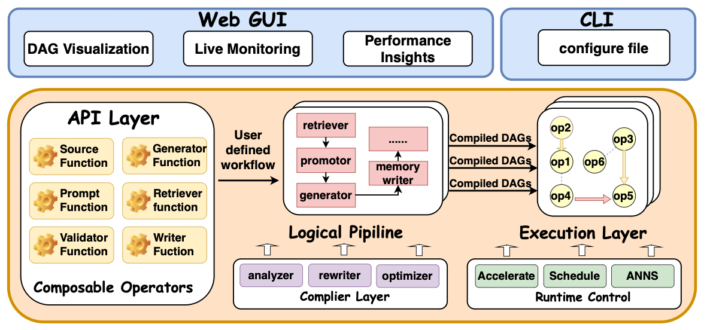
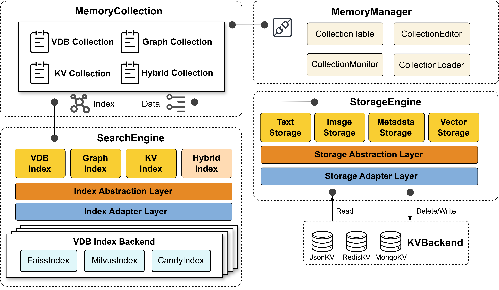
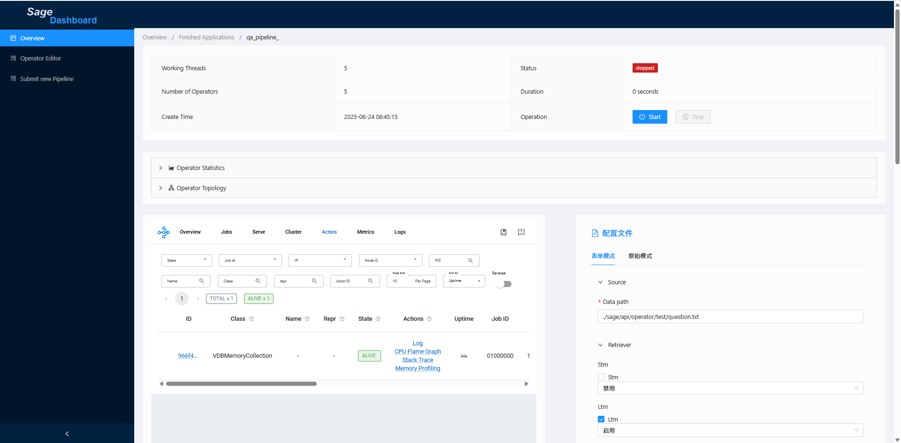

# <div align="center">🧠 SAGE: A Dataflow-Native Framework for LLM Reasoning<div>


SAGE is a dataflow-native reasoning framework built from the ground up to support modular, controllable, and transparent workflows over Large Language Models (LLMs). It addresses common problems in existing LLM-augmented systems (like RAG and Agents), such as hard-coded orchestration logic, opaque execution paths, and limited runtime control. SAGE introduces a dataflow-centric abstraction, modeling reasoning workflows as directed acyclic graphs (DAGs) composed of typed operators.




## � Quick Installation

### For Developers
```bash
git clone <repo-url>
cd SAGE
pip install -r requirements-dev.txt
```

### For Production
```bash
pip install -r requirements.txt
```

### Commercial Version
```bash
# 1. Install base version
pip install -r requirements.txt

# 2. Install license
python scripts/sage-license.py install <license-key>

# 3. Install commercial components
pip install -r requirements-commercial.txt
```

See [INSTALL_GUIDE.md](INSTALL_GUIDE.md) for detailed installation instructions.

## �🛠️ SAGE Development Toolkit

The SAGE Development Toolkit provides unified development tools for the SAGE project. It integrates various development utilities into a single, easy-to-use command-line interface.

### Quick Start

```bash
# Install the toolkit
pip install -e dev-toolkit/

# Show all available commands
sage-dev --help

# Check toolkit status
sage-dev status

# Run tests on changed files
sage-dev test --mode diff

# Update VS Code paths
sage-dev update-vscode
```

### Available Commands

- `sage-dev test` - Intelligent test execution with parallel support
- `sage-dev analyze` - Comprehensive dependency analysis  
- `sage-dev package` - Package management across SAGE ecosystem
- `sage-dev report` - Generate development reports
- `sage-dev fix-imports` - Fix import paths automatically
- `sage-dev update-vscode` - Update VS Code Python configurations
- `sage-dev setup-test` - One-click environment setup and testing
- `sage-dev list-tests` - List all available tests

For detailed documentation, see [dev-toolkit/README.md](dev-toolkit/README.md).


## ✨ Features

- 🧩 **Declarative & Modular Composition**: Build complex reasoning pipelines from typed, reusable operators. The dataflow graph cleanly separates what to compute from how to compute it.

- 🔀 **Unified Data and Control Flow**: Express conditional branching, tool routing, and fallback logic declaratively within the graph structure, eliminating brittle, imperative control code.

- 💾 **Native Stateful Operators**: Memory is a first-class citizen. Model session, task, and long-term memory as stateful nodes directly within the graph for persistent, context-aware computation.

- ⚡ **Asynchronous & Resilient Runtime**: The engine executes DAGs asynchronously in a non-blocking, data-driven manner. It features stream-aware queues, event-driven scheduling, and built-in backpressure to handle complex workloads gracefully.

- 📊 **Built-in Observability & Introspection**: An interactive dashboard provides runtime instrumentation out-of-the-box. Visually inspect execution graphs, monitor operator-level metrics, and debug pipeline behavior in real-time.

## 文档信息

阅读文档请refer到 [https://intellistream.github.io/SAGE-Pub/](https://intellistream.github.io/SAGE-Pub/)

维护文档请refer到 [https://github.com/intellistream/SAGE-Pub](https://github.com/intellistream/SAGE-Pub)

## 🔧 Installation

SAGE provides two primary installation methods, tailored for different use cases.

### For End-Users: Installing via PyPI (Recommended)

<<<<<<< HEAD
<<<<<<< HEAD
<<<<<<< HEAD
<<<<<<< HEAD
For users who want to use SAGE in their projects, the recommended installation method is via PyPI. This ensures you get a stable, tested version of the framework.
=======
SAGE 使用 Monorepo 架构，包含多个独立的子包。**重要：需要两步安装过程**

#### 方式1: 标准安装 (推荐)
>>>>>>> 8edc6b2 (再试试安装)
=======
For users who want to use SAGE in their projects, the recommended installation method is via PyPI. This ensures you get a stable, tested version of the framework.
>>>>>>> 42a3e65 (使用install_packages.sh)
=======
SAGE 使用 Monorepo 架构，包含多个独立的子包。**重要：需要两步安装过程**

#### 方式1: 标准安装 (推荐)
>>>>>>> 8edc6b2 (再试试安装)
=======
For users who want to use SAGE in their projects, the recommended installation method is via PyPI. This ensures you get a stable, tested version of the framework.
>>>>>>> 42a3e65 (使用install_packages.sh)

```bash
# Install the complete SAGE framework (metapackage)
pip install sage-framework

# After installation, you can verify it by checking the version
sage --version
```
*Note: The `sage-framework` package is a metapackage that will automatically install all the necessary sub-packages like `sage-kernel`, `sage-middleware`, etc. This package will be available on PyPI soon.*

### For Developers: Setting up a Local Development Environment

For developers who want to contribute to SAGE or work with the latest source code, you need to set up a local development environment from the cloned repository.

**Important:** Do not run `pip install .` from the root directory, as it will not install the sub-packages correctly. Instead, use the provided script to set up the environment.

```bash
# 1. Clone the repository
git clone https://github.com/intellistream/SAGE.git
cd SAGE

<<<<<<< HEAD
<<<<<<< HEAD
<<<<<<< HEAD
<<<<<<< HEAD
# 2. Run the installation script
# This script will install all sub-packages in editable mode.
./install_packages.sh
```

This script iterates through all the sub-packages (`sage-kernel`, `sage-middleware`, `dev-toolkit`, etc.) and installs them using `pip install -e`. This "editable" installation means that any changes you make to the source code will be immediately effective without needing to reinstall.

### ✅ Verifying Your Local Installation

After running the script, you can verify that all packages are installed correctly:
=======
# 第一步：安装工作空间根包
pip install .

# 第二步：安装所有子包
pip install -r requirements-subpackages.txt

# 一条命令完成安装：
pip install . && pip install -r requirements-subpackages.txt
```

#### 方式2: 自动安装脚本

```bash
# 运行自动安装脚本 (包含详细输出)
./install_packages.sh
```

#### 方式3: 手动逐个安装
>>>>>>> 8edc6b2 (再试试安装)

```bash
<<<<<<< HEAD
# 先安装工作空间包
pip install .

=======
# 第一步：安装工作空间根包
pip install .

# 第二步：安装所有子包
pip install -r requirements-subpackages.txt

# 一条命令完成安装：
pip install . && pip install -r requirements-subpackages.txt
```

#### 方式2: 自动安装脚本

```bash
# 运行自动安装脚本 (包含详细输出)
=======
# 2. Run the installation script
# This script will install all sub-packages in editable mode.
>>>>>>> 42a3e65 (使用install_packages.sh)
./install_packages.sh
```

This script iterates through all the sub-packages (`sage-kernel`, `sage-middleware`, `dev-toolkit`, etc.) and installs them using `pip install -e`. This "editable" installation means that any changes you make to the source code will be immediately effective without needing to reinstall.

### ✅ Verifying Your Local Installation

After running the script, you can verify that all packages are installed correctly:

```bash
<<<<<<< HEAD
# 先安装工作空间包
pip install .

>>>>>>> 8edc6b2 (再试试安装)
# 然后按顺序安装子包
pip install -e packages/sage-middleware    # 1. 先安装中间件 (被其他包依赖)
pip install -e packages/sage-kernel        # 2. 安装内核
pip install -e packages/sage-userspace     # 3. 安装用户空间
pip install -e packages/sage-tools/sage-frontend  # 5. 安装前端工具
pip install -e dev-toolkit                 # 6. 安装开发工具包
```

This will check if all core components of SAGE are importable and ready to use.

### 🔧 Troubleshooting

If you encounter any issues, here are some common solutions:

#### Problem: `sage` command not found after installation.
**Reason:** The shell hasn't recognized the new command.
**Solution:**
1. Open a new terminal window.
2. If that doesn't work, ensure that your user's local bin directory (e.g., `~/.local/bin` on Linux) is in your shell's `PATH`.

### 🔧 故障排除

#### 问题：pip install . 后无法找到 sage 命令

**原因：** `pip install .` 只安装了工作空间根包，没有安装包含 CLI 命令的子包。

**解决方案：**
```bash
# 安装包含 CLI 命令的子包
pip install -r requirements-subpackages.txt

# 或者手动安装 CLI 包
pip install -e packages/sage-tools/sage-cli

# 验证安装
sage --version
```

#### 问题：ImportError: No module named 'sage.xxx'

<<<<<<< HEAD
<<<<<<< HEAD
**原因：** 子包没有正确安装。
=======
### 🔧 故障排除
=======
### 🔧 故障排除

#### 问题：pip install . 后无法找到 sage 命令

**原因：** `pip install .` 只安装了工作空间根包，没有安装包含 CLI 命令的子包。

**解决方案：**
```bash
# 安装包含 CLI 命令的子包
pip install -r requirements-subpackages.txt

# 或者手动安装 CLI 包
pip install -e packages/sage-tools/sage-cli

# 验证安装
sage --version
```

#### 问题：ImportError: No module named 'sage.xxx'

**原因：** 子包没有正确安装。

**解决方案：**
```bash
# 运行验证脚本检查安装状态
=======
# Run the verification script
>>>>>>> 42a3e65 (使用install_packages.sh)
python verify_installation.py
```

This will check if all core components of SAGE are importable and ready to use.

### 🔧 Troubleshooting

If you encounter any issues, here are some common solutions:

<<<<<<< HEAD
**包含的子包：**
- `sage-kernel`: 统一内核层 (Core + Runtime + Utils + CLI集成)
- `sage-middleware`: 中间件层 (LLM服务、数据库、内存管理)
- `sage-userspace`: 用户空间层 (RAG算子、插件、高级功能)
- `sage-cli`: 独立的命令行工具包
- `sage-frontend`: 前端工具
- `sage-dev-toolkit`: 开发工具包
>>>>>>> 8edc6b2 (再试试安装)

#### 问题：pip install . 后无法找到 sage 命令

**原因：** `pip install .` 只安装了工作空间根包，没有安装包含 CLI 命令的子包。

**解决方案：**
```bash
# 安装包含 CLI 命令的子包
pip install -r requirements-subpackages.txt

# 或者手动安装 CLI 包
pip install -e packages/sage-tools/sage-cli

# 验证安装
sage --version
```

#### 问题：ImportError: No module named 'sage.xxx'

**原因：** 子包没有正确安装。

**解决方案：**
```bash
# 运行验证脚本检查安装状态
=======
# 2. Run the installation script
# This script will install all sub-packages in editable mode.
./install_packages.sh
```

This script iterates through all the sub-packages (`sage-kernel`, `sage-middleware`, `dev-toolkit`, etc.) and installs them using `pip install -e`. This "editable" installation means that any changes you make to the source code will be immediately effective without needing to reinstall.

### ✅ Verifying Your Local Installation

After running the script, you can verify that all packages are installed correctly:

```bash
# Run the verification script
>>>>>>> 42a3e65 (使用install_packages.sh)
python verify_installation.py
```
=======
#### Problem: `sage` command not found after installation.
**Reason:** The shell hasn't recognized the new command.
**Solution:**
1. Open a new terminal window.
2. If that doesn't work, ensure that your user's local bin directory (e.g., `~/.local/bin` on Linux) is in your shell's `PATH`.

#### Problem: `ImportError: No module named 'sage.xxx'`
**Reason:** The sub-packages were not installed correctly.
**Solution:**
1. Make sure you did **not** run `pip install .` from the root.
2. Rerun the installation script: `./install_packages.sh`.
3. Run the verification script to confirm: `python verify_installation.py`.
>>>>>>> 42a3e65 (使用install_packages.sh)

This will check if all core components of SAGE are importable and ready to use.

### 🔧 Troubleshooting

If you encounter any issues, here are some common solutions:

#### Problem: `sage` command not found after installation.
**Reason:** The shell hasn't recognized the new command.
**Solution:**
1. Open a new terminal window.
2. If that doesn't work, ensure that your user's local bin directory (e.g., `~/.local/bin` on Linux) is in your shell's `PATH`.

<<<<<<< HEAD
### 🚀 一键安装 (适合最终用户)
>>>>>>> 8edc6b2 (再试试安装)

**解决方案：**
```bash
# 运行验证脚本检查安装状态
=======
# Run the verification script
>>>>>>> 42a3e65 (使用install_packages.sh)
python verify_installation.py
```
=======
#### Problem: `ImportError: No module named 'sage.xxx'`
**Reason:** The sub-packages were not installed correctly.
**Solution:**
1. Make sure you did **not** run `pip install .` from the root.
2. Rerun the installation script: `./install_packages.sh`.
3. Run the verification script to confirm: `python verify_installation.py`.
>>>>>>> 42a3e65 (使用install_packages.sh)

This will check if all core components of SAGE are importable and ready to use.

### 🔧 Troubleshooting

If you encounter any issues, here are some common solutions:

#### Problem: `sage` command not found after installation.
**Reason:** The shell hasn't recognized the new command.
**Solution:**
1. Open a new terminal window.
2. If that doesn't work, ensure that your user's local bin directory (e.g., `~/.local/bin` on Linux) is in your shell's `PATH`.

#### Problem: `ImportError: No module named 'sage.xxx'`
**Reason:** The sub-packages were not installed correctly.
**Solution:**
1. Make sure you did **not** run `pip install .` from the root.
2. Rerun the installation script: `./install_packages.sh`.
3. Run the verification script to confirm: `python verify_installation.py`.

### 🧩 C++ Extensions (Optional)

For advanced users who need high-performance C++ extensions:

```bash
# Check extension status
sage extensions status

# Install all C++ extensions
sage extensions install

# Install specific extension
sage extensions install sage_queue

# View extension information
sage extensions info
```

### 📦 Build Distribution Packages

```bash
# Build modern wheel
./build_modern_wheel.sh                 # Python-only wheel
./build_modern_wheel.sh --with-cpp      # With C++ extensions
```

### ✅ 验证安装

```bash
# 快速验证 Monorepo 安装
python verify_installation.py

# 传统验证方式
python -c "import sage; print(f'SAGE version: {sage.__version__}')"
sage --help

# 综合系统诊断
sage doctor

# 检查安装状态
python quick_install.py --check

# 运行示例来测试安装
python sage-examples/rag/qa_dense_retrieval.py
```

### 🔧 故障排除

#### 问题1: `pip install .` 显示 "UNKNOWN" 包

**症状：**
```
Building wheels for collected packages: UNKNOWN
  Building wheel for UNKNOWN (pyproject.toml) ... done
  Created wheel for UNKNOWN: filename=UNKNOWN-0.0.0-py3-none-any.whl
```

**解决方案：**
这是因为根目录的 `pyproject.toml` 配置为 Monorepo 工作空间包。请使用以下方法之一：

```bash
# 方法1: 使用专用安装脚本
./install_packages.sh

# 方法2: 手动安装子包
pip install -e packages/sage-middleware
pip install -e packages/sage-kernel  
pip install -e packages/sage-userspace
pip install -e packages/sage-tools/sage-cli
pip install -e dev-toolkit

# 方法3: 使用 Python 脚本
python setup.py
```

#### 问题2: 包导入失败

**症状：**
```python
ImportError: No module named 'sage.middleware'
```

**解决方案：**
确保所有子包都已安装：
```bash
python verify_installation.py  # 检查安装状态
./install_packages.sh          # 重新安装子包
```

#### 问题3: 权限问题

**症状：**
```
Defaulting to user installation because normal site-packages is not writeable
```

**解决方案：**
```bash
# 使用用户安装模式
pip install -e . --user

# 或者使用虚拟环境
python -m venv sage_env
source sage_env/bin/activate  # Linux/Mac
# 或 sage_env\Scripts\activate  # Windows
pip install -e .
```

### 🛠️ System Requirements

- **Python**: 3.11+ (required)
- **Memory**: 8GB+ RAM (16GB+ recommended for large models)
- **Storage**: 10GB+ available space
- **Optional**: CUDA 11.0+ for GPU acceleration
- **C++ Extensions**: gcc/g++, cmake, make (for extensions only)

For detailed installation instructions and troubleshooting, see [INSTALL_GUIDE.md](INSTALL_GUIDE.md).


## 🚀 Quick Start
### 🧠 Memory Toolkit

SAGE provides a comprehensive memory management system with a lightweight in-memory vector database (VDB) supporting text embeddings, vector indexing, multi-index management, metadata filtering, persistence to disk, and recovery. The memory system is a first-class citizen in SAGE's dataflow architecture.

---

#### (1). Initialize Memory Manager and Vector Database

```python
from sage.service.memory.memory_manager import MemoryManager
from sage.utils.embedding_methods.embedding_api import apply_embedding_model

# Create memory manager with default or custom data directory
mgr = MemoryManager()

# Apply embedding model (supports various models including OpenAI, HuggingFace, etc.)
embedder = apply_embedding_model("default")  # or specify model like "openai" or "huggingface"
dim = embedder.get_dim()

# Create a vector database collection
col = mgr.create_collection(
    name="test_vdb",
    backend_type="VDB",                    # Vector Database
    description="Test vector database collection",
    embedding_model=embedder,
    dim=dim
)
```

#### (2). Insert Text Entries with Rich Metadata

```python
# Add metadata fields for structured filtering
col.add_metadata_field("tag")
col.add_metadata_field("category") 
col.add_metadata_field("source")

# Insert documents with associated metadata
col.insert("Artificial Intelligence is transforming industries worldwide", {
    "tag": "technology", 
    "category": "AI",
    "source": "research_paper"
})
col.insert("Machine Learning algorithms learn from data patterns", {
    "tag": "technology", 
    "category": "ML",
    "source": "textbook"
})
col.insert("Deep learning uses neural networks with multiple layers", {
    "tag": "technology", 
    "category": "DL", 
    "source": "tutorial"
})
```

#### (3). Create Multiple Indexes with Filtering

```python
# Create global index for all documents
col.create_index("global_index")

# Create filtered indexes based on metadata
col.create_index("ai_index", metadata_filter_func=lambda m: m.get("category") == "AI")
col.create_index("tech_index", metadata_filter_func=lambda m: m.get("tag") == "technology")
```

#### (4). Retrieve Similar Vectors with Smart Querying

```python
# Retrieve from global index
global_results = col.retrieve("What is artificial intelligence?", topk=3, index_name="global_index")

# Retrieve from filtered index
ai_results = col.retrieve("AI applications", topk=5, index_name="ai_index")

# Display results with similarity scores and metadata
for result in global_results:
    print(f"Text: {result['text']}")
    print(f"Metadata: {result['metadata']}")
    print(f"Score: {result.get('score', 'N/A')}")
```

#### (5). Persist and Manage Collections

```python
# Save collection to persistent storage
mgr.store_collection()
print(f"Collection saved to: {mgr.data_dir}")

# List all available collections
available_collections = mgr.list_collections()
print(f"Available collections: {available_collections}")
```

#### (6). Reload and Connect to Persisted Collections

```python
# Create new manager instance
mgr2 = MemoryManager()

# Reconnect to existing collection (requires compatible embedding model)
embedder2 = apply_embedding_model("default")
col2 = mgr2.connect_collection("test_vdb", embedding_model=embedder2)

# Verify collection is loaded and functional
test_results = col2.retrieve("machine learning", topk=2, index_name="global_index")
print(f"Reconnected collection works: {len(test_results)} results found")
```

#### (7). Advanced Memory Operations

```python
# Update existing documents
col.update("doc_id_1", "Updated content about AI and its applications", {"updated": True})

# Delete specific documents
col.delete("doc_id_2")

# Clear specific collection data
from sage.service.memory.memory_collection.vdb_collection import VDBMemoryCollection
VDBMemoryCollection.clear("test_vdb", mgr.data_dir)

# Clean up manager metadata
import os
manager_json = os.path.join(mgr.data_dir, "manager.json")
if os.path.exists(manager_json):
    os.remove(manager_json)
```

### 🔧 Step-by-Step: Build a Local RAG Pipeline
SAGE uses a **fluent-style API** to declaratively define RAG pipelines with comprehensive support for memory management, distributed execution, and real-time monitoring.

---

```python
from sage.api.local_environment import LocalEnvironment  # Updated import
from sage.lib.io.source import FileSource
from sage.lib.rag.retriever import DenseRetriever
from sage.lib.rag.promptor import QAPromptor
from sage.lib.rag.generator import OpenAIGenerator
from sage.lib.io.sink import TerminalSink
from sage.utils.config.loader import load_config

# Load configuration
config = load_config("config.yaml")

# Create local execution environment with memory support
env = LocalEnvironment("rag_pipeline")
env.set_memory(config=None)  # Initialize built-in memory system

# Build pipeline using Fluent API with method chaining
query_stream = (env
                .from_source(FileSource, config["source"])
                .map(DenseRetriever, config["retriever"])
                .map(QAPromptor, config["promptor"])
                .map(OpenAIGenerator, config["generator"]["local"])
                .sink(TerminalSink, config["sink"])
                )

# Submit and execute the pipeline
try:
    env.submit()
    print("✅ Pipeline submitted successfully")
    # Pipeline runs asynchronously - you can do other work here
    
except Exception as e:
    print(f"❌ Pipeline execution failed: {e}")
```

#### 📘 About Configuration

Each operator in the pipeline requires a configuration dictionary that provides runtime parameters, connection details, and behavioral settings. SAGE provides flexible configuration management:

```yaml
# Example config.yaml structure
source:
  file_path: "data/questions.txt"
  batch_size: 10

retriever:
  collection_name: "knowledge_base"
  top_k: 5
  similarity_threshold: 0.7

promptor:
  template: "Answer the question based on context: {context}\nQuestion: {query}\nAnswer:"
  max_context_length: 2000

generator:
  local:
    model: "gpt-3.5-turbo"
    temperature: 0.7
    max_tokens: 500
  vllm:
    model_path: "/models/llama-7b"
    gpu_memory_utilization: 0.9

sink:
  output_format: "json"
  file_path: "results/answers.json"
```

You can find comprehensive example configurations under [sage-examples/config/](./sage-examples/config/).

#### 📘 About Distributed Execution with Ray

SAGE supports seamless scaling from local to distributed execution using Ray:

```python
from sage.api.remote_environment import RemoteEnvironment

# Create distributed environment  
env = RemoteEnvironment("distributed_rag", jobmanager_address="localhost:19001")
env.set_memory(config=config["memory"])

# Same pipeline code works in distributed mode
query_stream = (env
                .from_source(FileSource, config["source"])
                .map(DenseRetriever, config["retriever"])
                .map(QAPromptor, config["promptor"])  
                .map(OpenAIGenerator, config["generator"]["vllm"])
                .sink(TerminalSink, config["sink"])
                )

# Submit to Ray cluster
job_id = env.submit()
print(f"Job submitted with ID: {job_id}")
env.wait_for_completion(job_id)
```

#### 📘 About Service Integration

SAGE supports service-oriented architecture with memory services and other specialized services:

```python
from sage.service.memory import MemoryService

# Register memory service
def memory_service_factory():
    service = MemoryService()
    result = service.create_collection(
        name="qa_collection",
        backend_type="VDB", 
        description="QA pipeline memory"
    )
    return service

env.register_service("memory_service", memory_service_factory)

# Use in pipeline
query_stream = (env
                .from_source(FileSource, config["source"])
                .map(DenseRetriever, config["retriever"])  # Uses registered memory service
                .map(QAPromptor, config["promptor"])
                .map(OpenAIGenerator, config["generator"]["local"])
                .sink(TerminalSink, config["sink"])
                )
```

#### 📘 About Production Deployment

For production deployments, SAGE provides:

- **Docker containerization** with `docker-compose` support
- **Kubernetes deployments** with Helm charts
- **Monitoring and observability** via built-in dashboard
- **Auto-scaling** based on workload demands

See more comprehensive examples under [sage-examples/](./sage-examples/) directory.

## 🧩 Components

### 🎯 Command-Line Interface (CLI)

SAGE provides a comprehensive CLI system for managing distributed deployments, cluster operations, and job lifecycle:

```bash
# Cluster management (unified approach)
sage cluster start                    # Start entire Ray cluster (Head + Workers)
sage cluster stop                     # Stop entire cluster
sage cluster status                   # Check cluster health and status
sage cluster deploy                   # Deploy SAGE to all worker nodes
sage cluster scale add worker:22      # Dynamic scaling: add worker nodes
sage cluster scale remove worker:22   # Dynamic scaling: remove worker nodes

# System deployment
sage deploy start                      # Start SAGE system (Ray + JobManager)
sage deploy stop                      # Stop system components
sage deploy status                    # Check system health

# Job management
sage job list                         # List all running jobs
sage job show <job_id>                # Show detailed job information
sage job stop <job_id>                # Stop specific job
sage job logs <job_id>                # View job logs

# Individual node management (advanced)
sage head start/stop/status           # Head node management
sage worker start/stop/status         # Worker nodes management
```

**Key CLI Features:**
- **Unified Cluster Management**: Single command to manage entire distributed clusters
- **Automated Deployment**: One-click deployment to multiple worker nodes with SSH
- **Dynamic Scaling**: Add/remove worker nodes without stopping running jobs
- **Health Monitoring**: Real-time status checking and health diagnostics
- **Configuration Management**: Centralized configuration with validation
- **Job Lifecycle Control**: Complete job management from submission to termination

### Operator
SAGE follows a Flink-style pipeline architecture where each `Operator` acts as a modular and composable processing unit. Operators can be chained together using a fluent API to form a streaming data pipeline. Internally, each `Operator` wraps a stateless or stateful `Function` that defines its core logic.

#### 🔧 Supported Operators
| Operator Method | Description                                                                                                    |
| --------------- | -------------------------------------------------------------------------------------------------------------- |
| `from_source()` | Adds a `SourceFunction` to read input data from external systems.                                              |
| `map()`         | Applies a stateless `Function` to each element of the stream, one-to-one transformation.                       |
| `flatmap()`    | Similar to `map()`, but allows one input to emit zero or more outputs (many-to-many).                          |
| `sink()`        | Defines the terminal output of the stream, consuming the final data (e.g., write to terminal, file, database). |

#### 🔧 Supported Function Types

| Function Type         | Description                                                                                                        | Example Usage |
| --------------------- | ------------------------------------------------------------------------------------------------------------------ | ------------- |
| `SourceFunction`      | Entry point of the pipeline. Ingests input data from external sources such as files, APIs, databases, or user queries | `FileSource`, `KafkaSource`, `HFDatasetBatch` |
| `RetrievalFunction`   | Performs dense, sparse, or hybrid retrieval from vector databases, document stores, or knowledge bases based on input queries | `DenseRetriever`, `BM25Retriever`, `HybridRetriever` |
| `RefineFunction`      | Compresses, filters, or optimizes retrieved context to reduce input length for faster and more accurate model inference | `LongRefinerAdapter`, `ContextCompressor` |
| `RerankFunction`      | Reorders retrieved documents using reranker models (e.g., cross-encoder, LLM-based) to improve relevance scoring | `CrossEncoderReranker`, `LLMbasedReranker` |
| `PromptFunction`      | Builds model-ready prompts by formatting queries and context into specific templates or structured formats | `QAPromptor`, `ChatPromptor`, `FewShotPromptor` |
| `GenerationFunction`  | Generates answers using large language models (OpenAI, LLaMA, vLLM, HuggingFace) based on constructed prompts | `OpenAIGenerator`, `VLLMGenerator`, `HuggingFaceGenerator` |
| `AgentFunction`       | Enables multi-step decision-making agents that call tools, APIs, or other services based on reasoning strategies | `AnswerBot`, `SearcherBot`, `ChiefBot` |
| `EvaluateFunction`    | Calculates comprehensive metrics like F1, ROUGE, BLEU, BERTScore for model output evaluation and benchmarking | `F1Evaluate`, `RougeLEvaluate`, `BERTRecallEvaluate` |
| `MemoryFunction`      | Manages persistent storage, retrieval, and indexing operations for long-term knowledge and context management | `MemoryWriter`, `MemoryRetriever`, `IndexBuilder` |
| `TransformFunction`   | Handles data transformation, preprocessing, chunking, and format conversion operations | `CharacterSplitter`, `DocumentParser`, `DataNormalizer` |
| `RoutingFunction`     | Implements conditional branching, fallback logic, and dynamic workflow control within pipelines | `ConditionalRouter`, `LoadBalancer`, `FallbackHandler` |
| `SinkFunction`        | Terminal point of the pipeline. Outputs final results to various destinations like terminal, files, databases, or APIs | `TerminalSink`, `FileSink`, `DatabaseSink`, `APISink` |

### Memory


SAGE's memory system provides a comprehensive solution for persistent knowledge management, vector storage, and intelligent retrieval:

**Core Features:**
- **Multi-Backend Support**: Vector databases (VDB), key-value stores (KV), and graph databases (Graph)
- **Advanced Indexing**: Multi-index support with metadata filtering and semantic search
- **Persistent Storage**: Automatic serialization, disk persistence, and recovery mechanisms  
- **Service Integration**: Memory-as-a-Service with REST API and pipeline integration
- **Scalable Architecture**: From single-machine to distributed memory clusters

**Supported Operations:**
- Document insertion with rich metadata
- Semantic similarity search and retrieval
- Index management and optimization
- Collection lifecycle management
- Cross-collection queries and federated search

## Engine（执行引擎）

SAGE Engine is the sophisticated execution component that orchestrates the compilation and execution of dataflow pipelines. It uses a modern layered architecture to transform logical pipelines into optimized physical execution graphs and efficiently execute them across different runtime environments, supporting both local multi-threaded acceleration and distributed execution on platforms like Ray.

### Architecture Overview

```
┌─────────────────────────────────────────────────────────────┐
│                    SAGE Engine Architecture                │
├─────────────────────────────────────────────────────────────┤
│  User API (LocalEnvironment / RemoteEnvironment)          │
├─────────────────────────────────────────────────────────────┤
│              JobManager (Centralized Orchestration)        │
│  • Job Lifecycle Management    • Resource Allocation       │
│  • Execution Graph Compilation • Health Monitoring         │
│  • Distributed Coordination    • Service Integration       │
├─────────────────────────────────────────────────────────────┤
│                   Execution Runtime                        │
│  LocalEnvironment     │      RemoteEnvironment             │
│  (Multi-threaded)     │      (Ray Distributed)             │
├─────────────────────────────────────────────────────────────┤
│              ExecutionGraph Compiler                       │
│         (Optimization & Parallelization)                   │
├─────────────────────────────────────────────────────────────┤
│    Function Layer     │      Operator Layer                │
│    (Business Logic)   │      (Runtime Execution)           │
├─────────────────────────────────────────────────────────────┤
│              Communication & Memory                         │
│            (Queues, Services, Storage)                     │
└─────────────────────────────────────────────────────────────┘
```

### How It Works

The Engine operates through a well-defined four-phase execution model:

1. **Pipeline Collection & Validation**: Gathers user-defined logical pipelines built through the DataStream API, validates pipeline integrity, and performs dependency analysis

2. **Compilation & Optimization**: Uses the ExecutionGraph system to transform logical pipelines into optimized physical execution graphs with automatic parallelism expansion, operator fusion, and resource allocation

3. **Runtime Scheduling**: Intelligently selects appropriate Runtime (LocalEnvironment/RemoteEnvironment), converts execution graphs into concrete DAG nodes, and handles resource management

4. **Execution Monitoring**: Continuously monitors pipeline execution status, collects comprehensive performance metrics, handles fault recovery, and provides real-time observability

### Key Features

- **Centralized Job Management**: The JobManager acts as a singleton orchestrator, managing job lifecycle, resource allocation, and distributed coordination across the entire cluster
- **Declarative Programming Model**: Users describe "what to compute", Engine handles "how to compute it" with automatic optimization
- **Intelligent Auto-Parallelization**: Automatically determines optimal parallel execution strategies based on data dependencies and resource availability  
- **Platform Agnostic Design**: Same logical pipeline code runs seamlessly on both local and distributed environments without modification
- **Advanced Performance Optimization**: Combines compile-time graph optimization with runtime adaptive tuning for maximum efficiency
- **Comprehensive Fault Tolerance**: Built-in error handling, automatic recovery mechanisms, and checkpoint-restart capabilities
- **Real-time Observability**: Rich monitoring, profiling, and debugging support through integrated dashboard and metrics collection
- **Service-Oriented Architecture**: Native support for microservices integration with automatic service discovery and load balancing

### Execution Environments

**LocalEnvironment**: High-performance single-machine execution with:
- Multi-threaded parallel processing  
- Direct JobManager integration
- Optimized memory management
- Local service integration
- Development and testing support

**RemoteEnvironment**: Distributed execution capabilities with:
- Ray-based cluster computing
- Remote JobManager communication via TCP
- Horizontal scaling across nodes  
- Fault tolerance and high availability
- Production-grade performance
- Automatic resource management

### JobManager Features

The JobManager serves as the central brain of SAGE's distributed system:

- **Job Lifecycle Management**: Complete job submission, execution, monitoring, and cleanup
- **Resource Orchestration**: Intelligent resource allocation and load balancing
- **Health Monitoring**: Real-time health checks and system diagnostics  
- **Service Registry**: Centralized service discovery and management
- **TCP Daemon**: High-performance network communication for remote clients
- **Persistence**: Job state persistence and recovery capabilities

## 🎨 SAGE-Dashboard

<p>With the <strong>SAGE-Dashboard</strong>, you can quickly orchestrate complex LLM applications and monitor them with one click. Our meticulously designed visual interface helps you efficiently build, monitor, and manage sophisticated AI workflows in real-time!</p>

### ✨ Advanced Features

- **Real-time DAG Visualization**
  - Interactive rendering of running DAGs (Directed Acyclic Graphs) with live updates
  - Intuitive display of data flows, component dependencies, and execution paths
  - Color-coded status indicators and progress tracking
  - Zoom, pan, and drill-down capabilities for complex workflows

- **Comprehensive Live Monitoring**
  - Real-time resource utilization monitoring (CPU, memory, GPU, network)
  - Operator-level performance metrics with latency heatmaps
  - Queue occupancy, throughput statistics, and bottleneck detection
  - Memory usage patterns and garbage collection insights
  - Error tracking and exception handling visualization

- **Intelligent Drag-and-Drop DAG Construction**
  - Visual pipeline builder with rich component library
  - Smart connector system with type checking and validation
  - Template gallery for common patterns (RAG, agents, evaluation pipelines)
  - Real-time syntax checking and configuration validation
  - One-click deployment from visual design to execution

- **Advanced Analytics & Debugging**
  - Performance profiling with detailed execution traces
  - A/B testing capabilities for pipeline variants
  - Historical performance analysis and trend monitoring
  - Debug mode with step-by-step execution and breakpoints
  - Export capabilities for reports and documentation

- **Multi-tenant & Collaboration Support**
  - User authentication and role-based access control
  - Project workspaces with sharing and collaboration features
  - Version control integration for pipeline definitions
  - Team activity feeds and notification system

<details>
<summary>🖼️ Dashboard Screenshots</summary>

 <!--  -->
 
 
 **Key Dashboard Components:**
 - **Pipeline Canvas**: Visual DAG editor with drag-and-drop components
 - **Component Palette**: Library of pre-built operators and functions
 - **Monitoring Panel**: Real-time metrics and performance indicators
 - **Configuration Editor**: YAML/JSON configuration with syntax highlighting
 - **Execution Console**: Live logs and execution status
</details>

#### 🚀 Experience the Power of SAGE-Dashboard

Start the integrated development and monitoring environment:

```bash
# Start the backend server
cd frontend/sage_server
python main.py --host 0.0.0.0 --port 8080 --log-level info

# In a new terminal, start the frontend dashboard
cd ../dashboard
npm install
npm start

# Access at http://localhost:4200
```

**Production Deployment:**
```bash
# Build for production
cd frontend/dashboard
npm run build

# Deploy with Docker
docker-compose up -d sage-dashboard
```

The dashboard provides a complete IDE experience for SAGE development, from visual pipeline design to real-time monitoring and debugging.

## 🔖 License

SAGE is licensed under the [MIT License](./LICENSE).

---

## 📚 Additional Resources

- **Documentation**: [https://intellistream.github.io/SAGE-Pub/](https://intellistream.github.io/SAGE-Pub/)
- **Source Repository**: [https://github.com/intellistream/SAGE-Pub](https://github.com/intellistream/SAGE-Pub)
- **Installation Guide**: [INSTALL_GUIDE.md](INSTALL_GUIDE.md)
- **SAGE Examples**: [sage-examples/](./sage-examples/) directory
- **Configuration Samples**: [config/](./config/) directory

## 🤝 Contributing

We welcome contributions! Please see our contributing guidelines and join our community:

- 🐛 **Bug Reports**: [GitHub Issues](https://github.com/intellistream/SAGE/issues)
- 💡 **Feature Requests**: [GitHub Discussions](https://github.com/intellistream/SAGE/discussions)
- 📖 **Documentation**: Help improve our docs and examples
- 🚀 **Code Contributions**: Submit pull requests for new features and fixes

---

**Built with ❤️ by the SAGE Team | Transforming AI Application Development**
