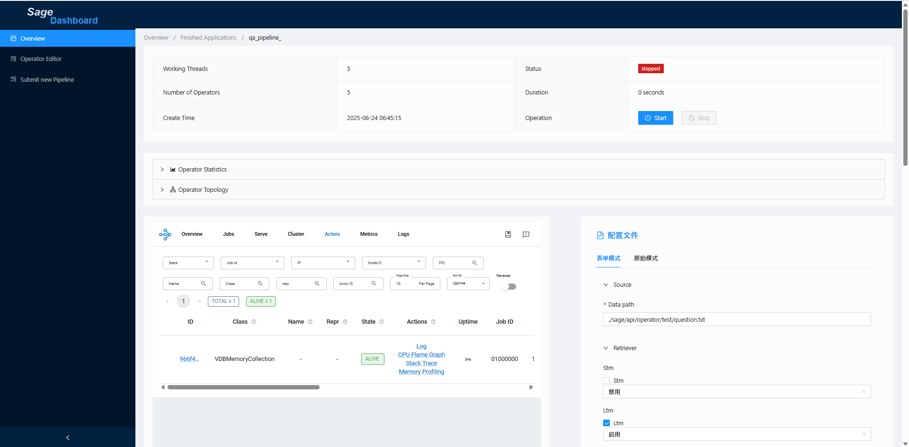

# <div align="center">🧠 SAGE: A Dataflow-Native Framework for LLM Reasoning<div>


SAGE is a dataflow-native reasoning framework built from the ground up to support modular, controllable, and transparent workflows over Large Language Models (LLMs). It addresses common problems in existing LLM-augmented systems (like RAG and Agents), such as hard-coded orchestration logic, opaque execution paths, and limited runtime control. SAGE introduces a dataflow-centric abstraction, modeling reasoning workflows as directed acyclic graphs (DAGs) composed of typed operators.


## ✨ Features

- 🧩 **Declarative & Modular Composition**: Build complex reasoning pipelines from typed, reusable operators. The dataflow graph cleanly separates what to compute from how to compute it.

- 🔀 **Unified Data and Control Flow**: Express conditional branching, tool routing, and fallback logic declaratively within the graph structure, eliminating brittle, imperative control code.

- 💾 **Native Stateful Operators**: Memory is a first-class citizen. Model session, task, and long-term memory as stateful nodes directly within the graph for persistent, context-aware computation.

- ⚡ **Asynchronous & Resilient Runtime**: The engine executes DAGs asynchronously in a non-blocking, data-driven manner. It features stream-aware queues, event-driven scheduling, and built-in backpressure to handle complex workloads gracefully.

- 📊 **Built-in Observability & Introspection**: An interactive dashboard provides runtime instrumentation out-of-the-box. Visually inspect execution graphs, monitor operator-level metrics, and debug pipeline behavior in real-time.

## 🔧 Installation

To accommodate different user environments and preferences, we provide **comprehensive setup scripts** that support multiple installation modes. Simply run the top-level `./setup.sh` script and choose from the following four installation options:

```bash
./setup.sh
```

You will be prompted to select one of the following modes:

1. **Minimal Setup**  
   Set up only the Conda environment.

2. **Setup with Ray**  
   Includes the minimal setup and additionally installs [Ray](https://www.ray.io/), a distributed computing framework.

3. **Setup with Docker**  
   Launches a pre-configured Docker container and sets up the Conda environment inside it.

4. **Full Setup**  
   Launches the Docker container, installs all required dependencies (including **CANDY**, our in-house vector database), and sets up the Conda environment.

---

Alternatively, you can install the project manually:

1. Create a new Conda environment with Python ≥ 3.11:

   ```bash
   conda create -n sage python=3.11
   conda activate sage
   ```

2. Install the package from the root directory:

   ```bash
   pip install .
   ```

This method is recommended for advanced users who prefer manual dependency management or wish to integrate the project into existing workflows.


## 🚀 Quick Start
### 🧠 Load and Save Memory

### 🔧 Build Pipeline Using Fluent API
Sage uses a fluent-style API to declaratively define data flows. Here’s how to build a RAG pipeline step by step:
```python
pipeline = Pipeline(name="example_pipeline", use_ray=False)
query_stream = (pipeline
   .add_source(FileSource, config)
   .retrieve(DenseRetriever, config)
   .construct_prompt(QAPromptor, config)
   .generate_response(OpenAIGenerator, config)
   .sink(TerminalSink, config)
   )
   # Submit the pipeline job
   pipeline.submit(config{"is_long_running":False})
```

#### 📘 About config

Each operator in the pipeline requires a configuration dictionary config that provides runtime parameters. You can find example config.yaml under [config](./config).

#### 📘 About Ray
To enable distributed execution using Ray, simply set use_ray=True when building the pipeline:
```python
pipeline = Pipeline(name="example_pipeline", use_ray=True)
```
#### 📘 About Long Running
If your pipeline is meant to run as a long-lived service, use:
```python
   pipeline.submit(config{"is_long_running":True})
```

See more examples under [app](./app)

## 🎨 SAGE-Dashboard
<p>With the <strong>SAGE-Dashboard</strong>, you can quickly orchestrate a large model application and run it with one click. Our meticulously designed visual interface will help you efficiently build, monitor, and manage complex workflows!</p>


### ✨: Features
- **DAG Visualization**
  - In the dashboard, the running DAG (Directed Acyclic Graph) is rendered in real-time, making your application workflow clear at a glance.</li>
  - Intuitively displays data flows and component dependencies, simplifying the process of understanding complex applications.</li>
- **Live Monitoring**
  - During execution, you can observe the resource usage of various components, including operators and memory, in real-time through the built-in dashboard.</li>
  - Operators are annotated with latency heatmaps, queue occupancy, and runtime statistics. Developers can observe the execution flow in real time, trace performance bottlenecks, and monitor memory behavior.</li>
- **Drag-and-Drop DAG Construction**
  - Quickly assemble a complete DAG workflow by simply arranging and connecting nodes on the canvas, with no need to write complex configuration files.</li>
  - Intuitively define your workflow by dragging and dropping from a rich library of built-in component nodes.</li>

<details>
<summary>Show more</summary>

 <!--  -->
 
</details>

#### Experience our meticulously designed Sage -Dashboard both user-friendly and powerful::
```bash
cd frontend/sage_server
python main.py --host 127.0.0.1 --port 8080 --log-level debug

cd ../dashboard
npm i 
npm start
```

## 🔖 License
SAGE is licensed under the [MIT License](./LICENSE).
