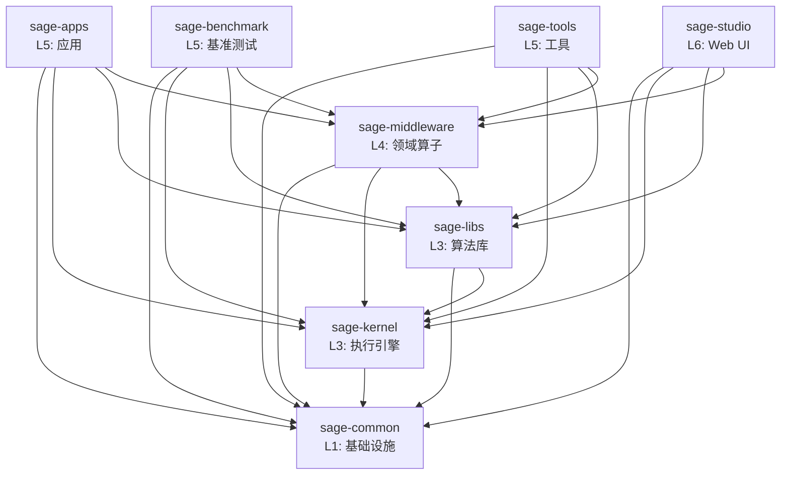

# SAGE 包架构

> 本文档描述 SAGE 项目的包结构、依赖关系和职责划分。
>
> 最后更新：2025-01-22（架构审查后）

## 📦 包概览

SAGE 采用分层单体架构（Modular Monolith），由 8 个独立包组成：

```
L6: sage-studio          # Web 界面管理工具
    │
L5: sage-apps           # 实际应用
    sage-benchmark      # 基准测试和示例
    sage-tools          # 开发和 CLI 工具
    │
L4: sage-middleware     # 领域算子和组件
    │
L3: sage-kernel         # 流式执行引擎
    sage-libs           # 算法库和 Agents 框架
    │
L1: sage-common         # 基础设施
```

### 层级说明

- **L1 (Foundation)**: 基础设施，所有包都可以依赖
- **L2 (Infrastructure)**: *预留层级* - 当前无独立包，基础设施已包含在 L1 和 L3 中
- **L3 (Core)**: 核心功能，提供执行引擎和算法库
- **L4 (Domain)**: 领域特定功能，基于 L1+L3 构建
- **L5 (Applications)**: 应用层，组合使用下层功能
- **L6 (Interface)**: 用户界面层

#### 关于 L2 层

⚠️ **重要发现**: 通过 2025-01 架构审查，我们发现 SAGE **需要 L2 (Platform) 层**。

**当前状态**: L2 层缺失，导致基础设施组件错误地分布在 L3/L4：
1. **Queue Descriptor** (消息队列抽象) - 当前在 sage-kernel (L3)
   - 提供 Python/Ray/RPC 队列的统一接口
   - 是通用基础设施，不是 SAGE 执行引擎特有逻辑
   
2. **KV Backend** (KV存储抽象) - 当前在 sage-middleware (L4)
   - 提供 Dict/Redis/RocksDB 的统一接口
   - 是通用存储抽象，不是领域特定逻辑

3. **BaseService** (服务基类) - 当前在 sage-kernel (L3)
   - 导致 sage-common (L1) 反向依赖 sage-kernel (L3)

**为什么需要 L2**:
1. **架构正确性**: 基础设施抽象应该在独立的平台层，而非混在核心引擎中
2. **依赖清晰**: Queue/Storage 抽象应该被 L3 依赖，而不是作为 L3 的一部分
3. **可复用性**: 平台服务可以被多个上层组件复用（kernel, middleware, apps）
4. **可扩展性**: 便于添加新的队列/存储后端，无需修改核心引擎

**计划重构**（待执行）:
```
创建 sage-platform (L2) 包：
  - queue/: Queue Descriptor 抽象
  - storage/: KV Backend 抽象  
  - service/: Service 基类
```

**更新后的职责分布**:
- **sage-common (L1)**: 纯粹的工具函数、配置、日志（无业务依赖）
- **sage-platform (L2)**: 平台服务抽象（队列、存储、服务基类）
- **sage-kernel (L3)**: 流式执行引擎（依赖 L2 的队列抽象）
- **sage-middleware (L4)**: 领域组件（依赖 L2 的存储抽象）

详见: [L2_LAYER_ANALYSIS.md](./dev-notes/L2_LAYER_ANALYSIS.md) 和本文档的"重构历史"章节。

## 🔍 包详细说明

### sage-common (L1)

**职责**: 基础设施和共享组件

**提供**:
- `core`: 核心类型、异常、参数、数据结构
- `components`: 基础组件（embedding, vllm, 向量数据库等）
- `config`: 配置管理
- `utils`: 通用工具函数
- `model_registry`: 模型注册表

**依赖**: 无

**公共 API**:
```python
from sage.common import core, components, config, utils, model_registry
from sage.common.core import Parameter, Record, WindowedRecord
from sage.common.components import sage_vllm, sage_embedding
```

---

### sage-kernel (L3)

**职责**: 流式数据处理引擎和基础算子

**提供**:
- `api`: LocalEnvironment, RemoteEnvironment, Function APIs
- `operators`: 基础算子（map, filter, join, window, aggregate）
- `runtime`: 执行引擎、调度器、任务管理
- `service`: 服务基类和客户端
- `distributed`: 分布式计算支持

**依赖**: `sage-common`

**公共 API**:
```python
from sage.kernel import api, operators
from sage.kernel.api import LocalEnvironment
from sage.kernel.api.function import MapFunction, BatchFunction, SinkFunction
```

---

### sage-libs (L3)

**职责**: 算法库和 Agents 框架

**提供**:
- `agents`: LangChain 风格的 Agents 框架
- `rag`: RAG 工具和实用函数（非算子）
- `tools`: 工具函数和辅助类
- `io_utils`: I/O 工具（source, sink, batch）
- `utils`: 算法相关工具
- `unlearning`: 隐私遗忘算法

**依赖**: `sage-common`, `sage-kernel`

**公共 API**:
```python
from sage.libs import agents, rag, tools, io_utils, utils
from sage.libs.agents import LangChainAgentAdapter
from sage.libs.io_utils import FileSource, TerminalSink
```

---

### sage-middleware (L4)

**职责**: 领域算子和中间件组件

**提供**:
- `operators.rag`: RAG 算子（检索、提示、生成、评估）
- `operators.llm`: LLM 算子（对话、工具调用）
- `operators.tools`: 工具算子（网页抓取、API 调用）
- `components`: 中间件组件（sage_mem, sage_db, sage_tsdb, sage_refiner 等）

**依赖**: `sage-common`, `sage-kernel`, `sage-libs`

**公共 API**:
```python
from sage.middleware import operators, components
from sage.middleware.operators.rag import ChromaRetriever, QAPromptor, OpenAIGenerator
from sage.middleware.components import sage_mem, sage_db
```

---

### sage-apps (L5)

**职责**: 实际应用

**提供**:
- `video`: 视频智能分析应用
- `medical_diagnosis`: 医疗诊断应用

**依赖**: `sage-common`, `sage-kernel`, `sage-libs`, `sage-middleware`

**公共 API**:
```python
from sage.apps import video, medical_diagnosis
```

---

### sage-benchmark (L5)

**职责**: 基准测试和示例

**提供**:
- `benchmark_rag`: RAG 基准测试
- `benchmark_memory`: 内存性能测试

**依赖**: `sage-common`, `sage-kernel`, `sage-libs`, `sage-middleware`

**公共 API**:
```python
from sage.benchmark import benchmark_rag, benchmark_memory
```

---

### sage-tools (L5)

**职责**: 开发工具和 CLI

**提供**:
- `cli`: 命令行接口（`sage` 命令）
- `dev`: 开发工具（测试、质量检查）
- `finetune`: 模型微调工具
- `management`: 系统管理工具
- `studio`: Studio 相关工具
- `utils`: 工具函数

**依赖**: `sage-common`, `sage-kernel`, `sage-libs`, `sage-middleware`

**公共 API**:
```python
from sage.tools import cli, dev, management
```

---

### sage-studio (L6)

**职责**: Web 界面管理工具

**提供**:
- `StudioManager`: 主管理器
- `models`: 数据模型
- `services`: 服务层
- `adapters`: Pipeline 适配器

**依赖**: `sage-common`, `sage-kernel`, `sage-libs`, `sage-middleware`

**公共 API**:
```python
from sage.studio import StudioManager, models, services, adapters
```

## 🔗 依赖关系图



## 📋 依赖规则

### ✅ 允许的依赖

1. **向下依赖**: 高层可以依赖低层
   - L6 → L5, L4, L3, L1
   - L5 → L4, L3, L1
   - L4 → L3, L1
   - L3 → L1

2. **同层独立**: 同层包之间相互独立
   - kernel 和 libs 独立（都是 L3）
   - apps, benchmark, tools 独立（都是 L5）

### ❌ 禁止的依赖

1. **向上依赖**: 低层不能依赖高层
   - common ❌→ 任何其他包
   - kernel/libs ❌→ middleware, apps, tools, studio
   - middleware ❌→ apps, benchmark, tools, studio

2. **反向依赖**: 防止循环依赖
   - 如果 A → B，则 B ❌→ A

3. **跨层依赖**: 避免跨层直接依赖
   - L6 不应该绕过 L5 直接使用 L3 的实现细节

## 🏗️ 设计原则

### 1. 单向依赖

依赖关系必须是单向的，形成有向无环图（DAG）：
- 防止循环依赖
- 便于理解和测试
- 支持独立发布

### 2. 职责分离

每个包有明确的职责边界：
- **common**: 不包含业务逻辑
- **kernel**: 不包含领域算子
- **libs**: 不包含 SAGE 算子实现
- **middleware**: 组合 kernel + libs 提供领域算子

### 3. 接口稳定

低层包提供稳定的公共 API：
- 通过 `__init__.py` 明确导出
- 避免直接依赖内部实现
- 版本化的 API 变更

### 4. 最小依赖

每个包只依赖必需的包：
- 减少耦合
- 加快构建速度
- 便于独立部署

## 📊 包统计

| 包 | 模块数 | 测试数 | 代码行数 | 依赖数 |
|---|--------|--------|----------|--------|
| sage-common | 15+ | 12 | ~15K | 0 |
| sage-kernel | 20+ | 23 | ~20K | 1 |
| sage-libs | 25+ | 18 | ~18K | 2 |
| sage-middleware | 30+ | 20 | ~25K | 3 |
| sage-apps | 8 | 6 | ~8K | 4 |
| sage-benchmark | 10+ | 10 | ~12K | 4 |
| sage-tools | 15+ | 8 | ~10K | 4 |
| sage-studio | 12+ | 6 | ~8K | 4 |
| **总计** | **135+** | **103** | **~116K** | - |

## 🔄 重构历史

### 2025-01 重大重构

**问题**:
1. libs → middleware 反向依赖（longrefiner）
2. 包导出不完整
3. 测试文件混合在源代码中

**解决方案**:
1. ✅ 删除 libs/rag/longrefiner 适配器
2. ✅ 更新所有 `__init__.py`，正确导出公共 API
3. ✅ 将所有测试文件移动到 `tests/` 目录
4. ✅ 更新导入路径（30+ 文件）
5. ✅ 创建架构文档

**结果**:
- 无循环依赖
- 清晰的包边界
- 标准化的测试结构
- 完整的文档

参见: [ARCHITECTURE_REVIEW_2025.md](./dev-notes/ARCHITECTURE_REVIEW_2025.md), [RESTRUCTURING_SUMMARY.md](./dev-notes/RESTRUCTURING_SUMMARY.md)

### 2025-01 架构审查（Top-Layer Review）

**审查范围**: sage-studio (L6), sage-apps/benchmark/tools (L5)

**发现的问题**:

1. **L2 层缺失** ⚠️
   - **Queue Descriptor** 抽象（当前在 `sage-kernel/runtime/communication/queue_descriptor/`）
     - 提供 Python Queue、Ray Queue、RPC Queue 的统一抽象
     - 是通用的基础设施，不是 SAGE 执行引擎特有的逻辑
     - **应该移动到新的 L2 (Platform) 层**
   
   - **KV Backend** 抽象（当前在 `sage-middleware/components/sage_mem/neuromem/storage_engine/kv_backend/`）
     - 提供 Key-Value 存储的统一接口
     - Dict、Redis、RocksDB 等后端实现
     - **应该移动到新的 L2 (Platform) 层**

2. **跨层依赖问题** ⚠️
   - **sage-common → sage-kernel** (L1 → L3 违规)
     - `sage.common.components.sage_embedding.service` 依赖 `sage.kernel.api.service.base_service`
     - `sage.common.components.sage_vllm.service` 依赖 `sage.kernel.api.service.base_service`
     - **问题**: L1 不应该依赖任何上层包
     - **原因**: BaseService 应该是基础接口，但当前在 kernel
   
   - **sage-libs → sage-kernel** (L3 → L3，但耦合度高)
     - sage-libs 的多个模块依赖 sage-kernel 的 Function API
     - 当前设计合理（libs 需要 kernel 的算子基类）
     - 但未来可考虑将 Function API 抽象下沉到更低层

3. **代码位置问题** ✅ (已修复)
   - **sage-tools**: TestFailureCache 在 tests/ 目录（已移动到 src/）
   
4. **测试覆盖不足** ⚠️
   - **sage-benchmark**: 仅 1 个测试文件（test_hg.py - HuggingFace 连接测试）
   - 缺少实际的 benchmark 功能测试

**建议的重构方案**:

```
创建新的 sage-platform (L2) 包：

packages/
  sage-platform/          # L2 - 平台服务层（新建）
    src/sage/platform/
      queue/              # 从 sage-kernel/runtime/communication/queue_descriptor 移动
        base_queue_descriptor.py
        python_queue_descriptor.py
        ray_queue_descriptor.py
        rpc_queue_descriptor.py
      
      storage/            # 从 sage-middleware/components/sage_mem 移动
        kv_backend/
          base_kv_backend.py
          dict_kv_backend.py
          # 未来扩展: redis_kv_backend.py, rocksdb_kv_backend.py
      
      service/            # 从 sage-kernel 移动
        base_service.py   # 解决 sage-common 的依赖问题
```

**更新后的架构层级**:
```
L1 (sage-common)       - 通用工具 (logging, config, decorators)
L2 (sage-platform)     - 平台服务 (queue, storage, service 基类) [待创建]
L3 (sage-kernel, libs) - 核心引擎 (runtime, jobmanager, compiler, algorithms)
L4 (sage-middleware)   - 领域组件 (neuromem, sageDB, sageFlow, RAG operators)
L5 (sage-apps, tools)  - 应用层
L6 (sage-studio)       - 接口层
```

**状态**: 
- ✅ 审查完成
- ⏳ 重构待执行（等待审查完成后统一重构）

参见: [L2_LAYER_ANALYSIS.md](./dev-notes/L2_LAYER_ANALYSIS.md)

## 🚀 使用指南

### 导入最佳实践

**✅ 推荐**:
```python
# 从包的公共 API 导入
from sage.kernel.api import LocalEnvironment
from sage.middleware.operators.rag import ChromaRetriever
from sage.libs.agents import LangChainAgentAdapter
```

**❌ 不推荐**:
```python
# 不要直接导入内部模块
from sage.kernel.runtime.dispatcher import Dispatcher
from sage.middleware.operators.rag.retriever.chroma_retriever import ChromaRetrieverImpl
```

### 添加新功能

1. **确定合适的层级**:
   - 基础类型/工具 → common
   - 基础算子 → kernel
   - 算法/工具 → libs
   - 领域算子 → middleware
   - 应用 → apps/benchmark/tools

2. **遵循依赖规则**:
   - 只依赖更低层的包
   - 通过公共 API 导入

3. **更新导出**:
   - 在 `__init__.py` 中导出公共 API
   - 编写 docstring 说明

4. **添加测试**:
   - 在包的 `tests/` 目录中添加

## 📚 参考文档

- [架构评审 2025](./dev-notes/ARCHITECTURE_REVIEW_2025.md) - 问题分析和解决方案
- [重构总结](./dev-notes/RESTRUCTURING_SUMMARY.md) - 完整重构记录
- [贡献指南](../CONTRIBUTING.md) - 如何参与开发
- [开发命令](./dev-notes/DEV_COMMANDS.md) - 常用开发命令

## 🤝 贡献

如果您发现架构问题或有改进建议，请：
1. 查看现有 issues
2. 创建新 issue 讨论
3. 提交 PR 并附上说明

遵循架构原则有助于保持代码库的健康和可维护性！
