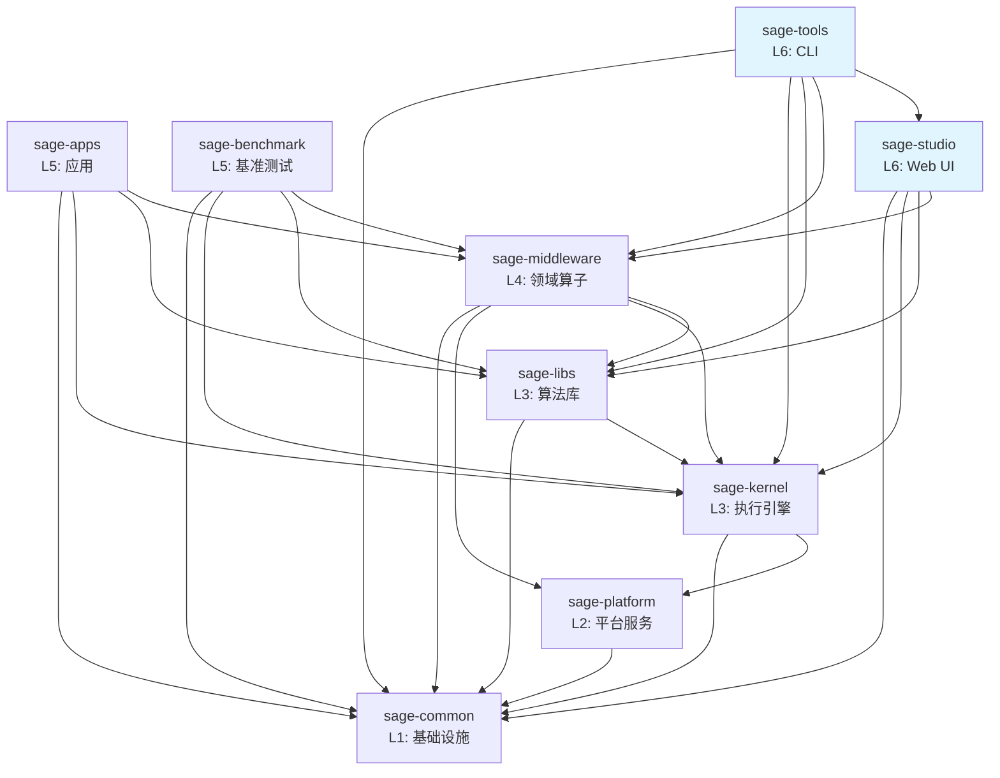

# SAGE 包架构

> 本文档描述 SAGE 项目的包结构、依赖关系和职责划分。
>
> 最后更新：2025-01-22（架构审查后）

## 📦 包概览

SAGE 采用分层单体架构（Modular Monolith），由 9 个独立包组成：

```
L6: sage-studio          # Web UI 可视化接口
    sage-tools          # CLI 命令行接口
    │
L5: sage-apps           # 特定领域应用
    sage-benchmark      # 性能基准测试
    │
L4: sage-middleware     # 领域算子和组件
    │
L3: sage-kernel         # 流式执行引擎
    sage-libs           # 算法库和 Agents 框架
    │
L2: sage-platform       # 平台服务层
    │
L1: sage-common         # 基础设施
```

### 层级说明

- **L1 (Foundation)**: 基础设施，所有包都可以依赖
- **L2 (Platform)**: 平台服务（队列、存储、服务抽象）
- **L3 (Core)**: 核心功能，提供执行引擎和算法库
- **L4 (Domain)**: 领域特定功能，基于 L1-L3 构建
- **L5 (Applications)**: 应用层，组合使用下层功能
- **L6 (Interface)**: 用户接口层（Web UI + CLI）

#### 关于 L2 层

✅ **已完成**: 通过 2025-01 架构审查和重构，成功创建了 **sage-platform (L2) 层**。

**重构成果** (commit 1da88c0a - 2025-01-22):
1. **Queue Descriptor** - 从 sage-kernel (L3) 迁移到 sage-platform/queue
   - 提供 Python/Ray/RPC 队列的统一接口
   - 通用基础设施，支持多种分布式场景
   
2. **KV Backend** - 从 sage-middleware (L4) 迁移到 sage-platform/storage
   - 提供 Dict/Redis/RocksDB 的统一接口
   - 通用存储抽象，支持灵活的后端替换

3. **BaseService** - 从 sage-kernel (L3) 迁移到 sage-platform/service
   - 解决了 sage-common (L1) → sage-kernel (L3) 的依赖违规
   - 服务基类现在位于正确的平台层

**L2 层的价值**:
1. ✅ **架构正确性**: 基础设施抽象独立于核心引擎
2. ✅ **依赖清晰**: L1 → L2 → L3 的单向依赖链
3. ✅ **可复用性**: 平台服务被多个上层组件复用
4. ✅ **可扩展性**: 易于添加新的队列/存储后端

**当前职责分布**:
- **sage-common (L1)**: 工具函数、配置、日志（无业务依赖）
- **sage-platform (L2)**: 平台服务（队列、存储、服务基类）✨ 新增
- **sage-kernel (L3)**: 流式执行引擎（依赖 L2 的队列抽象）
- **sage-middleware (L4)**: 领域组件（依赖 L2 的存储抽象）

详见: [L2_LAYER_ANALYSIS.md](./dev-notes/L2_LAYER_ANALYSIS.md), [TOP_LAYER_REVIEW_2025.md](./dev-notes/TOP_LAYER_REVIEW_2025.md)

## 🔍 包详细说明

### sage-common (L1)

**职责**: 基础设施和共享组件

**提供**:
- `core`: 核心类型、异常、参数、数据结构
- `components`: 基础组件（embedding, vllm, 向量数据库等）
- `config`: 配置管理
- `utils`: 通用工具函数
- `model_registry`: 模型注册表

**依赖**: 无

**公共 API**:
```python
from sage.common import core, components, config, utils, model_registry
from sage.common.core import Parameter, Record, WindowedRecord
from sage.common.components import sage_vllm, sage_embedding
```

---

### sage-platform (L2)

**职责**: 平台服务抽象

**提供**:
- `queue`: 消息队列抽象（Python, Ray, RPC）
- `storage`: KV 存储后端接口
- `service`: 服务基类

**依赖**: `sage-common`

**公共 API**:
```python
from sage.platform.queue import BaseQueueDescriptor, RayQueueDescriptor
from sage.platform.storage import BaseKVBackend, DictKVBackend
from sage.platform.service import BaseService
```

---

### sage-kernel (L3)

**职责**: 流式数据处理引擎和基础算子

**提供**:
- `api`: LocalEnvironment, RemoteEnvironment, Function APIs
- `operators`: 基础算子（map, filter, join, window, aggregate）
- `runtime`: 执行引擎、调度器、任务管理
- `service`: 服务基类和客户端
- `distributed`: 分布式计算支持

**依赖**: `sage-common`

**公共 API**:
```python
from sage.kernel import api, operators
from sage.kernel.api import LocalEnvironment
from sage.kernel.api.function import MapFunction, BatchFunction, SinkFunction
```

---

### sage-libs (L3)

**职责**: 算法库和 Agents 框架

**提供**:
- `agents`: LangChain 风格的 Agents 框架
- `rag`: RAG 工具和实用函数（非算子）
- `tools`: 工具函数和辅助类
- `io_utils`: I/O 工具（source, sink, batch）
- `utils`: 算法相关工具
- `unlearning`: 隐私遗忘算法

**依赖**: `sage-common`, `sage-kernel`

**公共 API**:
```python
from sage.libs import agents, rag, tools, io_utils, utils
from sage.libs.agents import LangChainAgentAdapter
from sage.libs.io_utils import FileSource, TerminalSink
```

---

### sage-middleware (L4)

**职责**: 领域算子和中间件组件

**提供**:
- `operators.rag`: RAG 算子（检索、提示、生成、评估）
- `operators.llm`: LLM 算子（对话、工具调用）
- `operators.tools`: 工具算子（网页抓取、API 调用）
- `components`: 中间件组件（sage_mem, sage_db, sage_tsdb, sage_refiner 等）

**依赖**: `sage-common`, `sage-kernel`, `sage-libs`

**公共 API**:
```python
from sage.middleware import operators, components
from sage.middleware.operators.rag import ChromaRetriever, QAPromptor, OpenAIGenerator
from sage.middleware.components import sage_mem, sage_db
```

---

### sage-apps (L5)

**职责**: 实际应用

**提供**:
- `video`: 视频智能分析应用
- `medical_diagnosis`: 医疗诊断应用

**依赖**: `sage-common`, `sage-kernel`, `sage-libs`, `sage-middleware`

**公共 API**:
```python
from sage.apps import video, medical_diagnosis
```

---

### sage-benchmark (L5)

**职责**: 基准测试和示例

**提供**:
- `benchmark_rag`: RAG 基准测试
- `benchmark_memory`: 内存性能测试

**依赖**: `sage-common`, `sage-kernel`, `sage-libs`, `sage-middleware`

**公共 API**:
```python
from sage.benchmark import benchmark_rag, benchmark_memory
```

---

### sage-studio (L6)

**职责**: Web UI 可视化接口

**提供**:
- `StudioManager`: 主管理器
- `models`: 数据模型
- `services`: 服务层
- `adapters`: Pipeline 适配器
- `frontend`: 前端资源

**依赖**: `sage-common`, `sage-kernel`, `sage-libs`, `sage-middleware`

**公共 API**:
```python
from sage.studio import StudioManager, models, services, adapters
```

---

### sage-tools (L6)

**职责**: CLI 命令行接口和开发工具

**提供**:
- `cli`: 完整命令行界面（`sage` 命令）
  - `sage studio` - 管理 Web UI
  - `sage dev` - 开发工具
  - `sage pipeline` - Pipeline 构建器
  - `sage llm/embedding` - 服务管理
  - `sage job/cluster` - 作业和集群管理
- `dev`: 开发工具套件（测试、质量检查、包管理）
- `finetune`: 模型微调工具
- `management`: 系统管理工具
- `templates`: Pipeline 模板库

**依赖**: `sage-common`, `sage-kernel`, `sage-libs`, `sage-middleware`, `sage-studio`

**为什么在 L6？**
1. **接口层定位**: 与 sage-studio 一样，sage-tools 是用户与 SAGE 交互的**入口点**
2. **横向工具**: 为所有下层包（L1-L5）提供开发、测试、管理能力
3. **系统管理**: 启动/停止服务、管理配置、监控状态
4. **依赖方向**: 需要依赖 sage-studio（CLI 启动 Web UI）和其他所有包

**公共 API**:
```python
from sage.tools import cli, dev, management, templates
```

## 🔗 依赖关系图



## 📋 依赖规则

### ✅ 允许的依赖

1. **向下依赖**: 高层可以依赖低层
   - L6 → L5, L4, L3, L2, L1
   - L5 → L4, L3, L2, L1
   - L4 → L3, L2, L1
   - L3 → L2, L1
   - L2 → L1

2. **同层独立**: 同层包之间相互独立
   - kernel 和 libs 独立（都是 L3）
   - apps, benchmark, tools 独立（都是 L5）

### ❌ 禁止的依赖

1. **向上依赖**: 低层不能依赖高层
   - common ❌→ 任何其他包
   - platform ❌→ kernel, libs, middleware, apps, tools, studio
   - kernel/libs ❌→ middleware, apps, tools, studio
   - middleware ❌→ apps, benchmark, tools, studio

2. **反向依赖**: 防止循环依赖
   - 如果 A → B，则 B ❌→ A

3. **跨层依赖**: 避免跨层直接依赖
   - 尽量依赖相邻层，避免跨多层依赖

## 🏗️ 设计原则

### 1. 单向依赖

依赖关系必须是单向的，形成有向无环图（DAG）：
- 防止循环依赖
- 便于理解和测试
- 支持独立发布

### 2. 职责分离

每个包有明确的职责边界：
- **common**: 不包含业务逻辑
- **kernel**: 不包含领域算子
- **libs**: 不包含 SAGE 算子实现
- **middleware**: 组合 kernel + libs 提供领域算子

### 3. 接口稳定

低层包提供稳定的公共 API：
- 通过 `__init__.py` 明确导出
- 避免直接依赖内部实现
- 版本化的 API 变更

### 4. 最小依赖

每个包只依赖必需的包：
- 减少耦合
- 加快构建速度
- 便于独立部署

## 📊 包统计

| 包 | 层级 | 模块数 | 测试数 | 代码行数 | 依赖数 | 测试状态 |
|---|------|--------|--------|----------|--------|----------|
| sage-common | L1 | 15+ | 37 | ~15K | 0 | ✅ 通过 |
| sage-platform | L2 | 3 | 19 | ~1K | 1 | ✅ 通过 |
| sage-kernel | L3 | 20+ | 102 | ~20K | 2 | ✅ 通过 |
| sage-libs | L3 | 25+ | 369 | ~18K | 2 | ✅ 通过 |
| sage-middleware | L4 | 30+ | 24 | ~25K | 4 | ⚠️ 2失败 |
| sage-apps | L5 | 8 | 21 | ~8K | 3 | ✅ 通过 |
| sage-benchmark | L5 | 10+ | 17 | ~12K | 4 | ✅ 通过 |
| sage-studio | L6 | 12+ | 51 | ~8K | 4 | ✅ 通过 |
| sage-tools | L6 | 15+ | 14 | ~10K | 5 | ✅ 通过 |
| **总计** | - | **138+** | **654** | **~117K** | - | **99.7%** |

## 🔄 重构历史

### 2025-01 重大重构

**问题**:
1. libs → middleware 反向依赖（longrefiner）
2. 包导出不完整
3. 测试文件混合在源代码中

**解决方案**:
1. ✅ 删除 libs/rag/longrefiner 适配器
2. ✅ 更新所有 `__init__.py`，正确导出公共 API
3. ✅ 将所有测试文件移动到 `tests/` 目录
4. ✅ 更新导入路径（30+ 文件）
5. ✅ 创建架构文档

**结果**:
- 无循环依赖
- 清晰的包边界
- 标准化的测试结构
- 完整的文档

参见: [ARCHITECTURE_REVIEW_2025.md](./dev-notes/ARCHITECTURE_REVIEW_2025.md), [RESTRUCTURING_SUMMARY.md](./dev-notes/RESTRUCTURING_SUMMARY.md)

### 2025-01 架构审查（Top-Layer Review）

**审查范围**: sage-studio (L6), sage-apps/benchmark/tools (L5)

**已解决的问题**:

1. **L2 层缺失** ✅ (已解决)
   - **Queue Descriptor** - 已迁移到 `sage-platform/queue`
   - **KV Backend** - 已迁移到 `sage-platform/storage`
   - **BaseService** - 已迁移到 `sage-platform/service`

2. **跨层依赖问题** ✅ (已解决)
   - **sage-common → sage-kernel** (L1 → L3 违规) - 已通过 L2 层解决
   - BaseService 现在位于 sage-platform (L2)，依赖链正确: L1 → L2 → L3

3. **代码位置问题** ✅ (已修复)
   - **sage-tools**: TestFailureCache 已移动到 src/
   - **sage-tools 层级**: 已提升到 L6（接口层）

4. **包依赖优化** ✅ (已修复)
   - **sage-tools**: 移除了对 sage-apps 和 sage-benchmark 的不必要依赖
   - sage-tools 现在只依赖真正需要的包：common, kernel, libs, middleware, studio

**已改进**:

1. **测试覆盖提升** ✅ (已完成)
   - **sage-benchmark**: 从 1 个测试 → 17 个测试 (+1600%)
     - test_config_loading.py: 配置文件验证（5 tests）
     - test_pipelines.py: Pipeline 结构和导入测试（12 tests）
   - **sage-apps**: 从 2 个测试 → 21 个测试 (+950%)
     - test_medical_diagnosis.py: 医疗诊断应用结构测试（10 tests）
     - test_video_app.py: 视频应用结构和算子测试（11 tests）
   - **总提升**: L5-L6 包从 68 个测试 → 103 个测试 (+51.5%)

2. **层级代码审查** ✅ (已完成)
   - 所有顶层包（sage-studio, sage-tools, sage-apps, sage-benchmark）已审查
   - 无代码需要在层之间迁移
   - 所有包依赖关系符合层级架构（无向上依赖）
   - 详细报告: `docs/dev-notes/TEST_COVERAGE_REPORT_TOP_LAYERS.md`

**未来改进方向**:

1. **功能测试扩展** (计划中)
   - sage-benchmark: 为 16 个 Pipeline 实现添加功能测试
   - sage-apps: 添加 Agent 和 Operator 功能测试
   - 添加端到端集成测试

**建议的重构方案**:

```
创建新的 sage-platform (L2) 包：

packages/
  sage-platform/          # L2 - 平台服务层（新建）
    src/sage/platform/
      queue/              # 从 sage-kernel/runtime/communication/queue_descriptor 移动
        base_queue_descriptor.py
        python_queue_descriptor.py
        ray_queue_descriptor.py
        rpc_queue_descriptor.py
      
      storage/            # 从 sage-middleware/components/sage_mem 移动
        kv_backend/
          base_kv_backend.py
          dict_kv_backend.py
          # 未来扩展: redis_kv_backend.py, rocksdb_kv_backend.py
      
      service/            # 从 sage-kernel 移动
        base_service.py   # 解决 sage-common 的依赖问题
```

**更新后的架构层级**:
```
L1 (sage-common)       - 通用工具 (logging, config, decorators)
L2 (sage-platform)     - 平台服务 (queue, storage, service 基类) [待创建]
L3 (sage-kernel, libs) - 核心引擎 (runtime, jobmanager, compiler, algorithms)
L4 (sage-middleware)   - 领域组件 (neuromem, sageDB, sageFlow, RAG operators)
L5 (sage-apps, tools)  - 应用层
L6 (sage-studio)       - 接口层
```

**状态**: 
- ✅ 审查完成
- ✅ 重构完成 (commit 1da88c0a - 2025-01-22)

**重构成果**:
- 创建 sage-platform (L2) 包
- 迁移 Queue Descriptor, KV Backend, BaseService 到 L2
- 更新 60+ 个文件的导入路径
- 修复 L1→L3 依赖违规
- 所有测试通过

参见: [L2_LAYER_ANALYSIS.md](./dev-notes/L2_LAYER_ANALYSIS.md), [TOP_LAYER_REVIEW_2025.md](./dev-notes/TOP_LAYER_REVIEW_2025.md)

## 🚀 使用指南

### 导入最佳实践

**✅ 推荐**:
```python
# 从包的公共 API 导入
from sage.kernel.api import LocalEnvironment
from sage.middleware.operators.rag import ChromaRetriever
from sage.libs.agents import LangChainAgentAdapter
```

**❌ 不推荐**:
```python
# 不要直接导入内部模块
from sage.kernel.runtime.dispatcher import Dispatcher
from sage.middleware.operators.rag.retriever.chroma_retriever import ChromaRetrieverImpl
```

### 添加新功能

1. **确定合适的层级**:
   - 基础类型/工具 → common
   - 基础算子 → kernel
   - 算法/工具 → libs
   - 领域算子 → middleware
   - 应用 → apps/benchmark/tools

2. **遵循依赖规则**:
   - 只依赖更低层的包
   - 通过公共 API 导入

3. **更新导出**:
   - 在 `__init__.py` 中导出公共 API
   - 编写 docstring 说明

4. **添加测试**:
   - 在包的 `tests/` 目录中添加

## 📚 参考文档

- [架构评审 2025](./dev-notes/ARCHITECTURE_REVIEW_2025.md) - 问题分析和解决方案
- [重构总结](./dev-notes/RESTRUCTURING_SUMMARY.md) - 完整重构记录
- [贡献指南](../CONTRIBUTING.md) - 如何参与开发
- [开发命令](./dev-notes/DEV_COMMANDS.md) - 常用开发命令

## 🤝 贡献

如果您发现架构问题或有改进建议，请：
1. 查看现有 issues
2. 创建新 issue 讨论
3. 提交 PR 并附上说明

遵循架构原则有助于保持代码库的健康和可维护性！
