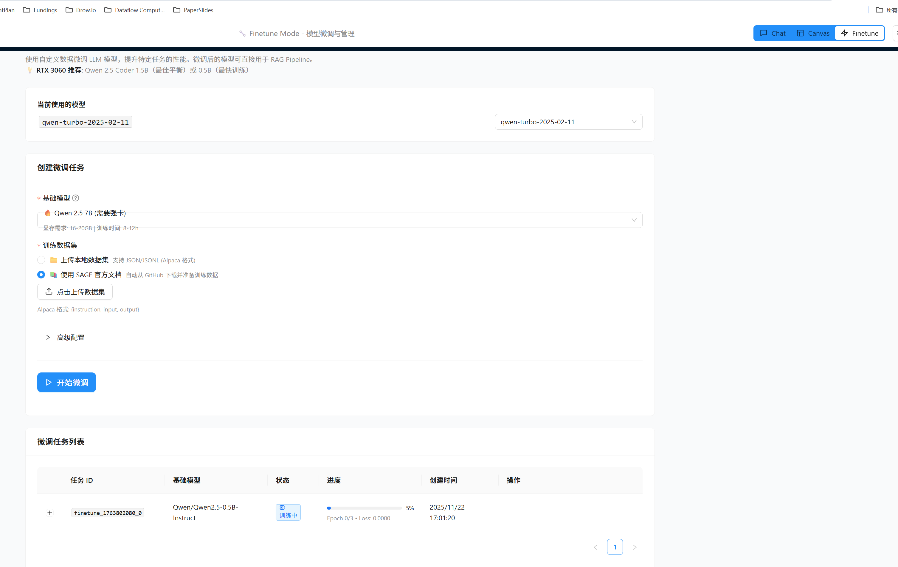

# Studio Restart 自动清理缓存功能

## 问题描述

用户在更新代码后运行 `sage studio restart`，但前端显示的仍然是旧版本，因为构建产物（dist/）和 Vite 缓存没有被清理。

## 解决方案

### 1. 添加前端缓存清理功能 ✅

**文件**: `packages/sage-studio/src/sage/studio/studio_manager.py`

新增方法：
- `clean_frontend_cache()`: 清理前端构建缓存
- `clean()`: 兼容旧命令的别名

**清理的目录**：
```
frontend/
├── dist/                    ← 构建产物（Vite 打包输出）
├── .vite/                   ← Vite 缓存
└── node_modules/
    └── .vite/              ← Vite 节点缓存
```

**实现**：
```python
def clean_frontend_cache(self) -> bool:
    """清理前端构建缓存

    清理以下目录以确保使用最新代码：
    - dist/ (构建产物)
    - .vite/ (Vite 缓存)
    - node_modules/.vite/ (Vite 节点缓存)
    """
    import shutil

    cache_dirs = [
        self.frontend_dir / "dist",
        self.frontend_dir / ".vite",
        self.frontend_dir / "node_modules" / ".vite",
    ]

    for cache_dir in cache_dirs:
        if cache_dir.exists():
            shutil.rmtree(cache_dir)
            console.print(f"✓ 清理: {cache_dir.relative_to(self.frontend_dir)}")

    return True
```

### 2. 更新 restart 命令 ✅

**文件**: `packages/sage-cli/src/sage/cli/commands/apps/studio.py`

**新增参数**：
- `--clean` / `--no-clean`: 控制是否清理缓存（默认开启）

**修改后的命令**：
```python
@app.command()
def restart(
    port: int | None = typer.Option(None, "--port", "-p", help="指定端口"),
    host: str = typer.Option("localhost", "--host", "-h", help="指定主机"),
    dev: bool = typer.Option(False, "--dev", help="开发模式"),
    clean: bool = typer.Option(True, "--clean/--no-clean", help="清理前端构建缓存（默认开启）"),
):
    """重启 SAGE Studio

    默认会清理前端构建缓存以确保使用最新代码。
    使用 --no-clean 可跳过清理步骤。
    """
    # 先停止
    studio_manager.stop()

    # 清理前端缓存（如果启用）
    if clean:
        console.print("🧹 清理前端构建缓存...")
        cleaned = studio_manager.clean_frontend_cache()
        if cleaned:
            console.print("✅ 缓存清理完成")

    # 再启动
    studio_manager.start(port=port, host=host, dev=dev)
```

## 使用方法

### 默认行为（自动清理）

```bash
# 重启并自动清理缓存
sage studio restart
```

输出示例：
```
🔄 重启 SAGE Studio...
Studio 前端 和 后端API 已停止
🧹 清理前端构建缓存...
  ✓ 清理: dist
  ✓ 清理: .vite
  ✓ 清理: node_modules/.vite
✅ 已清理 3 个缓存目录
✅ 缓存清理完成
[...启动过程...]
✅ Studio 重启成功
```

### 跳过清理（快速重启）

```bash
# 不清理缓存，快速重启
sage studio restart --no-clean
```

### 仅清理缓存（不重启）

```bash
# 只清理缓存，不重启 Studio
sage studio clean
```

输出示例：
```
🧹 清理 Studio 缓存...
  ✓ 清理: dist
  ✓ 清理: .vite
  ✓ 清理: node_modules/.vite
✅ 已清理 3 个缓存目录
✅ 清理完成
```

## 工作流程

### 代码更新后的标准流程

```bash
# 1. 拉取最新代码
git pull

# 2. 重启 Studio（自动清理缓存）
sage studio restart

# 3. 浏览器硬刷新（可选，确保客户端更新）
# Ctrl+Shift+R (Windows/Linux)
# Cmd+Shift+R (Mac)
```

### 开发调试流程

```bash
# 修改前端代码后

# 方式 1: 完整重启（推荐）
sage studio restart

# 方式 2: 仅清理缓存
sage studio clean
# 然后浏览器刷新
```

## 技术细节

### 为什么需要清理这些目录？

1. **`dist/`** - Vite 构建产物
   - 包含打包后的 HTML、JS、CSS
   - 生产模式下 Studio 直接提供这些文件
   - 如果不清理，会使用旧的构建版本

2. **`.vite/`** - Vite 缓存
   - 存储依赖预构建结果
   - 加速开发服务器启动
   - 可能缓存旧的模块

3. **`node_modules/.vite/`** - Vite 节点缓存
   - 存储 npm 包的预处理结果
   - 可能包含过时的依赖信息

### 清理的影响

**优点**：
- ✅ 确保使用最新代码
- ✅ 解决缓存导致的不一致问题
- ✅ 避免前端显示旧版本

**缺点**：
- ⏱️ 首次启动稍慢（需要重新构建 dist/）
- ⏱️ 开发模式首次启动稍慢（需要重新预构建依赖）

**首次构建时间**：
- 开发模式：10-30 秒
- 生产模式：30-60 秒

### 何时使用 `--no-clean`？

适用场景：
- 快速测试后端修改（前端无变化）
- 调试过程中频繁重启
- 确认前端代码未更新

## 故障排查

### 问题：清理后仍显示旧版本

**解决方案**：
1. 浏览器硬刷新：`Ctrl+Shift+R`
2. 清除浏览器缓存
3. 检查 dist/ 是否被清理
4. 确认构建成功完成

### 问题：启动速度变慢

**原因**：清理后需要重新构建

**解决方案**：
- 开发时使用 `--no-clean` 跳过清理
- 或使用开发模式（无需构建 dist/）

### 问题：Finetune 按钮不显示

**诊断步骤**：
```bash
# 1. 检查源代码是否包含 Finetune
grep -r "Finetune" packages/sage-studio/src/sage/studio/frontend/src/

# 2. 检查构建产物是否包含 Finetune
grep -r "Finetune" packages/sage-studio/src/sage/studio/frontend/dist/

# 3. 如果源码有但构建产物没有 → 清理并重启
sage studio restart

# 4. 浏览器硬刷新
# Ctrl+Shift+R
```

## 相关命令总览

```bash
# 启动 Studio
sage studio start

# 停止 Studio
sage studio stop

# 重启 Studio（自动清理缓存）
sage studio restart

# 重启 Studio（不清理缓存）
sage studio restart --no-clean

# 仅清理缓存
sage studio clean

# 查看状态
sage studio status

# 查看日志
sage studio logs
sage studio logs --backend  # 后端日志
```

## 更新日志

**版本**: 2025-11-22

**新增功能**：
- ✅ `sage studio restart` 默认自动清理前端缓存
- ✅ 新增 `--clean/--no-clean` 参数控制清理行为
- ✅ `sage studio clean` 命令可单独使用
- ✅ 清理过程显示详细日志

**修改文件**：
1. `packages/sage-studio/src/sage/studio/studio_manager.py`
   - 新增 `clean_frontend_cache()` 方法
   - 新增 `clean()` 方法（别名）

2. `packages/sage-cli/src/sage/cli/commands/apps/studio.py`
   - 更新 `restart` 命令，添加 `clean` 参数
   - 默认启用自动清理

**向后兼容**：
- ✅ 所有旧命令仍然工作
- ✅ 默认行为更智能（自动清理）
- ✅ 可通过 `--no-clean` 恢复旧行为
