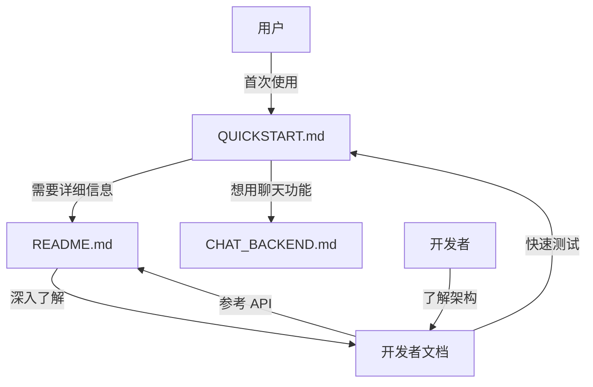

# SAGE Finetune 文档组织结构

**Date**: 2024-10-11  
**Author**: SAGE Team  
**Summary**: Finetune 文档结构说明

---


## 📁 文档分布

### 用户文档（模块目录）

位置: `packages/sage-tools/src/sage/tools/finetune/`

这些文档面向**最终用户**，与代码放在一起方便查阅：

```
packages/sage-tools/src/sage/tools/finetune/
├── README.md          ⭐ 主文档 - 完整功能和 API 参考
├── QUICKSTART.md      🚀 快速上手 - 5分钟开始微调
├── CHAT_BACKEND.md    💬 Chat 集成 - 在聊天中使用微调模型
├── __init__.py        # 模块导出
├── config.py          # 配置类
├── data.py            # 数据处理
└── trainer.py         # 训练器
```

**特点**:
- ✅ 与代码放在一起，方便查找
- ✅ 支持 IDE 内查看
- ✅ 可随包一起发布到 PyPI
- ✅ 用户安装后可本地查看

### 开发者文档（docs 目录）

位置: `docs/dev-notes/finetune/`

这些文档面向**开发者和贡献者**，记录技术细节和演进历史：

```
docs/dev-notes/finetune/
├── FINETUNE_COMPATIBILITY_FIX.md          # 兼容性修复记录
├── FINETUNE_MODULE_TEST_REPORT.md         # 模块测试报告
├── FINETUNE_REFACTOR_SUMMARY.md           # 重构总结
├── CHAT_FINETUNE_INTEGRATION_SUMMARY.md   # Chat 集成实现细节
└── CLEANUP_SUMMARY.md                     # 代码清理总结
```

**特点**:
- ✅ 记录开发历史和决策
- ✅ 技术实现细节
- ✅ 不会打包到发布版本
- ✅ 便于团队协作和代码审查

## 📖 文档导航关系



## 🎯 文档使用场景

### 场景 1: 新用户第一次使用

1. 打开 `QUICKSTART.md`
2. 跟随步骤微调第一个模型
3. 如需更多配置，查看 `README.md`

### 场景 2: 用户想在聊天中使用微调模型

1. 打开 `CHAT_BACKEND.md`
2. 了解如何集成到 `sage chat`
3. 配置 backend 参数

### 场景 3: 用户需要 API 参考

1. 打开 `README.md`
2. 查找配置类、预设配置、数据格式
3. 查看完整的代码示例

### 场景 4: 开发者想了解实现细节

1. 打开 `docs/dev-notes/finetune/`
2. 阅读重构总结、集成报告
3. 了解架构设计和技术决策

### 场景 5: 贡献者想提交 PR

1. 阅读开发者文档了解架构
2. 参考 `README.md` 的 API 设计
3. 更新相关文档

## 📦 PyPI 发布

当发布到 PyPI 时，用户文档会随包一起分发：

```bash
# 用户安装后
pip install sage-tools

# 可以查看本地文档
python -c "import sage.tools.finetune; print(sage.tools.finetune.__file__)"
# 输出: /path/to/sage/tools/finetune/__init__.py

# 文档在同一目录
ls /path/to/sage/tools/finetune/
# README.md  QUICKSTART.md  CHAT_BACKEND.md  *.py
```

## 🔄 文档维护原则

### 用户文档

- **何时更新**: API 变更、新增功能、使用方式改变
- **更新内容**: 使用示例、配置说明、故障排查
- **更新者**: 所有贡献者
- **审查标准**: 清晰、准确、易懂

### 开发者文档

- **何时更新**: 重大重构、架构变更、重要决策
- **更新内容**: 技术细节、设计思路、变更历史
- **更新者**: 核心开发者
- **审查标准**: 完整、准确、有价值

## ✅ 优势总结

### 与代码放在一起的优势

1. **发现性更好**: 用户打开模块就能看到文档
2. **版本同步**: 文档和代码版本一致
3. **离线可用**: 无需网络即可查看
4. **IDE 集成**: 编辑器可以直接显示
5. **包完整性**: 安装即包含文档

### 分离的开发者文档优势

1. **不污染包**: 技术细节不会随包发布
2. **便于维护**: 历史文档可以归档
3. **灵活组织**: 可以按时间、主题组织
4. **团队协作**: 便于 PR 审查和讨论

## 📝 推荐实践

### 添加新功能时

1. 更新 `README.md` - 添加 API 文档
2. 更新 `QUICKSTART.md` - 如果影响快速开始流程
3. 创建技术文档 - 在 `docs/dev-notes/finetune/` 记录设计

### 修复 Bug 时

1. 如果是使用方式问题 → 更新用户文档
2. 如果是实现问题 → 在开发者文档中记录

### 重构代码时

1. 先在开发者文档中记录重构计划
2. 执行重构
3. 更新用户文档（如果 API 变更）
4. 在开发者文档中记录重构总结

## 🎉 总结

通过这种组织方式，我们实现了：

- ✅ **用户友好**: 文档随代码分发，易于查找
- ✅ **开发友好**: 技术文档独立管理，便于维护
- ✅ **版本一致**: 用户文档与代码版本同步
- ✅ **职责清晰**: 不同文档服务不同受众

这是一个**既专业又实用**的文档组织方式！🚀
