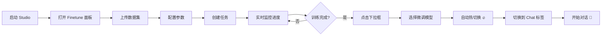
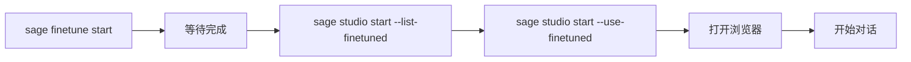

# Studio 微调模型集成 - 丝滑使用指南

## 📖 概述

SAGE Studio 现在完美集成了微调模型功能，让用户可以无缝地使用自己微调的模型进行对话。**支持 CLI 命令和 Web UI 两种方式**，整个流程从微调到使用只需几步操作，非常丝滑！

## 🎯 核心特性

### 1. **自动发现微调模型**
- Studio 启动时自动扫描 `~/.sage/studio_finetune/` 下的所有完成的微调任务
- 支持 merged 模型（合并后的完整模型）和 LoRA 模型

### 2. **一键启动微调模型**
- CLI: 使用 `--use-finetuned` 自动选择最新的微调模型
- Web UI: 在下拉框中直接选择微调模型

### 3. **热切换模型** ✨ 新功能
- **无需重启 Studio** - 在 Web UI 中切换模型会自动重启 LLM 服务
- 切换后立即生效，可直接使用新模型对话
- 支持在基础模型和微调模型之间随意切换

### 4. **统一模型管理**
- 微调模型通过 sageLLM 加载，使用相同的 VLLMService
- 与 HuggingFace 模型享受相同的管理和缓存机制

## 🖥️ Web UI 操作指南（推荐）

### 方式 1：在微调面板中操作（完整流程）

#### 步骤 1: 启动 Studio

```bash
sage studio start
```

浏览器会自动打开 `http://localhost:5173`

#### 步骤 2: 创建微调任务

1. 点击顶部 **"Finetune"** 标签
2. 在 **"创建微调任务"** 卡片中：
   - 选择基础模型（推荐 `Qwen/Qwen2.5-Coder-1.5B-Instruct`）
   - 上传数据集（JSON/JSONL 格式）
   - 配置训练参数（默认值适合 RTX 3060）
   - 点击 **"创建任务"** 按钮

3. 任务创建后会自动开始训练
   - 可以实时查看训练进度
   - 查看当前 epoch、loss 等指标
   - 查看实时日志

#### 步骤 3: 等待训练完成

训练完成后，任务状态会变为 **"completed"** ✅

#### 步骤 4: 切换到微调模型（热切换 🔥）

**方法 A: 从当前模型下拉框切换**

1. 在页面顶部找到 **"当前使用的模型"** 卡片
2. 点击下拉框，会看到：
   ```
   ├── 基础模型
   │   ├── Qwen/Qwen2.5-7B-Instruct    [基础]
   │   └── Qwen/Qwen2.5-0.5B-Instruct  [基础]
   └── 微调模型
       ├── ~/.sage/studio_finetune/task_xxx/merged_model  [微调]
       └── ~/.sage/studio_finetune/task_yyy/lora          [微调]
   ```
3. 选择你想要的微调模型
4. 系统会显示：
   - ✅ **"模型已切换并生效"** - LLM 服务自动重启，立即可用
   - ⚠️ **"模型已切换"** - 如果 LLM 服务未运行，下次启动时生效

**方法 B: 从任务列表快速切换**

1. 在 **"微调任务"** 表格中找到已完成的任务
2. 点击该任务行的 **"切换为对话后端"** 按钮
3. 模型自动切换并重启 LLM 服务

#### 步骤 5: 开始对话 💬

1. 点击顶部 **"Chat"** 标签
2. 在聊天界面输入消息
3. 你的微调模型会自动处理对话！

### 方式 2: 查看和管理模型

#### 查看所有可用模型

在 **"Finetune"** 面板的 **"当前使用的模型"** 下拉框中，可以看到：
- 所有基础模型（蓝色标签 [基础]）
- 所有微调完成的模型（绿色标签 [微调]）

#### 查看微调任务详情

在 **"微调任务"** 表格中，点击任务可以查看：
- 训练配置
- 训练进度和指标
- 实时日志输出
- 输出目录路径

## 🚀 CLI 操作指南（高级用户）

### 快速开始

### 步骤 1: 微调一个模型

```bash
# 使用 Studio 微调向导
sage finetune start

# 或直接通过 Studio Web UI 进行微调
sage studio start
# 然后在 Web UI 中进行微调操作
```

### 步骤 2: 查看可用的微调模型

```bash
# 列出所有可用的微调模型
sage studio start --list-finetuned
```

输出示例：
```
🎓 可用的微调模型 (2):

1. code_expert_2024
   类型: merged
   基础模型: Qwen/Qwen2.5-Coder-7B-Instruct
   路径: /home/user/.sage/studio_finetune/code_expert_2024/merged_model
   完成时间: 2024-11-23T10:30:00

2. chat_assistant_2024
   类型: lora
   基础模型: Qwen/Qwen2.5-7B-Instruct
   路径: /home/user/.sage/studio_finetune/chat_assistant_2024/lora
   完成时间: 2024-11-23T09:15:00

💡 使用方式：
  sage studio start --use-finetuned     # 使用最新微调模型
  sage studio start --llm-model "/home/user/.sage/studio_finetune/code_expert_2024/merged_model"  # 指定特定模型
```

### 步骤 3: 启动 Studio 并使用微调模型

```bash
# 方式 1: 使用最新的微调模型（推荐）
sage studio start --use-finetuned

# 方式 2: 指定特定的微调模型
sage studio start --llm-model "/path/to/your/finetuned/model"

# 方式 3: 指定模型名称（任务 ID）
sage studio start --llm-model "code_expert_2024"
```

## � UI 截图说明

### 微调面板布局

```
┌─────────────────────────────────────────────────────────────┐
│  🔧 模型微调                                                  │
├─────────────────────────────────────────────────────────────┤
│  📌 当前使用的模型                                            │
│  ┌───────────────────────────────────────────────────────┐  │
│  │ Qwen/Qwen2.5-0.5B-Instruct        [下拉框选择模型 ▼] │  │
│  └───────────────────────────────────────────────────────┘  │
├─────────────────────────────────────────────────────────────┤
│  ➕ 创建微调任务                                              │
│  ┌───────────────────────────────────────────────────────┐  │
│  │ 基础模型: [Qwen/Qwen2.5-Coder-1.5B-Instruct ▼]       │  │
│  │ 数据集:   [上传 JSON/JSONL 文件]                      │  │
│  │ Epochs:   [3]        Batch Size: [1]                 │  │
│  │ Learning Rate: [0.00005]                             │  │
│  │ [创建任务] 按钮                                        │  │
│  └───────────────────────────────────────────────────────┘  │
├─────────────────────────────────────────────────────────────┤
│  �📋 微调任务列表                                              │
│  ┌────┬──────┬────────┬────────┬────────┬──────────────┐  │
│  │ ID │ 模型 │ 状态   │ 进度   │ Loss   │ 操作         │  │
│  ├────┼──────┼────────┼────────┼────────┼──────────────┤  │
│  │ 001│ Qwen │ ✅完成 │ 100%   │ 0.234  │ [切换为对话] │  │
│  │ 002│ Qwen │ 🔄训练 │ 67%    │ 0.456  │ [查看日志]   │  │
│  │ 003│ Qwen │ ⏳排队 │ 0%     │ -      │ [取消]       │  │
│  └────┴──────┴────────┴────────┴────────┴──────────────┘  │
└─────────────────────────────────────────────────────────────┘
```

### 聊天界面（使用微调模型）

```
┌─────────────────────────────────────────────────────────────┐
│  💬 Chat  [当前模型: 微调模型 task_001]                      │
├─────────────────────────────────────────────────────────────┤
│  👤 User: 解释一下这段代码的功能                              │
│                                                               │
│  🤖 Assistant: [使用你的微调模型回答]                         │
│     这段代码实现了...（专业且精准的回答）                      │
│                                                               │
│  ┌─────────────────────────────────────────────────────┐    │
│  │ 输入消息...                                    [发送] │    │
│  └─────────────────────────────────────────────────────┘    │
└─────────────────────────────────────────────────────────────┘
```

## 🎨 Web UI vs CLI 对比

| 功能 | Web UI | CLI | 推荐场景 |
|------|--------|-----|----------|
| **创建微调任务** | ✅ 可视化表单 | ✅ 命令行 | Web UI（更直观） |
| **监控训练进度** | ✅ 实时图表 | ❌ 需查看日志 | Web UI（实时更新） |
| **切换模型** | ✅ 下拉选择 + 热切换 | ✅ 命令参数 | Web UI（即时生效） |
| **查看日志** | ✅ 内置查看器 | ✅ 文件查看 | Web UI（过滤和搜索） |
| **批量操作** | ❌ | ✅ 脚本自动化 | CLI（批处理） |
| **远程访问** | ✅ 浏览器访问 | ✅ SSH | Web UI（更方便） |

**建议**：
- 🎨 **日常使用**：Web UI（可视化、实时反馈、热切换）
- 🔧 **自动化/脚本**：CLI（批量处理、CI/CD 集成）
- 🚀 **快速测试**：CLI（一行命令启动）

## 📝 完整工作流程对比

### Web UI 工作流（推荐新手）

### Web UI 工作流（推荐新手）



**特点**：
- ✅ 全程可视化操作
- ✅ 实时进度反馈
- ✅ 一键热切换，无需重启
- ✅ 适合新手和日常使用

### CLI 工作流（推荐高级用户）



**特点**：
- ✅ 命令行操作
- ✅ 适合脚本和自动化
- ✅ 一行命令启动
- ✅ 适合远程服务器

## 🔧 高级功能

### 1. 模型热切换原理

当你在 Web UI 中切换模型时，后端会：

```python
# 1. 更新环境变量
os.environ["SAGE_CHAT_MODEL"] = new_model_path

# 2. 停止当前 LLM 服务
chat_manager._stop_llm_service()

# 3. 启动新 LLM 服务
chat_manager._start_llm_service(model=new_model_path)

# 4. Gateway 自动检测新服务（IntelligentLLMClient）
# 无需手动配置！
```

**优势**：
- 🚀 **秒级切换** - 无需重启整个 Studio
- 🔄 **自动检测** - Gateway 自动使用新模型
- 💾 **状态保持** - 聊天历史不丢失

### 2. 在已运行的 Studio 中切换模型

如果 Studio 已经在运行，有三种方式切换：

**方式 A: Web UI 下拉框（推荐）**
1. 打开 Finetune 面板
2. 从下拉框选择新模型
3. 自动热切换 ✅

**方式 B: API 调用**
```bash
curl -X POST "http://localhost:5173/api/finetune/switch-model?model_path=/path/to/model"
```

**方式 C: 重启 Studio**
```bash
sage studio restart --use-finetuned
```

### 3. 多模型管理

**场景**：你有多个微调模型，需要频繁切换

```bash
# 模型 A: 代码专家
~/.sage/studio_finetune/code_expert/merged_model

# 模型 B: 文档写手
~/.sage/studio_finetune/doc_writer/merged_model

# 模型 C: 对话助手
~/.sage/studio_finetune/chat_assistant/merged_model
```

**在 Web UI 中**：
1. 下拉框会列出所有模型
2. 标签显示模型类型 [基础]/[微调]
3. 鼠标悬停显示完整路径
4. 点击切换，立即生效

### 4. 与 Gateway 的集成

Studio 使用 `IntelligentLLMClient` 自动检测 LLM 服务：

```python
# 检测顺序
1. 检查 localhost:8001 (本地 LLM 服务)
2. 检查 localhost:8000 (备用端口)
3. 回退到云端 API (DashScope/OpenAI)
```

**这意味着**：
- ✅ 切换模型后，Gateway 自动使用新服务
- ✅ 无需手动配置 API 端点
- ✅ 本地模型优先，云端兜底

## 📋 完整工作流程示例

### 场景 1: 代码理解微调 → 对话使用（Web UI）

```bash
# 1. 微调一个代码理解模型
sage finetune start --task code --model Qwen/Qwen2.5-Coder-7B-Instruct

# 2. 等待微调完成...（会显示进度）

# 3. 查看可用模型
sage studio start --list-finetuned

# 4. 使用微调模型启动 Studio
sage studio start --use-finetuned

# 5. 在 Chat 界面中与你的代码专家模型对话！
```

### 场景 2: 自定义数据集微调 → 专业助手

```bash
# 1. 准备你的数据集（JSON 格式）
cat > my_data.json << EOF
[
  {
    "instruction": "你的指令",
    "input": "输入内容",
    "output": "期望输出"
  }
]
EOF

# 2. 启动微调
sage finetune start --task custom --data my_data.json

# 3. 微调完成后，使用模型
sage studio restart --use-finetuned
```

## 🔧 高级用法

### 1. 在已运行的 Studio 中切换模型

```bash
# Studio 已经在运行，想切换到微调模型

# 方式 1: 通过 API（不重启）
curl -X POST http://localhost:5173/api/finetune/switch-model \
  -H "Content-Type: application/json" \
  -d '{"model_path": "/path/to/finetuned/model"}'

# 方式 2: 重启并切换
sage studio restart --use-finetuned
```

### 2. 组合使用不同参数

```bash
# 使用微调模型 + 自定义端口
sage studio start --use-finetuned --port 8080

# 使用微调模型 + 生产模式
sage studio start --use-finetuned --prod

# 使用微调模型 + 更多 GPU 内存
SAGE_STUDIO_LLM_GPU_MEMORY=0.95 sage studio start --use-finetuned
```

### 3. 查看模型状态

```bash
# 查看当前运行的模型
sage studio status

# 查看所有可用模型（包括 HF 和微调）
sage llm model show
sage studio start --list-finetuned
```

## 🏗️ 架构说明

### 模型发现流程

```
Studio 启动
    ↓
ChatModeManager.list_finetuned_models()
    ↓
查询 FinetuneManager 的已完成任务
    ↓
检查每个任务的输出目录
    ├── merged_model/ (优先使用)
    └── lora/ (如果没有 merged)
    ↓
返回可用模型列表
```

### 模型加载流程

```
sage studio start --use-finetuned
    ↓
ChatModeManager._start_llm_service(use_finetuned=True)
    ↓
获取最新微调模型路径
    ↓
检测是本地路径 → 不自动下载
    ↓
VLLMService 加载模型
    ├── HF 模型: 通过 vllm_registry.ensure_model_available()
    └── 本地模型: 直接加载路径
    ↓
LLM 服务就绪 (http://localhost:8001)
    ↓
Gateway 自动检测并使用 (IntelligentLLMClient)
    ↓
Studio Chat 可用！
```

### 模型类型

| 类型 | 说明 | 优先级 | 加载速度 | 推理性能 |
|------|------|--------|---------|---------|
| **merged** | 合并后的完整模型 | 高 | 快 | 最好 |
| **lora** | LoRA 权重 | 中 | 较快 | 好 |

## 📁 文件位置

```
~/.sage/
├── studio_finetune/           # Studio 微调输出
│   ├── task_id_1/
│   │   ├── merged_model/      # 合并后的模型（优先）
│   │   ├── lora/              # LoRA 权重
│   │   ├── checkpoints/       # 训练检查点
│   │   └── finetune_meta.json # 元数据
│   └── task_id_2/
│       └── ...
├── models/vllm/               # HuggingFace 模型缓存
│   ├── Qwen__Qwen2.5-0.5B-Instruct/
│   └── metadata.json
└── finetune_output/           # CLI finetune 输出（不同位置）
```

## 🎨 Web UI 集成

Studio 的 Web UI 已经内置了微调模型管理：

1. **微调任务创建**: 在 Finetune 页面创建微调任务
2. **进度监控**: 实时查看微调进度
3. **模型切换**: 在 Chat 页面切换到微调模型
4. **模型列表**: 查看所有可用模型（基础 + 微调）

## 🔍 故障排查

### 问题 1: 找不到微调模型

```bash
# 检查微调任务状态
ls -la ~/.sage/studio_finetune/

# 检查任务是否完成
sage studio start --list-finetuned

# 如果显示空，说明还没有完成的微调任务
```

### 问题 2: 模型加载失败

```bash
# 检查模型路径是否存在
ls -la /path/to/your/finetuned/model

# 检查是否有 config.json 等必要文件
ls -la /path/to/your/finetuned/model/*.json

# 查看详细日志
sage studio logs --gateway
```

### 问题 3: GPU 内存不足

```bash
# 减少 GPU 内存使用
SAGE_STUDIO_LLM_GPU_MEMORY=0.7 sage studio start --use-finetuned

# 或使用量化加载（需要在微调配置中设置）
```

## 💡 最佳实践

### 1. 模型命名

- 使用描述性的任务 ID：`code_expert_2024`、`doc_writer_v2`
- 避免使用特殊字符和空格

### 2. 模型管理

- 定期清理旧的微调模型：`rm -rf ~/.sage/studio_finetune/old_task_id`
- 保留元数据文件：`finetune_meta.json`

### 3. 资源优化

- 小数据集用 0.5B/1.5B 模型微调
- 生产环境建议使用 merged 模型（更快）
- 开发测试可以用 LoRA 模型（节省空间）

### 4. 工作流建议

```bash
# 开发流程
1. sage finetune start --task code --model Qwen/Qwen2.5-Coder-1.5B-Instruct
2. sage finetune merge task_id  # 合并模型
3. sage studio start --use-finetuned  # 测试

# 生产流程
1. 使用更大模型微调
2. 严格验证模型性能
3. 合并并部署到生产环境
```

## 🎯 总结

通过这个集成方案，你可以：

1. ✅ **无缝微调**: 在 Studio 中微调模型
2. ✅ **自动发现**: Studio 自动发现所有微调模型
3. ✅ **一键启动**: `--use-finetuned` 一键使用最新模型
4. ✅ **丝滑切换**: 支持热切换和重启切换
5. ✅ **统一管理**: sageLLM 统一管理所有模型

整个流程从微调到使用，只需要：

```bash
sage finetune start    # 微调
sage studio start --use-finetuned  # 使用
```

就是这么简单！🎉
