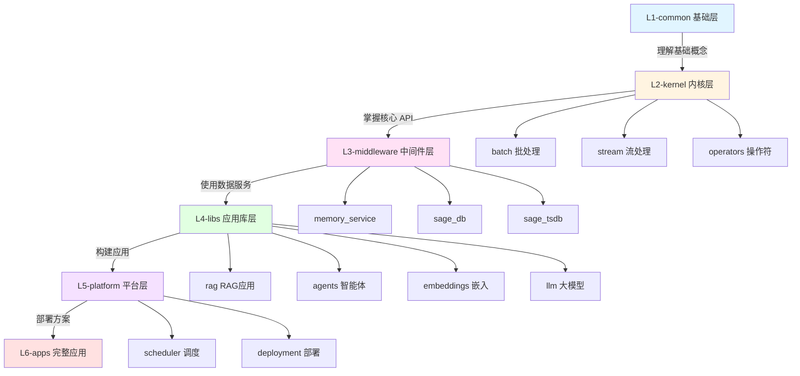

# Tutorials 目录重组方案

## 📊 当前问题分析

### 1. 根目录文件过多

当前 `tutorials/` 根目录有 **20+ 个文件**，包括：

- 各种独立的 demo 文件（`hello_world.py`, `embedding_demo.py`, `basic_unlearning_demo.py` 等）
- usage 系列文件（`usage_1_direct_library.py` ~ `usage_4_complete_rag.py`）
- 测试文件（`test_*.py`）
- 文档文件（`README.md`, `QUICK_REFERENCE.md`, `TROUBLESHOOTING.md`）

### 2. 未遵循 SAGE 架构分层

根据 SAGE 的完整包架构，系统分为 **6 层**：

```
L1: sage-common     → 基础工具、配置、日志系统
L2: sage-kernel     → 核心框架 (core API, runtime)
L3: sage-middleware → 中间件和数据服务 (sage_db, sage_flow, neuromem)
L4: sage-libs       → 应用库 (RAG, agents, tools, unlearning 等)
L5: sage-platform   → 平台服务和集成
L6: sage-apps       → 完整应用和解决方案

    sage-cli        → 命令行工具
    sage-tools      → 开发工具
    sage-studio     → 可视化工具
    sage-benchmark  → 性能测试
```

但当前 tutorials 的组织是混合的，没有清晰反映这个 6 层架构。

______________________________________________________________________

## 🎯 重组目标

1. **按 6 层架构分层**：严格与 SAGE 包架构对应
1. **降低根目录复杂度**：根目录只保留核心入口文件和文档
1. **清晰的学习路径**：从基础到高级，从 L1 到 L6
1. **便于维护**：相关功能集中在同一目录
1. **支持工具生态**：为 CLI、Studio、Benchmark 提供示例

______________________________________________________________________

## 📁 建议的新结构

```
examples/tutorials/
│
├── README.md                          # 总体介绍和导航
├── QUICK_START.md                     # 快速开始指南
├── hello_world.py                     # 最基础的入门示例（保留在根目录）
│
├── L1-common/                         # 基础层（对应 sage-common）
│   ├── README.md
│   ├── hello_world.py                 # 从根目录移入
│   ├── config_demo.py                 # 配置管理示例
│   └── logging_demo.py                # 日志系统示例
│
├── L2-kernel/                         # 内核层（对应 sage-kernel）
│   ├── README.md
│   ├── batch/                         # 批处理
│   │   ├── hello_local_batch.py
│   │   ├── hello_remote_batch.py
│   │   └── hello_batch_operator_examples.py
│   ├── stream/                        # 流处理
│   │   ├── hello_streaming_world.py
│   │   ├── hello_onebyone_world.py
│   │   └── hello_connected_stream_example.py
│   ├── operators/                     # 操作符
│   │   ├── hello_comap_world.py
│   │   ├── hello_filter_world.py
│   │   ├── hello_flatmap_world.py
│   │   ├── hello_join_world.py
│   │   └── hello_three_input_comap.py
│   ├── functions/                     # 函数
│   │   ├── hello_comap_function_example.py
│   │   ├── hello_comap_lambda_example.py
│   │   └── hello_wordcount_*.py
│   └── advanced/                      # 高级特性
│       ├── hello_future_world.py
│       ├── hello_future_stream_example.py
│       ├── hello_realistic_service_example.py
│       └── fault_tolerance/           # 从 fault_tolerance/ 移入
│           ├── fault_tolerance.py
│           ├── checkpoint_recovery_test.py
│           └── fault_tolerance_examples.py
│
├── L3-middleware/                     # 中间件层（对应 sage-middleware）
│   ├── README.md
│   ├── hello_service_world.py         # 从 service-api/ 移入
│   ├── memory_service/                # 从 memory/ 移入
│   │   ├── README.md
│   │   ├── rag_memory_service.py
│   │   ├── rag_memory_pipeline.py
│   │   └── rag_memory_manager.py
│   ├── sage_db/                       # 从 sage_db/ 移入
│   │   ├── README.md
│   │   └── workflow_demo.py
│   └── sage_tsdb/                     # 从 sage_tsdb/ 移入
│       ├── README.md
│       ├── basic_dag_example.py
│       ├── advanced_dag_example.py
│       └── stream_join_dag_example.py
│
├── L4-libs/                           # 应用库层（对应 sage-libs）
│   ├── README.md
│   │
│   ├── rag/                          # RAG 应用
│   │   ├── README.md
│   │   ├── simple_rag.py             # 从 rag/ 移入
│   │   ├── qa_local_llm.py
│   │   ├── qa_no_retrieval.py
│   │   ├── usage_1_direct_library.py # 从根目录移入
│   │   ├── usage_2_sage_function.py
│   │   ├── usage_3_memory_service.py
│   │   └── usage_4_complete_rag.py
│   │
│   ├── agents/                       # Agent 应用
│   │   ├── README.md
│   │   ├── basic_agent.py
│   │   ├── workflow_demo.py
│   │   ├── arxiv_search_tool.py
│   │   └── demo_arxiv_search.py
│   │
│   ├── embeddings/                   # Embedding 应用
│   │   ├── README.md
│   │   ├── embedding_demo.py         # 从根目录移入
│   │   ├── embedding_service_demo.py # 从 service/ 移入
│   │   ├── pipeline_builder_embedding_demo.py
│   │   └── cross_modal_search.py     # 从 multimodal/ 移入
│   │
│   ├── llm/                          # LLM 应用
│   │   ├── README.md
│   │   ├── pipeline_builder_llm_demo.py
│   │   ├── templates_to_llm_demo.py
│   │   ├── demo_new_templates.py
│   │   └── test_real_llm.py
│   │
│   └── unlearning/                   # 机器遗忘
│       ├── README.md
│       ├── basic_unlearning_demo.py  # 从根目录移入
│       └── (其他 unlearning 示例)
│
├── L5-platform/                      # 平台层（对应 sage-platform）
│   ├── README.md
│   ├── scheduler/                    # 从 scheduler/ 移入
│   │   ├── README.md
│   │   ├── scheduler_comparison.py
│   │   └── remote_env.py
│   └── deployment/                   # 部署示例（新建）
│       └── README.md
│
├── L6-apps/                          # 应用层（对应 sage-apps）
│   ├── README.md
│   └── complete_solutions/           # 完整解决方案（新建）
│       └── README.md
│
├── tools/                            # 工具示例（对应 sage-tools, sage-cli 等）
│   ├── README.md
│   ├── cli/                          # CLI 工具示例
│   │   └── README.md
│   ├── studio/                       # Studio 工具示例
│   │   └── README.md
│   └── benchmark/                    # 性能测试示例
│       └── README.md
│
├── docs/                             # 文档（新建）
│   ├── QUICK_REFERENCE.md            # 从根目录移入
│   ├── TROUBLESHOOTING.md            # 从根目录移入
│   └── LEARNING_PATH.md              # 学习路径指南（新建）
│
└── tests/                            # 测试文件（新建目录）
    ├── README.md
    ├── test_new_templates.py         # 从根目录移入
    ├── test_real_llm.py
    └── test_template_matching.py
```

______________________________________________________________________

## 🔄 迁移对照表

### 从根目录迁移

| 当前位置                             | 新位置                        | 原因         |
| ------------------------------------ | ----------------------------- | ------------ |
| `hello_world.py`                     | `01-basics/hello_world.py`    | 基础入门     |
| `embedding_demo.py`                  | `04-applications/embeddings/` | 应用示例     |
| `pipeline_builder_embedding_demo.py` | `04-applications/embeddings/` | 应用示例     |
| `pipeline_builder_llm_demo.py`       | `04-applications/llm/`        | 应用示例     |
| `basic_unlearning_demo.py`           | `04-applications/unlearning/` | 应用示例     |
| `usage_*.py` (1-4)                   | `04-applications/rag/`        | RAG 应用示例 |
| `demo_new_templates.py`              | `04-applications/llm/`        | LLM 应用     |
| `templates_to_llm_demo.py`           | `04-applications/llm/`        | LLM 应用     |
| `test_*.py`                          | `tests/`                      | 测试文件     |
| `QUICK_REFERENCE.md`                 | `docs/`                       | 文档         |
| `TROUBLESHOOTING.md`                 | `docs/`                       | 文档         |

### 从子目录重组

| 当前位置               | 新位置                                         | 原因              |
| ---------------------- | ---------------------------------------------- | ----------------- |
| `core-api/*`           | `02-core-api/batch/`, `02-core-api/stream/` 等 | 按功能细分        |
| `service-api/*`        | `03-service-api/`                              | 与架构对应        |
| `transformation-api/*` | `02-core-api/operators/`                       | 操作符是核心 API  |
| `stream_mode/*`        | `02-core-api/stream/`                          | 合并流处理        |
| `memory/*`             | `03-service-api/memory_service/`               | 服务类            |
| `rag/*`                | `04-applications/rag/`                         | 应用示例          |
| `agents/*`             | `04-applications/agents/`                      | 应用示例          |
| `multimodal/*`         | `04-applications/embeddings/`                  | 合并到 embeddings |
| `fault_tolerance/*`    | `05-advanced/fault_tolerance/`                 | 高级主题          |
| `scheduler/*`          | `05-advanced/scheduler/`                       | 高级主题          |
| `kernel/*`             | `05-advanced/kernel/`                          | 高级主题          |

______________________________________________________________________

## 📚 学习路径设计

新结构支持清晰的 6 层学习路径：



### 推荐学习顺序

**🔰 初学者路径（L1 → L2）**

1. `L1-common/hello_world.py` - 最简单的开始
1. `L2-kernel/batch/hello_local_batch.py` - 批处理基础
1. `L2-kernel/stream/hello_streaming_world.py` - 流处理基础
1. `L2-kernel/operators/hello_comap_world.py` - 操作符基础

**🚀 应用开发者路径（L1 → L4）**

1. 完成初学者路径
1. `L3-middleware/hello_service_world.py` - 服务基础
1. `L3-middleware/memory_service/` - 内存服务
1. `L4-libs/rag/simple_rag.py` - 简单 RAG
1. `L4-libs/rag/usage_4_complete_rag.py` - 完整 RAG

**🧠 平台开发者路径（L1 → L5）**

1. 完成应用开发者路径
1. `L5-platform/scheduler/` - 调度系统
1. `L5-platform/deployment/` - 部署方案
1. `L2-kernel/advanced/fault_tolerance/` - 容错机制

**🏗️ 架构师路径（全栈）**

1. 完成平台开发者路径
1. `L6-apps/complete_solutions/` - 完整解决方案
1. `tools/` - 工具生态系统
1. 探索所有层的高级特性

______________________________________________________________________

## ✅ 实施步骤

### Phase 1: 准备工作

1. ✅ 创建此重组方案文档
1. ⬜ 团队评审和确认方案
1. ⬜ 创建新的目录结构

### Phase 2: 文件迁移

1. ⬜ 创建新目录和 README 文件
1. ⬜ 移动文件到新位置
1. ⬜ 更新所有文件中的导入路径
1. ⬜ 更新 README 中的文件引用

### Phase 3: 文档更新

1. ⬜ 更新主 README.md
1. ⬜ 创建各子目录的 README.md
1. ⬜ 创建 LEARNING_PATH.md
1. ⬜ 更新相关文档中的路径引用

### Phase 4: 测试验证

1. ⬜ 运行所有示例确保可用
1. ⬜ 验证所有导入路径正确
1. ⬜ 检查文档链接完整性

### Phase 5: 清理工作

1. ⬜ 删除旧的空目录
1. ⬜ 更新 CI/CD 配置（如有）
1. ⬜ 创建迁移指南给用户

______________________________________________________________________

## 🎯 预期效果

### 改进点

1. **清晰的架构映射**：目录结构反映 SAGE 的分层架构
1. **降低复杂度**：根目录文件从 20+ 减少到 5 个左右
1. **更好的可发现性**：用户按需求快速找到相关示例
1. **清晰的学习路径**：从基础到高级，循序渐进
1. **便于维护**：相关功能聚合，减少重复

### 根目录保留文件（核心文件 + 9 个目录）

```
examples/tutorials/
├── README.md           # 总览和导航（更新）
├── QUICK_START.md      # 快速开始（新建）
├── hello_world.py      # 最简入门（可选保留）
├── L1-common/          # 基础层示例
├── L2-kernel/          # 内核层示例
├── L3-middleware/      # 中间件层示例
├── L4-libs/            # 应用库层示例
├── L5-platform/        # 平台层示例
├── L6-apps/            # 应用层示例
├── tools/              # 工具示例
├── docs/               # 文档
└── tests/              # 测试
```

______________________________________________________________________

## 🔧 技术注意事项

### 1. 导入路径

所有示例的导入都需要检查和更新：

```python
# 旧的相对导入可能需要调整
from ..config import load_config

# 确保使用正确的绝对导入
from sage.common.config import load_config
```

### 2. 配置文件路径

一些示例引用配置文件，需要更新路径：

```python
# 更新配置文件路径
config_path = Path(__file__).parent.parent / "config" / "config.yaml"
```

### 3. 数据文件路径

确保数据文件的相对路径正确：

```python
# 可能需要调整
data_path = Path(__file__).parent.parent.parent / "data"
```

### 4. README 链接

所有 README 中的相对链接都需要更新。

______________________________________________________________________

## 📋 迁移检查清单

### 每个文件迁移后检查

- [ ] 文件已移动到正确位置
- [ ] 导入语句已更新
- [ ] 配置/数据路径已更新
- [ ] 文件可以独立运行
- [ ] 相关 README 已更新
- [ ] 旧位置引用已更新

### 整体检查

- [ ] 所有目录都有 README
- [ ] 主 README 导航正确
- [ ] 学习路径文档完整
- [ ] 没有断裂的链接
- [ ] CI/CD 配置已更新
- [ ] 示例测试通过

______________________________________________________________________

## 🤔 待讨论问题

1. **根目录是否保留 `hello_world.py`？**

   - 优点：用户可以立即运行
   - 缺点：增加根目录复杂度
   - 建议：保留，因为它是最重要的入门文件

1. **`config/` 目录如何处理？**

   - 选项 A：移到 `01-basics/config/`
   - 选项 B：保留在根目录（供所有示例共享）
   - 建议：保留在根目录，因为是共享资源

1. **测试文件是否应该单独目录？**

   - 建议：是，因为 `examples/` 应该只包含示例，不包含测试

1. **是否需要创建符号链接保持向后兼容？**

   - 如果有外部引用，可以考虑临时创建符号链接

______________________________________________________________________

## 📖 相关文档

- [SAGE 包架构](../../packages/README.md)
- [Examples 总体说明](../README.md)
- [开发者指南](../../DEVELOPER.md)

______________________________________________________________________

**创建时间**: 2025-10-29 **创建者**: AI Assistant based on user feedback **状态**: 待评审
